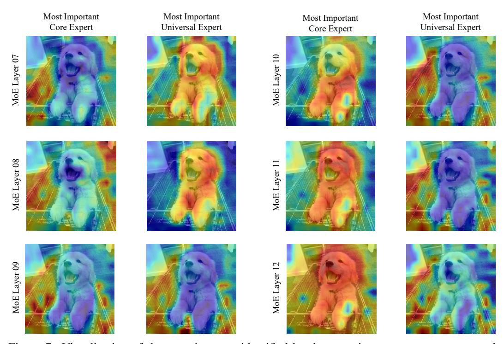

# D Dynamic Allocation and Focus Regions of Experts in MoE Jetpack

In this section, we discuss the dynamic allocation and focus regions of core and universal experts across different layers of MoE Jetpack. We used the same test images as in the main text, visualizing the focus regions of the most important (i.e., those with the highest output contribution) core and universal experts for each MoE layer in Fig. [7.](#page-15-0) The corresponding contribution values for these experts are listed in Tab. [8.](#page-15-1)

Our findings are as follows: Initially, in the shallower network layers (MoE Layer 7 and 8), the core experts contribute less than the universal experts, and their focus regions are relatively dispersed. As the network deepens, in MoE Layer 9, the most important core and universal experts show similar contribution values and focus regions. With further depth (MoE Layers 10, 11, and 12), the dominance of the core experts becomes increasingly evident, with significantly higher contribution values than the universal experts. Core experts focus on prominent objects in the images and are inclined to capture global information.

These experts' dynamic allocation and different focus region tendencies are crucial to our method. Different experts have varying capabilities in extracting information at various granularities, and the network facilitates collaboration among these experts to produce the final output. This illustrates the effective utilization of expert diversity in the MoE model.

Figure 7: Visualization of the attention map identified by the most important core experts and universal experts across different layers (MoE Layer 07 to MoE Layer 12). The images show the regions deemed most relevant by each type of expert at each layer.

Table 8: Contribution values of core and universal experts across network layers.

| MoE Layer | Core Expert Contribution | Universal Expert Contribution |
|-----------|--------------------------|-------------------------------|
| 7         | 1.71                     | 3.91                          |
| 8         | 2.52                     | 4.16                          |
| 9         | 3.78                     | 3.77                          |
| 10        | 8.17                     | 6.71                          |
| 11        | 17.66                    | 2.12                          |
| 12        | 7.36                     | 0.77                          |

