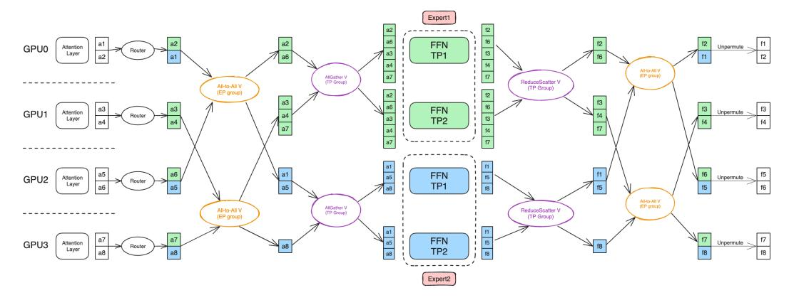

# 3 Method

#### 3.1 Preliminary

#### 3.1.1 Mixture of Experts

The Mixture of Experts (MoE) is a neural network architecture that dynamically selects the most relevant experts to process each individual token. The MoE layer consists of E expert networks and a gating network, which determines the routing by computing a selection probability for each expert. The output of the MoE layer is computed as a weighted aggregation of the outputs from the selected experts, based on their gating probabilities:

$$\mathbf{y} = \sum_{e=1}^{E} g_e(\mathbf{x}) \cdot f_e(\mathbf{x}), \tag{1}$$

where ge(x) denotes the gating weight for expert e, and fe(x) represents the output of expert e. Among the various gating strategies, the Top-K gating method is the most widely used:

$$g_e(\mathbf{x}_i) = \begin{cases} s_i & \text{if } i \in \text{TopK}(\mathbf{s}, K), \\ 0 & \text{otherwise,} \end{cases}$$
 (2)

where xi is the i-th token input to the current expert, and s is computed as follows:

$$\mathbf{s} = G(W_g \cdot \mathbf{x}). \tag{3}$$

Here, Wg represents the weight matrix of the gating network, and G denotes a non-linear activation function.

The learnable gating network enables dynamic routing, which can lead to load imbalance issues. To mitigate this, in addition to the auxiliary loss, a capacity factor (CF) is introduced to regulate load balancing among experts. The capacity factor defines the maximum capacity of each expert relative to the average expected load, ensuring that computational resources are evenly distributed and preventing bottlenecks caused by uneven workloads. The capacity per expert is calculated as:

Capacity per Expert = 
$$CF \cdot \frac{L}{E}$$
, (4)

where L is the total number of tokens to process, E is the number of experts, and CF ≥ 1 is the capacity factor. Tokens that exceed the capacity of a given expert are dropped.

#### 3.1.2 Expert Parallelism

In large-scale distributed training of MoE models, EP efficiently distributes computation across multiple devices by assigning distinct experts to each device. This parallelization strategy reduces communication overhead while optimizing hardware utilization. The EP process comprises three key stages:

Token Dispatching Initially, input tokens are grouped according to their assigned experts through data permutation, ensuring tokens destined for the same expert are stored contiguous in memory. An *All-to-All* collective communication operation then exchanges token data between devices, allowing each device to receive only the tokens required by its locally hosted experts.

Expert Computation Each device processes its local batch of tokens through its designated experts in parallel. Since experts operate independently, this stage requires no inter-device communication, allowing for efficient concurrent computation across the distributed system.

Token Restore After expert processing, the output tokens are rearranged to restore their original sequence order through an inverse permutation operation. This restoration step ensures proper alignment for subsequent layer operations while maintaining the model's sequential processing requirements. The restored tokens can then flow into the next layer of the network.

Figure 1: Illustration of parallelism mappings with MoE Parallel Folding.

### 3.2 MoE Parallel Folding

Attention layers and MoE layers in Transformers exhibit distinct computation and communication patterns. Attention operations are performed at the whole-sequence level with dense computation, requiring information exchange between devices holding sub-sequences when using TP and CP. In contrast, MoE layers process individual tokens rather than whole sequences, and their inherent sparsity makes them more suitable for EP with lower communication overhead.

Consequently, forcing MoE layers to follow the same parallelism mapping as Attention layers is sub-optimal. To achieve optimal hybrid parallelism for MoE models, we propose MoE Parallel Folding, which disentangles the parallel mappings between Attention and MoE layers.

As shown in Figure [1,](#page-4-0) previous methods place the EP group in a sub-group of DP, which greatly restricts the scalability of MoE. The maximum degree of expert parallelism is bounded by the degree of data parallelism. Instead, we flatten the parallelism mappings of the attention layer and allow model parallelism in the MoE layer to be folded with arbitrary sub-groups of attention, making the parallelism mappings of MoE layer more flexible and efficient.

Specifically, for the attention layers, we form a four-dimensional parallel group comprising T P × CP × DP × P P. For the MoE layers, we define another four-dimensional group consisting of T P × EP × DP × P P. For convenience, we name the TP and DP group for MoE layer as Expert-TP(ETP) and Expert-DP(EDP). The only restriction is that the number of PP groups and members of each PP group for the Attention and MoE layer must be consistent. This separation allows us to set flexible and independent parallelism configurations for attention and MoE layers.

MoE Parallel Folding provides two main benefits. First, it allows selecting the optimal parallelism mapping for the MoE layer independently of the Attention layer. For example, EP is more communication-efficient than ETP. We can replace ETP with EP and fold it with TP in the Attention layer. Second, the folded parallelism mappings enable communication within more compact groups. By folding model parallelism across attention and MoE layers, the scope of intra-layer communication is reduced, allowing it to fit within high-bandwidth intra-node connections more effectively.

### 3.3 Flexible and Efficient Token Dispatcher

Arbitrary hybrid parallelism with MoE Parallel Folding necessitates a flexible and scalable token dispatcher. The dispatcher is responsible for routing tokens to their assigned experts across various parallelism dimensions. To ensure numerical correctness while maintaining high performance under different parallelism strategies, we have designed a unified token dispatcher that handles both ETP and EP within the MoE layer.

With MoE Parallel Folding, the inputs fed into the MoE layer from the attention layer are split either along the batch dimension (DP) or the sequence dimensions (CP and TP). In both scenarios, different ranks contain different chunks of tokens. Since the expert layer computes the features of each token individually, we can employ the same workflow for the token dispatcher regardless of the parallelism mappings of the attention layer.

Figure 2: Workflow of token dispatcher with Tensor Parallelism and Expert Parallelism.

In Figure [2,](#page-5-0) we illustrate the workflow of an MoE layer distributed across four GPUs, where the degrees of TP and ETP are both 2. GPU pairs (0, 1) and (2, 3) form the ETP group. GPU pairs (0, 2) and (1, 3) form the EP group.

The forward computation workflow proceeds as follows. First, the router determines the mapping of each token to its designated expert based on the local input and reorganizes the tokens assigned to the same expert into contiguous memory regions through a permutation operation. Next, an All-to-All-V communication is executed across the EP groups to exchange tokens, ensuring that each token is delivered to its corresponding expert. Following this, an AllGather-V communication is performed within the ETP groups to guarantee that all members within an ETP group share identical activations. Once the AllGather-V communication is complete, each GPU computes its assigned partition of the expert feed-forward networks. A subsequent ReduceScatter-V communication within the ETP groups aggregates and distributes the output hidden states, effectively reversing the AllGather operation. Another All-to-All-V communication is then employed to return the tokens to their original GPUs. Finally, an un-permutation operation restores the tokens to their initial order, preparing them for further processing in the attention layer. The backward workflow mirrors the forward process, with the AllGather/ReduceScatter (AG/RS) operations in the TP groups replaced by ReduceScatter/AllGather (RS/AG).

We now elaborate on the design of the router to support both token-dropping and token-dropless training paradigms. The router assigns tokens to experts by selecting the top-k tokens based on their softmax probabilities. In token-dropless training, ensuring numerical correctness is straightforward, as token assignments remain consistent across different parallelism configurations. For tokendropping training, two potential strategies can be employed: full-sequence-based dropping and sub-sequence-based dropping.

- Full-sequence dropping ensures consistency by gathering logits from all ranks that collectively represent the entire sequence. However, this approach incurs significant communication overhead, particularly when sequences are distributed across multiple nodes.
- Sub-sequence dropping, on the other hand, makes dropping decisions based solely on the logits from the current sub-sequence. This strategy eliminates the need for gathering logits across ranks, thereby reducing communication overhead and alleviating load imbalance issues during token communication.

Empirically, we observe that sub-sequence dropping does not adversely affect model convergence compared to full-sequence dropping. Consequently, we adopt the sub-sequence dropping approach as the default strategy in this work.

