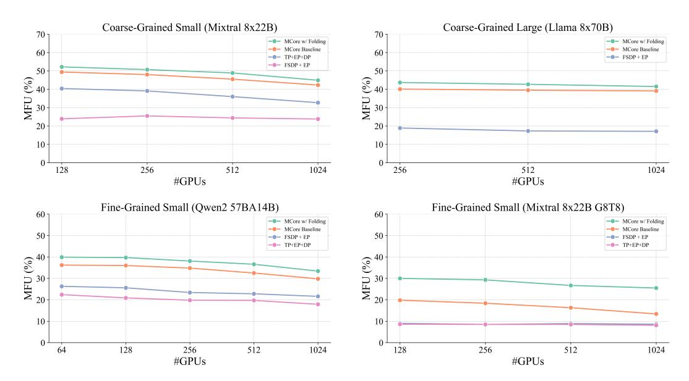
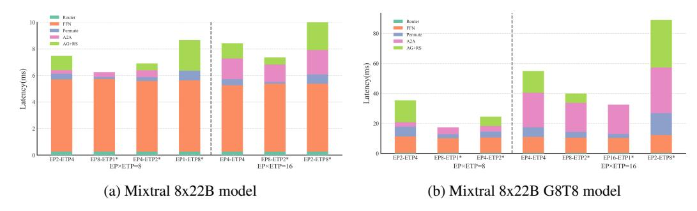

# 4 Experiments

#### 4.1 Experimental Setup

All experiments in this work were conducted on the Eos [\[34\]](#page-13-11) cluster. The Eos cluster consists of NVIDIA DGX H100 nodes, each equipped with eight NVIDIA H100 GPUs [\[24\]](#page-12-9) and two 56-core Intel Sapphire Rapids CPUs. Each GPU achieves a peak half-precision throughput of 989.5 TFLOP/s, and all GPUs are interconnected via NVLink 4th Generation [\[22\]](#page-12-10) and InfiniBand [\[23\]](#page-12-11). The peak uni-directional communication bandwidths are 450 GB/s for intra-node (NVLink) and 400Gbps for inter-node (InfiniBand) connections. We utilize PyTorch 2.5.0 and CUDA 12.6 for our experiments. All performance measurements reported in TFLOPS and MFU are conducted using BF16 precision. Up to 1024 GPUs are utilized in the scaling experiments.

We select two types of MoE models for our experiments, coarse-grained and fine-grained MoE, each type containing models of two different sizes. Compared to coarse-grained MoE, fine-grained MoE has a larger number of experts and more activated experts per token, but each expert has a reduced hidden size. For the coarse-grained MoE, we select the Mixtral 8x22B [\[18\]](#page-12-12) model and design a larger MoE named Llama3-8x70B by upcycling Llama3-70B [\[5\]](#page-11-10) to 8 experts [\[13\]](#page-12-13). For the fine-grained MoE, we choose Qwen2-57B-A14B [\[38\]](#page-13-1), which has 64 experts and 8 active experts per token, totaling 57 billion parameters with 14 billion active parameters. To obtain a larger fine-grained MoE model, we reparameterized the Mixtral 8x22B model to 64 experts and 8 active experts per token called Mixtral-8x22B-G8T8, with each expert possessing a hidden size that is one-eighth of the original model, by applying fine-grained upcycling [\[9\]](#page-11-4).

#### 4.2 Performance Comparison

To evaluate the performance of our proposed MoE Parallel Folding technique compared to existing parallelism strategies, we conducted comparative experiments using the four models previously described. The primary metric for assessment was the Model TFLOPS Utilization (MFU) during training, which measures the efficiency of computational resource utilization by comparing theoretical peak performance with the actual achieved performance in BF16 precision. To alleviate the performance jitter caused by load imbalance issues in dropless training, we use token drop training with a capacity factor equal to 1 for benchmarking.

For baseline comparisons, we chose four representative baseline parallelism strategies:

- 1. FSDP [\[39\]](#page-13-12): A data parallelism method that shards model parameters, gradients, and optimizer states across workers.
- 2. FSDP + EP [\[8\]](#page-11-3): An extension of FSDP that incorporates EP.
- 3. TP+EP+DP [\[32\]](#page-13-10): An framework combining TP and EP to fit larger MoE models across multiple GPUs.
- 4. MCore with 5D-parallelism[\[21\]](#page-12-2): The state-of-the-art training framework for large scale LLM models, supporting TP,EP,CP,DP and PP.

All baseline methods were implemented using the NVIDIA Megatron-Core framework[2](#page-6-0) . For each method, we report the MFU achieved with the optimal parallelism configuration found by tuning its supported parallelism dimensions.

Table [1](#page-7-0) presents the comparison results of different parallelism strategies on the selected MoE models. The observed MFU values highlight several key insights into the performance implications of each strategy: (1) FSDP exhibits poor performance(<10% MFU) due to their sparse computations and large parameter counts. In FSDP, the communication of parameters and gradients cannot be effectively overlapped with computation. Additionally, FSDP fails to train larger models like Llama3-8x70B due to out-of-memory (OOM) issues. (2) FSDP + EP improves performance, by parallelizing expert across GPUs, thereby reducing communication of expert parameters and gradients. However, this strategy still suffers from communication overhead that cannot be fully overlapped with computation, limiting further performance gains. (3)TP + EP + DP [\[32\]](#page-13-10) further uses TP to split the model weights to multiple GPUs and use ZeRO-1 instead of ZeRO-3 to reduce communication overhead

<https://github.com/NVIDIA/Megatron-LM>

Table 1: Performance comparison of different parallelism strategies by MFU. The global batch size for experiment is 256.

|                  |                      | Coarse-grained      | Fine-grained         |                           |  |  |  |
|------------------|----------------------|---------------------|----------------------|---------------------------|--|--|--|
| GPUs             | Mixtral-8x22B 128 | Llama3-8x70B 256 | Qwen2-57B-A14B 64 | Mixtral-8x22b-G8T8 128 |  |  |  |
| FSDP             | 4.3%                 | OOM                 | 9.9%                 | 2.2%                      |  |  |  |
| FSDP + EP        | 23.4%                | 19.6%               | 25.4%                | 9.0%                      |  |  |  |
| TP+EP+DP         | 36.6%                | OOM                 | 23.1%                | 8.7%                      |  |  |  |
| MCore            | 46.3%                | 38.8%               | 35.3%                | 17.1%                     |  |  |  |
| MCore w/ Folding | 49.3%                | 41.6%               | 39.0%                | 28.8%                     |  |  |  |

Figure 3: Strong scaling experiments for various parallelism strategies by increasing number of GPUs up to 1024.

of parameters, resulting in better performance. But a large TP also introduces significant activation communication overhead. And the largest model Llama3-8x70B could not be trained using only TP+EP due to memory constraints. (4)MCore framework leverages pipeline parallelism (PP) in addition to TP, EP, and DP, achieves a better balance between communication and computation. This results in higher MFU values, reaching 46.3% on Mixtral-8x22B and 35.3% on Qwen-2-57B. By effectively partitioning the model across pipeline stages, MCore reduces the memory footprint per GPU and overlaps communication with computation more efficiently. However, the coupling of parallelism strategies between the Attention and MoE layers renders the mappings sub-optimal for MoE models. (5)MCore with MoE Parallel Folding: further enhances training efficiency, achieving the highest MFU values across all models: 49.3% for Mixtral-8x22B, 41.6% on Llama3-8x70B, 39.0% on Qwen-2-57B, and 28.8% on Mixtral-8x22B-G8T8. The flexible parallelism provided by MoE Parallel Folding allows for a more optimal parallelism strategy tailored to the characteristics of MoE models. By folding MoE parallel groups with Attention and effectively utilizing available hardware resources, it minimizes communication overhead and maximizes computational efficiency. This leads to significant performance improvements over existing strategies.

The experiments also reveal that fine-grained MoE models achieve lower training efficiency compared to coarse-grained MoE models across all parallelism strategies. This performance gap stems from two key factors: (1) Fine-grained MoE models generate higher communication volume due to their architecture - they employ more experts and activate more experts per token, increasing communication overhead during the token dispatching process. Additionally, the smaller hidden sizes decrease GEMM efficiency. (2) Fine-grained MoE models typically incorporate a larger number of

local and active experts, leading to significant memory overhead for storing activations. The memory requirements for managing numerous experts force the use of larger model parallelism sizes, which introduces additional communication costs and further reduces training efficiency.

#### 4.3 Scaling Experiments

Strong Scaling To evaluate the scalability of our methods, we conduct strong scaling experiments by increasing the number of GPUs up to 1,024. The global batch size is set to 1024 in the scaling experiments. As shown in Figure [3,](#page-7-1) our framework maintains consistently higher MFU compared to baseline approaches as the GPU count increases across all model types. The results show the scalability of MoE parallel folding up to 16x nodes with little MFU drops, especially for large-scale models like Llama3-8x70B, where the MFU only drops from 43.7% to 41.5%.

Scaling with Context Length To evaluate the capability of our framework to train large scale MoE models with very long context lengths, we conducted context scaling experiments by increasing the sequence length while keeping the total number of tokens per global batch constant. As shown in Figure [4,](#page-8-0) our framework can train MoE models with high efficiency up to a context length of 128K tokens, and the MFU only drops from 38.7% to 35.9% for Qwen-57B14A and 47.6% to 42.9% for Mixtral-8x22B. With MoE parallel folding, MCore can achieve higher performance by folding the parallelism groups of attention and MoE layers to better utilize the intra-node communication bandwidth.

#### 4.4 Ablation Study

To systematically evaluate the performance characteristics of MoE layers and quantitatively assess the advantages of MoE parallel folding, we conducted comprehensive ablation studies. Our methodology involves varying the parallelism mappings of the MoE layer while maintaining fixed parallelism configurations for the Attention layer. Specifically, we examine the Attention layer's parallelism mappings across TP and CP, while the MoE layer's parallelism mappings are analyzed with respect to EP and ETP.

In the first experimental setup, we configure the Attention layer with TP=4 and CP=1 (no context parallelism). We evaluate parallelism mappings for the MoE layer with EPxETP=8 and EPxETP=16, which enables us to examine both intra-node and inter-node communication patterns. Notably, the memory utilization remains consistent across different configurations when the product ETPxEP is held constant.

Figure [5](#page-9-0) presents detailed latency breakdowns for the MoE layer in both the standard Mixtral 8x22B model and its fine-grained variant Mixtral 8x22B G8T8. Configurations enabled by MoE parallel folding are denoted with an asterisk (\*). Our analysis reveals several key findings: (1) MoE Parallel Folding significantly expands the available parallelism configuration space, enabling the discovery of optimal parallelism mappings. The configurations utilizing MoE parallel folding consistently achieve superior performance. (2) ETP in the MoE layer introduces substantially higher communication overhead compared to EP, with this effect being particularly pronounced in fine-grained MoE models. (3) Fine-grained MoE models exhibit notably lower computation-to-communication ratios. When ETPxEP exceeds 8, necessitating inter-node communication, communication overhead dominates,

Figure 4: Context-scaling experiments by increasing context length and number of GPUs up to 128K and 1024.

Figure 5: MoE layer breakdown with different parallelism mappings. Marker \* means the new parallelism mappings supported by MoE Parallel Folding.

Figure 6: MoE layer breakdown with different parallelism mappings. Marker \* means the new parallelism mappings supported by MoE Parallel Folding.

accounting for over 70% of the total latency. (4) Maintaining minimal model parallelism while favoring EP over ETP emerges as an effective strategy for optimizing MoE layer performance.

In the second experimental setup, we configure the Attention layer with various CP sizes and sequence lengths, and compare the performance of the MoE layer with and without parallel folding. Figure [6](#page-9-1) shows the breakdown results. As we can see, when the size of the CPxEP group exceeds 8 and spans beyond the NVLINK domain, the latency without MoE Parallel Folding increases significantly. Without MoE Parallel Folding, the EP group spans across multiple context parallelism groups, causing All-to-All communications within the EP group to traverse the lower-bandwidth inter-node network fabric. The MoE Parallel Folding technique allows the CP and EP groups to be folded together, maximizing the use of high-bandwidth NVLink connections whenever possible.

### 4.5 FP8 Training Performance

To further evaluate the capabilities of our framework, we investigated the performance benefits of utilizing FP8 precision, particularly relevant for newer hardware architectures like NVIDIA Hopper and NVIDIA Blackwell. We conducted experiments employing FP8 delayed scaling [\[25\]](#page-12-14) with the Mixtral 8x22B model on 128 H100 GPUs. The results demonstrate substantial throughput improvements compared to BF16 training.

Specifically, we observed the following performance in model TFLOPS:

These results, summarized in Table [2,](#page-10-0) indicate that FP8 training provides a significant performance uplift over BF16 (approximately 1.26x speedup without folding and 1.30x with folding). Furthermore, MoE Parallel Folding continues to enhance performance within the FP8 regime, yielding the highest throughput of 631.7 TFLOPS.

Table 2: Mixtral 8x22B Performance Comparison

| Configuration    | Precision | TFLOPS | Speedup vs BF16 | Speedup w/ Folding |
|------------------|-----------|--------|-----------------|--------------------|
| MCore            | BF16      | 458.3  | -               | -                  |
| MCore w/ Folding | BF16      | 487.7  | -               | 1.06x              |
| MCore            | FP8       | 575.1  | 1.26x           | -                  |
| MCore w/ Folding | FP8       | 631.7  | 1.30x           | 1.10x              |

### 5 Conclusion

In this paper, we introduce a novel framework for efficient large-scale MoE model training that addresses key challenges in distributed training through two main innovations. First, we propose MoE Parallel Folding, a technique that decouples the parallelization strategies of attention and MoE layers, enabling more flexible and efficient parallel configurations. This approach allows for optimal resource utilization by adapting to the distinct computational characteristics of each layer. Second, we develop an efficient token-level dispatcher that supports both token-dropping and token-dropless training across five dimensions of parallelism, providing a robust foundation for complex hybrid parallelism schemes. Our experimental results demonstrate significant performance improvements across different MoE architectures, achieving up to 49.3% MFU for Mixtral 8x22B and 39.0% MFU for Qwen2-57B-A14B on H100 GPUs. The framework shows strong scaling efficiency up to 1024 GPUs and maintains high performance with sequence lengths up to 128K tokens. These results validate the effectiveness of our approach in addressing the scalability challenges of large-scale MoE model training.

