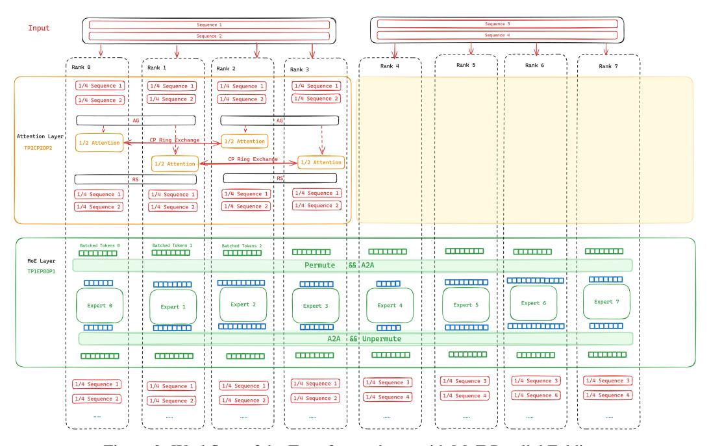

# 6 Appendix

#### 6.1 Accuracy Validation

To validate the accuracy of our implementation, we train a Mixtral 8x7B model with MoE Parallel Folding compared to MCore v0.9 in a token-dropless manner up to 40B tokens. We set TP=2, CP=2, PP=2, EP=8, ETP=1, this allows us to verify the correctness of MoE Parallel Folding where EP in MoE layer are folded with all of TP,CP,DP in Attention. As shown in Figures [7](#page-14-0) and [8,](#page-14-1) MCore with MoE Parallel Folding is able to successfully train the model to convergence, and the training and validation loss curves align well with MCore v0.9.

<span id="page-14-0"></span>

Figure 7: Training loss of MCore with MoE Parallel Folding compared to MCore v0.9.

<span id="page-14-1"></span>

Figure 8: Validation loss of MCore with MoE Parallel Folding compared to MCore v0.9.

#### 6.2 Workflow for Transformer Layer with MoE parallel folding

Figure [9](#page-15-0) illustrates the overall workflow of a Transformer Layer in an MoE model with Parallel Folding. In the Attention component, the parallelism mapping is TP2CP2DP2, where each sequence is split across 4 GPUs. For the MoE layer, the parallelism mapping is TP1EP8DP1, with each GPU handling a different expert FFN. The transformation between the Attention and MoE layers requires only a reshape operation that flattens the sequence/subsequence into a batch of tokens, introducing no explicit communication overhead.

<span id="page-15-0"></span>

Figure 9: Workflow of the Transformer layer with MoE Parallel Folding.

#### 6.3 Parallel Groups Initialization

In the code of Listing [1,](#page-16-0) we give an example to show how the parallelism groups with MoE Parallel Folding for each device are generated. The code demonstrates the initialization of parallel groups for both attention and MoE components, handling different parallelism dimensions including TP, EP, PP and DP.

The function generate\_mappings takes the total number of devices (world\_size) and parallelism dimensions as input parameters. It first calculates the effective data parallelism degrees for attention and MoE components separately. Then, it creates two sets of parallel groups: one for attention layers with TP, CP, PP, and DP dimensions, and another for MoE layers with TP, EP, PP, and DP dimensions.

```
1 from einops import rearrange
2 import torch
4 def generate_mappings ( world_size , tp , cp , ep , etp , pp ) :
5 ranks = torch . arange ( world_size )
6 attn_dp = world_size // tp // cp // pp
7 moe_dp = world_size // etp // ep // pp
8
9 # Parallel groups for attention
10 attn_ranks = ranks . reshape ( attn_dp , pp , cp , tp )
11 attention_groups = {
12 "TP": rearrange ( attn_ranks , " attn_dp pp cp tp -> ( attn_dp pp
     cp) tp",
13 tp =tp , cp = cp , pp = pp , attn_dp = attn_dp ) . tolist () ,
14 "CP": rearrange ( attn_ranks , " attn_dp pp cp tp -> ( attn_dp pp
     tp) cp",
15 tp =tp , cp = cp , pp = pp , attn_dp = attn_dp ) . tolist () ,
16 "PP": rearrange ( attn_ranks , " attn_dp pp cp tp -> ( attn_dp cp
     tp) pp",
17 tp =tp , cp = cp , pp = pp , attn_dp = attn_dp ) . tolist () ,
18 "DP": rearrange ( attn_ranks , " attn_dp pp cp tp -> (pp cp tp)
     attn_dp ",
19 tp =tp , cp = cp , pp = pp , attn_dp = attn_dp ) . tolist ()
20 }
22 # Parallel groups for MoE
23 moe_ranks = ranks . reshape ( moe_dp , pp , ep , tp )
24 moe_groups = {
25 "TP": rearrange ( moe_ranks , " moe_dp pp ep tp -> ( moe_dp pp ep)
     tp",
26 tp = etp , ep = ep , pp = pp , moe_dp = moe_dp ) . tolist () ,
27 "EP": rearrange ( moe_ranks , " moe_dp pp ep tp -> ( moe_dp pp tp)
     ep",
28 tp = etp , ep = ep , pp = pp , moe_dp = moe_dp ) . tolist () ,
29 "PP": rearrange ( moe_ranks , " moe_dp pp ep tp -> ( moe_dp ep tp)
     pp",
30 tp = etp , ep = ep , pp = pp , moe_dp = moe_dp ) . tolist () ,
31 "DP": rearrange ( moe_ranks , " moe_dp pp ep tp -> (pp ep tp)
     moe_dp ",
32 tp = etp , ep = ep , pp = pp , moe_dp = moe_dp ) . tolist ()
33 }
34
35 return attention_groups , moe_groups
36
37 attn_groups , moe_groups = generate_mappings (64 , 2 , 2 , 2 , 2 , 2)
```

Listing 1: Python implementation of parallel group generation for MoE Parallel Folding

#### 6.4 Details of Parallelism Mappings in Experiments

We conducted numerous experiments to find the optimal training parallel configurations. The optimal settings found and their corresponding performance metrics are presented in Table [3.](#page-17-0) In these experiments, the global batch size was fixed at 256, and the sequence length was fixed at 4096.

To investigate the scalability of various methods, we fixed the parallel configuration and increased the number of GPUs. The detailed benchmark numbers are presented in Table [4.](#page-17-1) All parallel configurations are the same as those identified in the performance experiments.

In the context scaling experiment, influenced by the long sequence length, the optimal parallel configuration might differ. The parallel configurations found and the detailed performance results are presented in Table [5.](#page-19-0)

Table 3: Detailed parallel mapping of models with optimal configurations.

<span id="page-17-0"></span>

| Model              | Methods          | GPUs | CP | TP | EP | PP | ETP | MFU   |
|--------------------|------------------|------|----|----|----|----|-----|-------|
|                    | FSDP             | 128  | 1  | 8  |    |    |     | 4.3%  |
|                    | FSDP + EP        | 128  | 1  | 2  | 8  |    |     | 23.4% |
| Mixtral-8x22B      | TP + EP + DP     | 128  | 1  | 4  | 8  |    |     | 36.6% |
|                    | MCore            | 128  | 1  | 2  | 4  | 8  |     | 46.3% |
|                    | MCore w/ Folding | 128  | 1  | 2  | 8  | 8  | 1   | 49.3% |
|                    | FSDP             | 64   | 1  | 2  | 1  |    |     | 9.9%  |
|                    | FSDP + EP        | 64   | 1  | 1  | 8  |    |     | 25.4% |
| Qwen2-57B-A14B     | TP + EP + DP     | 64   | 1  | 4  | 4  |    |     | 23.1% |
|                    | MCore            | 64   | 1  | 2  | 4  | 4  |     | 35.3% |
|                    | MCore w/ Folding | 64   | 1  | 2  | 4  | 4  | 1   | 39.0% |
|                    | FSDP             | 128  | 1  | 8  | 1  |    |     | 2.2%  |
|                    | FSDP + EP        | 128  | 1  | 4  | 8  |    |     | 9.0%  |
| Mixtral-8x22B-G8T8 | TP + EP + DP     | 128  | 1  | 8  | 8  |    |     | 8.7%  |
|                    | MCore            | 128  | 1  | 2  | 8  | 8  |     | 17.1% |
|                    | MCore w/ Folding | 128  | 1  | 4  | 8  | 8  | 1   | 28.8% |
|                    | FSDP             | 256  | 8  | 8  | 1  |    |     | OOM   |
|                    | FSDP + EP        | 256  | 1  | 8  | 8  |    |     | 19.6% |
| Llama3-8x70B       | TP + EP + DP     | 256  | 1  | 8  | 8  |    |     | OOM   |
|                    | MCore            | 256  | 1  | 8  | 4  | 8  |     | 38.8% |
|                    | MCore w/ Folding | 256  | 1  | 8  | 8  | 16 |     | 41.6% |

<span id="page-17-1"></span>Table 4: The detailed parallel mapping of scaling experiments for the numbers of GPUs

| Model         | Methods          | GPUs | MFU   |
|---------------|------------------|------|-------|
|               |                  | 128  | 49.4% |
|               | MCore            | 256  | 48.0% |
|               |                  | 512  | 45.5% |
|               |                  | 1024 | 42.3% |
|               |                  | 128  | 52.2% |
|               |                  | 256  | 50.7% |
|               | MCore w/ Folding | 512  | 48.9% |
| Mixtral 8x22B |                  | 1024 | 44.9% |
|               |                  | 128  | 23.9% |
|               |                  | 256  | 25.5% |
|               | FSDP + EP        | 512  | 24.4% |
|               |                  | 1024 | 23.8% |
|               |                  | 128  | 40.4% |
|               | TP + EP + DP     | 256  | 39.1% |

| Model              | Methods          | GPUs        | MFU            |
|--------------------|------------------|-------------|----------------|
|                    |                  | 512         | 36.0%          |
|                    |                  | 1024        | 36.2%          |
|                    |                  | 64          | 36.2%          |
|                    | MCore            | 128         | 36.0%          |
|                    |                  | 256         | 34.8%          |
|                    |                  | 512<br>1024 | 32.5%<br>29.8% |
|                    |                  | 64          | 39.9%          |
|                    | MCore w/ Folding | 128         | 39.7%          |
|                    |                  | 256         | 38.1%          |
|                    |                  | 512         | 36.6%          |
|                    |                  | 1024        | 33.4%          |
|                    |                  | 64          | 26.3%          |
| Qwen2 57B-A14B     | FSDP + EP        | 128         | 25.6%          |
|                    |                  | 256<br>512  | 23.4%<br>22.8% |
|                    |                  | 1024        | 21.6%          |
|                    |                  | 64          | 22.4 %         |
|                    | TP + EP + DP     | 128         | 20.9 %         |
|                    |                  | 256         | 19.8 %         |
|                    |                  | 512         | 19.7 %         |
|                    |                  | 1024        | 17.9 %         |
|                    |                  | 128         | 19.8%          |
|                    | MCore            | 256<br>512  | 18,4%<br>16.3% |
|                    |                  | 1024        | 13.4%          |
|                    |                  | 128         | 30.0%          |
|                    | MCore w/ Folding | 256         | 29.3%          |
|                    |                  | 512         | 26.7%          |
| Mixtral 8x22B G8T8 |                  | 1024        | 25.5%          |
|                    |                  | 128         | 9.0%           |
|                    | FSDP + EP        | 256         | 8.5%           |
|                    |                  | 512         | 8.9%           |
|                    |                  | 1024        | 8.6%           |
|                    |                  | 128<br>256  | 8.6%<br>8.5%   |
|                    | TP + EP + DP     | 512         | 8.5%           |
|                    |                  | 1024        | 8.1%           |
|                    |                  | 256         | 40.1%          |
|                    | MCore            | 512         | 39.5%          |
|                    |                  | 1024        | 39.1%          |
| Llama3 8x70B       |                  | 128         | 43.7%          |
|                    | MCore w/ Folding | 512         | 42.7%          |
|                    |                  | 1024        | 41.5%          |
|                    |                  | 128         | 18.9%          |
|                    | FSDP + EP        | 512<br>1024 | 17.3%<br>17.1% |
|                    |                  |             |                |

Table 5: The performance of scaling experiments for the sequence length

<span id="page-19-0"></span>

| model          | methods          | #GPUs | SeqLen | CP | TP | EP | PP | ETP | GBS  | MFU      |
|----------------|------------------|-------|--------|----|----|----|----|-----|------|----------|
|                |                  | 128   | 16384  | 4  | 2  | 4  | 8  |     | 1024 | 45.30%   |
|                |                  | 256   | 32768  | 8  | 2  | 4  | 8  |     | 512  | 43.20%   |
|                | Mcore            | 512   | 65536  | 16 | 2  | 4  | 8  |     | 256  | 42.60%   |
| Mixtral-8x22B  |                  | 1024  | 131072 | 16 | 4  | 8  | 8  |     | 128  | 38.20%   |
|                | Mcore w/ Folding | 128   | 16384  | 4  | 2  | 8  | 8  | 1   | 1024 | 47.60%   |
|                |                  | 256   | 32768  | 8  | 2  | 8  | 8  | 1   | 512  | 45.10%   |
|                |                  | 512   | 65536  | 8  | 4  | 8  | 8  | 1   | 256  | 44.50%   |
|                |                  | 1024  | 131072 | 8  | 8  | 8  | 8  | 1   | 128  | 42.90%   |
|                | Mcore            | 128   | 16384  | 4  | 2  | 4  | 8  |     | 1024 | 45.30%   |
|                |                  | 256   | 32768  | 8  | 2  | 4  | 8  |     | 512  | 43.20%   |
| Qwen2-57B-A14B |                  | 512   | 65536  | 16 | 2  | 4  | 8  |     | 256  | 42.60%   |
|                |                  | 1024  | 131072 | 16 | 4  | 8  | 8  |     | 128  | 38.20%   |
|                | Mcore w/ Folding | 128   | 16384  | 4  | 2  | 8  | 8  | 1   | 1024 | 47.60%   |
|                |                  | 256   | 32768  | 8  | 2  | 8  | 8  | 1   | 512  | 45.10%   |
|                |                  | 512   | 65536  | 8  | 4  | 8  | 8  | 1   | 256  | 44.50%   |
|                |                  | 1024  | 131072 | 8  | 8  | 8  | 8  | 1   | 128  | 42.90% . |