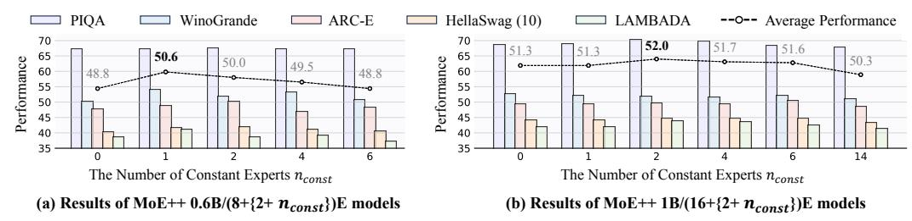
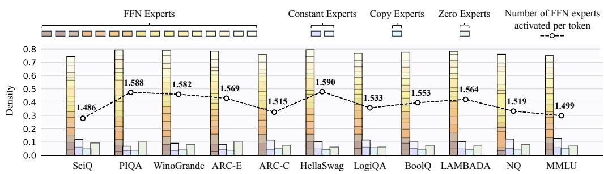
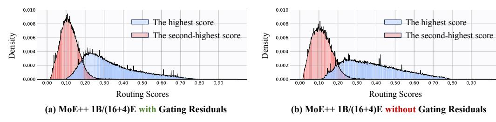

# 3 METHODOLOGY

A standard Mixture-of-Experts (MoE) layer consists of N expert networks E = {E1, E2, ..., EN } and a router G that activates the Top-K experts. Typically, the number of activated experts K is fixed and much smaller than the total number of experts N. Formally, given the input token x, the output token y of the MoE layer is the weighted sum of outputs from the K activated experts:

$$\mathbf{y} = \sum_{i=1}^{N} g_i E_i(\mathbf{x}), \quad g_i = \begin{cases} \operatorname{Softmax} \left( G(\mathbf{x}) \right)_i, & \text{if } G(\mathbf{x})_i \in \operatorname{Top-K} \left( \left\{ G(\mathbf{x})_i \middle| 1 \le i \le N \right\} \right). \\ 0, & \text{otherwise.} \end{cases}$$
 (1)

Vanilla MoE. A vanilla MoE layer typically consists of multiple structurally identical experts, where each expert is a standard Feed-Forward Network (FFN). Besides, the router is usually implemented as a trainable weight matrix. Formally, the experts and router in a vanilla MoE layer can be defined as:

$$\boldsymbol{E} = \{ FFN_1, FFN_2, ..., FFN_N \}, \quad G(\boldsymbol{x}) = \boldsymbol{W}\boldsymbol{x}, \tag{2}$$

where W ∈ R N×D is the trainable weight matrix, and D denotes the hidden size of the model. Since a fixed number of FFNs are activated in the vanilla MoE layer for both simple and challenging tokens, the vanilla MoE layer may be training and inference inefficient when processing simple tokens.

MoE++ Overview. Our proposed MoE++ is a general and heterogeneous MoE framework that integrates both FFN and zero-computation experts. Besides, MoE++ enhances the router by gating residuals, allowing each token to consider its previous pathway when selecting the appropriate experts in the current MoE++ layer. Additionally, to effectively train heterogeneous expert structures, we introduce a heterogeneous load balance loss and a heterogeneous expert capacity allocation strategy. The core components of the proposed MoE++ are illustrated in Fig. [2.](#page-3-0)

Figure 2: The core components of the proposed MoE++. Subfigure (a) illustrates the architectures of the FFN expert and zero-computation experts, while subfigure (b) shows the gating residuals which allow each token to consider its previous pathway to select the appropriate experts.

### 3.1 ZERO-COMPUTATION EXPERTS

In MoE++, the redesigned expert architecture should satisfy specific criteria: (i) It should be as streamlined as possible to process simple tokens efficiently; (ii) To ensure a fair comparison with the vanilla MoE, the new expert should introduce an almost negligible number of parameters. Guided by these principles, we introduce zero-computation experts, each performing only the most fundamental operations. Specifically, we propose three types of zero-computation experts: the zero expert, copy expert, and constant expert, which correspond to discard, skip, and replace operations, respectively.

Zero Experts. The simplest zero-computation is to discard the current input. Given input token x, the output of the zero expert is 0, which is formulated as:

$$E_{zero}(\boldsymbol{x}) = \mathbf{0}.\tag{3}$$

In essence, the presence of zero experts can degrade the Top-2 MoE++ layer to the Top-1 MoE++ layer. Specifically, if a zero expert is activated, its zero output makes the output of Top-2 MoE++ layers equivalent to that of the other expert alone. Therefore, in MoE++, the introduction of zero experts adds flexibility in handling both simple and challenging tokens simultaneously.

Copy Experts. Inspired by residual networks [\(He et al.,](#page-11-10) [2016\)](#page-11-10), we propose the copy expert, whose output is equal to the input and therefore equivalent to a shortcut:

$$E_{copy}(\boldsymbol{x}) = \boldsymbol{x}.\tag{4}$$

Intuitively, the copy expert offers the option to skip the current MoE++ layer. Specifically, if the input token is poorly aligned with the existing experts, it may benefit from bypassing the MoE++ layer.

Constant Experts. Neither zero experts nor copy experts contain trainable parameters, so their flexibility in handling input tokens is limited. To address this limitation, we propose constant experts, which replace the input token x with a trainable vector v. However, a complete replacement would lose all input information. Therefore, we use a trainable weight matrix Wc to dynamically predict the proportion of the replacement. Formally, the output of copy experts can be defined as:

$$E_{const}(\boldsymbol{x}) = \alpha_1 \boldsymbol{x} + \alpha_2 \boldsymbol{v}, \quad [\alpha_1, \alpha_2] = \text{Softmax}(\boldsymbol{W}_c \boldsymbol{x}),$$
 (5)

where Wc ∈ R 2×D is the trainable weight matrix, and D is the hidden size of the input token x.

By assigning fewer FFN experts to simple tokens and dedicating more FFN experts to challenging tokens, MoE++ optimizes computation allocation. Therefore, MoE++ achieves better performance with less computation than vanilla MoE. Moreover, MoE++ significantly broadens the range of subnetworks. For instance, combining an FFN expert with a constant expert is equivalent to adjusting the output of the FFN expert using a trainable vector. Similarly, the combination of a zero expert with a copy expert allows the input token to bypass the current layer entirely.

### 3.2 PATHWAY-AWARE ROUTER

Since MoE++ contains heterogeneous experts, the design of the router becomes even more critical compared to vanilla MoE. To this end, we propose the pathway-aware router that considers the pathway taken in the previous layer when selecting the appropriate experts.

Table 1: Comparison of complexity between the proposed MoE++ and MoE. Hyper-parameter  $\tau$  controls the proportion of tokens allocated between zero-computation experts and FFN experts.

| Methods             | # The Number of | # The Number of             | # The Number of          | Computation                                                                                           |
|---------------------|-----------------|-----------------------------|--------------------------|-------------------------------------------------------------------------------------------------------|
|                     | Tokens          | FFN Experts                 | Zero-Computation Experts | Complexity                                                                                            |
| MoE <b>MoE++</b> | $T \ T$         | $N_{\rm FFN} \ N_{\rm FFN}$ | $0 \ N_{\rm ZC}$         | $\mathcal{O}(T) \over \mathcal{O}(\frac{\tau N_{\text{FFN}} T}{\tau N_{\text{FFN}} + N_{\text{ZC}}})$ |

**Gating Residuals.** Similar to residual networks (He et al., 2016), we add the routing scores from the previous layer to the routing scores predicted by the current layer. Specifically, given the input token  $x^j$  of the  $j_{th}$  layer with N experts, we use a trainable transformation matrix  $W_g^j \in \mathbb{R}^{N \times N}$  to integrate the scores from the previous layer into the current layer:

$$G(\boldsymbol{x}^{j}) = \begin{cases} \boldsymbol{W}^{j} \boldsymbol{x}^{j}, & \text{if } j = 1, \\ \boldsymbol{W}^{j} \boldsymbol{x}^{j} + \boldsymbol{W}_{g}^{j} G(\boldsymbol{x}^{j-1}), & \text{if } j > 1, \end{cases}$$
(6)

where  $W^j \in \mathbb{R}^{N \times D}$  is the trainable weight matrix, and D is the hidden size. These gating residuals effectively establish connections between MoE++ layers, therefore ensuring stable routing.

#### 3.3 LOAD BALANCE DURING PRETRAINING

Training an MoE model directly often results in most tokens being dispatched to a small number of experts, leaving other experts insufficiently trained (Shazeer et al., 2017). Following previous works (Lepikhin et al., 2021; Xue et al., 2024; Dai et al., 2024; Wei et al., 2024), we apply the load balance loss and expert capacity to ensure a balanced load during pretraining.

**Heterogeneous Load Balance Loss.** In vanilla MoE methods, each expert is a standard Feed-Forward Network (FFN), so all experts are assigned the same number of tokens. However, in our proposed MoE++, the architecture and number of parameters in zero-computation experts and FFN experts differ significantly, making it sub-optimal to allocate the same number of tokens to both types of experts. To this end, we introduce a hyper-parameter  $\tau$  to control the proportion of tokens allocated between zero-computation experts and FFN experts. Specifically, given the  $t_{th}$  input token  $\boldsymbol{x}_t$ , the heterogeneous load balance loss  $\mathcal{L}_b$  is formulated as:

$$\mathcal{L}_{b} = \sum_{i=1}^{N} \eta_{i} f_{i} P_{i}, \quad \eta_{i} = \begin{cases} 1, & \text{if Expert } i \text{ is an FFN expert,} \\ \tau, & \text{if Expert } i \text{ is a zero-computation expert,} \end{cases}$$

$$f_{i} = \frac{1}{T} \sum_{t=1}^{T} \mathbb{1}(\text{Token } \boldsymbol{x}_{t} \text{ selects Expert } i), \quad P_{i} = \frac{1}{T} \sum_{t=1}^{T} \text{Softmax}(G(\boldsymbol{x}_{t}))_{i},$$

$$(7)$$

where T denotes the number of tokens. N is the number of experts.  $\mathbb{1}(*)$  denotes the indicator function. A smaller hyper-parameter  $\tau$  means that more tokens are assigned to the zero-computation experts. In comparison, a larger  $\tau$  means fewer tokens are allocated to the zero-computation experts.

**Expert Capacity.** Expert capacity is proposed to mitigate severe load imbalance by limiting the maximum number of tokens routed to each expert. Since MoE++ assigns different numbers of tokens to different types of experts, we also design varying expert capacities for each type of expert. For an MoE++ model with  $N_{\rm FFN}$  FFN experts and  $N_{\rm ZC}$  zero-computation experts, the total number of experts is  $N=N_{\rm FFN}+N_{\rm ZC}$ . Given the hyper-parameter  $\tau$ , the expert capacity is defined as:

$$C_{i} = \begin{cases} \gamma \frac{\tau T}{\tau N_{\text{FFN}} + N_{\text{ZC}}}, & \text{if Expert } i \text{ is an FFN expert,} \\ \gamma \frac{T}{\tau N_{\text{FFN}} + N_{\text{ZC}}}, & \text{if Expert } i \text{ is a zero-computation expert,} \end{cases}$$
(8)

where  $\gamma$  is the preset capacity factor. T is the number of tokens. Similarly, a smaller hyper-parameter  $\tau$  means more capacity is allocated to the zero-computation expert. For both types of experts, if an expert is underutilized, its unused capacity is filled with padding tokens. Once an expert reaches capacity, any additional tokens assigned to that expert are dropped out, which means the additional tokens are passed directly to the subsequent Transformer (Vaswani et al., 2017) block.

**Total Training Objective.** Finally, the total training loss is the weighted sum of the cross-entropy loss  $\mathcal{L}_{ce}$  and the heterogeneous load balance loss  $\mathcal{L}_b$ :

$$\mathcal{L} = \mathcal{L}_{ce} + \beta \mathcal{L}_b, \tag{9}$$

Table 2: **Sizes and architectures of MoE++ and vanilla MoE models.** "0.2B/0.6B" represents an architecture of an approximately 0.6B parameter, with 0.2B activated per token during inference. "1/1/2" denotes an MoE++ model with one zero expert, one copy expert, and two constant experts.

| Methods                          | # Activated Params   | # Layers | # Hidden Size | # Intermediate Size | # Heads | # Head Dim | # The Number of FFN Experts | # Zero/Copy/Constant Experts |
|----------------------------------|-------------------------|----------|------------------|------------------------|---------|---------------|--------------------------------|---------------------------------|
| MoE 0.6B/8E MoE++ 0.6B/(8+4)E | 0.2B/0.6B ≤0.2B/0.6B | 12       | 768              | 2048                   | 12      | 64            | 8                              | 1/1/2                           |
| MoE 1B/16E MoE++ 1B/(16+4)E   | 0.2B/1B ≤0.2B/1B     | 12       | 768              | 2048                   | 12      | 64            | 16                             | 1/1/2                           |
| MoE 2B/32E MoE++ 2B/(32+8)E   | 0.2B/2B ≤0.2B/2B     | 12       | 768              | 2048                   | 12      | 64            | 32                             | 1/1/6                           |
| MoE 7B/16E MoE++ 7B/(16+4)E   | 1.2B/7B ≤1.2B/7B     | 24       | 1536             | 4096                   | 16      | 96            | 16                             | 1/1/2                           |

where  $\beta$  is the trade-off hyper-parameter to mitigate the risk of routing collapse.

#### 3.4 Analysis of Efficiency

It is worth noting that zero-computation experts require a negligible amount of computing and communication costs to process a token. As shown in Tab. 1, for an MoE++ model with  $N_{\text{FFN}}$  FFN experts,  $N_{\text{ZC}}$  zero-computation experts and hyper-parameter  $\tau$ , its computational complexity is only  $\frac{\tau N_{\text{FFN}}}{\tau N_{\text{FFN}} + N_{\text{ZC}}}$  that of MoE models with the same number of parameters.

#### 4 EXPERIMENTS

#### 4.1 EXPERIMENTAL SETUP

**Model Settings.** We use Megatron (Shoeybi et al., 2019), an open-source training code, as the training framework. We conduct training on a cluster with 4 nodes and 32 A100 GPUs. Tab. 2 summarizes the hyper-parameter settings of various MoE++ models. For example, "MoE++ 0.6B/(8+4)E" represents the architecture of an approximately 0.6B parameter MoE++ model with 8 FFN experts and 4 zero-computation experts. For a fair comparison, we also include the corresponding MoE model configurations with similar numbers of activated parameters per token during inference.

**Training Data and Tokenization.** MoE++ is trained exclusively on public datasets, making it accessible for academic research settings. Specifically, we sample from the **RedPajama** (Computer, 2023a), **Dolma** (Soldaini et al., 2024), and **Pile** (Gao et al., 2020) datasets according to different sampling probabilities. Please refer to Tab. A and Appendix B.1 for detailed sample ratios. We use the tokenizer of LLaMA2, which contains 65,536 vocabulary tokens.

**Training Hyper-Parameters.** The hyper-parameters for MoE++ are selected based on the common practice for dense language models. We replace all FFN layers in the transformer with MoE++ layers and set the Top-K to 2 for every layer, resulting in approximately twice the computation compared to a dense model. Please refer to Tab. B and Appendix B.2 for detailed training hyper-parameters.

Evaluation Benchmarks. We use the lm-evaluation-harness package (Gao et al., 2024) to assess performance on an extensive suite of downstream tasks: (i) Following Pythia (Biderman et al., 2023) and Sheared-LLaMA (Xia et al., 2024), we report 0-shot accuracy on ARC Easy (ARC-E) (Clark et al., 2018), LAMBADA (Paperno et al., 2016), LogiQA (Liu et al., 2020), PIQA (Bisk et al., 2020), SciQ (Welbl et al., 2017), and WinoGrande (Sakaguchi et al., 2021). (ii) We also report the accuracy of tasks from the Open LLM Leaderboard (Beeching et al., 2023), including 10-shot HellaSwag (Zellers et al., 2019), 25-shot ARC Challenge (ARC-C) (Clark et al., 2018), and 5-shot MMLU (Hendrycks et al., 2021). (iii) Moreover, we report the exact match score for 32-shot Natural Questions (NQ) (Kwiatkowski et al., 2019) and the accuracy for 32-shot BoolQ (Clark et al., 2019).

### 4.2 MAIN RESULTS

**Comparisons to Vanilla MoE.** To conduct comparative evaluations of our proposed MoE++ against vanilla MoE models, we start with a modest scale of 0.6B parameters and expand up to 7B. Since the activated parameters are only about 0.2B for the smallest model, we select 9 simple

Table 3: Comparisons between MoE++ and vanilla MoE models. The training budget for all MoE++ and vanilla MoE models listed in the table below is 100B tokens.

| Methods                                          | # τ          | # Expert Forward # Throughput |                | Commonsense & Reading Comprehension |              |                           |                 |                |  |  |
|--------------------------------------------------|--------------|-------------------------------|----------------|-------------------------------------|--------------|---------------------------|-----------------|----------------|--|--|
|                                                  |              | Time (ms)                     | Increase       | SciQ                                | PIQA         | WinoGrande                | ARC-E           | HellaSwag (10) |  |  |
| MoE 0.6B/8E                                      | -            | 535.3                         | -              | 76.6                                | 67.3         | 50.2                      | 47.6            | 40.3           |  |  |
| MoE++ 0.6B/(8+4)E 0.10                           |              | 202.4                         | 164.5%         | 73.1                                | 65.1         | 51.9                      | 46.0            | 36.1           |  |  |
| MoE++ 0.6B/(8+4)E 0.25                           |              | 277.8                         | 92.7%          | 74.8                                | 66.5         | 51.1                      | 48.4            | 39.7           |  |  |
| MoE++ 0.6B/(8+4)E 0.50                           |              | 387.3                         | 38.2%          | 74.9                                | 68.4         | 49.3                      | 48.9            | 40.7           |  |  |
| MoE++ 0.6B/(8+4)E 0.75                           |              | 427.6                         | 25.2%          | 76.5                                | 67.6         | 51.9                      | 50.1            | 41.8           |  |  |
| MoE++ 0.6B/(8+4)E 1.00                           |              | 449.6                         | 19.1%          | 75.9                                | 67.6         | 52.2                      | 49.0            | 41.7           |  |  |
| MoE 1B/16E                                       | -            | 610.9                         | -              | 79.3                                | 68.4         | 54.2                      | 48.9            | 43.7           |  |  |
| MoE++ 1B/(16+4)E                                 | 0.10         | 289.3                         | 111.2%         | 76.3                                | 67.6         | 51.1                      | 48.5            | 40.0           |  |  |
| MoE++ 1B/(16+4)E                                 | 0.25         | 384.9                         | 58.7%          | 77.4                                | 68.3         | 50.2                      | 48.2            | 42.5           |  |  |
| MoE++ 1B/(16+4)E                                 | 0.50         | 469.7                         | 30.1%          | 77.5                                | 67.6         | 52.5                      | 49.7            | 44.3           |  |  |
| MoE++ 1B/(16+4)E                                 | 0.75         | 500.3                         | 22.1%          | 78.3                                | 70.3         | 51.7                      | 49.7            | 44.6           |  |  |
| MoE++ 1B/(16+4)E                                 | 1.00         | 530.2                         | 15.2%          | 79.3                                | 69.5         | 52.5                      | 51.5            | 44.6           |  |  |
| MoE 2B/32E                                       | -            | 683.4                         | -              | 77.9                                | 70.0         | 51.6                      | 51.6            | 46.0           |  |  |
| MoE++ 2B/(32+8)E                                 | 0.10         | 417.9                         | 63.5%          | 76.0                                | 68.2         | 52.3                      | 49.7            | 42.7           |  |  |
| MoE++ 2B/(32+8)E                                 | 0.25         | 473.7                         | 44.3%          | 76.2                                | 69.4         | 52.6                      | 51.7            | 46.0           |  |  |
| MoE++ 2B/(32+8)E                                 | 0.50         | 532.7                         | 28.3%          | 78.4                                | 70.0         | 54.2                      | 50.6            | 47.0           |  |  |
| MoE++ 2B/(32+8)E                                 | 0.75         | 561.0                         | 21.8%          | 79.6                                | 70.2         | 51.9                      | 51.4            | 47.3           |  |  |
| MoE++ 2B/(32+8)E                                 | 1.00         | 590.5                         | 15.7%          | 81.7                                | 69.8         | 53.6                      | 52.4            | 47.7           |  |  |
| MoE 7B/16E                                       | -            | 1859                          | -              | 78.3                                | 72.6         | 58.8                      | 53.1            | 61.3           |  |  |
| MoE++ 7B/(16+4)E                                 | 0.75         | 1455                          | 27.8%          | 80.1                                | 73.6         | 58.2                      | 53.6            | 61.8           |  |  |
|                                                  |              |                               |                |                                     |              |                           |                 |                |  |  |
|                                                  |              | # Expert Forward # Throughput |                |                                     | Continued    | LM                        | World Knowledge |                |  |  |
| Methods                                          | # τ          | Time (ms)                     | Increase       |                                     |              | LogiQA BoolQ (32) LAMBADA | NQ (32)         | Average        |  |  |
|                                                  |              |                               |                |                                     |              |                           |                 |                |  |  |
| MoE 0.6B/8E                                      | -            | 535.3                         | -              | 25.3                                | 50.9         | 38.7                      | 1.5             | 44.3           |  |  |
| MoE++ 0.6B/(8+4)E 0.10                           |              | 202.4                         | 164.5%         | 27.5                                | 57.6         | 33.2                      | 0.3             | 43.4           |  |  |
| MoE++ 0.6B/(8+4)E 0.25                           |              | 277.8                         | 92.7%          | 27.8                                | 55.9         | 38.3                      | 1.2             | 44.9           |  |  |
| MoE++ 0.6B/(8+4)E 0.50                           |              | 387.3                         | 38.2%          | 27.3                                | 56.5         | 37.4                      | 1.1             | 44.9           |  |  |
| MoE++ 0.6B/(8+4)E 0.75 MoE++ 0.6B/(8+4)E 1.00 |              | 427.6 449.6                | 25.2% 19.1% | 28.7 26.9                        | 54.2 46.1 | 38.7 39.6              | 1.1 1.1      | 45.6 44.5   |  |  |
|                                                  |              |                               |                |                                     |              |                           |                 |                |  |  |
| MoE 1B/16E                                       | -            | 610.9                         | -              | 27.5                                | 41.2         | 42.5                      | 2.1             | 45.3           |  |  |
| MoE++ 1B/(16+4)E                                 | 0.10         | 289.3                         | 111.2%         | 26.4                                | 60.8         | 40.5                      | 0.9             | 45.8           |  |  |
| MoE++ 1B/(16+4)E                                 | 0.25         | 384.9                         | 58.7%          | 27.2                                | 57.2         | 40.2                      | 2.1             | 45.9           |  |  |
| MoE++ 1B/(16+4)E                                 | 0.50         | 469.7                         | 30.1%          | 27.0                                | 50.7         | 42.5                      | 2.4             | 46.0           |  |  |
| MoE++ 1B/(16+4)E MoE++ 1B/(16+4)E             | 0.75 1.00 | 500.3 530.2                | 22.1% 15.2% | 27.6 27.8                        | 46.3 52.2 | 43.9 45.3              | 2.4 1.8      | 46.1 47.2   |  |  |
| MoE 2B/32E                                       | -            | 683.4                         | -              | 28.1                                | 41.2         | 43.9                      | 2.9             | 45.9           |  |  |
| MoE++ 2B/(32+8)E                                 | 0.10         | 417.9                         | 63.5%          | 28.7                                | 58.0         | 39.1                      | 1.8             | 46.3           |  |  |
| MoE++ 2B/(32+8)E                                 | 0.25         | 473.7                         | 44.3%          | 28.6                                | 54.3         | 42.3                      | 1.8             | 47.0           |  |  |
| MoE++ 2B/(32+8)E                                 | 0.50         | 532.7                         | 28.3%          | 26.7                                | 45.1         | 43.5                      | 2.2             | 46.4           |  |  |
| MoE++ 2B/(32+8)E                                 | 0.75         | 561.0                         | 21.8%          | 27.7                                | 48.2         | 46.0                      | 3.6             | 47.3           |  |  |
| MoE++ 2B/(32+8)E                                 | 1.00         | 590.5                         | 15.7%          | 25.7                                | 58.4         | 44.9                      | 3.0             | 48.6           |  |  |
| MoE 7B/16E                                       | -            | 1859                          | -              | 27.8                                | 53.7         | 57.2                      | 8.2             | 52.3           |  |  |

benchmarks as the metric. As shown in Tab. [3,](#page-6-0) our proposed MoE++ consistently outperforms vanilla MoE models. Notably, MoE++ achieves a 15%∼111% increase in expert forward throughput compared to a vanilla MoE model of the same size, while at the same time having better performance. The proposed MoE++ lays a solid foundation for developing advanced and efficient language models.

Comparisons to LLMs of Equivalent Activated Parameters. Existing models usually employ substantial training budgets, such as OpenMoE-8B/32E with 1.1T tokens and TinyLlama-1.1B with 3T tokens. Similarly, as shown in Tab. [4,](#page-7-0) we extend the training budget of our MoE++ model to 1T tokens, aligning it with other models. We find that the MoE++ model delivers performance comparable to dense models that have 2 to 3 times the number of activation parameters. Notably, MoE++ outperforms OpenMoE-8B/32E, a larger MoE model trained from scratch with more tokens, while utilizing only approximately 57% of the computational cost of OpenMoE-8B/32. These results show that the proposed MoE++ method is a promising solution for training LLMs.

### 4.3 ABLATIVE ANALYSIS

Effect of the hyper-parameter τ in Eq. [7](#page-4-1) and Eq. [8.](#page-4-2) The hyper-parameter τ controls the proportion of tokens distributed between zero-computation experts and FFN experts. To investigate

Table 4: Comparisons to LLMs of equivalent activated parameters. " § " denotes that the model is not trained from scratch but is pruned and continue-tuned using the weights of LLaMA2-7B. Therefore, we gray out Sheared-LLaMA and LLaMA-MoE for a fair comparison. The results of OpenMoE-8B/32E are from its paper, so only partial task results are available.

| Methods                                                                 | # Activated        |              |                   | Commonsense & Reading Comprehension |             |                 |                                            |
|-------------------------------------------------------------------------|--------------------|--------------|-------------------|-------------------------------------|-------------|-----------------|--------------------------------------------|
|                                                                         | Params             | SciQ         | PIQA              |                                     |             |                 | WinoGrande ARC-E ARC-C (25) HellaSwag (10) |
| LLaMA2-7B (Touvron et al., 2023)                                        | 7B/7B              | 93.7         | 78.1              | 69.3                                | 76.4        | 53.0            | 78.6                                       |
| OPT-1.3B (Zhang et al., 2022)                                           | 1.3B/1.3B          | 84.3         | 71.7              | 59.6                                | 57.0        | 29.7            | 54.5                                       |
| Pythia-1.4B (Biderman et al., 2023)                                     | 1.4B/1.4B          | 86.4         | 70.9              | 57.4                                | 60.7        | 31.2            | 53.0                                       |
| TinyLlama-1.1B (Zhang et al., 2024)                                     | 1.1B/1.1B          | 88.9         | 73.3              | 58.8                                | 55.3        | 30.1            | 60.3                                       |
| Sheared-LLaMA-1.3B§ (Xia et al., 2024)                               | 1.3B/1.3B          | 87.3         | 73.4              | 57.9                                | 61.5        | 33.5            | 60.7                                       |
| OPT-2.7B (Zhang et al., 2022)                                           | 2.7B/2.7B          | 85.8         | 73.7              | 60.8                                | 60.8        | 34.0            | 61.5                                       |
| Pythia-2.8B (Biderman et al., 2023)                                     | 2.8B/2.8B          | 88.3         | 74.0              | 59.7                                | 64.4        | 36.4            | 60.8                                       |
| INCITE-Base-3B (Computer, 2023b)                                        | 3B/3B              | 90.7         | 74.6              | 63.5                                | 67.7        | 40.2            | 64.8                                       |
| Open-LLaMA-3B-v1 (Geng & Liu, 2023)                                     | 3B/3B              | 91.3         | 73.7              | 61.5                                | 67.6        | 39.6            | 62.6                                       |
| Open-LLaMA-3B-v2 (Geng & Liu, 2023)                                     | 3B/3B              | 91.8         | 76.2              | 63.5                                | 66.5        | 39.0            | 67.6                                       |
| Sheared-LLaMA-2.7B§ (Xia et al., 2024)                               | 2.7B/2.7B          | 90.8         | 75.8              | 64.2                                | 67.0        | 41.2            | 70.8                                       |
| OpenMoE-8B/32E (Xue et al., 2024)                                       | 2.1B/8B            | -            | 74.2              | 60.3                                | 64.1        | 30.3            | 45.5                                       |
| LLaMA-MoE-3.0B§ (Zhu et al., 2024)                                   | 3.0B/7B            | 89.9         | 77.5              | 63.6                                | 66.8        | 40.9            | 70.8                                       |
| MoE++ 7B/(16+4)E                                                        | ≤1.2B/7B           | 89.7         | 77.6              | 63.1                                | 66.5        | 42.3            | 72.3                                       |
|                                                                         |                    |              |                   |                                     |             |                 |                                            |
|                                                                         | # Active           |              | Continued         | LM                                  |             | World Knowledge |                                            |
| Methods                                                                 | Params             |              | LogiQA BoolQ (32) | LAMBADA                             | NQ (32)     | MMLU (5)        | Average                                    |
| LLaMA2-7B (Touvron et al., 2023)                                        | 7B/7B              | 30.7         | 82.1              | 73.9                                | 28.8        | 46.6            | 64.7                                       |
| OPT-1.3B (Zhang et al., 2022)                                           | 1.3B/1.3B          | 26.9         | 57.5              | 58.0                                | 6.9         | 24.7            | 48.3                                       |
| Pythia-1.4B (Biderman et al., 2023)                                     | 1.4B/1.4B          | 27.3         | 57.4              | 61.6                                | 6.2         | 25.7            | 48.9                                       |
| TinyLlama-1.1B (Zhang et al., 2024)                                     | 1.1B/1.1B          | 26.3         | 60.9              | 58.8                                | 12.1        | 25.5            | 50.0                                       |
| Sheared-LLaMA-1.3B§ (Xia et al., 2024)                               | 1.3B/1.3B          | 26.9         | 64.0              | 61.0                                | 9.6         | 25.7            | 51.0                                       |
|                                                                         |                    |              |                   |                                     |             |                 |                                            |
| OPT-2.7B (Zhang et al., 2022)                                           | 2.7B/2.7B          | 26.0         | 63.4              | 63.6                                | 10.1        | 25.9            | 51.4                                       |
| Pythia-2.8B (Biderman et al., 2023) INCITE-Base-3B (Computer, 2023b) | 2.8B/2.8B 3B/3B | 28.0 27.7 | 66.0 65.9      | 64.7 65.3                        | 9.0 14.9 | 26.9 27.0    | 52.6 54.8                               |
| Open-LLaMA-3B-v1 (Geng & Liu, 2023)                                     | 3B/3B              | 28.4         | 70.0              | 65.4                                | 18.6        | 27.0            | 55.1                                       |
| Open-LLaMA-3B-v2 (Geng & Liu, 2023)                                     | 3B/3B              | 28.1         | 69.6              | 66.5                                | 17.1        | 26.9            | 55.7                                       |
| Sheared-LLaMA-2.7B§ (Xia et al., 2024)                               | 2.7B/2.7B          | 28.9         | 73.7              | 68.4                                | 16.5        | 26.4            | 56.7                                       |
| OpenMoE-8B/32E (Xue et al., 2024)                                       | 2.1B/8B            | -            | 61.2              | -                                   | -           | -               | -                                          |
| LLaMA-MoE-3.0B§ (Zhu et al., 2024)                                   | 3.0B/7B            | 30.6         | 71.9              | 66.6                                | 17.0        | 26.8            | 56.6                                       |

Figure 3: Ablation study on the number of constant experts. We gradually increase the number of constant experts nconst until the number of zero-computation experts is the same as that of FFN experts. All models are trained with a budget of 100B tokens, with the hyper-parameter τ set to 0.75.

the impact of the hyper-parameter τ , we provide comparative evaluations in Tab. [3.](#page-6-0) As shown in Tab. [3,](#page-6-0) a smaller τ means that more tokens are assigned to the zero-computation experts with negligible computing costs, resulting in higher throughput. Conversely, a larger τ means fewer tokens are allocated to the zero-computation experts and generally have better performance. To balance computing costs and performance, we set the hyper-parameter τ to 0.75 by default.

Effect of Each Zero-Computation Expert. In Tab. [5,](#page-8-0) we provide the ablation study on each zero-computation expert in "MoE++ 1B/(16+4)E" model. We find that constant experts improve the model more than zero experts and copy experts. We consider that it is due to the increased flexibility that constant experts provide in handling tokens. Specifically, zero experts output only empty features, copy experts replicate the input as output, and constant experts introduce additional trainable vectors

Table 5: Ablation study on the impact of each zero-computation expert in "MoE++ 1B/(16+4)E" model. All models are trained with a budget of 100B tokens, with the hyper-parameter  $\tau$  set to 0.75.

| Zero     | Сору         | Constant     | Language Tasks |            |       |                |        |            |         | Average |
|----------|--------------|--------------|----------------|------------|-------|----------------|--------|------------|---------|---------|
| Expert   | Expert       | Expert       | PIQA           | WinoGrande | ARC-E | HellaSwag (10) | LogiQA | BoolQ (32) | LAMBADA |         |
|          |              |              | 68.4           | 54.2       | 48.9  | 43.7           | 27.5   | 41.2       | 42.5    | 46.6    |
|          |              |              | 68.4           | 52.2       | 48.7  | 44.0           | 28.3   | 45.7       | 42.0    | 47.0    |
|          | ✓            |              | 69.4           | 52.1       | 50.0  | 44.0           | 27.7   | 45.1       | 42.3    | 47.2    |
|          |              | $\checkmark$ | 68.6           | 51.3       | 49.6  | 44.4           | 28.9   | 46.4       | 42.4    | 47.4    |
| ✓        | ✓            |              | 68.6           | 52.6       | 49.2  | 44.1           | 28.1   | 45.8       | 41.8    | 47.2    |
| ✓        |              | $\checkmark$ | 67.9           | 52.4       | 50.8  | 44.0           | 26.6   | 47.1       | 42.2    | 47.3    |
|          | $\checkmark$ | $\checkmark$ | 68.8           | 53.6       | 49.3  | 44.6           | 24.9   | 47.3       | 44.0    | 47.5    |
| <b>√</b> | ✓            | ✓            | 70.3           | 51.7       | 49.7  | 44.6           | 27.6   | 46.3       | 43.9    | 47.7    |

Table 6: Ablation study on the gating residuals in "MoE++ 1B/(16+4)E" model. All models are trained with a budget of 100B tokens, with the hyper-parameter  $\tau$  set to 0.75.

| Methods                    | Language Tasks |            |       |                |        |            |         | Average |
|----------------------------|----------------|------------|-------|----------------|--------|------------|---------|---------|
|                            | PIQA           | WinoGrande | ARC-E | HellaSwag (10) | LogiQA | BoolQ (32) | LAMBADA |         |
| MoE++ w/o gating residuals | 69.0           | 51.3       | 50.8  | 44.1           | 27.5   | 46.2       | 43.8    | 47.5    |
| MoE++ w/ gating residuals  | 70.3           | 51.7       | 49.7  | 44.6           | 27.6   | 46.3       | 43.9    | 47.7    |

Figure 4: The visualization of the expert load distribution at the task level. The result comes from layer 12 of the "MoE++ 7B/(16+4)E" model, with the hyper-parameter  $\tau$  set to 0.75.

to adjust the output. Our full model, which incorporates all three types of zero-computation experts, achieves the best performance, demonstrating their benefit for language models.

**Effect of the Gating Residuals.** The gating residuals enable each token to consider the pathway taken in the previous layer when selecting the appropriate experts. To explore the influence of the gating residuals, we provide the ablation results in Tab. 6. We find that these simple gating residuals effectively establish connections between different MoE++ layers, thereby ensuring stable routing.

Effect of the Number of Constant Experts  $n_{const}$ . Compared to zero experts and copy experts, constant experts have trainable vectors, allowing for the addition of multiple constant experts to the MoE++ layer to enhance performance. We gradually increase the number of constant experts  $n_{const}$  and provide the ablation results in Fig. 3. We find that average performance initially improves and then decreases. We consider that it is because an increase in constant experts reduces the expert capacity (Eq. 8) of other types of experts. As shown in Fig. 3, given the number of FFN experts  $N_{FFN}$ , the number of constant experts  $n_{const}$  can be adaptively determined by:

$$n_{const} = \max(\frac{N_{\text{FFN}}}{4} - n_{zero} - n_{copy}, 1), \tag{10}$$

where  $n_{zero}$  represents the number of zero experts.  $n_{copy}$  denotes the number of copy experts.

#### 4.4 QUALITATIVE ANALYSIS

**Visualization of the Expert Load Distribution at the Task Level.** We provide the visualization of the expert load distribution in Fig. 4. Fig. 4 reveals three key findings: (i) There is a significant variation in the number of FFN experts activated per token across tasks, but it is not necessarily the simpler tasks that activate fewer FFN experts. For example, the ARC Challenge task activates more

Figure 5: The visualization of the number of FFN experts activated per token at the token level. The result comes from the "MoE++ 7B/(16+4)E" model, with the hyper-parameter τ set to 0.75. We evaluate over 60,000 tokens and average results across all MoE++ layers. Tokenizers often split a word into multiple components, resulting in semantically meaningless tokens such as "icken".

Figure 6: The visualization of the impact of gating residuals on routing scores. We show the highest and second-highest scores of the "MoE++ 1B/(16+4)E" model on the WinoGrande benchmark. All models are trained with a budget of 100B tokens, with the hyper-parameter τ set to 0.75.

FFN experts than the ARC Easy task. These results indicate that the MoE++ model assigns experts based on the content of knowledge and complexity at the token level, rather than the overall task difficulty. (ii) Among all expert types, zero experts have the highest average number of activations. Interestingly, simpler tasks show a greater average number of zero expert activations. (iii) We observe that the expert assignments vary significantly across different task topics, indicating that the MoE++ model handles tasks of diverse topics by employing distinct expert assignment patterns. For additional visualizations and a detailed analysis of the expert load distribution, please refer to Appendix [D.](#page-17-0)

Visualization of the Number of FFN Experts Activated Per Token at the Token Level. To explore the average number of FFN expert activations at the token level, we provide the visualization in Fig. [5.](#page-9-0) The results reveal three observations: (i) Verbs tend to activate a large number of FFN experts. For example, the verb "touch" activates an average of 1.77 FFN experts across all layers, approaching the upper limit of 2. This likely occurs because verbs often convey rich semantic information and frequently interact with nouns to form more complex semantic structures. (ii) Nouns typically activate a moderate number of FFN experts, with most nouns averaging between 1.5 and 1.7 FFN expert activations. (iii) Simple tokens with little semantic tend to activate a small number of FFN experts. For example, word fragments, such as "pper" and "ather", usually activate fewer than 1.5 FFN experts. These findings confirm that MoE++ allows simple tokens to utilize fewer FFN experts, freeing up more FFN experts to focus on challenging tokens.

Visualization of the Impact of Gating Residuals on Routing Scores. To better illustrate the impact of the proposed pathway-aware router, we provide a visualization of the effect of gating residuals on routing scores. As shown in Fig. [6,](#page-9-1) these gating residuals effectively establish connections between different MoE++ layers and reduce the variance of routing scores. Meanwhile, the gating residuals do not change the mean and range of values of the routing scores. Consequently, gating residuals contribute to the stable routing of heterogeneous expert architectures in MoE++.

