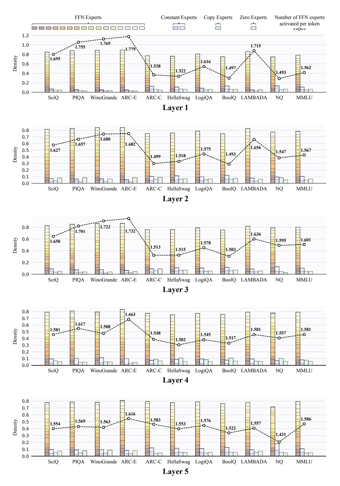
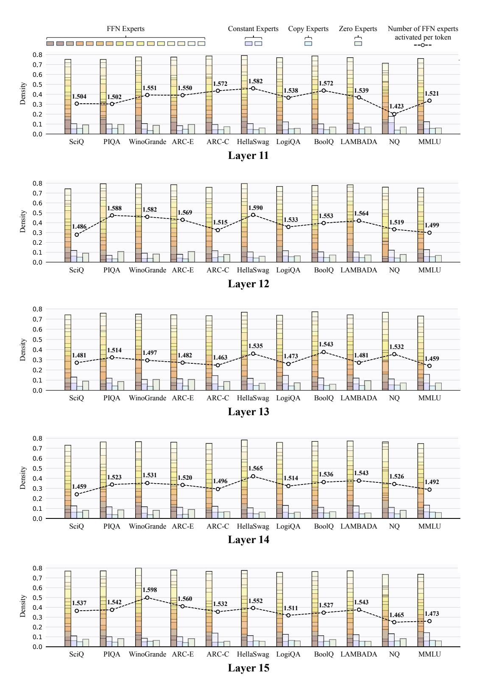

# D ADDITIONAL QUALITATIVE ANALYSIS

To explore the expert load distribution across all layers in the MoE++ model across different tasks, we provide the visualizations of the expert load distribution at the task level in Fig. [A,](#page-18-0) Fig. [B,](#page-19-0) Fig. [C,](#page-20-0) Fig. [D,](#page-21-0) and Fig. [E.](#page-22-0) These visualizations reveal several interesting findings:

- We observe a correlation in expert load across different layers, particularly between adjacent layers. For example, when layer j activates a large proportion of FFN experts, there is a high likelihood that layer j + 1 will also activate FFN experts in a similarly large proportion.
- We find that expert assignment patterns in the shallow and final layers vary more significantly across tasks compared to the middle layers. This suggests that the model primarily adapts to different tasks through its shallow and final layers, rather than the middle layers. Future work could focus on designing more complex structures in these layers to enhance the model's adaptability to diverse tasks.
- There is a significant variation in the number of FFN experts activated per token across tasks, but it is not necessarily the simpler tasks that activate fewer FFN experts. For example, the ARC Challenge task usually activates more FFN experts than ARC Easy. These results indicate that the MoE++ model assigns experts based on the content of knowledge and complexity at the token level, rather than the overall task difficulty.
- Among all expert types, zero experts have the highest average number of activations, with simpler tasks showing a greater average number of activations. For example, the ARC Easy task activates more zero experts than the ARC Challenge task. This indicates that the level of zero expert activation may serve as an indicator of task difficulty for the model.
- We also observe that the expert assignments vary significantly across different task topics for all layers in the MoE++ model, indicating that the MoE++ model handles tasks of diverse topics by employing distinct expert assignment patterns.

Figure A: The visualization of the expert load distribution at the task level. The results come from layer 1 to layer 5 of the "MoE++ 7B/(16+4)E" model, with the hyper-parameter τ set to 0.75.

Figure B: The visualization of the expert load distribution at the task level. The results come from layer 6 to layer 10 of the "MoE++ 7B/(16+4)E" model, with the hyper-parameter τ set to 0.75.

Figure C: The visualization of the expert load distribution at the task level. The results come from layer 11 to layer 15 of the "MoE++ 7B/(16+4)E" model, with the hyper-parameter τ set to 0.75.

Figure D: The visualization of the expert load distribution at the task level. The results come from layer 16 to layer 20 of the "MoE++ 7B/(16+4)E" model, with the hyper-parameter τ set to 0.75.

Figure E: The visualization of the expert load distribution at the task level. The results come from layer 21 to layer 24 of the "MoE++ 7B/(16+4)E" model, with the hyper-parameter τ set to 0.75.