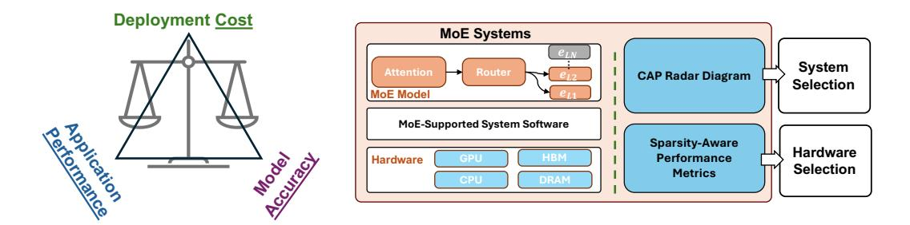

# 1 Introduction

Recent large language models (LLMs) are increasingly adopting sparse Mixture-of-Experts (MoE) architectures, notable examples of which include Switch-C [\[14\]](#page-11-0), DBRX, Mixtral-8x22B [\[25\]](#page-11-1), Snowflake Arctic [\[39\]](#page-12-0), Grok-1 [\[46\]](#page-12-1), DeepSeek-MoE [\[10\]](#page-10-0), and Qwen1.5-MoE [\[4\]](#page-10-1). These models utilize sparse experts grouped into an MoE layer, and these experts are selectively activated through a router (or a gating network). By routing tokens to a subset of experts, MoEs achieve sub-linear computational costs compared to their dense equivalents, which allows building trillion-parameter-scale LLMs.

Current MoE systems exhibit increasing complexity, driven by two main factors: (i) There is enhanced sophistication in the design of sparse MoE layers and gating networks (or routers), which differ in sparsity characteristics across various MoE models—we define sparsity in MoE systems as the ratio of activated to total parameters per token; (ii) MoEs demonstrate sub-linear computational complexity, enabling the offloading of less frequently activated experts onto external memory and processors. This approach reduces dependence on costly High Bandwidth Memory (HBM) on GPUs. Consequently, the complexity of servers hosting MoE systems has escalated, with these servers typically featuring heterogeneous compute, memory, and communication resources, arranged in a

1University of Edinburgh 2Microsoft Research 3Peking University 4NetMind.AI 5NVIDIA

∗Co-leading authors.

Figure 1: Overview of MoE-CAP. **Left**: We identify trade-offs between hardware Cost, model Accuracy, and application Performance. **Right**: MoE-CAP introduces new sparsity-aware metrics and CAP radar diagrams to accurately and comprehensively evaluate MoE systems, helping users choose both the right MoE system and suitable hardware.

multi-tier architecture. For instance, modern MoE systems increasingly offload experts to DRAM and SSDs [49, 13] and delegate part of the computation to CPUs [26].

Practitioners of MoE systems are actively seeking methods to benchmark their cost, accuracy (in downstream tasks), and performance (time and memory efficiency) in order to optimize their deployment. However, this benchmarking is challenging for the following reasons: (i) *Poor understanding of the relation between cost, accuracy and performance*: real-world deployments of MoE systems frequently reveal underestimated costs, under-achievements in performance benefits, and compromised accuracy. Clear principles are needed to help practitioners effectively evaluate and understand the complex interplay between these factors, (ii) *Inadequate system cost and performance assessment metrics*: Existing metrics like Memory Bandwidth Utilization (MBU) [1] and Model FLOPS Utilization (MFU) [8] fail to account for the sparse activation patterns of experts in MoE systems. This oversight leads to overestimated memory and compute costs. Additionally, current benchmarks predominantly estimate costs based on GPU usage alone. However, modern MoE systems increasingly rely on heterogeneous processors and multi-tier memory resources. Ignoring these factors yields inaccurate cost estimations.

To address the above issues, this paper introduces MoE-CAP, a benchmark designed to evaluate and understand the cost, accuracy, and performance of MoE systems. The design of MoE-CAP (illustrated in Figure 1) offers several key contributions:

- (1) A benchmarking method for understanding MoE system trade-offs. We analyze a broad range of MoE systems and observe that their optimizations typically compromise one of three key properties—cost, accuracy, or performance—while prioritizing the other two. Based on this observation, we categorize MoE systems into three types: cost—performance optimized, accuracy—cost optimized, and accuracy—performance optimized. To better capture and compare these trade-offs, we introduce the CAP radar diagram, a benchmarking method that highlights the strengths and limitations of each system, helping users select the most suitable MoE system based on their deployment needs.
- (2) Sparsity-aware performance metrics. We propose two sparsity-aware performance metrics: Sparse Memory Bandwidth Utilization (Sparse MBU) and Sparse Model FLOPS Utilization (Sparse MFU). These metrics enable accurate predictions of the compute and memory bandwidth savings achievable with MoE systems. As a result, they serve as a valuable guide for determining whether lower-power, cost-efficient processors can effectively support large MoE models without performance bottlenecks. This provides a formal explanation for how recent models such as DeepSeek-R1 significantly reduce the reliance on expensive, high-performance processors.
- (3) Comprehensive benchmark implementation and coverage. We developed an automated workflow to evaluate MoE systems on current and emerging hardware using sparsity-aware metrics and comparing them via the CAP radar diagram. It supports diverse MoE models—including QWen3 and DeepSeek-R1—and enables evaluation across multiple datasets and MoE-serving systems such as SGLang, vLLM, K-Transformer and MoE-Infinity.

Table 1: Characteristics of recent open-source MoE models.

| Model             | Total Param | Active Param | # of Experts | Top-k + Shared |
|-------------------|-------------|--------------|--------------|----------------|
| Switch-C          | 1571B       | 12B          | 128          | 1              |
| DBRX              | 132B        | 36B          | 16           | 4              |
| Mistral-8x22B     | 141B        | 39B          | 8            | 2              |
| Snowflake Arctic  | 480B        | 17B          | 128          | 2              |
| Grok-1            | 314B        | 77B          | 8            | 2              |
| DeepSeek-R1       | 671B        | 37B          | 256          | 8 + 1          |
| Qwen1.5-MoE       | 14.3B       | 2.7B         | 60           | 4 + 4          |
| Moonlight-16B-A3B | 16B         | 3B           | 64           | 6 + 2          |
| Qwen3-235B-A22B   | 235B        | 22B          | 128          | 8              |

