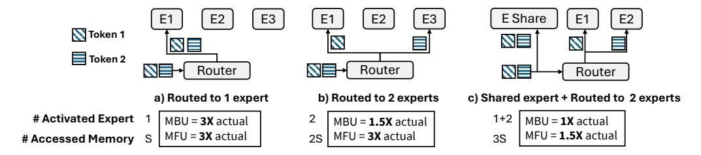
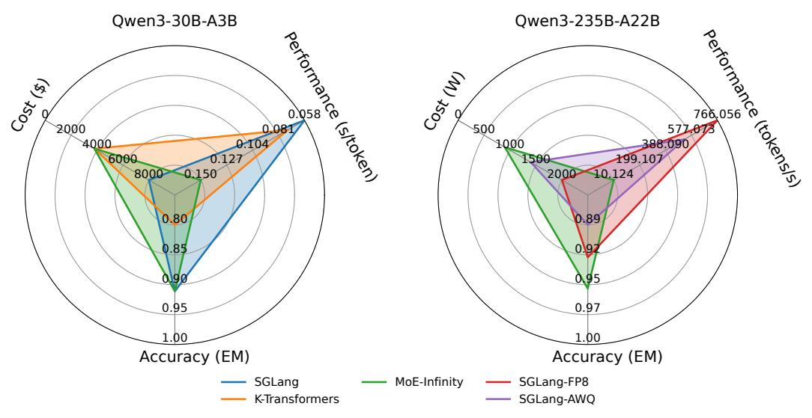

# 2 Background and Motivation

Sparse MoE models. Many sparse MoE models have been designed recently, and their characteristics are summarized in Table [1.](#page-2-0) These models typically possess a large number of parameters, with some reaching as high as 1571 billion. During token processing, only a subset of these parameters, generally between 1–25%, is activated. MoE models display diverse sparsity characteristics. For instance, Mistral-8x22B features large experts, each containing 0.3 billion parameters, but restricts the number of experts per layer to just 8. In contrast, Snowflake Arctic uses a much higher number of experts per layer (128), though each expert is smaller, containing only 0.15 billion parameters. The complexity extends to the router design, which typically selects the top-K experts (where K usually ranges from 1 to 4) for activation. Some models also employ a hybrid approach, incorporating a set of always-activated "shared" experts along with a selectively activated group of K experts. These shared experts may differ in size from the selectively activated ones, adding another layer of complexity to the model architecture.

Emerging MoE system designs. MoE systems exhibit sub-linear computational complexity but still require increased memory to accommodate all potentially activated experts. To enhance memory efficiency, several system designs have been explored recently: (i) Designs applying quantization to experts, such as unified quantization for all experts—e.g., GPTQ [\[16\]](#page-11-3), AWQ [\[32\]](#page-12-2), and SmoothQuant [\[47\]](#page-13-1)—and expert-specific adaptive quantization—e.g., QMoE [\[15\]](#page-11-4) and MoQE [\[27\]](#page-11-5). (ii) Designs offloading experts to external memory. Examples include MoE-layer-wise parameter offloading—e.g., DeepSpeed-Inference [\[2\]](#page-10-5) and SwapAdvisor [\[23\]](#page-11-6)—and fine-grained expert-level offloading—e.g., MoE-Infinity [\[49\]](#page-13-0), Brainstorm [\[9\]](#page-10-6), Mixtral-Offloading [\[13\]](#page-10-2). (iii) Designs utilizing CPU cores for sharing partial computation from GPUs, such as computing less input-intensive experts on CPUs— e.g., Fiddler [\[26\]](#page-11-2).

Heterogeneous resources in MoE systems. The sparse nature of MoE models has led system designers to increasingly utilize heterogeneous resources for hosting sparse experts, thus enhancing the cost–performance ratio of these systems. These resources are typically more cost-effective than their GPU counterparts, while still offering significant computing power and memory bandwidth, sufficient for certain operations in MoE models. These resources include: (i) Heterogeneous compute resources, such as CPUs integrated within GPUs (e.g., Grace-Hopper ARM chips) and external CPUs (e.g., AMD and Intel x86 chips). (ii) Heterogeneous memory resources, including LPDDR and HBM in a Grace-Hopper Superchip, DRAM in host CPU, and high-speed SSDs). (iii) Heterogeneous communication resources, featuring chip-to-chip links for HBM-DRAM within GPUs, PCIe for external GPU communications, and NVLink for inter-GPU communication.

#### 2.1 Why existing benchmarks fall short with MoE systems

Many LLM benchmarks have been proposed over the past few years, including MLPerf [\[38\]](#page-12-3), ML-Energy [\[51\]](#page-13-2), Open-LLM-Leaderboard [\[5\]](#page-10-7), LLM-Perf [\[24\]](#page-11-7), TensorDock [\[40\]](#page-12-4), and Artificial Analysis [\[3\]](#page-10-8). To evaluate LLM systems, these benchmarks primarily use three types of metrics: (i) overall system performance metrics, such as token throughput, prefilling time, and decoding time, (ii) cost metrics, like tokens-per-dollar and tokens-per-kilowatt, focusing solely on GPU usage, and (iii) fine-grained system performance metrics, such as MBU and MFU, to facilitate the understanding

Figure 2: MoE memory access and performance metrics under three routing scenarios. S denotes the size of a single expert. Existing MBU/MFU definitions overestimate costs by ignoring routing and expert selection. We show the extent of this overestimation relative to actual values.

of memory and compute bottlenecks, as discussed in recent MoE articles [1]. However, when these benchmarks are applied to MoE systems, they demonstrate several limitations.

- (1) Lack of principles to understand the relation between cost, accuracy and performance in MoE systems. While MoE systems often claim advantages in cost, accuracy, and performance, their real-world deployment frequently reveals significant challenges. Practitioners often find that deployment costs are underestimated, promised performance benefits over dense alternatives are not achieved, and model accuracy is often compromised. There is a growing need for clear principles to help users effectively assess and understand the complex interplay between these factors.
- (2) Inaccurate system cost and performance assessment metrics. The commonly used MBU [1] and MFU [8] metrics fail to consider the selective activation within sparse MoE layers. MBU measures memory bandwidth utilization as MBU =  $\frac{B_{\text{achieved}}}{B_{\text{peak}}}$  =  $\frac{(S_{\text{model}} + S_{\text{KV}})/\text{TPOT}}{B_{\text{peak}}}$ , where  $S_{\text{model}}$  represents the full model size and  $S_{\text{KV}}$  is the KV cache size,  $B_{\text{achieved}}$  refers to the achieved memory bandwidth per forward pass,  $B_{\text{peak}}$  is the peak bandwidth of the underlying hardware. Similarly, MFU measures compute utilization as MFU =  $(T_{\text{token}} \times F_{\text{token}})/F_{\text{peak}}$ , assuming all parameters participate in computation, where  $T_{\text{token}}$  is the token throughput,  $F_{\text{token}}$  represents the FLOPs required per token, and  $F_{\text{peak}}$  indicates the peak FLOPs capacity of the hardware. However, as illustrated in Figure 2, these metrics significantly overestimate resource utilization by assuming all experts are active, especially when batch size >1. For example, when only one expert out of three is activated (case a), both MBU and MFU are inflated by 3×. Even with shared experts (case c), the metrics still overestimate utilization by 1.5×. This often leads operators to substantially over-provision GPUs, causing significant resource waste.

### 3 The CAP Benchmarking Method

We propose the following **CAP benchmarking method** for understanding, benchmarking, and comparing MoE systems. The CAP method encompasses three key system optimization metrics:

- Cost (C): We propose a cost model for MoE systems that accounts for all hardware components, reflecting the increasing use of heterogeneous resources (e.g., CPUs and GPUs). Unlike existing benchmarks that consider GPU cost in isolation, our model jointly evaluates the cost—measured in power or monetary terms—of computation, communication, and memory. The computation cost includes both CPU and GPU usage. Communication cost captures system interconnects (e.g., PCIe links and NVLink). Memory cost spans multiple tiers (i.e., HBM, DRAM, PCIe SSD and emerging CXL).
- Accuracy (A): Accuracy in MoE systems is broadly defined to encompass a range of evaluation metrics commonly used in prominent LLM benchmarks, such as the Open LLM Leaderboard [5], which reflect real-world applications of large language models. To support comprehensive task evaluation—spanning multiple-choice, reasoning, and QA tasks—we adopt diverse metrics including exact match, F1 score, and win rate, ensuring broad coverage across various evaluation scenarios.
- **Performance** (**P**): Performance metrics in MoE systems vary by deployment scenario. In online serving, time-per-output-token (TPOT) is crucial, reflecting the need for low decoding latency. It is influenced by factors like memory bandwidth and FLOPS. In contrast, offline inference and training prioritize token throughput and end-to-end latency for faster task completion. We support

switching between metrics such as TPOT, throughput, bandwidth utilization, and FLOPS to suit different use cases.

### 3.1 Complete cost model of MoE systems

We introduce the design of our cost model, which aims to capture the complexity of managing various heterogeneous resources in an MoE system.

**Purchase cost.** Upon server decommissioning and during model deployment upgrades, new hardware purchases are factored into the overall cost. From a performance perspective, system choice is influenced by three main components as outlined in Equation 1: computation, communication, and memory capacity. The computation component includes both the GPU and CPU. Communication involves the connectivity within the system, such as the PCIe links between the GPU, CPU, and SSD, and the NVLink connections between GPUs. We also consider the communication between the computation units and memory, specifically CPU-to-DRAM and SRAM-to-HBM in GPUs. Memory is structured in three hierarchical tiers: HBM within the GPU, DRAM as host memory, and SSD storage. More formally, we define Equation 1 as follows where *C* stands for the dollar cost for the target hardware:

$$C_{\text{hardware}} = \underbrace{(C_{\text{GPU}} + C_{\text{CPU}})}_{\text{computation}} + \underbrace{(C_{\text{C2M}} + C_{\text{PCIe}} + C_{\text{NVLink}})}_{\text{communication}} + \underbrace{(C_{\text{HBM}} + C_{\text{DRAM}} + C_{\text{SSD}})}_{\text{memory}}, \quad (1)$$

$$= C_{\text{GPU}} + C_{\text{CPU}} + C_{\text{Motherboard}} + C_{\text{DRAM}} + C_{\text{SSD}},$$

Specifially,  $C_{\rm C2M}$  is the accelerator internal bandwidth cost. Choosing the GPU variant  $C_{\rm GPU}$  involves the options for HBM size  $C_{\rm HBM}$ , communication links  $C_{\rm NVLink}$  and  $C_{\rm C2M}$ . Choosing the motherboard variant  $C_{\rm Motherboard}$  covers the PCIe cost. Choosing the CPU variant also caps the  $C_{\rm C2M}$ .

**Energy cost.** After the server is purchased and the model is deployed, the primary cost comes from using the hardware, which is reflected as energy consumption. (shown in Equation 2). The energy consumption primarily stems from using the data on the device (computation) and moving the data (communication) between and within devices. The maintenance power draw on each layer of memory is included as the basis for computation and communication. We account for the average power draw over the server runtime R.

$$C_{\text{energy}} = \left[ \overbrace{(P_{\text{GPU}} + P_{\text{CPU}})}^{\text{computation}} + \overbrace{(P_{\text{C2M}} + P_{\text{PCIe}} + P_{\text{NVLink}})}^{\text{communication}} \right] \times R \tag{2}$$

**Cost-performance.** The performance metric (e.g., tokens-per-second throughput) only measures whether the model achieves a guaranteed performance on a given server setting. However, cost efficiency has yet to be considered: how to identify the best server setup to achieve the desired performance? Cost efficiency must take into account both the purchase cost and the energy cost of the model deployment.

$$C_{\text{token}} = (C_{\text{hardware}} + C_{\text{energy}} \times \$/\text{kWh})/(T_{\text{token}} \times R), \tag{3}$$

We apply Equation (3) to combine both cost models and performance metrics. We aim to determine the per-token cost in units of dollars, denoted as  $C_{\rm token}$ . The energy cost in kWh needs to be combined with the local energy price to estimate the cost, as it can vary between industrial/personal energy usage and by region [41]. The  $C_{\rm token}$  is calculated over the lifetime R of the deployment and averaged across all generated tokens. To further explain our cost model, we illustrate the use cases of our cost model in Appendix A.2.

#### 3.2 Understanding strengths of MoE systems through CAP analysis

While most MoE systems claim strengths in performance, cost, and accuracy, they typically optimize only two at the expense of the third. Based on this, we group them as follows:

MoE systems for Performance and Accuracy (PA). Improving performance without compromising accuracy can be achieved through two primary approaches: (i) scaling up device memory capacity

Figure 3: **CAP Radar diagrams** comparing representative PA, PC, and CA systems. **Left:** Trade-offs among SGLang (PA), K-Transformers (PC), and MoE-Infinity (CA) on Qwen3-30B-A3B. **Right:** Trade-offs comparing with offloading (MoE-Infinity) and quantization (SGLang-FP8/AWQ).

by utilizing high-end GPUs with large memory (e.g., H200 NVL with 141 GB and MI300X with 192 GB), and (ii) scaling out memory capacity via parallel and distributed computing, leveraging technologies such as NVLinks, NVSwitch, and InfiniBand, along with techniques like Tensor, Pipeline, and Expert parallelism [30, 21, 31, 28, 37]. However, these approaches face significant drawbacks: the exponential increase in system costs due to the growing manufacturing complexity of high-speed memory devices and the sub-linear scaling efficiency of distributed systems, where communication increasingly becomes a bottleneck at larger scales.

MoE systems for Performance and Cost (PC). To enhance system performance without increasing costs, effective model compression techniques such as quantization and sparsification can be adopted for MoE models. Specifically, quantization reduces model size by mapping parameters to lower precisions, such as 8-bit [11, 50], 4-bit [32, 16], or even 2-bit [12, 7], and accelerates latency through advanced system implementations [17, 44] featuring optimized data layouts and efficient dequantization. Although MoE models inherently exhibit sparsity, their application in long-context scenarios faces challenges due to the quadratic complexity of attention mechanisms. Sparse attention, therefore, emerges as a compelling solution for MoE models [48, 19, 33, 52]. However, compression typically introduces accuracy degradation due to the limited representational capacity of compressed parameters.

MoE systems for Cost and Accuracy (CA). In constrained hardware environments, some systems aim to maintain model accuracy within a limited budget (e.g., relying on low-end GPUs or a restricted number of GPUs). Techniques such as memory swapping [49, 6] are employed to offload model parameters or KV caches based on sparsity. Additionally, some systems utilize CPUs to assist GPU operations during model inference or generation [26]. These systems however, still introduce performance degradation.

