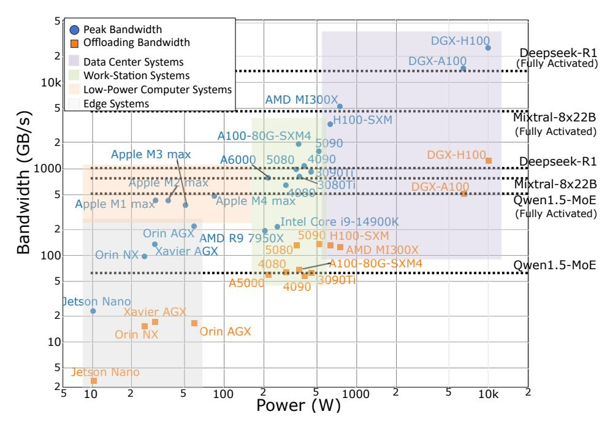
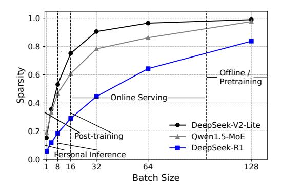
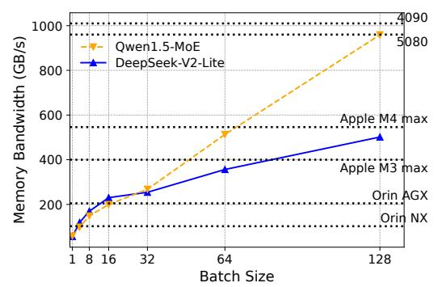

# 4 Sparsity-Aware Performance Metrics

### 4.1 Sparse model bandwidth utilization

When designing a new sparsity-aware MBU, we want this new metric to be generally applicable to all types of MoE models we are aware of by far. These different sparsity patterns of MoE models can be summarized in Figure [2.](#page-3-0) From this figure, we can derive several requirements for the new MBU. First, the metric must capture the set of experts activated by a batch of input tokens. For example, in case (a), a sparse feed-forward (FF) layer contains three experts, and each token is routed to its top-1 expert. Both tokens are routed to the same expert, so the accessed memory corresponds to a single expert of size S. In contrast, case (b) routes the tokens to two distinct experts, doubling the accessed memory to 2S. Second, the metrics must account for different routing mechanisms, such as shared experts introduced by recent MoE studies [\[10,](#page-10-0) [4\]](#page-10-1) (illustrated in Figure [2](#page-3-0) (c)).

To meet the above requirements, we define Sparse Memory Bandwidth Utilization (S-MBU) based on the activated size of parameters Sactivated, rather than using the full model size Smodel, as follows.

$$\text{S-MBU} = \frac{B_{\text{achieved}}}{B_{\text{peak}}}, \ B_{\text{achieved}} = \frac{S_{\text{activated}} + S_{\text{KV}}}{\text{TPOT}}, \ S_{\text{activated}} = n_{\text{layer}} \times S_{\text{attn}} + \sum_{l=1}^{n_{\text{layer}}} \sum_{i=1}^{n_{\text{expert}}} \mathbb{1}[l, i] \times S_{\text{expert}},$$

where 1[l, i] is a boolean variable indicates whether the expert indexed i at layer l is used for computation. This guarantees that only the activated parameters are accounted for the accessed memory for each layer l. 1[l, i] can be achieved by tracing router outputs.

Besides, dense models are a special case of equation [\(4\)](#page-6-0) with nexpert = 1 and ∀i, 1[l, i] = 1. Therefore, our definition is also suitable for model architectures where not all layers are MoE layers, *e.g*., in Switch Transformers [\[14\]](#page-11-0). We further validate S-MBU accuracy on MoE models; detailed results are provided in Appendix [A.4.](#page-15-1)

Figure 4: Benchmarking MoE deployment using sparsity-aware performance metrics. Horizontal lines show the minimum bandwidth required for MoE models to meet a decoding latency target, under two scenarios: full activation (large batch size) and minimal activation (batch size = 1). Blue dots represent each device's peak bandwidth and TDP; orange dots indicate reduced bandwidth when DRAM offloading is needed. Devices above the lines satisfy the latency requirement. Systems are grouped by deployment class: edge (e.g., robotics, autonomous driving), low-power devices, workstations, and data centers.

#### 4.2 Sparse model FLOPS utilization

We aim to account for the fact that experts are sparsely activated when calculating  $F_{\text{token}}$ , *i.e.* FLOPs per token. Specifically, in each MoE layer, we account for top-k activated experts with shared experts, denoted  $k_{\text{expert}}$ , which can be obtained from the model configuration without the need for runtime tracing. Besides, we also account for the router component in each MoE layer,  $N_{\text{router}}$ . The attention layer remains the same. Consequently, we refine the FLOPs per token calculation as follows:

$$S-MFU = (T_{token} \times S-F_{token}) / F_{peak}, S-F_{token} = F_{attn} + 2N_{router} + 2k_{expert}N_{expert},$$
 (5)

where  $F_{\rm attn}$  represents the number of FLOPs needed for the attention module and  $N_{\rm expert}$  represents the number of parameters in the expert module. These values can be derived from the model configuration and accurately calculated based on the easily accessible model structure. Furthermore, since the FLOPs for each matrix multiplication are fixed and deterministic, S-MFU can be ensured with high accuracy. We show the accuracy of S-MFU in Appendix A.5 and the results demonstrate that S-MFU matches profiler-measured S-MFU within 0.05% across all settings, showing it accurately captures MoE compute cost.

### 4.3 Benchmarking use cases of sparsity-aware performance metrics

Our sparsity-aware metrics enable accurate evaluation of AI processors for bottleneck-free MoE deployment. Figure 7 plots peak memory bandwidth against power consumption, covering processors from edge devices to data center systems. Each MoE model is shown with two horizontal lines: one for activation at batch size 1 and another for full activation as batch size increases.

The lines are computed using our accurate S-MBU metric to represent the actual bandwidth requirements for deploying the model under both lower-bound conditions (batch size = 1) and upper-bound scenarios (full expert activation). Detailed calculation procedures are provided in Appendix A.7.

For instance, full activation of DeepSeek-R1 requires 18,901 GB/s—a level achievable only on high-end data center hardware like the DGX-H100 (10,200W) using expert parallelism. In contrast, at batch size 1, the bandwidth requirement drops to 1,040 GB/s, making it feasible on consumer GPUs

Figure 5: Illustration of how model sparsity varies with batch size, along with the corresponding deployment scenarios on DeepSeek-V2-Lite, Qwen1.5-MoE and DeepSeek-R1

Figure 6: Benchmarking results of MoE-CAP on DeepSeek-V2-Lite and Qwen1.5-MoE, highlighting how their practical bandwidth requirements and hardware choices vary with batch size

such as the RTX 4090 (450W) when paired with efficient offloading strategies (e.g., CA systems). All results assume a TPOT SLO of 0.1s/token.

These findings support the growing market view that MoE models may shift LLM deployment from power-hungry data centers to a broader range of affordable, personal computing platforms.

Impact of batch size on MoE sparsity and deployment. In practice, the sparsity of MoE systems is closely influenced by the batch size. Batch size, in turn, is largely determined by the deployment context. For offline batched inference and pretraining, large batch sizes are common, leading to full or near-full activation of experts and thus low sparsity. In contrast, personal devices that support a single user typically operate with batch size 1, meaning high sparsity. In post-training or online inference on shared devices, batch sizes are moderate (ranging from 1 to tens), causing model sparsity to vary dynamically—from high to low—as batch size increases.

To more accurately benchmark performance across scenarios, we analyze how model sparsity evolves with batch size for three MoE models—DeepSeek-V2-Lite, Qwen1.5-MoE, and DeepSeek-R1—and examine the implications for bandwidth requirements and hardware selection.

Figure 5 illustrates the relationship between batch size and model sparsity, based on profiling using our custom benchmarking tool built on the latest vLLM release and evaluated on the MATH [20] dataset. In scenarios such as personal inference and post-training—characterized by small batch sizes (1–16)—all models exhibit high sparsity. At batch size 8, for instance, only 53.05%, 46.79%, and 18.44% of parameters are activated for DeepSeek-V2-Lite, Qwen1.5-MoE, and DeepSeek-R1, respectively. This significantly reduces bandwidth demands, making these models viable for deployment on cost-efficient hardware.

As shown in Figure 6, under a TPOT (time-per-output-token) SLO of 0.25s/token and using S-MBU (see §4.1) for practical bandwidth estimation, we observe that: (i) **Apple M3 Max** meets bandwidth requirements for DeepSeek-V2-Lite at batch sizes of 32; (ii) **NVIDIA Orin AGX**, an edge-class device, supports deployment up to batch size 16; and (iii) **Orin NX**, a lighter variant, remains sufficient for batch sizes up to 4.

These findings highlight that MoE systems can run on various low-power processors, but their performance depends on the deployment scenario—underscoring the need for accurate, sparsity-aware performance metrics to guide hardware selection.

#### 5 Benchmark Implementation

**Expert activation profiler.** To evaluate S-MBU accurately, we profile expert activation patterns at a given batch size. We implement lightweight profilers in SGLang and HuggingFace Transformers, inserting probes near the router in each MoE layer to record activations during forward passes. The model runs on representative data until the activation distribution stabilizes. To avoid redundant runs, we store activation sheets for reuse in future evaluations.

Automated evaluation pipeline. Following HuggingFace's leaderboard design, we built MoE-CAP as an automated benchmarking tool to evaluate MoE systems across cost, accuracy, and performance. Model and dataset setup, as well as evaluation, are fully automated—users simply provide system and hardware details to run benchmarks. Currently, MoE-CAP supports six widely used MoEenabled LLM inference frameworks: vLLM, MoE-Infinity, SGLang, K-Transformers, HuggingFace Transformers and Accelerate.

Dataset support. We evaluate all models on four representative benchmarks: MMLU, GSM8K, MATH, Arena-Hard, and LongBench. MMLU covers 57 diverse multiple-choice tasks to assess factuality and reasoning across domains. GSM8K and MATH focus on mathematical reasoning, with problems requiring multi-step solutions and short-form generation at varying difficulty levels. Arena-Hard evaluates long-form generation using 500 complex user queries from Chatbot Arena, judged by GPT-4-Turbo. It shows strong agreement with human preferences (89.1%) and better separability than other benchmarks. LongBench is a benchmark of long-context questions, making it well-suited for evaluating prefill-heavy workloads. Together, these benchmarks comprehensively test MoE LLMs across multiple-choice, short-form, and long-form generation tasks—covering knowledge, reasoning, and output quality—and are widely used in leading LLM leaderboards [\[5,](#page-10-7) [24,](#page-11-7) [22\]](#page-11-15).

Model support. We have currently evaluated the following models: Mixtral-8x7B-Instruct-v0.1, Mixtral-8x22B-Instruct-v0.1, DBRX-Instruct, Qwen1.5-MoE-A2.7B-Chat, DeepSeek-V2-Lite-Chat, Qwen3-30B-A3B, Qwen3-235B-A22B, and DeepSeek-R1, along with their corresponding quantized versions. These MoE models were selected for their diversity in parameter scale and architectural design, as well as for their strong performance. All are widely recognized and adopted across both academic research and industrial applications.

