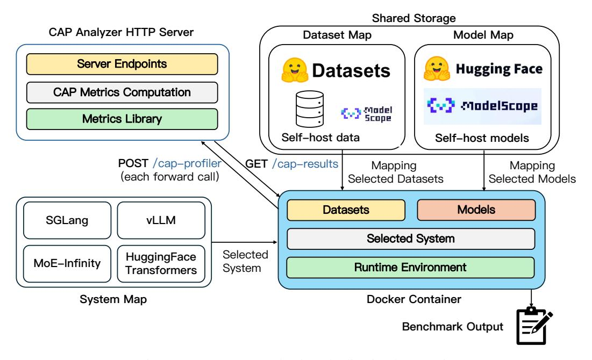
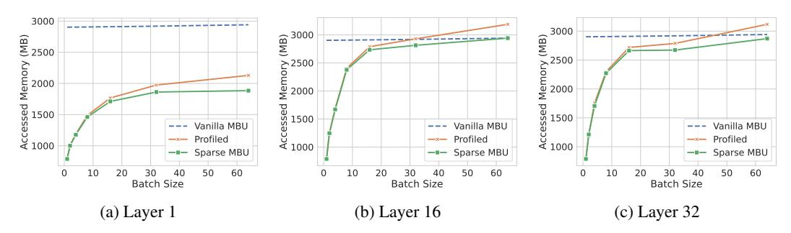
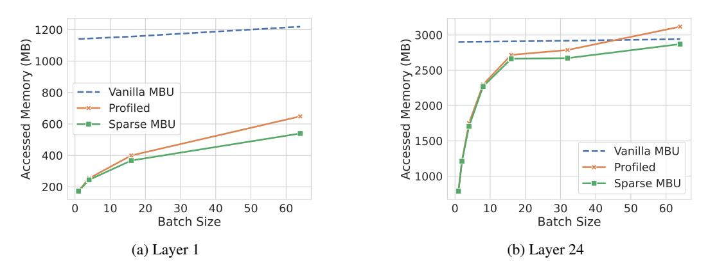

# A More Details of MoE-CAP

### A.1 MoE-CAP Limitation and Future Work

In this section, we discuss the current limit and future work for MoE-CAP.

Limitation. The current version of MoE-CAP focuses exclusively on inference tasks. It does not yet address other important deployment scenarios such as post-training and pre-training. Additionally, broader evaluation across a wider range of MoE models and systems is needed to ensure comprehensive coverage and generalizability.

Future Work. For future work, we will investigate MoE-CAP within training settings, instrumenting training tasks to evaluate its capabilities.

System Selection Map for broader deployment benchmarking. As part of future work, we plan to expand MoE-CAP with a System Selection Map that tracks the best-in-class AI software and hardware systems across diverse deployment scenarios, including inference, post-training, and pre-training. Building on recent advances in systems like vLLM, SGLang, MoE-Infinity, Unsloth, Axolotl, and TorchTitan, this map will benchmark SOTA models—identified in the Model Selection Map—on a range of platforms from single-node GPUs to multi-node clusters and heterogeneous architectures. This will enable scenario-specific benchmarking (e.g., short-context vs. long-context inference) to guide optimal system-model pairing.

To accelerate end-to-end benchmarking, we package the system as a prebuilt Docker image and expose CAP analysis as a service (Figure [7\)](#page-14-0). Datasets and models are mounted from our storage at runtime, and the container runs a command that launches the FastAPI-based CAP analyzer. During inference, the analyzer is invoked (Post /cap-profiler) on every forward pass to collect data and compute CAP metrics. When all user requests finish, the service assembles the final report and exposes it via a pull endpoint (Get /cap-results).

Toward real-world deployment scenarios. We also aim to evaluate MoE systems in diverse cloud deployment settings, including serverless model endpoints [\[18\]](#page-11-16), elastic infrastructure [\[43,](#page-12-9) [45,](#page-12-10) [34\]](#page-12-11), and spot-instance pricing environments [\[35,](#page-12-12) [36,](#page-12-13) [42\]](#page-12-14). This will enable more realistic assessments of cost-performance trade-offs under variable resource conditions.

Figure 7: MoE-CAP evaluation pipeline implementation

### A.2 Cost model use cases

We have considered several use cases after introducing new cost models as part of our benchmark. For instance, in GPU-only deployments, the specifications for DRAM, CPU, and SSD are typically not defined. Cloud providers often scale the computational power in line with GPU capabilities, offering four times the DRAM capacity (e.g., 2TB DDR5) relative to GPU memory (e.g., 8XA100-80GB), and pair it with the latest CPUs (e.g., AMD 9004 series). This hardware combination results in an approximate cost of \$176,000 per server. Opting for a less powerful CPU and reduced memory capacity in GPU-only workloads can yield a saving of \$20,000 per server in hardware costs.

Additionally, for MoE systems that enable offloading, it is crucial to account for the CPU's energy consumption and the energy used in communication between the CPU and GPU. For instance, the AMD 777X has a peak power consumption of 280W, while the A6000 Ada peaks at 300W. Relying solely on GPU energy assessments might lead to overly optimistic forecasts for energy savings, as the CPU's power consumption can be as significant as another GPU.

#### A.3 S-MBU and S-MFU on dynamic batching

Dynamic batching introduces variability in execution, as the number of forward passes required to process a given query queue depends on sequence length distribution, dataset characteristics, and hardware constraints. For instance, a batch of 128 queries may be executed in 2 or 4 separate forward passes depending on how sequences are packed.

To accurately capture system behavior, our probing mechanism instruments both the prefill and decoding stages. On each forward pass, we record the S-MBU (as defined in Equation [6\)](#page-15-2), the actual batch size, and the per-layer expert activation patterns, including token-level routing information. This comprehensive data allows us to compute the data movement through activated experts for every pass. The formulation ensures that S-MBU remains valid and comparable across workloads with heterogeneous sequence lengths. By grounding the metric in actual routing behavior and hardwareobserved throughput, it provides a reliable indicator of sparsity-induced memory bottlenecks, even under realistic and variable deployment scenarios. In addition to S-MBU, S-MFU is based solely on token-level throughput (Ttoken). Similar to S-MBU, we get the token throughput of each batch and then calculate the S-MFU.

$$S-MBU = \frac{\sum_{forward} \left( S_{activated} + S_{KV} \right)}{\sum_{forward} Latency}$$
Hardware Memory Bandwidth (6)

## A.4 S-MBU accuracy on MoE models

We show that our S-MBU definition can capture novel MoE architectures. Since S-MBU accounts for actual expert activation in MoE models, we evaluate its accuracy against the standard (vanilla) MBU definition.

Figure [8](#page-16-1) shows the average accessed memory for a specific Transformer layer in the Mixtral-8x7B model using the GSM8K dataset, with batch sizes ranging from 1 to 64 and running on A100-PCIe-80G. At batch size 1, each layer activates only the top 2 experts. As batch size increases, more experts are accessed—but the total number of activated experts does not grow linearly, since tokens may share experts.

The results demonstrate that vanilla MBU significantly overestimates memory usage, by over 260%, due to its failure to account for selective expert activation. In contrast, S-MBU closely matches actual memory usage, with less than 1% error compared to profiles based on HuggingFace Transformers.

We also observe layer-wise variation in expert activation as batch size grows. For example, at batch size 64, only about half of the experts are activated in the first layer, whereas in deeper layers (e.g., layers 16 and 32), nearly all experts are used. S-MBU accurately reflects the trend of increased memory access with larger batches. However, when most experts are activated, both MBU and S-MBU still underestimate total memory due to excluding intermediate states (e.g., hidden activations), which scale linearly with batch size. We show further experiments on Qwen to demonstrate the accuracy of S-MBU. Qwen has a distinct model architecture in MoE layers. Each MoE layer has 64 experts where the first 4 experts are shared by all tokens. In other words, each token, apart from

Figure 8: Correctness evaluation of the vanilla MBU, our S-MBU and actual MBU (through profiling).

Figure 9: Accuracy evaluation of the vanilla MBU, our S-MBU and actual MBU (through profiling).

top-4 experts, is also processed by 4 shared experts. Therefore, we have  $\mathbb{1}[l,i]=1, i=1,2,3,4$  and  $\forall l \in [1,n_{\text{layer}}]$ . For i>4,  $\mathbb{1}[l,i]$  can still be traced as other MoE models.

We profiled the memory access of one decoder layer (the first and last layer) of Qwen model using HuggingFace Transformers and show the comparison of vanilla MBU and Sparse MBU in Figure 9.

In both layers, with batch size increasing, the memory footprint increases sub-linearly. This is because tokens can activate the same experts. Even with batch size =64, still not all experts are activated. If we do not consider this sparse activation (*i.e.* Vanilla MBU), the overestimation is even more severe. And similar to Mixtral models, we also observe that there are more overlap in expert activation of batched tokens in layer 1 (*i.e.* the first layer) than in layer 24 (*i.e.* the last layer). Different from Mixtral models, only 4/60 non-shared experts are selected for each token. Therefore, even with batch size =64, not all experts are accessed. We do not evaluate MBU in larger batch size because MBU is only meaningful in memory bandwidth-bounded scenarios (*i.e.* small batch sizes).

This experiment demonstrates that S-MBU definition can be extended to cooperate novel architectures and the calculated memory access is accurate too.

#### A.5 S-MFU accuracy on MoE models

We validate S-MFU on Mixtral-8×7B and DeepSeek-V2-Lite over batch sizes 1–32. As shown in Table 2, our analytic S-MFU matches profiler-measured S-MFU within 0.05% across all settings, showing it accurately captures MoE compute cost.

#### A.6 S-MBU on multi-node inference

To ensure the real-world reliability, accuracy, and practical value of our proposed metrics, we have maintained close collaboration with an industrial partner to validate the metrics under realistic deployment scenarios, including multi-node inference.

We present results evaluating the accuracy of S-MBU in a production-like setup, where our collaborator deployed the SGLang serving framework on a two-node cluster—each node equipped with

Table 2: S-MFU Accuracy

| Model            | Batch size | Profiled S-MFU (%) | Ours (%) |
|------------------|------------|--------------------|----------|
| Mixtral-8x7B     | 1          | 0.08               | 0.06     |
|                  | 4          | 0.19               | 0.18     |
|                  | 8          | 0.31               | 0.29     |
|                  | 16         | 0.50               | 0.48     |
|                  | 32         | 0.85               | 0.80     |
| DeepSeek-V2-Lite | 1          | 0.01               | 0.01     |
|                  | 4          | 0.04               | 0.03     |
|                  | 8          | 0.05               | 0.05     |
|                  | 16         | 0.07               | 0.06     |
|                  | 32         | 0.07               | 0.07     |

8×NVIDIA H20 GPUs and connected via 400 GB/s InfiniBand—running the DeepSeek-R1 model on the LongBench dataset. In this setting, analytically computed S-MBU values were compared against actual communication utilization profiled using torch.profiler.

As shown in the Table 3, the computed S-MBU values closely match the profiled results across all batch sizes, with deltas consistently below 1%. This alignment supports the robustness of S-MBU in capturing communication efficiency under practical multi-node scenarios.

Table 3: Performance metrics across different batch sizes.

| Batch Size | S-MBU (%) | Profiled S-MBU (%) | Δ (%) |
|------------|-----------|--------------------|-------|
| 1          | 1.67      | 1.88               | 0.21  |
| 16         | 7.91      | 8.15               | 0.24  |
| 32         | 10.08     | 10.38              | 0.30  |
| 64         | 17.33     | 17.75              | 0.42  |
| 128        | 33.12     | 33.91              | 0.79  |

### A.7 Practical bandwidth and compute requirement calculation

We calculated theoretical performance through existing tools like LLM-Analysis [29] and LLM-Viewer [53]. In practice, MoE systems often suffer inefficiencies due to redundant data transfers or calculations, resulting in performance losses. Consequently, the calculated theoretical bandwidth or OPS may not meet the required application performance (e.g., throughput). To determine the practical hardware requirements for a given set of inputs, it is essential to consider hardware utilization. Thus, the practical performance requirement is defined as:

$$Practical \ Bandwidth = \frac{Theoretical \ Bandwidth}{S-MBU} \tag{7}$$
 
$$Practical \ OPS = \frac{Theoretical \ OPS}{S-MFU} \tag{8}$$

$$Practical OPS = \frac{Theoretical OPS}{S-MFU}$$
 (8)

Here, S-MBU and S-MFU (defined in the next subsection) represent the actual hardware utilization for MoE models.

To illustrate, suppose the theoretical bandwidth requirement is 400 GB/s. If the hardware achieves only 50% bandwidth efficiency during model decoding, the practical bandwidth requirement must be doubled to 800 GB/s ( $\frac{400 \, \text{GB/s}}{50\%}$ ) in order to meet the same throughput or latency needs.

### A.8 Results on prefill stage

MoE-CAP profiler already records prefill throughput and time-to-first-token (TTFT). Some results are shown in the table 4. We are expanding our benchmark to include long-context workloads such

as LongBench. Early experiments demonstrate that S-MBU and S-MFU effectively characterize decoding performance under extended sequences. These results show that full expert activation during prefill increases latency and can alter the optimal MoE configuration.

Table 4: Benchmark results on prefill stage for different models and methods.

| Model                  | Method   | Benchmark  | Batch Size | TTFT (s) | Prefill Throughput (T/s) | Device          |
|------------------------|----------|------------|------------|----------|-----------------------------|-----------------|
| Qwen1.5-MoE-A2.7B-Chat | hf-chat  | GSM8K      | 16         | 0.06     | 4166.67                     | 1xA100-80G-SXM4 |
| Qwen1.5-MoE-A2.7B-Chat | hf-chat  | Arena Hard | 16         | 0.06     | 4132.63                     | 1xA100-80G-SXM4 |
| Qwen1.5-MoE-A2.7B-Chat | hf-chat  | LongBench  | 1          | 23.23    | 561.82                      | 4xRTX A6000     |
| Qwen3-30B-A3B          | sglang   | GSM8K      | auto       | 0.01     | 21844.81                    | 4xRTX A6000     |
| Qwen3-30B-A3B          | sglang   | Arena Hard | auto       | 0.02     | 6993.28                     | 4xRTX A6000     |
| Qwen3-30B-A3B          | sglang   | LongBench  | auto       | 2.3      | 5652.17                     | 4xRTX A6000     |
| DBRX-Instruct          | vllm_moe | GSM8K      | auto       | 0.08     | 3125.00                     | 8xA100-80G-PCIe |
| DBRX-Instruct          | vllm_moe | Arena Hard | auto       | 0.12     | 2083.33                     | 8xA100-80G-PCIe |
| DBRX-Instruct          | hf-chat  | GSM8K      | 16         | 0.40     | 625.00                      | 4xA100-80G-PCIe |
| DBRX-Instruct          | hf-chat  | Arena Hard | 8          | 0.29     | 862.07                      | 4xA100-80G-PCIe |
| Mixtral-8x22B-Instruct | vllm_moe | GSM8K      | auto       | 0.14     | 1776.54                     | 8xA100-80G-PCIe |
| Mixtral-8x22B-Instruct | vllm_moe | Arena Hard | auto       | 0.14     | 1785.71                     | 8xA100-80G-PCIe |
| Mixtral-8x22B-Instruct | hf-chat  | GSM8K      | 16         | 0.43     | 581.40                      | 4xA100-80G-PCIe |
| Mixtral-8x22B-Instruct | hf-chat  | Arena Hard | 8          | 0.27     | 925.93                      | 4xA100-80G-PCIe |
| Mixtral-8x7B-Instruct  | vllm_moe | GSM8K      | auto       | 0.01     | 18932.23                    | 8xA100-80G-SXM4 |
| Mixtral-8x7B-Instruct  | vllm_moe | Arena Hard | auto       | 0.05     | 5024.03                     | 8xA100-80G-SXM4 |
| Mixtral-8x7B-Instruct  | hf-chat  | GSM8K      | 64         | 0.15     | 1666.67                     | 2xA100-80G-SXM4 |
| Mixtral-8x7B-Instruct  | hf-chat  | Arena Hard | 16         | 0.17     | 1470.59                     | 2xA100-80G-SXM4 |

### A.9 Profiling overhead on latency and metric error

We recorded the overhead before and after adding our runtime profiling tools. Our expert-activation profiler uses lightweight tensor operations that remain compatible with CUDA graph compilation to minimize disruption. As shown in table 5, in our benchmarks—comparing vLLM inference with and without the profiler—we observed a maximum 2.7% overhead of just 8 ms in Time-To-First-Token (TTFT) and 2.2% overhead - 4ms in Tokens-Per-Output-Token (TPOT), confirming that the profiling imposes a negligible performance penalty.

We also recorded statistical measures including standard deviations. As shown in the table 6, the standard deviations for key metrics—including decoding S-MFU, S-MBU, prefill latency, and model accuracy—remain consistently low across all experimental settings. These small deviations do not affect the core insights or conclusions of our comparative analysis.

Table 5: Performance comparison before and after optimization.

| Model                            | Framework                   | Hardware           | Batch Size   | TTFT (Before)  | TTFT (After)   | $\Delta$ TTFT    | TPOT (Before)  | TPOT (After)   | $\Delta$ TPOT    |
|----------------------------------|-----------------------------|--------------------|--------------|----------------|----------------|------------------|----------------|----------------|------------------|
| Qwen3-235B-A22B Qwen3-30B-A3B | SGLang SGLang            | 8× H20 4× A6000 | auto auto | 0.067 0.020 | 0.071 0.024 | +0.004 +0.004 | 0.019 0.059 | 0.021 0.063 | +0.002 +0.004 |
| Mistral-8x7B                     | Huggingface Transformers | 2× A100-SXM4       | 16           | 0.173          | 0.176          | +0.006           | 0.179          | 0.183          | +0.004           |
| DBRX                             | Huggingface Transformers | 4× A100-PCIe       | 8            | 0.290          | 0.298          | +0.008           | 0.286          | 0.286          | +0.000           |

Table 6: Model evaluation results under different MoE systems and hardware with standard errors.

| Model                              | Eval Type  | Exact Match | Exact Match StdErr | Prefill Time (s) | Prefill Time StdErr | Decoding Throughput (T/s) | Decoding Throughput StdErr | Decoding MFU | Decoding MFU StdErr | Decoding MBU | Decoding MBU StdErr |
|------------------------------------|---------------|----------------|--------------------------|---------------------|------------------------|------------------------------|----------------------------------|-----------------|------------------------|-----------------|------------------------|
| Qwen1.5-MoE (HF, 1×A100 PCIe)   | Best Match | 0.4769         | 0.01371                  | 0.05655             | 0.00023                | 41.3253                      | 0.02629                          | 0.00560         | 0.000037               | 0.03796         | 0.000022               |
| Qwen3-30B-A3B (SGLang, 4×A6000) | Best Match | 0.9014         | 0.00821                  | 0.00582             | 0.00003                | 1343.1684                    | 2.81220                          | 0.00208         | 0.000004               | 0.18099         | 0.000460               |
| Qwen3-235B-A22B (SGLang, 8×H20) | Best Match | 0.8961         | 0.00840                  | 0.06550             | 0.00086                | 1792.0811                    | 4.87791                          | 0.01616         | 0.000043               | 0.14942         | 0.000397               |

### A.10 Multi-constraint decision matrix of CAP analysis

We distill CAP analysis into deployment heuristics or templates for the CAP radar plots in section 3.3 to provide clear guidance for deployments under different use cases. As shown in table 7, the matrix

is built by actionable "if-then" rules and it clearly guides users to choose suitable MoE systems under certain constraints.

Table 7: Extended Multi-Constraint Decision Matrix of CAP Analysis.

| Hardware Tier              | Batch Size | Primary Constraint       | Secondary Constraint | Recommended System | Recommended Configuration | Recommendation Reason                  | Example Use Case           |
|----------------------------|---------------|-----------------------------|-------------------------|-----------------------|------------------------------|-------------------------------------------|----------------------------|
| Workstation GPU (A5000) | 8+            | Performance (Latency)    | Accuracy                | SGLang/vLLM           | FP16                         | Original accuracy with lowest latency  | Chain-of-Thought inference |
| Workstation GPU (A5000) | 1-8           | Cost                        | Latency                 | K-Transformers        | Quantization                 | Low cost and moderate speed            | Chatbot                    |
| Workstation GPU (A5000) | 1-8           | Accuracy                    | Cost                    | MoE-Infinity          | Expert offloading            | Original accuracy with low cost        | Model benchmarking         |
| Datacentre GPU (H20)    | 1-16          | Accuracy                    | Power Cost              | MoE-Infinity          | Expert offloading            | Original accuracy with low power cost  | Model benchmarking         |
| Datacentre GPU (H20)    | 16+           | Performance (Throughput) | Power Cost              | SGLang/vLLM-FP8       | Mixed precision              | High throughput with accepetable accuracy | Batch document retrieval   |
| Datacentre GPU (H20)    | 16+           | Performance (Throughput) | Accuracy                | SGLang/vLLM           | FP16                         | High throughput with original accuracy | Offline batch processing   |

### A.11 Stress test with batch-size spikes on MoE systems

To emulate sudden batch-size spikes, we replayed Microsoft Azure request traces and parameterized inter-arrival times with a Poisson distribution, following established serving workloads. We compared two deployment strategies for Qwen3-30B-A3B on A6000 GPUs: MoE-Infinity with a fixed batch and SGLang with adaptive, continuous batching. The result is shown in table 8. Under rising request rates, SGLang achieved a higher S-MBU, peaking at 54.5% versus 16.7% for MoE-Infinity, demonstrating that continuous batching better maximizes S-MBU under load. However, as request volume and sequence length increased, token eviction in SGLang's PA system led to a sharp S-MBU decline under saturation. In contrast, MoE-Infinity's offload and fixed-batch approach yielded steadier, though lower, utilization. These results show that PA systems are more sensitive to such spikes and may require additional redundancy to maintain performance.

Table 8: MoE system performance across different time intervals.

| MoE System             | 30s | 60s | 90s | 120s | 150s | 180s             | 210s |
|------------------------|-----|-----|-----|------|------|------------------|------|
| SGLang MoE-Infinity |     |     |     |      |      | 27.77% 15.12% |      |

Table 9: Existing work comparison.

| Benchmark            | Accuracy metrics | System perf metrics | Cost metrics | Sparsity-aware for MoE | Heterogeneous resource accounting | Open sourced |
|----------------------|---------------------|------------------------|-----------------|------------------------|-----------------------------------|--------------|
| MLPerf               | Х                   | 1                      | 1               | Х                      | ✓                                 | ✓            |
| MLEnergy             | ✓                   | ✓                      | ✓               | X                      | X                                 | ✓            |
| Open-LLM-Leaderboard | ✓                   | X                      | X               | X                      | X                                 | ✓            |
| LLM-Perf             | X                   | ✓                      | ✓               | X                      | Х                                 | ✓            |
| TensorDock           | X                   | ✓                      | /               | X                      | X                                 | X            |
| Artificial Analysis  | ✓                   | ✓                      | /               | X                      | X                                 | X            |
| Inference Max        | X                   | ✓                      | /               | X                      | X                                 | ✓            |
| MoE-CAP              | 1                   | ✓                      | ✓               | ✓                      | ✓                                 | ✓            |