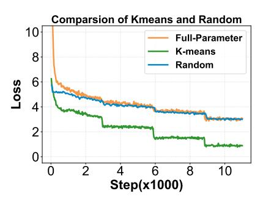
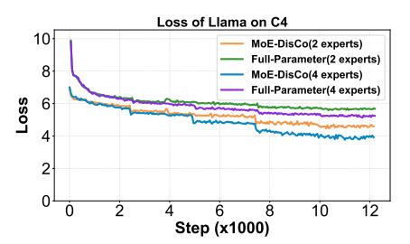

# 4.3 Downstream Task Performance

Table [2](#page-6-1) reports the downstream task performance of MoE-DisCo and full-parameter training. All models are pretrained on OpenWebText and evaluated on multiple downstream tasks. ARC-e and MMLU are evaluated in the 5-shot setting, while HellaSwag and PIQA are evaluated in the zero-shot setting.

As shown in the table, MoE-DisCo consistently achieves better performance than full-parameter training on both few-shot (ARC-e, MMLU) and zero-shot (HellaSwag, PIQA) downstream tasks.

Figure 5: PPL trends between MoE-Disco on fine-tune stage and Full-Parameter across different datasets

Overall, the results show that MoE-DisCo achieves better downstream task performance than fullparameter training across the evaluated benchmarks.

| Method     | ARC-e (5) | MMLU (%) | HellaSwag (%) | PIQA (%) |
|------------|-----------|----------|---------------|----------|
| Full-Param | 27.9      | 23.0     | 27.45         | 52.25    |
| MoE-DisCo  | 29.1      | 25.3     | 29.45         | 57.03    |

Table 2: Downstream task performance of Qwen1.5- MoE-2.7B on ARC-E, MMLU, Hellaswag and PIQA. (ARC-r and MMLU are evaluated under 5-shot settings; Hellaswag and PIQA under zero-shot.).

### 4.4 Economic Cost Analysis

Training large-scale models, especially those based on MoE architectures, incurs substantial computational and memory costs. This section analyzes the economic advantages of the proposed MoE-DisCo training strategy and compares it with conventional full-parameter training methods.

Following the market pricing of major cloud service providers and considering the hardware environment used in our experiments, we adopt the following GPU rental prices as the cost estimation baseline:RTX 4090: \$0.35/ GPU·hour; A100 (80GB): \$2.28 / GPU·hour.

Based on the results in Table [3,](#page-7-0) MoE-DisCo achieves model performance comparable to—sometimes slightly better than—full-parameter training, while substantially reducing both cost and

training time. The approach decouples MoE training into two phases: (1) Submodel Training (Sphase) and (2) Lightweight Fine-tuning (F-phase).

During the S-phase, all submodels are trained independently and in parallel on a low-cost RTX 4090 platform. To simplify accounting and provide a conservative upper bound on resource usage, the total S-phase cost and time are computed as four times the longest individual submodel training duration, reflecting worst-case synchronization overhead. Due to the low per-unit cost of RTX 4090 and the reduced computational footprint of submodels, this phase incurs only \$1.79–\$4.37 across all experiments. Critically, because training is fully parallelized, marginal costs scale sublinearly—effectively near-constant—with the number of experts.

The F-phase requires only a brief synchronized fine-tune step on a single A100 GPU, sufficient to recover (or slightly exceed) the convergence of fullparameter training. This phase costs \$1.55–\$10.92.

Overall, MoE-DisCo achieves significant savings across all settings. On Qwen, total costs on C4, WikiText-2, and OpenWebText are \$6.87, \$3.34, and \$10.91—69.5%, 51.8%, and 63.5% lower than full-parameter baselines (\$22.50, \$6.93, \$29.91)—with training time reduced from 9.87h, 3.04h and 13.12h to 3.82h, 1.96h, and 5.99h. On Llama, MoE-DisCo costs \$6.74, \$8.13, and \$15.14—47.6%, 52.2%, and 52.9% less than full-

| Model | Dataset             | Full-Parameter |       | MoE-DisCo |                                                |      |            |         |      |        |                                                              |      |
|-------|---------------------|----------------|-------|-----------|------------------------------------------------|------|------------|---------|------|--------|--------------------------------------------------------------|------|
|       |                     |                |       |           | Cost(\$) Time(h) Platform S-Cost(\$) S-Time(h) |      | S-Platform |         |      |        | F-Cost(\$) F-Time(h) F-Platform Total Cost(\$) Total Time(h) |      |
|       | C4                  | 22.5036        | 9.87  | A100*1    | 2.9260                                         | 2.09 | RTX 4090*4 | 3.9444  | 1.73 | A100*1 | 6.8704                                                       | 3.82 |
| Qwen  | Wiki                | 6.9312         | 3.04  | A100*1    | 1.7920                                         | 1.28 | RTX4090*4  | 1.5504  | 0.68 | A100*1 | 3.3424                                                       | 1.96 |
|       | OpenWebText 29.9136 |                | 13.12 | A100*1    | 4.3680                                         | 3.12 | RTX4090*4  | 6.5436  | 2.87 | A100*1 | 10.9116                                                      | 5.99 |
|       | C4                  | 12.8592        | 5.64  | A100*1    | 2.1560                                         | 1.54 | RTX4090*4  | 4.5828  | 2.01 | A100*1 | 6.7388                                                       | 3.55 |
| Llama | Wiki                | 16.9860        | 7.45  | A100*1    | 2.0440                                         | 1.46 | RTX4090*4  | 6.0876  | 2.67 | A100*1 | 8.1316                                                       | 4.13 |
|       | OpenWebText 32.1252 |                | 14.09 | A100*1    | 4.2140                                         | 3.01 | RTX4090*4  | 10.9212 | 4.79 | A100*1 | 15.1352                                                      | 7.80 |

Table 3: Comparison of Full-Parameter and MoE-DisCo training costs, times, and platforms for Qwen and Llama across three datasets. In MoE-DisCo, Fine-tune Cost, Fine-tune Time, and Platform are shown separately. S- means submodel training. F- means fine-tune. The S-Cost is the all cost in submodel training.

Figure 6: In the Qwen model on C4, replacing the cluster operation in MoE-DisCo with random data assignment causes the MoE training performance during the fine-tune stage to degrade to that of full-parameter training.

parameter training and reduces training time from 5.64h, 7.45h, and 14.09h to 3.55h, 4.13h, and 7.80h.

Despite drastic cost reduction, final performance remains on par with or marginally better than fullparameter training. By shifting the majority of computation from expensive A100 platform to lowcost RTX 4090 platform via a "decoupled training + lightweight reintegration" strategy, MoE-DisCo offers a practical, reproducible, and highly costefficient framework for training large MoE models—particularly valuable for academic and industrial teams under resource constraints.

## 4.5 Ablation Study

### 4.5.1 Cluster in MoE-DisCo

In this ablation study, we validate the importance of the clustering operation in the MoE-DisCo framework. Specifically, during the training of the Qwen model on C4, we removed the original k-means clustering step and replaced it with

Figure 7: The MoE-DisCo performance on Different MoE model with 2 and 4 experts

a random assignment of data to different experts for submodel training with the same amount of dataset. The results, Figure [6,](#page-7-1)show that substituting k-means clustering with random assignment significantly degrades training efficiency, and the final performance essentially regresses to that of full-parameter training. We therefore conclude that k-means clustering is an important component of MoE-DisCo.

### 4.5.2 Multi-experts in MoE-DisCo

In this ablation study, we evaluate MoE-DisCo's performance with varying expert counts to assess how architectural capacity affects training efficiency and model quality of MoE-DisCo. Specifically, we compare the convergence of the Llama model on C4 using 2 and 4 experts. As shown in Figure [7,](#page-7-2) MoE-DisCo achieves faster convergence and better final performance in both cases. Notably, the 4-expert model yields slightly lower loss and perplexity than the 2-expert version. Results suggest that MoE-DisCo achieves high training efficiency and strong performance across different numbers of experts.

