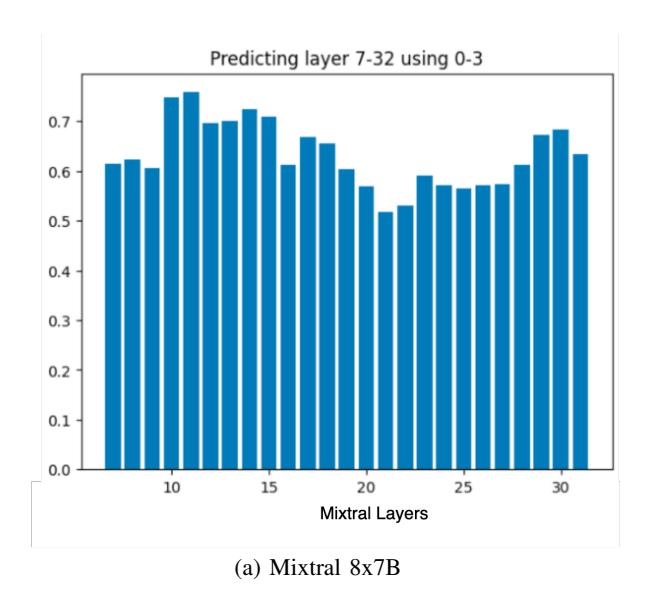
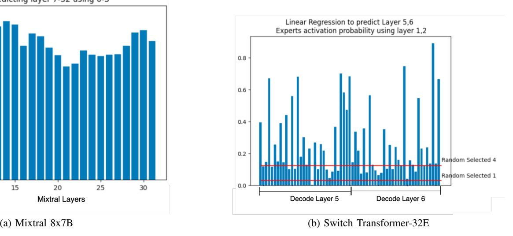

# *B. ERAS - Speedups*

In this section, we profile the speed-ups we are able to achieve with biasing and thresholding. We examine the se-

Fig. 5: Accuracies of predicting later layer expert activations using early layer's logit values.

Fig. 6: Number of *distinct* experts activated as the batch size grows for switch-T-32E. Unique experts are growing sublinearly compared to 2×Batch

. quential decoding to count the number of expert loads saved, and the overall impact on latency. We compare against the baseline implemented in [dvmazur/mixtral-offloading,](https://github.com/dvmazur/mixtral-offloading) which includes quantization and expert caching. Our optimizations are orthogonal to these and can be applied with or without other techniques. We consider our top-K routing with quantization and LRU caching as proposed in Moe-offload as our baseline. We generate sequences with l = 100 tokens, niter = 50 times, and collect the mean latency (wall clock time) and throughput. We see substantial gains using these approaches as seen in Figure [Figure 7.](#page-5-6)

We see two insights from this result:

First, the threshold determines the savings. In all offload settings, thresholding requires selecting α, which we test at 0.05, 0.15, 0.25. We find that as the threshold increases, the performance improves owing to saving more expert offloads. Together with the quality metrics in [subsection IV-C,](#page-4-0) a threshold can be selected for the desired performance. These performance metrics should only be compared between approaches in this paper, as latency, throughput, and tokens/second metrics are hardware-dependent. While the ordering should be the same on other hardware, the actual numbers will likely differ.

Second, as offload per layer grows, the savings become more significant. As more experts are offloaded when less VRAM is available, it becomes more likely that an off-chip expert is activated, causing performance degradation while the decoding waits for experts to be brought into memory. This shows that as the environment gets more and more resourceconstrained, our approach becomes more important.

In summary, depending on the number of experts offloaded, we find that we can achieve 10% - 13% reduction in latency using thresholding at α = 0.15, and 8.0% to 9.7% reduction using biasing with β = 1. At higher α, we achieve even more savings as shown in [Figure 7.](#page-5-6) Since this work represents a performance-accuracy trade-off, [subsection IV-C](#page-4-0) examines the quality of the generation with these performance gains.

## *C. ERAS - Quality*

Next, we test how different residency-aware routing schemes affect MoE inference quality. We only perform the quality experiments with Mixtral-8x7B as that is the SOTA MoE open-source model. We measure perplexity for Wiki-Text2 [\[13\]](#page-6-10) and C4 [\[15\]](#page-6-11). We also measure 5-shot MMLU [\[8\]](#page-6-12) accuracy. For WikiText2 and C4, we use the test set and validation sets, respectively. We use a sliding-window strategy with a stride of 512 and a max generation length of 2048. For MMLU, we ran the test over the complete dataset.

As shown in [Table I,](#page-5-7) our expert activation technique presents minimal quality degradation at low threshold values. As we increase the threshold β, the quality goes down. This result and speedup seen in the previous section present a quality-speedup trade-off for MoE model inference.

#### V. RELATED WORKS

Several prior efforts have a similar goal of reducing the inference latency of mixture-of-experts models.

EdgeMoE [\[20\]](#page-6-7) aims to reduce the latency of inference of MoEs on edge systems. It uses quantization and 1-2 layer early

Fig. 7: Speedup provided by various offloading algorithms over top-k routing. *Our baseline top-K routing already has implemented different optimizations like parameter quantization and LRU caching*. Varying α and offload per layer shown.

| Method     | C4-PPL | WikiText2-PPL | MMLU-Acc. |
|------------|--------|---------------|-----------|
| Top-K      | 8.044  | 4.497         | 66.1      |
| THRES-0.05 | 8.062  | 4.512         | 66.1      |
| THRES-0.10 | 8.133  | 4.560         | 66.1      |
| THRES-0.15 | 8.221  | 4.625         | 66.1      |
| BAISING    | 8.300  | 4.679         | 66.1      |
| THRES-0.25 | 8.522  | 4.813         | 66.1      |

TABLE I: Quality results of different expert activation techniques on different datasets.

expert prediction to fetch which experts would be activated appropriately. All non-expert weights are kept on the chip. However, this work is aimed at edge devices like Raspberry Pi and might not work on GPUs. Pre-gated MoE [\[10\]](#page-6-13) changed the model architecture to predict the experts one layer early. Expert Affinity [\[19\]](#page-6-14) provides a solution for a multi-GPU setup with expert parallelism. They propose method to reduce cross-GPU communication using KV cache duplication. Using this technique, they propose having 1 A2A + 1 AG instead of 2 A2As during inference. MoE-Infinity [\[18\]](#page-6-8) performs activationaware prefetching and caching of experts. They use a sample workload (e.g., validation) to form Expert Activation Matrices (EAMs) that they store in a collection. They rely on temporal locality (repeated activation of an expert in a sequence) and sparse activation (only a few activated) assumptions to select the expert to cache and prioritize the prefetch. MoE-offload [\[6\]](#page-5-5) propose quantization along with LRU caching and hidden state-based expert prediction for MoE inference on commodity hardware. While all these works are focused on expert prefetching and/or quantization, our work focuses on taking expert residency into account. Thus our work is orthogonal to all the related works and can be implemented along with any other proposed quantization or prefetching technique.

#### VI. CONCLUSION

In this paper, we have shown that Expert Residency Aware Selection (ERAS) shows considerable performance gain for those running Mixtral-8x7b in resource constrained environments requiring expert offloading to host memory. We provide parameters the user can tune navigate the accuracyperformance trade-off, and show that the impact of ERAS on perplexity or accuracy is minimal compared to the performance benefit it offers. This can be applied on top of, or instead of other approaches like parameter compression for performance gains.

However, this work comes with limitations. While our profiling and analysis include Switch Transformer as well, our implementation is limited to Mixtral at the moment. While we show both downstream tasks and text generation accuracy, a larger validation on all available benchmarks is required to establish the accuracy retained on other tasks. In addition, since both thresholding and biasing are inference time changes, they may redirect tokens to experts that have seen few such training examples, leading to increased risk of hallucinations.

In our next steps, we aim to establish test it on more comprehensive evaluation benchmarks, implement it for other MoE models, and study the effect of biasing/thresholding without aggressive quantization to compare the trade-offs.

