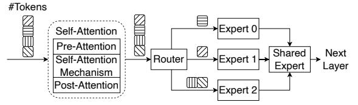

# **Abstract**

This paper presents MoE-GEN, a highthroughput MoE inference system optimized for single-GPU execution. Existing inference systems rely on model-based or continuous batching strategies, originally designed for interactive inference, which result in excessively small batches for MoE's key modules—attention and expert modules—leading to poor throughput. To address this, we introduce module-based batching, which accumulates tokens in host memory and dynamically launches large batches on GPUs to maximize utilization. Additionally, we optimize the choice of batch sizes for each module in an MoE to fully overlap GPU computation and communication, maximizing throughput. Evaluation demonstrates that MoE-GEN achieves 8-31× higher throughput compared to state-of-the-art systems employing model-based batching (FlexGen, MoE-Lightning, DeepSpeed), and offers even greater throughput improvements over continuous batching systems (e.g., vLLM and Ollama) on popular MoE models (DeepSeek and Mixtral) across offline inference tasks. MoE-Gen's source code is publicly available at https://github.com/EfficientMoE/MoE-Gen

### 1. Introduction

MoE architectures are increasingly favoured in LLMs because their router-based design activates only a subset of experts per token, reducing computational overhead and making them more suitable for deployment on personal machines with limited GPU resources. For locally deployed MoEs, AI developers often run high-throughput inference tasks such as benchmarking(Chiang et al., 2024; Cobbe

|                | Prefill Expert Avg. |      |     | Decoding Expert Avg. |      |    |  |
|----------------|---------------------|------|-----|----------------------|------|----|--|
|                | Bsz                 | Util | TP  | Bsz                  | Util | TP |  |
| DeepSpeed      | 153                 | 52%  | 109 | 0.3                  | 0.1% | 1  |  |
| FlexGen*       | 115                 | 49%  | 77  | 0.3                  | 0.1% | 1  |  |
| MoE-Lightning* | 134                 | 50%  | 98  | 0.4                  | 0.1% | 1  |  |
| MoE-Gen        | 8192                | 100% | 841 | 75                   | 41%  | 31 |  |

Table 1: Offloading throughput (TP in tokens/s) is measured for *DeepSeek-V2 236B* on an NVIDIA A5000 (24GB) with 512GB of host memory and a context length of 768 tokens (512 for the prompt, 256 for decoding). MOE-GEN's module-based batching enables up to a 2× increase in GPU FLOPs utilization and a 7.7-11× improvement in throughput. During the decoding phase, MOE-GEN achieves a 31× improvement in throughput. 'Bsz' denotes the average number of tokens routed to an expert.

et al., 2021) to evaluate fine-tuned models for personal AI applications, data wrangling(Narayan et al., 2022; van Renen et al., 2024) for cleaning datasets and extracting information, and feature extraction (Mischler et al., 2024; Asai et al., 2023) to generate embeddings for retrieval-based LLMs and other downstream applications. Unlike conventional interactive inference tasks (e.g., ChatBot), high-throughput inference trades off lower latency for higher batch sizes, optimizing overall throughput.

A major challenge for high-throughput MoE inference is the model's large size, which often exceeds a single GPU's memory capacity. To overcome this, AI developers use memory offloading, where the full model parameters of an MoE and its KV-cache are stored in host memory—typically much larger and more cost-effective to expand than GPU memory. Parameters and KV-cache are then fetched into the GPU only when activated.

When offloading is enabled, high-throughput LLM inference systems often suffer from low GPU utilization, leading to suboptimal throughput performance. These systems typically use model-based batching, where the entire MoE model processes a batch of input tokens at the model ingress, but within the model, each expert handles only a small fraction of tokens assigned by the router. This results in extremely low GPU utilization during decoding. We illustrate this in Table 1. Systems like FlexGen (Sheng et al., 2023), DeepSpeed-Inference (Aminabadi et al., 2022),

\*Equal contribution 1The University of Edinburgh 2EPCC, The University of Edinburgh. Correspondence to: Tairan Xu <t.xu-29@sms.ed.ac.uk>, Leyang Xue <leyang.xue@ed.ac.uk>, Zhan Lu <z.lu-64@sms.ed.ac.uk>, Adrian Jackson <a.jackson@epcc.ed.ac.uk>, Luo Mai <luo.mai@ed.ac.uk>.

Mixtral-Offloading [\(Eliseev & Mazur,](#page-9-2) [2023\)](#page-9-2), and MoE-Lightning [\(Cao et al.,](#page-8-3) [2024\)](#page-8-3) often operate with batch sizes 40–1000× smaller than what is needed to fully utilize a GPU during LLM decode, significantly reducing throughput compared to the prefill phase. While continuous batching [\(Yu](#page-10-3) [et al.,](#page-10-3) [2022\)](#page-10-3), as used in interactive inference systems like Llama.cpp [\(Ollama,](#page-10-4) [2025\)](#page-10-4) and vLLM [\(Kwon et al.,](#page-9-3) [2023\)](#page-9-3), could improve GPU utilization, our analysis shows that it is optimized for time-to-first-token (TTFT) rather than throughput. In practice, it leads to even smaller batch sizes during decoding, further lowering throughput.

In this paper, we explore methods to significantly improve high-throughput MoE inference on a single GPU. Our key idea is that MoE models have only two compute-intensive modules: attention and experts. For those two modules, we can accumulate sufficient tokens in the CPU's host memory to form large batches and ensure that GPUs process them only when the batch size is large enough to fully utilize GPU resources, increasing throughput. Additionally, we carefully optimize batch size so that GPU computation and memory communication are fully overlapped, keeping GPU utilization high. This approach is feasible because CPU memory is significantly cheaper than GPU memory and is typically large enough to store the entire MoE model in an offloading scenario. Moreover, by processing larger batches per module, we reduce the need for repeated hostto-GPU transfers, alleviating I/O bottlenecks. We call this new design module-based batching.

Building on this idea, we design MOE-GEN, a highthroughput MoE inference system that fully utilizes a single GPU. Our key contributions include:

Contribution 1. We propose a module-based batching strategy for MoE architectures, where attention and expert modules are carefully selected and organized to incrementally build large batches, maximizing GPU utilization.

Contribution 2. We propose an optimized system design for high-throughput MoE inference on a single GPU. This design includes full support for module-based batching, enhanced optimizations for managing offloaded KV-cache and model weights, and parallel CPU cores to offload partial computations from the GPU, further improving throughput.

Contribution 3. We formulate an optimization problem to determine the optimal batch size for different attention and expert modules, considering various practical factors such as MoE model architecture (e.g., expert size and count), hardware capabilities (e.g., GPU memory size), and system parameters (e.g., buffer size and peak memory consumption). To solve this, we propose a search policy that efficiently finds the optimized batch size for both prefill and decode phases.

We evaluated MOE-GEN against extensive baseline systems

Figure 1: Illustration of one layer in MoE models.

including FlexGen, DeepSpeed-Inference, MoE-Lightening, vLLM and Ollama (llama.cpp) using popular, open-sourced MoE models, including DeepSeek-V2 [\(DeepSeek-AI et al.,](#page-9-4) [2024\)](#page-9-4) and Mixtral [\(Jiang et al.,](#page-9-5) [2024a\)](#page-9-5) with benchmarks such as ChatBot-Arena [\(Chiang et al.,](#page-8-0) [2024\)](#page-8-0), Long-Bench [\(Bai et al.,](#page-8-4) [2024\)](#page-8-4), MMLU [\(Hendrycks et al.,](#page-9-6) [2021\)](#page-9-6) and GSM8K [\(Cobbe et al.,](#page-9-0) [2021\)](#page-9-0). In the evaluation, MOE-GEN achieves 9-63× less time to complete the inference on datasets with 8K–116K prompts, 16-33× higher decoding throughput across different models on a single commodity GPU compared to model-based offloading systems, and 7.7- 11× higher prefill throughput on MoE models with higher sparsity (e.g., DeepSeek). Additionally, MOE-GEN delivers 7-13× throughput improvement for long-context generation (6K–24K context length), fully leveraging the capabilities of state-of-the-art MoE LLMs.

