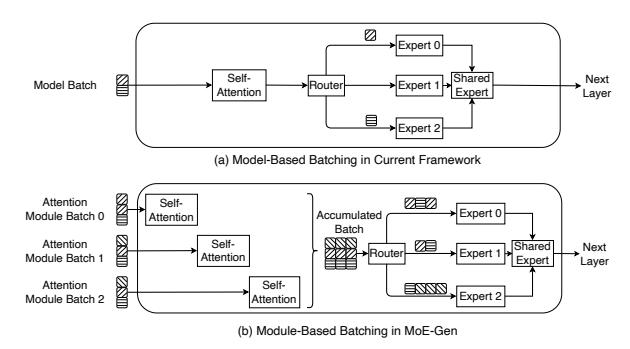
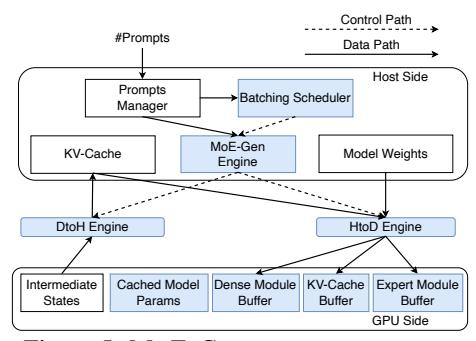

# 2. Background

MoE inference. We describe the inference process of the MoE model as shown in Figure [1.](#page-1-0) A typical layer in MoE models consists of a self-attention layer followed by a sparse MoE layer. The input tokens to a layer are first processed by the self-attention layer, which can be generally divided into three stages: the pre-attention stage (e.g., QKV projection), the self-attention mechanism stage (e.g., QKT ), and the post-attention stage (e.g., output projection). After the selfattention layer, tokens are passed to the sparse MoE layer, where a router assigns each token to a subset of experts, typically using a top-k selection strategy. Each token is processed by k selected experts, and the final output is obtained by computing a weighted average of the outputs from these experts. Some model architectures, such as DeepSeek-V2 and Qwen2MoE [\(Qwen Team,](#page-10-5) [2024\)](#page-10-5), incorporate a shared expert that all tokens pass through. The processed tokens then proceed to subsequent layers in the model. We omit layer normalization and residual connections in our discussion, as their exclusion does not affect the key structure.

MoE batched inference follows the same procedure as LLM generative inference, which operates in two phases: i) prefill: A batch of prompts is processed to generate the KV-cache at each attention layer. ii) decoding: New tokens are generated in an auto-regressive manner. The output tokens from the previous forward pass are used as the input tokens for generating the next token. In each forward pass, the KV-cache for the new input token is generated and appended to the

Figure 2: Model-based batching employs a single, unified batch size throughout the entire forward pass, whereas module-based batching iteratively process modules with small batches to form larger batches.

existing KV-cache, forming the complete context so far. The computational intensity in the decoding phase is typically orders of magnitude lower than in the prefilling phase, as only one token per sequence is passed into the model.

MoE offloading. The offloading system typically manages two levels of memory: CPU memory for excess model weights and key-value (KV) states, and GPU memory for computation and fast data access. When model weights are required for GPU computation, they can either be fetched in advance (overlapped with other computations) or fetched ondemand. A resident store can be designed in GPU memory to persistently hold model weights and/or KV-cache, while a staging *buffer* is used to prefetch dynamic data. If the GPU attempts to compute with data (e.g., weights or KV states) that are not yet in its resident store, it must stall until the data are transferred from CPU memory.

In offloading systems, the bandwidth between the host and memory is often a scarce resource. Leveraging CPU computation resources to process data locally can potentially increase overall throughput (Cao et al., 2024).

#### 3. Related Work

We show the commonly applied model-based batching and MoE-GEN's module-based batching in Figure 2. (1) Model-based batching. DeepSpeed-Inference (Aminabadi et al., 2022) and FlexGen (Sheng et al., 2023) are designed for dense transformer models and treat MoE layers as dense MLP layers, resulting in insufficient batch sizes for expert layers. FlexGen processes multiple rounds of forward passes reusing the same fetched model weights. In each forward pass, a unified batch is propagated through the entire model, without addressing the batch size limitation for MoE experts. MoE-Lightning (Cao et al., 2024) improves performance over FlexGen by optimizing GPU-CPU-I/O overlap but retains the same batching strategy. Mixtral Offloading (Eliseev & Mazur, 2023) supports the offloading of Mixtral-series of MoE models, making them popular among users with

limited GPU resources.

(2) Continuous batching for high throughput. Continuous batching is orthogonal to both model-based and module-based batching, as it operates at the sequence level. Each forward pass still relies on model-based batching.

Continuous batching frameworks often insert small prefill batches (frequently of size 1) into the decoding phase, leading to an even smaller average batch size over the entire execution.

Frameworks supporting continuous batching include vLLM (Kwon et al., 2023), TensorRT-LLM (NVIDIA, 2024), and Llama.cpp (Ollama, 2025). NEO (Jiang et al., 2024b) interleaves prefill and decoding across the GPU and CPU, while systems such as BlendServe (Zhao et al., 2024) and others (Luan et al., 2024) share the GPU in the temporal domain using micro-batches—ultimately facing the same issue as vLLM. In offloading scenarios, continuous batching performs even worse than traditional model-based batching. Therefore, we exclude it from further discussion in this paper and only report the result for reference.

- (3) Batching in training systems. Training systems often interoperate fixed global batch sizes to ensure accuracy. They seek to reduce communication overhead between GPUs over bottlenecked links (Liu et al., 2023; Li et al., 2023; Zhai et al., 2023). This is orthogonal to inference systems where batch size can vary without affecting the model quality. Training systems only have prefilling (Zheng et al., 2022), while decoding is not the major concern.
- (4) Interactive inference systems with offloading. Pregate-MoE (Hwang et al., 2024), ExpertFlow (He et al., 2024), MoE-Infinity (Xue et al., 2024), ProMoE (Song et al., 2024) and BrainStorm (Cui et al., 2023) use predictors to instruct expert prefetching before batched inference. While experts are often densely activated under large batch sizes, the prediction-based optimization becomes unnecessary for throughput optimizations. Fiddler (Kamahori et al., 2024) and PowerInfer (Song et al., 2023) support running attention or experts on CPU to alleviate the I/O bottleneck, while mainly optimized for latency in small batch sizes. Edge-MoE (Yi et al., 2023), AdapMoE (Zhong et al., 2024), and Hobbit (Tang1 et al., 2024) reduce I/O traffic by replacing high-precision expert parameters with quantized versions. These methods may incur accuracy loss as sparsity increases (Harma et al., 2024).

## 4. Module-Based Batching

### 4.1. Design Intuition

We aim to design a batching engine and strategy that accomplish two key objectives: (i) ensuring sufficient large input batches for modules to fully utilize GPU FLOPs, and (ii)

Figure 3: Left: Achieved FLOPs in the non-offloading scenario. This metric represents the number of floating-point operations performed by an expert module, normalized by the GPU compute time. Right: Percentage of GPU idle time in the offloading scenario on an NVIDIA A5000 (PCIe 4.0, 32 GB/s). This metric measures the ratio of the expert module's execution time to the time required to transfer the necessary weights from the CPU to the GPU.

overlapping computation and fetching times to reduce the end-to-end execution time.

Necessity of large batch size. We make a key observation: the batch size for model-based batching is constrained by the module with the highest memory usage—often the attention module. However, because each expert has low arithmetic intensity, a substantially larger batch size is required to achieve optimal GPU utilization.

As shown in Figure 3 (Left), at least  $2^{10}$  tokens are required to fully utilize GPU compute, whereas the average number of input tokens per expert in current SOTA models is only  $2^4$ . Furthermore, in Figure 3 (Right), we illustrate a common scenario in offloading: the computation of an expert should be fully overlapped with the fetching of the next expert, resulting in zero GPU idle time. In this case, more than  $2^{11}$  input tokens per expert are needed to ensure that the GPU does not remain idle while waiting for memory transfers. Thus, aggregating a larger batch size for experts is essential to achieve optimal performance. Similar phenomenon has also been observed in the forward pass of attention module in the decoding phase.

Necessity of searching batching strategy. While our main goal is to improve device utilization by increasing input batch sizes for modules, other factors can also affect the execution time of a forward pass. Their influence on throughput is primarily indirect, operating through the utilization or conservation of resources (e.g., GPU memory, PCIe bandwidth). For example, applying CPU-based computation to tasks that remain in host memory can save scarce HtoD memory bandwidth. However, whether this saving translates into throughput gains depends on (1) the CPU's computation speed and (2) whether we have reserved sufficient GPU buffer to effectively leverage the saved bandwidth. Similarly, if a module requires complex memory reshaping or migration, it may introduce delays but can also provide opportunities to over-

lap memory copy operations. Appropriate configurations must be chosen to seize this opportunity. Consequently, a searching strategy is necessary to determine the resulting throughput and select the optimal configurations.

Means to facilitate large batch size. We need to ensure that the GPU memory is sufficient to process large amounts of input in a single module. During module execution, design-dependent intermediate states (e.g., QKV projections in standard attention or the up-projection result of compressed KV-cache in DeepSeek) can consume significant GPU memory at runtime, which constrains the achievable batch size. To address this, MoE-GEN aims to keep fewer model weights and less KV-cache data on the GPU, thereby facilitating the use of larger batch sizes.

#### 4.2. MoE-GEN Engine Design

Module-based batching. We propose the batching strategy of MoE-GEN as shown in Figure 2. As we observe different modules have distinct memory and FLOP requirements, MoE-GEN instead assigns different batch sizes to each module, i.e., attention and expert. We choose these two components as the base for batching, since the attention module present higher memory demand, which is suitable for lower batch size. Conversely, the expert needs to scale to larger batch size, presenting two extremes. MoE-GEN then accumulates multiple attention batches and processes them in one at the expert module stage, effectively increasing the batch size for the expert module.

Sequential execution of experts. Under large batch sizes, the number of tokens routed to each expert is often uniformly distributed, as observed in previous work and by design of the MoE auxiliary loss (Xue et al., 2024; Jiang et al., 2024a). Consequently, MoE-GEN does not rely on heuristics or prediction-based prefetching. Instead, it focuses on enabling large batch sizes and prefetching, executing experts in a sparse MoE layer sequentially.

Full KV-cache offloading. We initially consider KV-cache partial offloading (Kwon et al., 2023). However, we demonstrate that fully offloading the KV-cache outperforms partial offloading, particularly when considering the completion time for processing an entire dataset. The primary reason is that caching the KV-cache in GPU memory limits batch size, leading to increased fetching traffic for expert weights (e.g., up to 86GB for Mixtral-8x7B). By trading off KV-cache copying, MoE-GEN achieves up to 20x savings in fetching traffic, as shown in Figure 4. While smaller datasets may benefit from retaining KV-cache in GPU memory, especially as GPU memory capacity increases (shown in Figure 4 (b)), popular benchmarking datasets are typically orders of magnitude larger, making KV-cache offloading more advantageous.

Figure 4: Fetching traffic over dataset, showing fully offload KV-cache benefits performance. Using Mixtral-8x7B with CPU KV-cache capacity 128GB. We pad/truncate each prompt to same length and decode same length.

Single GPU buffer for dense modules. In MoE models, in contrast to sparse activated experts, there are dense modules that would be activated for each token (e.g., attention modules and shared experts in DeepSeek). We find that setting the GPU prefetch buffer size to the size of dense modules in a single layer is sufficient to create overlapping. The fetching of such modules only has two cases: (i) with sufficient *HtoD bandwidth*: dense modules can be prefetched and fully overlapped; (ii) without sufficient HtoD bandwidth: as bandwidth is fully occupied by expert fetching, dense modules need to be fetched on demand. In both cases, the buffer can be cleared and repurposed to the next dense module. Empirically, we verified that assigning more buffer space to dense modules would not increase throughput. When they are large, they could downgrade performance by squeezing the space for other components.

**CPU for self-attention.** Matrix multiplications on the CPU (e.g., attention projection and expert) are often 10-100x slower than computation on the GPU even accounting for the fetching time of weights (NVIDIA, 2025; Kamahori et al., 2024). Due to the arithmetic intensity in matrix-vector multiplications (GEMV) in  $QK^T$  operation, CPU can process data at a pace comparable to the time required to transfer data with PCIe4.0 to the GPU and perform computations there. (Song et al., 2023; Cao et al., 2024). We only use the CPU to compute self-attention mechanism in MoE-GEN. This requires a custom CPU kernel to be implemented with better cache performance than current PyTorch and CBLAS, similar to the CPU version of FlashAttention (Dao, 2024).

System components. Our design choices has led to the system architecture shown in Figure 5. MOE-GEN features a batching scheduler, creating batching strategy based on hardware (e.g., connection speed, GPU memory capacity) and software (e.g., performance and memory usage of GPU and CPU kernels under various input batch sizes) profiling. Using this information, the scheduler enumerates candidate configurations in the search space and applies them to the DAG constructor to estimate the overall runtime of each configuration. It then selects the configuration with the shortest completion time and sends its decision to the MOE-GEN Engine, which is responsible for executing the inference. At

Figure 5: MoE-GEN system components.

this point, the KV-cache buffer, expert module buffer, and dense module buffer are allocated in GPU memory based on the selected configuration's size requirements.

The MoE-GEN Engine launches batched module execution and submits batched memory copy tasks to the HtoD engine in advance. The engine accumulates batches at each attention layer and MoE layer. Meanwhile, KV-cache offloading and update tasks are submitted to the DtoH engine at runtime. The MoE-GEN Engine also manages all necessary synchronization between computation and memory-copy operations. Details about workload profiling and implementation of the engine are in Appendix B.

### 4.3. Batching Strategy Formulation

**Problem Formulation.** The batching strategy is working under the following hardware settings. We consider a machine with two devices: a GPU and a CPU, both of which have memory capacity and computational capabilities. The two levels of memory hierarchy are interconnected with two links HtoD link and DtoH link, which only does data transmission. As the MoE model and corresponding KV-cache cannot fit entirely within the GPU, we offload them to Host memory that is close to the CPU.

Our aim is to find the module-based batching strategy that leads to the maximum throughput under the given system capability. Equivalently, we look for an accumulated batch size B constrained by the memory capacity and corresponding minimal runtime T of the batch. This includes managing micro-batches for each module separately and scheduling computation and memory copies.

**Search Space.** Given the formulation above, we construct a search space for possible system hyperparameters that affect the execution time T given accumulated batch size B (shown in Equation (1)). The time is a function of components as in Section 2. The variables in the search space that would influence the throughput are shown in Table 2.

This search space is constrained by host memory capacity

| Notations                                                 | Meaning                                        |  |
|-----------------------------------------------------------|------------------------------------------------|--|
| S                                                         | ystem & Model Parameters (Profiled)            |  |
| $m_c$                                                     | Host memory capacity                           |  |
| $m_g$                                                     | GPU memory capacity                            |  |
| $S_{\rm Model}$                                           | Size of the model                              |  |
|                                                           | Functions                                      |  |
| $S_{\rm KV-CPU}$                                          | Size of KV cache in CPU memory.                |  |
| $S_{\rm KV\text{-}GPU}$                                   | Size of KV cache in GPU memory.                |  |
| T                                                         | Execution time for a batch $B$                 |  |
| $S_{\rm IS}$                                              | Size of intermediate states in execution       |  |
|                                                           | Constants (Predetermined)                      |  |
| $S_{\mathrm{Dense}}$ GPU prefetch buffer size for dense m |                                                |  |
|                                                           | Variables                                      |  |
| B                                                         | Accumulated batch size for sparse MoE layer    |  |
| $b_a$                                                     | GPU attention module batch size                |  |
| $b_e$                                                     | GPU expert module batch size                   |  |
| $\omega$                                                  | Split ratio of $B$ to CPU for attention module |  |
| $S_{Expert}$                                              | Reserved GPU buffer size for expert modules    |  |
| $S_{\rm Params}$                                          | Size of cached model parameters in the GPU     |  |

Table 2: Notations for the search space.

and GPU memory capacity as in Equations (2) and (3)

$$S_{\text{KV-CPU}}(B) + S_{\text{Model}} \le m_c$$

$$S_{\text{Params}} + S_{\text{Expert}} + S_{\text{Dense}}$$

$$+ S_{\text{KV-GPU}}(b_a) + S_{\text{IS}}(B, b_a, b_e) \le m_q$$
 (3)

We consider the following factors in the search space:

**P-D disaggregation.** A widely adopted approach, known as the prefill-decode (P-D) disaggregation (Patel et al., 2024; Kwon et al., 2023), defines two classes of DAGs. During the prefill phase, there is no HtoD KV-cache copy in the DAG, whereas the decoding phase considers all possible nodes, as shown in Figure 6. The parameter B has minimal effect on  $S_{\rm IS}$  during decoding, since the hidden states it influences is typically sized in MBs, thus incurring negligible overheads. Consequently, we set B in the decoding phase to the maximum value permitted by the host memory size.

**Module micro-batch size**  $b_a$  **and**  $b_e$ . Choosing  $b_a$  presents a tradeoff between two types of overhead: (i) the traffic on HtoD link due to insufficient cached model weights with larger  $b_a$ , and (ii) GPU underutilization due to attention kernel launch with smaller  $b_a$ . Larger  $b_a$  uses more space for intermediate states in the GPU, squeezing the space for expert buffer, KV-cache buffer and cached model parameters. Smaller  $b_a$  reduces arithmetic intensity, risking underutilization of GPU computations as shown in Section 2.

Similar consideration applies to the selection of  $b_e$ . Furthermore, while we estimate the number of tokens routed to each expert by assuming an even distribution, the actual number remains unknown until runtime. Therefore,  $b_e$  is chosen to prevent out-of-memory (OOM) errors.

Accumulated batch split ratio to CPU  $\omega$ . Choosing the split ratio considers the following factors: (i) CPU computa-

Figure 6: MoE offloading DAG for module-based batching. The dependencies are denoted with arrows.

tion latency *Self\_Attn*, comparing to (ii) HtoD copy overhead of the KV-cache together with GPU computation latency and (iii) bandwidth for expert prefetching. CPU-based computation reduces the HtoD overhead and its bandwidth usage as the KV-cache stays in Host memory. CPU does not need to finish at the same time or earlier as GPU as in conventional load balanced scheduling, bandwidth saving for prefetching large amount of expert can be better.

Size of reserved GPU buffer  $S_{\text{Expert}}$ . We aim to select an appropriate size that allows the HtoD engine to prefetch expert weights into the GPU whenever there are periods of idle PCIe time, without overly consuming scarce GPU memory.

Size of cached model parameters in GPU  $S_{\text{Params}}$ . It is possible that the entire process is memory-bound, so adding  $S_{\text{Expert}}$  or  $b_a$  may not yield any benefit. In this case, using the spare GPU space to cache part of the model parameters reduces HtoD traffic for copying model weights, thereby alleviating memory-bound constraints.

## 4.4. Searching Batching Strategy

MoE offloading as a DAG. We can view the model inference as a Directed Acyclic Graph (DAG) of jobs. The edges of the DAG represent job dependencies, and each node has the following attributes: i) job execution time, being determined by model, hardware platform and context length, ii) type of the job, being either computation or memory copy. Figure 6 shows such an example, with the assumption that CPU and GPU run the attention module in parallel followed by memory copy and execution of the expert module.

In the decoding phase, the processing starts by copying attention module weights (if offloaded) to GPU memory. Then the GPU computation for the attention mechanism depends on the results from *Pre-Attention* and corresponding *KV-cache* copy. Meanwhile, the CPU kernel for attention mechanism would launch and only depends on Pre-Attention results because the KV-cache are fully offloaded to host memory and CPU kernel can access it directly. After batches of attention mechanism are completed, the results from both CPU and GPU are concatenated and pass through the *Post-Attention* stage. In the followed sparse MoE layer, experts are sequentially executed dependent on the copy of their module weights. and GPU computation for self-attention

| Config. | GPU        | CPU               | Host Memory |
|---------|------------|-------------------|-------------|
| C1      | A5000 24GB | AMD 7453 28-Core  | 256GB       |
| C2      | A5000 24GB | AMD 7453 28-Core  | 512GB       |
| C3      | A6000 48GB | AMD 7313P 16-Core | 480GB       |

Table 3: Testbed configurations.

mechanism depends on the results of Pre-Attention.

Solving minimal runtime on DAG. With DAG, we abstract the problem of estimating the time consumption of inference to Dynamic Programming for the Longest Path (Critical Path). Let dp[v] represent the earliest finishing time of node v in the DAG. Initialize dp[v] = 0 for all nodes v except the entry node. The dp[entry] is set to the time cost of itself. Traverse the nodes in topological order, for each node v:

$$dp[v] = \max_{u \in predecessors(v)} (dp[u]) + cost(v).$$
 (4)

The dp[exit] represents the finishing time for this DAG.

