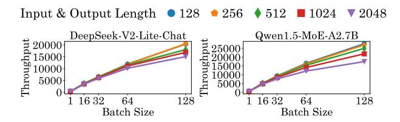

# 3.2 LLM Token Generation Parameters

The input length refers to the number of tokens present in a single input prompt. The output size denotes the number of tokens generated by the model sequentially until a stopping criterion or predefined token limit is reached. The batch size corresponds to the number of input & output pairs processed concurrently. In our evaluation, we consider input and output lengths of 128, 256, 512, 1024, and 2048 tokens, and batch sizes of 1, 16, 32, and 64.

## 3.3 AI Hardware Platforms

We deploy MoEs on Nvidia H100 SXM5 80GB GPU [\[6\]](#page-8-18) using the vLLM [\[23\]](#page-8-6) framework. The NVIDIA H100 GPU, built on TSMC's 4N process with 80B transistors, optimized for trillion-parameter LLMs. It features 80 GB HBM3 memory, 50 MB L2 cache, fourthgeneration Tensor Cores and NVLink. vLLM [\[23\]](#page-8-6) is an open-source inference framework known for its efficient memory management and support across a wide range of AI accelerators. In a limited study of Llama-4 Scout performance, we include a publicly-available Cerebras cloud inference CS-3 model replica [\[4\]](#page-8-19) in our evaluation.

Model Modality #Hidden Size #FFN Dimension #Active Experts Active Parameters Model Type #Layers #Experts Model Size Mixtral 8x7B Transformer Text 32 4096 14336 47B 12.9B Qwen 1.5 MoE Transformer Text 24 2048 5632 60 4 14.3B 2.7B 48 3 3B Owen3-30B-A3B 13824 30 5B Transformer Text 5120 128 8 DeepSeek V2 Lite Transformer Text 27 2048 1408 64 15.7B 2.4B 6 Phi 3.5 MoE Transformer Text 32 4096 6400 16 41 9B OLMoE-1B-7B 16 2048 8192 64 7.2B 1.3B Transformer Text 8 DeepSeek VL2 Tiny Transformer Text + Image 16 1536 8960 8 2 3R 1.0R DeepSeek VL2 Small Text + Image 24 2048 11008 16B 2.8B Transformer 8 DeepSeek VL2 Transformer Text + Image 32 4096 14336 27B 4.5B

Table 1: Comparison of Mixture of Expert Model Architectures

#### 3.4 Performance Metrics

We employ the following performance metrics in our evaluation: (a) Time to First Token (TTFT) measures the time between receiving an input prompt and generating the first output token. It reflects the responsiveness of an LLM from the user's perspective. TTFT is obtained by limiting the maximum output length to a single token and recording the generation time.

**(b) Inter-Token Latency (ITL)** is the average time interval between producing consecutive output tokens. It captures the model's per-token generation speed. ITL is computed as:

$$ITL = \frac{End\text{-to-}End\ Latency} - TTFT}{Batch\ Size} \times Output\ Tokens} - 1$$
 (1)

(c) Throughput indicates the processing efficiency of the hardware, representing the total number of tokens (input and output) processed per second. We first measure the end-to-end latency (time from prompt submission to the generation of the final output token) and convert it to throughput as follows:

Throughput = 
$$\frac{\text{Batch Size} \times (\text{Input Tokens+Output Tokens})}{\text{End-to-End Inference Latency}}$$
 (2)

(d) **Samples per second:** The metric for VLMs is the number of input (image + text) samples processed per second.

#### 4 MoE Inference Analysis

In this section, we first examine the breakdown of MoE prefill and decode phases, followed by examining the role of input/output lengths and batch sizes on the inference throughput.

#### 4.1 Prefill and Decode Breakdown

Figures 3 and 4 present a comparative analysis of TTFT, ITL, and end-to-end latency across LLMs and VLMs. Among LLMs, OLMoE-1B-7B achieves the fastest TTFT, outperforming DeepSeek-V2-Lite by approximately 70%, while ITL varies by nearly 100% between the best and worst performing models, and end-to-end latency shows over a 120% gap. In VLMs, latency differences are more pronounced as DeepSeek-VL2-Tiny attains a TTFT about 30% faster than the DeepSeek-VL2 model, with ITL showing a 240% gap and end-to-end latency exceeding a 260% difference. These results indicate that while LLMs exhibit moderate variation in latency, VLMs incur substantially larger performance gaps, mainly due to heavier computational load and multimodal processing overhead in the vision language inference pipeline.

Figure 3: TTFT, ITL and End-to-End Latency of LLMs for Batch Size of 64 and Input & Output Length of 2048

Figure 4: TTFT, ITL and End-to-End Latency of VLMs

#### 4.2 Impact of Batch Size

LLMs and VLMs demonstrate an increase in throughput with an increase in batch size for the same context length. This is mainly due to the simultaneous execution of all input prompts and the parallel generation of output tokens of all batches. Figure 5 demonstrates that throughput consistently decreases as the number of active experts increases across DeepSeek-V2-Lite and Qwen1.5-MoE-A2.7B models and all batch sizes, with the performance degradation being more pronounced at higher batch sizes. For DeepSeek-V2-Lite, increasing the active experts from 1 to 32 results in an average throughput drop of approximately 15-20% for large batch sizes (64 and 128), whereas small batch sizes (1 and 16) incur only about a 5-8% reduction. Qwen1.5-MoE-A2.7B exhibits a similar trend but with slightly lower relative losses (around 12-18% for large batches and 4-7% for small batches), indicating a marginally better resilience to TopK scaling. Across both models, throughput scales sub-linearly with batch size: moving from batch size 1 to 128 increases throughput by roughly two orders of magnitude, but larger batches increase the throughput with more active experts.

*Insight*: The results suggest that while larger batch sizes maximize hardware utilization, they are more sensitive to increased expert activation, highlighting a critical trade-off with batching and active experts in MoE inference.

Figure 5: Impact of Batch Size on Varying Number of Active Experts (TopK) on Nvidia H100 GPU for Context Length 2048

## 4.3 Impact of Input/Output Sizes

Figure 6 illustrates throughput trends across varying batch sizes and sequence lengths for DeepSeek-V2-Lite and Qwen1.5-MoE-A2.7B. For both models, throughput scales linearly with batch size, with increases exceeding  $8 \times$  from batch 1 to 128. Shorter sequences consistently outperform longer ones. For example, in both models, input/output length of 128 achieves up to 30% higher throughput than length of 2048 at large batches, and the performance gap between shortest and longest sequences widens with batch size due to reduced memory and compute demands. For DeepSeek-V2-Lite, intermediate lengths (256-512) show less than 10% drop compared to the shortest length, indicating efficient handling of medium sequences, whereas longer sequences (1024-2048) experience throughput degradation exceeding 20%. Qwen1.5-MoE-A2.7B not only surpasses DeepSeek-V2-Lite by 20-30% across all settings but also exhibits a more gradual decline in throughput as sequence length increases, reflecting better optimization for long-context inference.

*Insight:* Throughput decreases as the output generation tokens increase. This is due to the increase in sequential token generation. Also, throughput increases with an increase in input length, as there is less opportunity for parallel processing. This reflects the fundamental difference between parallel input encoding and sequential output generation in transformer architectures.

Figure 6: Batch Size vs Input & Output Length on H100 GPU

