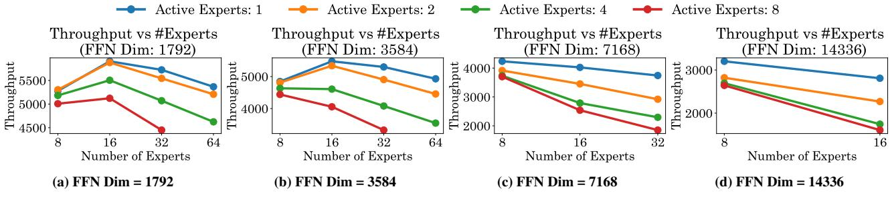
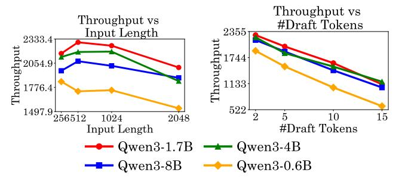
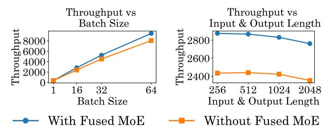
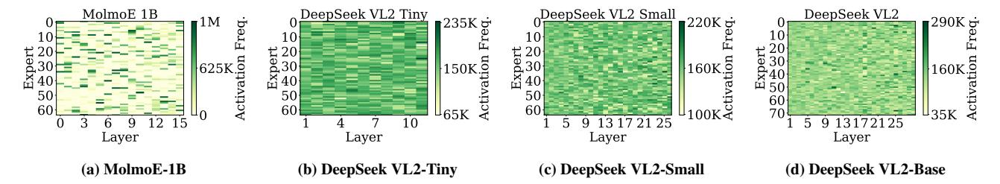
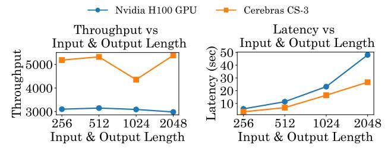
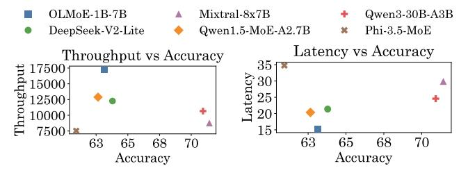
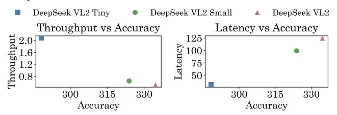

# 5 Fine Grained MoE Inference Analysis

#### 5.1 Hyperparameter Setup

This section investigates the impact of scaling MoE hyperparameters in a layer. We explore several possible combinations within our predefined hyperparameter configuration, namely FFN dimension: {1792,3584,7168,14336}, number of experts: {8,16,32,64}, and number of active experts: {1,2,4,8}. The baseline skeleton model is Mixtral-8x7B and we tweak the hyperparameters in each experiment. All experiments are conducted on 4 H100 GPUs using vLLM. Any missing data points in the results indicate OOM conditions.

#### 5.2 Scaling FFN Dimension

Figure 7 illustrates the scaling of FFN dimension for a fixed number of experts. Across all expert configurations, throughput steeply declines by 50% on average when FFN dimension increases from 1792 to 14336, with the steepest drops occurring in the transition from 1792 to 3584. This performance degradation is particularly acute for configurations with higher active expert counts, where 8 active expert scenarios consistently show the most throughput reductions. The impact of active experts becomes increasingly impactful at higher FFN dimensions, with single active expert configurations maintaining relatively stable throughput compared to multiple active expert scenarios. At the largest FFN dimension (14336), the performance gap between one active and eight active expert configurations reaches around 60%, highlighting the effect of increased data movement and computation overhead. The asymptotic behavior observed at the highest FFN dimensions across all configurations suggests approaching the theoretical bandwidth limits of H100.

*Insight:* The convergence of throughput, regardless of active expert count at extreme FFN sizes, indicates that memory bandwidth saturation overrides computational parallelism benefits. This finding has critical implications for MoE deployment strategies, suggesting that practitioners should carefully balance FFN capacity against throughput requirements.

## 5.3 Scaling Number of Experts

Figure 8 illustrates the scaling of the number of experts for a fixed FFN dimension. The scaling patterns with total expert count show a complex non-linear relationship that varies significantly based on FFN dimension and active experts. For smaller FFN dimensions (1792, 3584), increasing the total number of experts from 8 to 64 generally maintains or slightly improves throughput, with improvements ranging from 5-15% in optimal configurations. However, this positive scaling behavior becomes increasingly constrained at larger FFN dimensions, where the additional expert capacity cannot be effectively utilized due to memory bandwidth limitations. The interaction between total experts and active experts shows a resource allocation challenge that becomes more complex with increasing scale. Configurations with higher active expert counts (4, 8) show diminishing returns more rapidly as total experts increase, particularly evident in the flattening throughput curves beyond 32 total experts.

*Insight:* As number of experts grow, routing and communication overhead can overshadow computational gains, while memory limits, especially in high FFN configurations, cause out-of-memory failures. Effective MoE deployment should optimize the total parameter budget rather than maximize expert count, with extreme scale configurations likely needing distributed placement across multi-node architectures for efficient resource use.

## 5.4 Scaling Number of Active Experts

Figure 9 illustrates the scaling of the number of active experts for a fixed FFN dimension. The active expert scaling reveals a consistent throughput degradation as the number of active experts increases from 1 to 8 across all configurations. Single active expert configurations consistently deliver 50-80% higher throughput compared to 8 active expert scenarios, representing an efficiency optimization

Figure 7: Throughput vs. FFN Dimension for Batch Size 16 and Input/Output Length 2048 on 4 H100 GPUs on Mixtral-8x7B Variant

Figure 8: Throughput vs. #Experts for Batch Size 16 and Input/Output Length 2048 on 4 H100 GPUs on Mixtral-8x7B Variant

Figure 9: Throughput vs. #Active Experts for Batch Size 16 and Input/Output Length 2048 on 4 H100 GPUs on Mixtral-8x7B Variant

opportunity in MoE deployment strategies. This substantial performance difference reflects the fundamental relationship between sparse activation benefits and multi-expert overhead, particularly evident in the linear throughput degradation patterns observed across different total expert and FFN configurations. The consistency of this degradation across varying total expert counts suggests that active expert management represents a primary optimization level for inference production deployments. The scaling behavior across FFN dimensions reveals that active expert overhead is not uniformly distributed across different settings. At smaller FFN dimensions, the throughput gap between 1 active and 8 active configurations remains relatively modest (20-30%), while at larger FFN dimensions this gap expands dramatically (60-80%). The interaction suggests that high-capacity MoE configurations may benefit from dynamic active expert allocation strategies that adjust based on computation and memory availability.

**Insight:** MoE throughput drops sharply with more active experts, with single expert setups delivering up to 80% higher performance at larger FFN sizes. Jointly tuning expert count, FFN dimension,

and activation strategy is essential, as smaller FFNs allow flexibility while larger ones require conservative activation to avoid OOM.

To summarize our findings on scaling the number of experts, active experts, and FFN dimensions , the data reveals clear operating regimes where different parameter combinations provide optimal throughput characteristics, with smaller FFN dimensions (1792-3584) enabling more flexible active expert usage while larger dimensions (7168-14336) require more conservative activation strategies to maintain acceptable throughput. The systematic OOM boundaries observed at extreme configurations provide deployment guidelines for hardware-constrained environments, indicating that current H100-based systems can effectively support MoE models up to specific parameter budgets before requiring distributed architectures.

#### **6 MoE Algorithm Optimizations**

#### 6.1 Quantization

Quantization [17] is a method to reduce model size by lowering the precision of weights and activations. LLMs can be operated in lower precisions, such as FP8 [22], using GPTQ [14] and AWQ [25] without compromising the model quality. Figure 10 compares the performance of Mixtral-8x7B under FP16 and FP8 precisions using vLLM on H100 GPU with varying batch sizes and input/output lengths. Across both settings, FP8 outperforms FP16 in throughput, with the performance gap widening under larger batch sizes and remaining stable across varying sequence lengths. Specifically, FP8 achieves up to 25–30% higher throughput than FP16 at the highest batch size, indicating superior scalability with parallel workloads. In the input/output length variation analysis, FP8 sustains a throughput advantage of around 20–25% over FP16 across all tested lengths, suggesting that the benefit of lower precision is robust to changes in sequence length and not limited to small context inference.

**Insight:** These results show FP8's potential to deliver substantial efficiency gains in both compute-bound and memory-bound scenarios on H100 GPUs.

Figure 10: Performance Comparison of Mixtral-8x7B with FP16 and FP8 precisions on Nvidia H100 GPUs

## **6.2** MoE Pruning

Inter-expert pruning [29] removes an entire expert along with their routing weights, reducing memory while keeping the same number of active experts during inference. Intra-expert pruning [48] reduces the FFN Dimension inside each expert, keeping the number of experts unchanged but lowering the computation per expert. In our experiments, we apply pruning ratios of {12.5%, 25%, 50%}. For example, 12.5% inter-expert pruning removes 18 of the experts in each layer, while 25% intra-expert pruning reduces the FFN dimension by 1/4. We evaluate TopK values from 1 up to the baseline pretrained top-k:  $\{1, 2, \dots, \text{TopK}_{\text{baseline}}\}$ . The results in Figure 11 show that throughput generally decreases as the number of active experts increases, with intra- and inter-expert pruning exhibiting distinct trends across models. For OLMoE-1B-7B, higher pruning ratios (e.g., 50%), particularly intra-expert pruning tend to sustain or even improve throughput for larger TopK, likely due to reduced per-expert computation enabling better hardware utilization. In contrast, Qwen1.5-MoE-A2.7B is more sensitive to pruning, where aggressive intra-expert pruning at low TopK significantly degrades throughput, indicating greater vulnerability to load imbalance. On NVIDIA H100 GPUs, these effects are amplified because the GPU's high compute-to-memory bandwidth ratio and advanced scheduling mechanisms make performance more sensitive to expert load balancing; when token-to-expert routing is imbalanced, some experts become bottlenecks, reducing the overall parallel efficiency despite the available compute capacity. Low pruning percentages (12.5% or 25%) of inter and intra expert pruning can cause an inverse effect

Figure 11: Impact of Intra and Inter Expert Pruning on 4 H100 GPUs for Batch Size 16 and Input/output Length of 2048

and reduce throughput, while 50% pruning can significantly improve throughput.

## 6.3 Speculative Decoding Study

Speculative decoding is a technique to accelerate LLM inference by generating multiple tokens in parallel and verifying them. The process involves a small and lightweight draft model that generates several future tokens in a single step, followed by a verification step using the larger, more accurate model to validate or reject the sequence. This approach reduces the number of sequential forward passes required, significantly improving decoding throughput while maintaining output quality. Recent implementations integrate speculative decoding with advanced scheduling and KV cache management, making it particularly effective for real-time and large-scale deployment scenarios. A key limitation of speculative decoding is that the main model and the draft model must share an identical vocabulary. Consequently, the two models are typically selected from the same family, Owen, to ensure compatibility.

Figure 12 compares the speculative decoding performance of Qwen-30B using four draft models from the same family, Qwen3-0.6B, Owen3-1.7B, Owen3-4B and Owen3-8B. Owen-30B as the target model shows that Qwen3-1.7B delivers the highest throughput, exceeding Qwen3-8B by up to ~20% at short inputs and retaining a  $\sim$ 15% lead over Qwen3-4B at long inputs, while Qwen3-0.6B lags by  $\sim$ 25-35% across all lengths. Throughput drops with increasing input length for all models, but the decline is smaller ( $\sim$ 15%) for Owen3-1.7B compared to  $\sim$ 25% for Owen3-8B and Owen3-4B, indicating better scalability. As draft tokens increase, throughput decreases monotonically due to higher validation overhead, with Qwen3-1.7B maintaining a ~5-10% advantage over Qwen3-4B and ∼10% over Qwen3-8B at higher counts, while Qwen3-0.6B remains over  $\sim 30\%$  slower than the leader. These trends highlight that medium-sized draft models balance accuracy and efficiency best, while very small or large drafts incur greater latencies.

#### 7 Hardware Optimizations

#### 7.1 GPU Parallelism

Tensor Parallelism (TP) [39] distributes layer weight tensors across multiple devices in either row-wise or column-wise fashion. Devices communicate to share input and output activations. TP works most

Figure 12: Comparison of Speculative Decoding Performance on Target Model Owen3-30B-A3B using four Draft Models

effectively within single nodes due to faster intra-node communication, enabling the distribution of large tensors that exceed single-device memory capacity. Expert Parallelism (EP) [36] distributes MoE models by assigning groups of expert blocks to individual devices. This approach exploits the independent nature of experts in MoE layers, though it can suffer from load-balancing issues when assigned experts remain inactive. Hybrid Parallelism (HP) [41] combines multiple parallelism strategies (TP, PP and EP) to achieve efficient scaling and improved hardware utilization. While HP provides greater flexibility by allowing different parallelism techniques per layer, it introduces complexity in managing simultaneous parallelism strategies and coordinating work distribution across devices.

Figure 13 illustrates the performance of the Mixtral-8x7B model and OLMoE-1B-7B models under different settings of TP, PP and EP. The results show that TP without EP delivers the highest throughput scaling as the number of GPUs increases, achieving performance gains of over 2× from 1 to 4 GPUs on the H100. TP with EP exhibits lower scaling efficiency, while PP with EP shows minimal throughput improvement, and PP without EP remains almost flat, indicating poor scalability. This phenomenon on the H100 GPU arises because its high intra-node bandwidth (via NVLink) strongly benefits communication-intensive TP, allowing large weight tensors to be efficiently split and aggregated across devices. In contrast, PP suffers from stage imbalance and synchronization overheads, and EP's load-balancing and dispatch costs offset potential gains, especially for smaller expert activations.

*Insight:* Tensor parallelism over the entire model is more effective than pipeline or expert parallelism. This is due to better utilization of all available GPU devices, whereas expert and pipeline parallelism often result in underutilization of resources.

Figure 13: Performance Comparison of Mixtral-8x7B using TP, PP, EP on Nvidia H100 GPUs using vLLM

Figure 14: Performance Comparison of Mixtral-8x7B with and without Fused MoE Configuration on 4 H100 GPUs

#### 7.2 Fused MoE

Fused MoE is an optimized execution for MoEs to merge expert selection, routing, and FFN computation into a single fused GPU kernel, reducing intermediate memory transfers and kernel launch overhead. Fused MoE minimizes synchronization costs and improves GPU utilization by batching token routing decisions and executing only the active experts in one pass, leading to significantly higher throughput compared to a naive MoE implementation where routing and expert computation are separate stages. Figure 14 shows the performance of Mixtral-8x7B with and without the Fused MoE, both varying batch size and input/output lengths. Across both settings, Fused MoE consistently outperforms the non-fused version, with performance gains becoming more pronounced at higher context lengths and prompts. When scaling batch size, Fused MoE achieves approximately 15–20% higher throughput, with the relative advantage widening as the batch size increases, indicating superior GPU utilization and reduced kernel launch overhead. In the input/output length variation experiment, Fused MoE maintains a throughput advantage of roughly 12-18% across all sequence lengths, while the non-fused baseline exhibits a sharper decline at longer sequences.

*Insight:* These results highlight that kernel fusion not only boosts throughput but also sustains efficiency under increasing computational and memory demands, aligning with its design goal of minimizing synchronization costs and intermediate memory transfers.

#### 7.3 Hardware Benchmarking

Figure 16 compares latency and throughput for Llama-4-Scout-17B-16E model on H100 GPU and Cerebras cloud CS-3 systems across varying input/output lengths. The CS-3 model replica stores most weights at FP8 precision, though KV cache and all computation are performed at FP16 for maximum accuracy. The latency increases more steeply on H100 with context length, with a sharp rise beyond 1024 tokens, while the CS-3 maintains significantly lower and more gradual latency growth, indicating better scalability. CS-3 benefits from WSE-3 having multiple orders of magnitude memory bandwidth and decreased inter-device communication, enabling rapid inference pipelining slowed only slightly by infrequent cross-node pipelining. We selected Llama-4 Scout as it is the only model with stable support across H100 and CS-3, enabling a fair comparison.

## 8 Model Accuracy Comparison

## 8.1 Language Understanding Tasks

We benchmark LLMs on nine widely adopted language understanding tasks from the 1m-eval [16] suite: ARC-c [8], ARC-e [8], BoolQ

Figure 15: Expert Activation Frequency map of MolmoE-1B and DeepSeek VL2 family Models on MME task

Figure 16: H100 vs CS3: Throughput and Latency Comparison of Llama-4-Scout-17B-16E

[7], HellaSwag [53], MMLU [19], OpenBookQA [33], RTE [45], WinoGrande [37]. Figure 17 compares throughput, latency, and average accuracy (across the all the lm-eval tasks) across six LLMs, revealing distinct trade-offs between efficiency and performance. OLMoE-1B-7B achieves the highest throughput, over 40% higher than the next best model, while maintaining lower accuracy than MoE models such as Mixtral-8x7B and Qwen3-30B-A3B. Conversely, Qwen3-30B-A3B and Mixtral-8x7B deliver the highest accuracies but incur 60-100% higher latency and 30-50% lower throughput than the most efficient models. Medium-sized MoE variants like DeepSeek-V2-Lite and Qwen1.5-MoE-A2.7B lie in a balanced region, with moderate accuracy and efficiency. Phi-3.5-MoE exhibits the lowest throughput and highest latency despite competitive accuracy. These results highlight a clear performance-efficiency frontier, where small models excel in throughput and latency, while large MoEs dominate accuracy at the cost of runtime efficiency.

Figure 17: Throughput/Latency vs Accuracy for LLMs

## **8.2** Vision Language Model Tasks

We evaluate VLMs on datasets and tasks from VLMEvalKit [10]: MME [51], TextVQA [40], AI2D [21], DocVQA [31], MMMU [52], InfoVQA [30], RealWorldQA [54], ScienceQA [28]. Figure 18 compares throughput and latency against average accuracy for all the tasks for the DeepSeek-VL2 Tiny, Small, and Base models. DeepSeek-VL2-Tiny achieves the highest throughput but the lowest accuracy, highlighting its suitability for speed-critical applications with reduced precision requirements. Conversely, DeepSeek VL2

delivers the highest accuracy but suffers from the lowest throughput and highest latency, making it more appropriate for accuracy-focused scenarios. DeepSeek VL2 Small offers a balanced trade-off, with moderate accuracy, throughput, and latency, serving as a middle ground between the Tiny and Base variants. This trend underscores the inherent trade-off between computational efficiency and predictive performance in VLMs.

Figure 18: Throughput/Latency vs Accuracy for VLMs

#### 8.3 Expert Activation Frequency Study

Figure 15 depicts the expert activation frequency (number of times each expert is selected during inference) heatmap for the DeepSeek-VL2 family and MolmoE-1B models on the MME task dataset [15]. DeepSeek-VL2 family models show a relatively uniform activation pattern across experts and layers, whereas MolmoE-1B exhibits a more sparse activation pattern, with certain experts being triggered far more often. The activation frequency in MolmoE-1B reaches up to 1M for specific experts, in contrast to DeepSeek-VL2 models, which peak around 290K. This difference arises because DeepSeek-V2 [26] incorporates an auxiliary loss during training to balance expert utilization, ensuring that all experts are activated more evenly. Consequently, activation frequency alone is not a dependable metric for assessing expert importance in well-balanced models.

