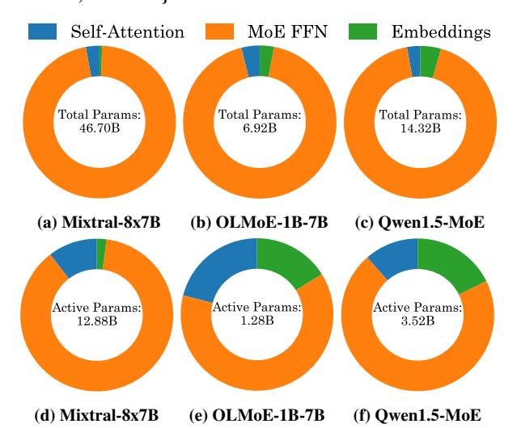

# MoE-Inference-Bench: Performance Evaluation of Mixture of Expert Large Language and Vision Models

Krishna Teja Chitty-Venkata1, Sylvia Howland2, Golara Azar2, Daria Soboleva2, Natalia Vassilieva2, Siddhisanket Raskar3, Murali Emani1, Venkatram Vishwanath1

1Argonne National Laboratory, 2Cerebras, 3Pacific Northwest National Laboratory {schittyvenkata, memani, venkat}@anl.gov, s.raskar@pnnl.gov, {sylvia.howland, golara.azar, daria.soboleva, natalia}@cerebras.net

#### **Abstract**

Mixture of Experts (MoE) models have enabled the scaling of Large Language Models (LLMs) and Vision Language Models (VLMs) by achieving massive parameter counts while maintaining computational efficiency. However, MoEs introduce several inference-time challenges, including load imbalance across experts and the additional routing computational overhead. To address these challenges and fully harness the benefits of MoE, a systematic evaluation of hardware acceleration techniques is essential. We present MoE-Inference-Bench, a comprehensive study to evaluate MoE performance across diverse scenarios. We analyze the impact of batch size, sequence length, and critical MoE hyperparameters such as FFN dimensions and number of experts on throughput. We evaluate several optimization techniques on Nvidia H100 GPUs, including pruning, Fused MoE operations, speculative decoding, quantization, and various parallelization strategies. Our evaluation includes MoEs from the Mixtral, DeepSeek, OLMoE and Qwen families. The results reveal performance differences across configurations and provide insights for the efficient deployment of MoEs.

## 1 Introduction

Mixture of Experts (MoE) models have emerged as a powerful paradigm for scaling neural networks, particularly in the domain of Large Language Models (LLMs). This approach offers a way to increase model capacity without a proportional rise in computational cost. MoE differs from dense models by using multiple specialized sub-networks, where each input activates only a subset of experts (as determined by a gating network). In contrast, dense models activate all parameters for every input, making MoE architectures significantly more parameter-efficient. Architectures such as the Switch Transformer [13] and GShard [24], along with more recent opensource MoE models like Mixtral [20], Llama4 [32], DeepSeekMoE [9], and Kimi [42], exemplify the rapid advancements in MoE-based systems These models leverage sparse weight activation, enabling large networks to maintain inference efficiency. MoE models are now widely used in applications such as text generation, retrievalaugmented generation, and multimodal reasoning. However, despite their computational advantages, MoE models also pose unique challenges in inference, training stability, memory usage, and hardware utilization due to load imbalance and dynamic routing.

MoE Inference [27] plays a central role in modern AI applications, as it involves executing the forward pass of a sparsely activated model where only the top-k experts per token are evaluated. Efficient inference is crucial for maximizing the benefits of sparsity in real-world deployments. As MoE models continue to grow in scale and

Figure 1: Layer-wise Total and Active Parameter Breakdown for Mixtral-8x7B, OLMoE-1B-7B, and Owen1.5-MoE

complexity, optimizing inference is critical to achieve low latency and energy-efficien execution on modern accelerators. This includes mitigating expert load imbalance, reducing communication overhead in distributed settings, and designing scheduling strategies that fully exploit sparsity for throughput gains.

The MoE ecosystem has witnessed a convergence of three key trends: the rise of open-source MoE models, advancements in AI accelerators, and the development of inference frameworks like vLLM [23] and FasterMoE [18] optimized for sparse execution. This synergy highlights the importance of robust benchmarking to evaluate MoE performance across diverse hardware setups. Benchmarking exposes critical trade-offs between throughput, latency, and memory footprint, enabling informed decisions about model deployment and architecture optimization.

The evolution of AI hardware such as GPUs and specialized AI accelerators has been instrumental for the ever-rising computational demands of MoE models. These accelerators offer high parallelism and memory bandwidth, essential for models with billions of parameters and dynamic computation graphs. However, MoE architectures also introduce new hardware challenges, such as expert placement, routing overhead, and under-utilization due to sparse activations. Addressing these hardware inefficiencies requires co-designing inference systems that are both MoE-aware and hardware-efficient. Figure 1 shows that MoE layers dominate both total and active parameters across different models, emphasizing their critical role in computational cost and memory footprint. Since MoE layer weights

account for a substantial portion of the model, understanding the MoE performance is essential for optimized deployment.

In this paper, we introduce MoE-Inference-Bench, a comprehensive benchmarking suite designed to systematically evaluate MoE models across a wide range of optimization techniques. Our benchmark analyzes throughput, latency, and hardware utilization for stateof-the-art MoE models, shedding light on the practical implications of sparse inference and routing dynamics. Our comprehensive study provides several insights for researchers aiming to deploy MoE models efficiently, and contributes to the broader goal of scalable and cost-effective AI deployment in the era of massive model sparsity.

The main contributions of our paper are as follows:

- (1) Comprehensive MoE Benchmarking Suite: We propose MoE-Inference-Bench to evaluate MoE performance under diverse inference scenarios. Our suite spans models from 2B to 70B parameters, covering multiple architectures (Mixtral, DeepSeek, Qwen, Phi, OLMoE). Our study examines multiple factors that significantly influence the inference performance of MoEs, providing insights for future designs.
- (2) Fine-Grained Hyperparameter Scaling Analysis: We perform an extensive exploration of key MoE layer hyperparameters, which include FFN dimension, total expert count, and active expert ratio to quantify their individual and joint impact on throughput and out-of-memory boundaries on Nvidia H100 GPUs. Our results identify optimal MoE operating constraints and reveal clear trade-offs between model size, expert sparsity and hardware efficiency.
- (3) Inference Optimizations: We systematically assess multiple inference-time acceleration techniques such as quantization, intra and inter expert pruning, speculative decoding and Fused MoE, highlighting their effectiveness across batch sizes and sequence lengths. We also benchmark MoE inference across Nvidia H100 GPUs, analyzing the effects of tensor, pipeline, and expert parallelism strategies.

## 2 Background and Related Work

*Large Language and Vision Models.* Modern LLMs are predominantly built upon the transformer architecture [\[44\]](#page-9-1), which comprises stacks of decoder layers. These layers incorporate core components such as token embeddings, positional encodings, multi-head selfattention, and feed-forward networks. VLMs combine vision and language capabilities to simultaneously process both visual data and textual information, enabling them to perform multimodal tasks such as image captioning and visual question answering.

*Mixture-of-Experts LLMs .* Dense architectures represent the conventional LLM, where a single, monolithic neural network activates all parameters for every token. This design facilitates comprehensive information processing but incurs substantial computational and memory costs [\[43\]](#page-9-2). Mixture-of-Experts (MoE) models [\[3,](#page-8-8) [38\]](#page-8-9) incorporates multiple specialized subnetworks within selected layers, typically the FFN blocks, as shown in Figure [2.](#page-1-0) A learnable routing mechanism activates only a subset of experts per token, improving parameter efficiency and potentially accelerating inference without proportionally increasing compute. Notable Examples include Mixtral-8x7B [\[34\]](#page-8-10), where expert specialization enables scaling to larger total parameter counts while mitigating the runtime

Figure 2: Mixture of Expert (MoE) Design

overhead of dense activation. However, MoE architectures introduce additional complexity in training stability and load balancing.

*Benchmarking LLM Performance.* LLM Benchmarking under different optimizations is essential for assessing the computational trade-offs of diverse architectures. Previous studies have evaluated LLMs on leadership-class supercomputers [\[11,](#page-8-11) [49\]](#page-9-3), LLM-specific inference [\[5\]](#page-8-12) and deep learning benchmark suites [\[12,](#page-8-13) [50\]](#page-9-4), offering insights into scalability, efficiency, and hardware utilization patterns. To the best of our knowledge, this work is the first to present systematic, inference-focused benchmarking of state-of-the-art MoE models across a broad spectrum of optimizations, providing insights into architectural and system-level performance trade-offs.

## 3 Experimental Setup

## 3.1 LLM Architectures

We evaluate MoEs across varying sizes and architectures, enabling a comprehensive inference performance comparison. The models include Mixtral-8×7B [\[20\]](#page-8-2), Qwen-1.5-MoE [\[2\]](#page-8-14), Qwen3-30B-A3B [\[47\]](#page-9-5), DeepSeek-V2-Lite [\[26\]](#page-8-15), Phi-3.5-MoE [\[1\]](#page-8-16), OLMoE-1B-7B [\[35\]](#page-8-17), DeepSeek-VL2-Tiny, DeepSeek-VL2-Small, DeepSeek-VL2 [\[46\]](#page-9-6). This set encompasses both LLM and VLM MoEs, covering parameter scales from lightweight 7B parameter models to largescale 30B+ parameter networks. Table [1](#page-2-0) summarizes the architecture specifications of different MoE models in our evaluation.

