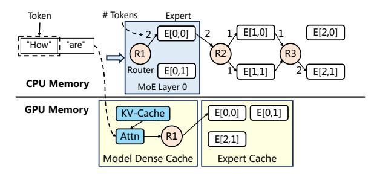
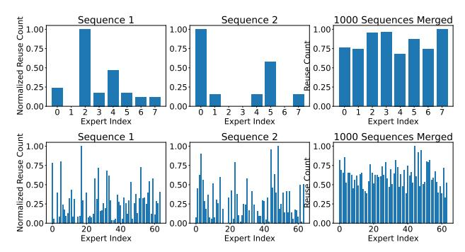
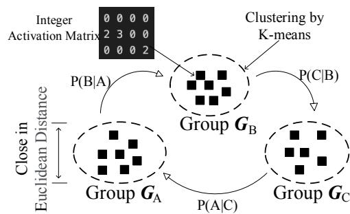
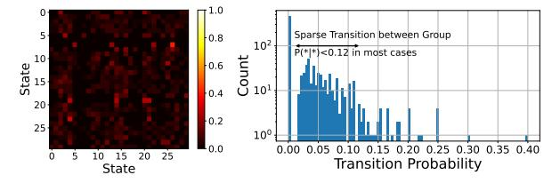
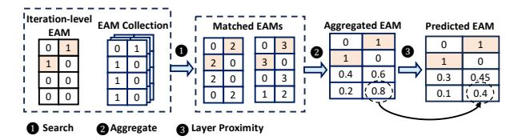

# 1. Introduction

Mixture-of-Expert (MoE) architectures can significantly improve the efficiency of Large Language Models (LLMs). In an MoE model, the majority of parameters belong to the MoE layers, where numerous experts are connected to a router that dynamically routes input tokens to different experts for processing. During inference, each input token typically activates only a small subset of experts, significantly reducing compute and memory bandwidth demands compared to fully activated counterparts, where all experts must be utilized.

|                    | Systems GPU idle time TPOT Avg. TPOT Tail |        |        |
|--------------------|-------------------------------------------|--------|--------|
| DeepSpeed          | 513ms                                     | 737ms  | 803ms  |
| Mixtral-Offloading | 754ms                                     | 1250ms | 1530ms |
| Ollama             | 2073ms                                    | 2590ms | 2599ms |
| vLLM               | 254ms                                     | 485ms  | 493ms  |
| MOE-INFINITY       | 51ms                                      | 155ms  | 169ms  |

Table 1: MoE generation latency for DeepSeek-V2-Lite as time-per-output-token (TPOT) on single NVIDIA-A5000- 24GB through PCIe4.0 (24GB/s). MOE-INFINITY achieves 3.1–16.7× latency reduction. Other systems incurs high latency due to high volume but inaccurate prefetch blocking GPU in addition to low GPU cache hit rate.

Given its efficiency, LLMs with MoE architectures are increasingly favoured for local deployment on personal machines. Unlike cloud servers, personal machines often have only a single consumer-grade GPU with limited memory (typically 24–48GB). To serve large MoE models—some exceeding 100GB [\(Jiang et al.,](#page-8-0) [2024;](#page-8-0) [The Mosaic Research](#page-9-0) [Team;](#page-9-0) [XAI,](#page-9-1) [2024\)](#page-9-1), such as DeepSeek-MoE [\(DeepSeek-AI,](#page-8-1) [2024\)](#page-8-1) with 236 billion parameters—the LLM inference system often relies on offloading [\(Aminabadi et al.,](#page-8-2) [2022\)](#page-8-2). This means the full MoE model resides in host memory, and only the activated experts (i.e., those receiving tokens for processing) are fetched into the GPU when needed.

Many state-of-the-art inference systems now support offloading, but they often suffer from slow performance. Our trace analysis reveals that the primary cause is poor cache design when fetching experts into GPUs. Most inference engines (e.g., DeepSpeed [\(Aminabadi et al.,](#page-8-2) [2022\)](#page-8-2), Mixtral-Offloading [\(Eliseev & Mazur,](#page-8-3) [2023\)](#page-8-3)) use prediction-based methods to manage their expert cache within GPUs. These methods primarily analyze the execution order of experts in the computational graph (e.g., prioritizing experts in the next immediate layer). While prediction-based methods work well for fully activated dense models, they fail to account for the sparse activation of experts and assume all required experts must be fetched into GPUs, leading to substantial I/O bottlenecks on the PCIe bus. As a result, they suffer from high GPU idle time and thus poor Time Per Output Token (TPOT)—a critical metric for LLM serving, shown in Table [1.](#page-0-0) In fact, inaccurate predictions can degrade performance even further than on-demand fetching approaches

1The University of Edinburgh. Correspondence to: Leyang Xue <leyang.xue@ed.ac.uk>, Yao Fu <y.fu@ed.ac.uk>, Zhan Lu <z.lu-64@sms.ed.ac.uk>, Chuanhao Sun <csun2@ed.ac.uk>, Luo Mai <luo.mai@ed.ac.uk>, Mahesh Marina <mahesh@ed.ac.uk>.

like vLLM (Kwon et al., 2023), which experience less I/O contention but still underutilize GPUs.

Recently, BrainStorm (Cui et al., 2023) was designed for caching parameters of dynamic neural networks. However, it can only handle dynamic patterns caused by control operators (e.g., if-else) in neural networks in classification tasks, rather than routers in MoE architectures during the auto-regressive LLM decoding process. As a result, it still produces highly inaccurate predictions, performing worse than on-demand vLLM – 934ms TPOT (avg.) in BrainStorm versus 485ms TPOT in vLLM.

We aim to design an effective caching strategy for MoE inference on personal machines. Our key idea is that MoE inference on personal devices typically operates with a batch size of one. Unlike cloud-based environments that batch multiple user requests using techniques like continuous batching (Yu et al., 2022), personal machines are singleuser environments and often process a single prompt at a time when running locally deployed LLM services (e.g., ChatBot). During decoding, an MoE model activates only a small subset of experts per token, meaning a small cache is effective (i.e., cache size is comparable to the memory size of a GPU). To optimize caching, we could further develop prediction methods that account for sparse expert activation patterns and identify which experts are most likely to be reused during decoding. This reuse pattern stems from how experts are trained—experts with similar expertise are often reactivated within the same context and prompt, with further analysis and evidence provided in Section 4.4.

Building on this key idea, we introduce MOE-INFINITY, a new MoE inference system for personal machines. The core innovation of MOE-INFINITY is a Sparsity-Aware Expert Cache which leads to the following contributions:

Contribution 1. We conduct extensive trace analysis on MoE models and provide novel evidence supporting the feasibility of an effective cache design for personal deployment scenarios. With a batch size of one, we find that the memory available on a consumer-grade GPU is often sufficient to store the most frequently used experts during the decoding phase of an LLM, even with long-context inputs, meaning that maintaining a cache for frequently used experts could be effective in such a case. Additionally, we observe that experts exhibit skewed reuse patterns when continuously decoding tokens within a single request (i.e., a prompt). However, this reuse pattern is only present at the request level; after processing multiple requests, the skew disappears, and all experts tend to be activated uniformly.

**Contribution 2.** We formulate the problem of online prediction for the skewed reuse patterns of experts. By statistically modeling these patterns, we conduct extensive analyses to identify prediction methods that offer robust, real-time per-

Figure 1: MoE inference on GPU with full model offloaded onto CPU memory. E[0,1] refers to an expert module at layer 0 with index 1.

formance. Based on this analysis, we develop an expert activation prediction method that traces the sparse activation of experts and carefully selects traces that can guide future predictions. This method is then integrated into a high-performance expert cache. Additionally, we analyze the cache's memory requirements and worst-case performance.

Contribution 3. We compare MoE-INFINITY against several advanced inference systems, including vLLM, Ollama, Mixtral-Offloading, DeepSpeed, and BrainStorm, across various MoE models such as DeepSeek-MoE, Arctic-MoE, Mixtral-MoE, Meta NLLB-MoE, and Google Switch-MoE. Evaluation results show that MoE-INFINITY effectively utilizes its PEC to achieve high cache performance, resulting in 3.1–16.7× improvement in performance on a commodity GPU.

MOE-INFINITY is open-sourced on GitHub. It unlocks local deployment of large MoE models for a vast number of personal machines and is rapidly gaining attention from both industry and academia.

### 2. Background: MoE Inference and Offloading

We provide the necessary background to understand an MoE inference running with offloading on a personal machine. As shown in Figure 1, a copy of expert parameters stays in Host memory, while densely activated parameters (i.e., attention and KV-cache) are cached in GPU memory without eviction. Each MoE layer consists of a router and a group of experts, which are Feed Forward Networks (FFNs). The router assigns each token to specific experts. MoE models can vary in configuration. For example, Mixtral-8x7B has 8 experts per layer, with each expert managing 0.15B parameters (340MB), and the router selects 2 experts per token. Switch-128x0.2B, while similar in total model size, features 128 experts per layer, each expert managing 33MB parameters, with the router selecting 1 expert per token.

The MoE model example processes one prompt (referred to as request). To process these prompts, the model first enters

a prefilling phase. Then, it moves into a decoding phase, which iteratively generates outputs. This interaction with GPU is illustrated in Figure 1, after attention and router decides the experts to be activated, the offloading systems look into *expert buffer* to find available parameters. If parameters are not availble, the system needs to fetch them into the buffer on-demand. To improve latency performance, the offloading system often has an *expert activation predictor*, which facilitates the router decision and prompts to decide the expert to prefetch, overlapping with the computation of attention and experts in GPU.

#### 3. Related Work

We describe all related work regarding offloading and LLM inference. Offloading has been extensively studied in the context of dense neural networks, and systems like Flex-Gen (Sheng et al., 2023), DeepPlan (Jeong et al., 2023), and SwapAdvisor (Huang et al., 2020) do not natively support MoE deployment. More generic offloading systems such as DeepSpeed-Inference and HuggingFace-Accelerate support MoE models but simply treat MoE layers as dense layers, failing to account for the conditional, sparse activation of experts during inference.

Some recent memory swapping systems, such as Sentinel (Ren et al., 2021) and DeepUM (Jung et al., 2023), can trace memory access in deep learning models, but they do not trace at the expert level. This limitation results in a high fault rate and negatively impacts performance.

Several inference systems have recently added support for MoE models. Mixtral-Offload (Eliseev & Mazur, 2023), Ollama (Llama.cpp) (Ollama, 2024), vLLM(Kwon et al., 2023), and BrainStorm (Cui et al., 2023) can support MoE but still suffer from poor cache performance (in Table 1).

InfiniGen (Lee et al., 2024) and TensorRT-LLM (NVIDIA, 2024) are designed for multi-GPU environments, making them more suitable for cloud servers rather than personal machines. As a result, they lack the required optimized cache designs, leading to worse performance compared to vLLM, Ollama, and Mixtral-Offload.

### 4. Sparsity-Aware Expert Cache

In this section, we first explain why a small expert cache suffices for accelerating offloading in LLM decoding. We then identify the sparse activation pattern needed to optimize cache performance and make online predictions for better cache replacement. Next, we formulate the online prediction problem and highlight the limitations of conventional tracing methods. Finally, we introduce our request-level sparse activation tracing method, leveraging the sparsity trace to enhance expert cache efficiency.

Figure 2: Expert reuse count over decoding iterations for two sample sequences and merged over 1000 sequences. Darker colour means higher reuse normalized. Sampled from last layer of Mixtral-8x7B (top, 20 decoding iterations) and DeepSeek-V2-Lite (bottom, 256 decoding iterations).

#### 4.1. Why expert cache could be effective

A key requirement for an expert cache to be effective in LLM decoding is that only a small subset of experts is used during each iteration of the decoding phase. This indicates a small working set (i.e., maximum capacity) that can fit within the limited memory of a GPU. Otherwise, an excessively large expert cache exceeding GPU capacity would trigger excessive I/O bandwidth usage, slowing down inference due to frequent offloading.

To estimate the size of this working set, we conduct an extensive trace study across widely used MoE models for various LLM inference tasks, with key findings highlighted below. For MoE models with around 100 experts (e.g., DeepSeek, QWen-MoE, NLLB, and Switch-MoE), fewer than 5% of experts are repeatedly activated when decoding tokens for a single request. Even for MoE models with fewer experts (e.g., Mixtral), we observe only 25% activation per request. These results indicate that experts are sufficiently trained to specialize in handling different types of requests.

#### 4.2. Why expert cache must be sparsity-aware

A key challenge in expert caching is determining which expert to replace when the cache is full. The optimal strategy depends on predicting which expert is least likely to be activated in the near future, thereby improving the cache hit ratio. A straightforward approach is to track expert activation frequency over time, as implemented in Brain-Storm (Cui et al., 2023) and advanced trace-based memory swapping systems like DeepUM (Jung et al., 2023).

However, we find this approach insufficient for expert caching, as it fails to account for the sparse activation patterns of individual requests. Figure 2 illustrates this with two sampled LLM requests. In Mixtral's last layer, Sequence 1 shows Expert 2 being reused over 15 times—7 times more than any other expert—while in Sequence 2, Expert 0 and Expert 5 exhibit the highest reuse counts. Similarly, in

DeepSeek, despite having 256 decoding iterations, expert activation remains sparse. In Sequence 2, Experts 48, 44, 23, and 3 exhibit higher reuse than others.

While expert reuse patterns are skewed within single requests, they become more uniform across multiple requests. Analyzing over 1000 sequences, we observe that reuse counts even out over time. With this uniform distribution of expert usage, the expert cache will fail to find which experts are more likely to be reused in a decoding phase, compromising cache performance.

### 4.3. Formulation of predicting activation during decode

We formulate the problem of making online prediction for expert activation during an LLM decoding process. We define the input to the problem as the *Expert Activation Matrix* (EAM). For a model with L MoE layers and E experts per layer, an EAM M is an  $L \times E$  matrix where  $M[i][j] \in \mathbb{Z}$  is the number of tokens routed to expert E[i,j], i.e., the expert with index j at layer i. Each element in the matrix accounts for the number of tokens processed by the expert. Given n tokens has been proceeded by the MoE model, we have  $M[i][j] \in \{0,\ldots,n\} \ \forall i,j \ \text{and} \ \sum_j M[i][j] = n \ \forall i,$  as each MoE layer needs to process tokens received by the model.

The online prediction problem uses EAM to find out the activation likelihood for future experts and reuse likelihood for all experts. The online prediction is triggered after knowing the routing decisions in each MoE layer i. The predictor provides a predicted EAM (pEAM) with each entry for either reuse or activation. The pEAM is also a  $L \times E$  matrix with likelihood as element. A zero in the matrix means that an expert is predicted to be inactive or will not be reused during decoding phase.

The EAM is built at request-level (rEAM) with updates from each iteration (iEAM) as follows: (1) Iteration-level EAM (iEAM), A iteration-level EAM keeps a trace for each sequence in each forward pass of the model. Formally, the first iteration is the prefilling phase of the model, with number of tokens n equals to the sequence length. While, the rest iterations belongs to decoding phase with n =1. Each iteration-level EAM is updated as per layer of inference. Given the current MoE layer is l,  $\sum_{i} M[i][j] =$  $0 \ \forall j > l \ \text{and} \ \sum_{j} M[i][j] = n \ \forall j \leq l. \ (2) \ Request-level$ EAM (rEAM), A request-level EAM accumulates the counts of per iteration EAM. Formally, given the total number of tokens across all iterations as r, we have  $\sum_{i} M[i][j] =$  $r \ \forall i$ . The request-level EAM are traced for prefilling and decoding separately. In prefilling, r is the number of tokens in a prompt, while in decoding, r is the number of output tokens. At the end of each iteration, the iteration-level EAM is added to an accumulated request-level EAM, which tracks the frequency of expert usage since the beginning of the current request.

| Model           | Switch   |       | NLLB  |          | Arctic | Mixtral |       |          |
|-----------------|----------|-------|-------|----------|--------|---------|-------|----------|
|                 | BigBench | Flan  | MMLU  | BigBench | Flan   | MMLU    | MMLU  | BigBench |
| # Groups        | 10       | 15    | 19    | 15       | 30     | 18      | 20    | 28       |
| Nor. Max. Group | 0.478    | 0.390 | 0.252 | 0.125    | 0.062  | 0.145   | 0.100 | 0.121    |

Table 2: Number of group by elbow-point in K-means. The group size is normalized by the total sequence number.

Figure 3: Cluster the activation matrix with K-means, the matrix within the same group has similar value. The activation state is modelled by a Markov Chain.

Figure 4: Markov Chain transition matrix for all groups (left) and probability of one group (right) of Arctic with MMLU.

### 4.4. Intuitions for an effective prediction method

Accurate prediction of expert activation during each iteration is needed for prefetching, and throughout decoding for caching. Our key observation is that **expert activation prediction is only made possible through matching observed activation patterns among groups of expert**. We validate this in two folds: (i) Existence of expert activation groups, (ii) Transition between different groups is hard to predict. By prediction we consider few existing methods in the literature (Appendix A), none of the existing work fully meets the SGR model for MoE.

First, the existence of strong similarity between rEAM makes the activation predictable based on known patterns. We utilize the selective activations captured in the element of rEAMs, such that each EAM represents a group activation pattern. We apply K-means clustering on a set of rEAMs, where each EAM is obtained per sequence. K-means is used to ensure matrices within the same group exhibit significant Euclidean similarity, closely aligning with the activations. We record the elbow point of the group number and the relative size of the maximum group in Table 2. The ability to form significant cluster means that we can use one EAM to infer others within each clustered activation group. The number of of group activation is relatively small in Ta-

Figure 5: Example of computing activation likelihood.

ble 2, where there are only 10 to 30 groups of activation patterns given 1000 samples for each dataset. The theoretical upper bound of the number of groups is illustrated in Appendix B.1.

Second, the prediction of group transition is hard since all group have sparse activation pattern at request-level, i.e., a small activation probability. Except 'Switch', the other models do not show significant major group, meaning that all groups have low activation frequency. The low activation frequency indicates that expert reuse is limited to request-level EAMs, while a single reuse pattern does not apply to the majority of inputs.

We further show that the transition probability between groups is low in Figure 4, meaning using existing group information to extrapolate other groups is infeasible. The highest probability is around 0.3, with most of the lower than 0.12. We also consider longer input sequence for prediction but the conditional probability is still small in most case. Therefore statistically we do not find significant activation pattern for predicting the transition between different groups. This excludes post-hoc learning-based predictions, as datashift from training set, it is essentially predict the transit between groups.

**Takeaway.** On request-level, the activated experts can be grouped into a limited number of EAMs. However, the transition between EAMs under different requests is unpredictable. Therefore, a reasonable prediction of expert activation is leveraging group matching for new requests.

