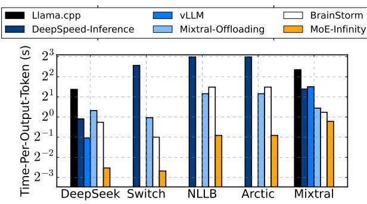
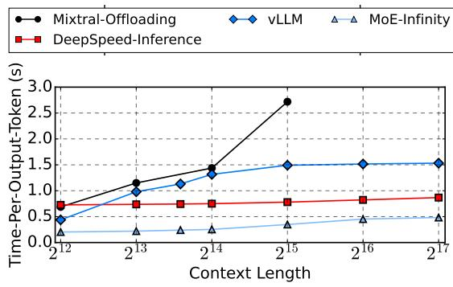
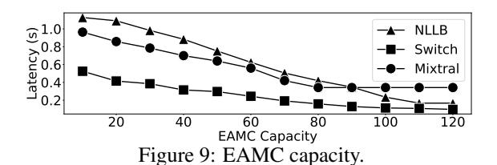

# 5. Evaluation

In the evaluation, we try to answer the following questions:

- Whether MOE-INFINITY achieves low latency under typical local deployment scenario?
- How MOE-INFINITY perform under long-context?
- Whether our prediction method is robust and efficient?

Models. We include popular open-sourced MoE models in our evaluations including Google Switch Transformers [\(Fedus et al.,](#page-8-14) [2021\)](#page-8-14) in the size of 30-100 GB depending on the configuration, DeepSeek-V2-Lite [\(DeepSeek-AI,](#page-8-1) [2024\)](#page-8-1) (31GB), Meta NLLB-MoE [\(Costa-jussa et al.](#page-8-15) ` , [2022\)](#page-8-15) (220GB), Mixtral-8x7B [\(Jiang et al.,](#page-8-0) [2024\)](#page-8-0) (120GB), and Snowflake-Arctic [\(Snowflake AI Research\)](#page-8-16) (900GB). For these models, we report their results with the following configurations if no further mentioned: DeepSeek-64x2.4B (denoted as DeepSeek), Switch-128x0.2B (denoted as Switch), NLLB-128x0.4B (denoted as NLLB), Arctic-128x4B (denoted as Arctic), and Mixtral-8x7B (denoted as Mixtral).

Datasets. We used a large variety of LLM tasks (290 tasks in total) contributed by three datasets to evaluate the perfor-

Figure 7: Decoding latency. vLLM and Llama.cpp does not support Switch, NLLB and Arctic, thus results are omitted.

mance and robustness of MOE-INFINITY. These datasets include BIGBench (166 tasks), FLAN (66 tasks), and MMLU (58 tasks). More specifically, these LLM tasks include reasoning, contextual question answering, free response, translation and many more.

Baselines. We evaluate MoE-Infinity against many SOTA baseline systems: (i) **DeepSpeed-Inference**, configured for optimized LLM inference (FastGen (Holmes et al., 2024)). DeepSpeed-Inference is the only mainstream LLM serving library that not only offers leading performance (comparable to vLLM and TensorRT-LLM) but also supports efficient offloading when GPU resources are limited. (ii) Llama.cpp (Ollama), a high-performance inference engine optimized for environments with restricted GPU availability. By default, Llama.cpp stores all model parameters in CPUs and offloads computations to GPUs using highly optimized memory copy and caching kernels. (iii) Mixtral-Offloading, specialized in offloading-efficient MoE model inference, implements optimized parameter prefetching and caching strategies tailored for these models. (iv) **BrainStorm\***, a leading dynamic neural network inference engine that implements model-level tracing to optimize operator scheduling, caching and prefetching. BrainStorm is not open-sourced and its design does not natively support MoE-based LLM tasks. We thus extended and implemented BrainStorm's model-level analysis in MoE-INFINITY.

**Hardware.** We show our experimental results with a single NVIDIA RTX A5000 GPU, connected to host memory via a dedicated PCIe 4.0 interface (32GB/s). We use 64GB memory for Switch, 256GB for NLLB, 32GB for DeepSeek, 128GB for Mixtral and 1TB for Arctic, as the model parameters need to be fully fitted into the Host memory.

#### 5.1. End-to-end experiments

We now assess the performance and benefits when putting MOE-INFINITY in action for serving MoE models.

**End-to-end performance.** We report the end-to-end performance of MoE-Infinity and baseline systems. Here, latency is reported as the time-per-output-token (decoding

latency). We report the performance with a prompt length of 512 and a decoding length of 32. The latency is reported as the average of all datasets.

Figure 7 reports the end-to-end performance. For Mixtral—our worst-case scenario due to its small number of large-sized experts per layer and relatively high activation ratio—MOE-INFINITY achieves a latency as low as 836ms. Across all offloading-supported baselines, MOE-INFINITY demonstrates latency performance comparable to Brain-Storm and Mixtral-Offloading, with a 1.4× improvement. In contrast, vLLM and DeepSpeed-Inference exhibit higher latency, primarily due to their low cache hit rate. For offloaded parameters, Llama.cpp computes on the CPU, further contributing to performance degradation.

For MoE models with more experts per layer and lower selective activation ratios, the performance gains of MoE-INFINITY become more significant. For Switch, NLLB and DeepSeek, MoE-INFINITY achieves the 155ms, 531ms and 155ms latency, both numbers comparable to those with the model running fully in GPU. This means significant GPU saving by MoE-INFINITY: achieving similar latency performance, MoE-INFINITY requires a single GPU while the non-offloading alternatives requires 8 GPUs for NLLB and 4 GPUs for Switch. Other offloading-supported systems, however, cannot provide such a promise. BrainStorm and DeepSpeed-Inference suffers from inaccurate prefetching, creating extra traffic on PCIe link that blocks the on-demand fetching when needed.

For Arctic, the largest MoE model with 900GB of parameters, the model is composed of small-sized experts. MoE-INFINITY becomes the only available serving system that can offer competitive inference performance with a single GPU, vastly surpassing other baseline systems.

Long context performance. We evaluate the decoding performance of MOE-INFINITY and baseline systems under longer generation lengths, ranging from  $2^{12}$  (4096) to  $2^{17}$  (131072) tokens. This scenario frequently occurs in chain-of-thought (CoT) test-time scaling process (Wei et al., 2022). The LongBench dataset is used to provide meaningful prompts, ensuring continuous generation until the maximum length is reached. DeepSeek supports a maximum context length of 32K; beyond this limit, we enforce generation even after encountering EOS tokens. We stop at  $2^{17}$  token since all systems OOMs.

Figure 8 reports the end-to-end performance. As the context length increases from  $2^{12}$  to  $2^{17}$ , total computation time rises from 50ms to 160ms. Additional latency stems from offloading mechanisms. Increasing the context length leads to a larger KV-cache size in GPU memory, which in turn reduces the available buffer size for caching experts.

For MoE-Infinity, the activated parameter size for

Figure 8: Decoding latency over long context. Using DeepSeek-V2-Lite with max context length 128K. We show top-4 systems in long context generation.

DeepSeek-V2-Lite is 3GB per decoding iteration. Before a context length of  $2^{15}$ , the buffer size remains above 3GB, leaving sufficient space for caching. However, as the context length increases, fewer experts can be cached—for example, at  $2^{16}$ , the buffer size shrinks to 2GB, and at  $2^{17}$ , it further decreases to 1GB—leading to performance degradation. Eventually, MOE-INFINITY resorts to on-demand fetching due to insufficient caching capacity. The on-demand fetching in MOE-INFINITY increases the latency by 137ms, being less than vLLM and Mixtral-Offloading. The reason is that MOE-INFINITY keeps all KV-cache in GPU memory, resulting in less fetching under long context.

As for vLLM, we observe that decoding latency increases more significantly as context length grows. vLLM also offloads KV-cache together with expert parameters, while the longer the context, the larger the KV-cache needs to be fetched to GPU at each layer. The KV-cache traffic causes contention with expert fetching, which delays and even blocks expert prefetching, leading to further performance degradation. DeepSpeed-Inference is more stable in latency as it experience constant blocking time due to expert prefetching by index.

#### 5.2. Micro-benchmark

Finally, we aim to evaluate the optimal parameter and robustness of the MOE-INFINITY activation tracer.

EAMC Capacity. Users of MoE-Infinity may wonder how to determine the best EAMC capacity. To explore this, we adjusted the EAMC capacity while serving various MoE models. Figure 9 presents the results. We observed that increasing the capacity from 1 to 120 allows all MoE models to achieve their lowest average latency. Our findings highlight two key points: (i) A suitably small EAMC capacity (3% of the total number of requests), even amidst a challenging mixed LLM inference workload involving 290 tasks from three datasets, is adequate for capturing most MoE activation patterns, thus efficiently supporting MoE-Infinity's prefetching and caching mechanisms, and

| Workload Setup             | NLLB    | Mixtral | Arctic   |
|----------------------------|---------|---------|----------|
| MMLU tasks                 | 0-14-43 | 0-9-49  | 28-43-45 |
| BIGBench tasks             | 1-15-49 | 0-11-49 | 0-29-42  |
| $MMLU \mapsto BIGBench$    | 0-6-17  | 0-27-42 | 2-28-41  |
| $BIGBench \mapsto MMLU \\$ | 3-11-24 | 0-35-46 | 5-27-45  |

Table 3: Handling workload changes. Numbers in each cell mean the minimum, mean and maximal numbers of requests required to recover low latency after a workload change.

(ii) The effectiveness of the EAMC capacity consistently manifests across different MoE models, indicating that the EAMC design can be generalized.

Robustness with workload changes. Addressing concerns about handling workload changes, we tested MoE-INFINITY's tracer with task shifts, and measured the minimum, average, and maximum number of requests needed to restore low latency. The responsiveness to workload changes is shown in Table 3. In the first experimental group, we randomly shifted between LLM tasks within the same dataset. Experiments showed that within the same dataset, models returned to optimal latency after around 50 requests. Each task has 1000 input sequence on average, recovery from task shift needs 5% requests in the worst case. When switching between datasets (e.g., MMLU to BigBench), models adapted faster, averaging 30 requests for latency recovery. Each dataset samples 50K inputs, recovery from dataset shift needs less than 0.1% requests on average. This quicker adaptation is due to the reuse of activation patterns across similar tasks shared by these datasets, as highlighted in our trace study.

### 6. Conclusions

MOE-INFINITY is the first system to enable personal machines to achieve competitive performance when running large MoE models, such as the popular DeepSeek. Its key design, a sparsity-aware expert cache, has been extensively evaluated across various MoE models and LLM tasks, demonstrating 2.7–13.7× performance improvements over strong baselines. We anticipate that MoE-Infinity will make it easier and more efficient for AI developers to deploy local MoE-based inference services. Additionally, its open-source nature is expected to drive rapid adoption and further innovation.

