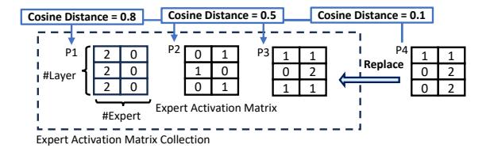

# B. Practical Concerns

### B.1. Predictor Runtime Efficiency

We design EAMC to have fixed capacity, thereby limiting both memory costs and the time required to find a matching EAM. When the EAMC reaches its capacity, it necessitates the replacement of an entry within the collection. Our replacement strategy is guided by two main objectives: first, to record the most recent EAM, thereby quickly adapting to changes in workload; second, to maintain diversity within the recorded EAMs. Consequently, we opt to replace an EAM that is most similar to the incoming one. To implement this, we compare the new EAM against all existing ones in the EAMC, replacing the one that shows the shortest cosine distance. We illustrate the EAMC replacement process in Figure [10.](#page-10-0) Here, consider that the EAMC capacity is 3. Upon a new prompt P4 finished its trace, we compute the cosine distance between the EAM4 with all EAMs in the EAMC. The distances show that EAM4 is similar to EAM3, and we thus evict EAM3 and accommodate the EAM4.

Runtime overhead. The capacity of an EAMC must be appropriately small, as a large capacity can impede its practicality. MoE models benefit from a modest EAMC capacity for two main reasons: (i) After pre-training, MoE routers are optimized to create specialized expert groups for token processing, limiting the number of groups to ensure efficient

Figure 10: EAMC replacement example.

token dispatching and high accuracy, a characteristic underscored by leading research (Jiang et al., 2024; Team, 2024). (ii) Our evaluations in Section 5.2 indicate that a modest EAMC capacity, from hundreds to thousands, suffices for various LLM tasks and adapts well to task shifts, with the added advantage of negligible matching costs compared to model decoding latency. Searching for the most similar EAM is essentially a matrix multiplication on CPU (Douze et al., 2024). We measured the cost to be 21us per query under 1K EAMs and 226us for 10K EAMs. The frequency of the query is at most once per MoE layer for each (batched) input. Both memory and computation overhead are less than 1% of the model inference latency (typically >120ms per token).

**Capacity bound.** To analyse the upper bound of the number of cluster needed for a given cut-off distance under diverse inference requests, we formulate the EAMC construction as a sphere covering problem on the cosine distance, with each EAM as a vector in the space. In such a sphere space, arbitrary EAM can be projected to a point on the sphere, as under cosine distance, the EAM is normalized to unit vector. If we can find the minimal amount of the cluster that covers all area of the sphere, then the centroids of the clusters can be the representative EAMs for any given sequence. Theorems (Rankin, 1947; Dumer, 2007) shows that total number of cluster needed to cover the expert activation patterns is finite and polynomial complexity regarding the number of experts. In detail, this guarantees a lower bound of 75% cosine similarity by using 2LE EAMs and lower bound of 98% cosine similarity by using  $\frac{1}{2}LE \ln(LE)$  EAMs. We observe that E of SOTA MoE models ranges from 8 to 128 and L ranges from 24 to 64 (Fedus et al., 2021; Jiang et al., 2024), leading to 40K EAMs with 160MB memory.

Runtime optimizations. The high computational complexity of the clustering algorithm makes this enhancement difficult to deploy. Consider the case of serving Arctic-128x4B for the FLAN dataset (which includes 66 LLM tasks). The clustering algorithm needs to handle over 1 million EAMs, each forming a 4480-dimensional vector (the flattened EAM). To our knowledge, no existing clustering libraries (e.g., FAISS (Douze et al., 2024)) can efficiently handle this workload. Hence, we adhered to the above simple but effective design for EAMC and left its enhancement with clustering algorithms for future work.

#### **B.2. System Implementation**

Support multiple GPUs. We implement expert parallelism to support the use of multiple GPUs on a server. Concretely, we use a hashing function to assign the experts to different GPUs based on their IDs. All experts are kept in the host DRAM. While executing the MoE layers by layers, we use this hashing function to know which GPU is going to accommodate an expert needed for prefetching or execution. When the GPU is spread across multiple NUMA nodes, we will pre-partition the experts based on NUMA nodes, ensuring that these experts are only assigned to the GPUs in the designated NUMA node.

For each GPU, we create an independent I/O thread to manage the prefetching and caching. This thread uses pinned memory and DMA operations to optimize data transfers between the GPU and host DRAM, and a single thread is sufficient to saturate the bandwidth provided by PCIe 4.0 (32GB/s). For higher PCIe versions, we support creating multiple such threads per GPU.

For now, most open-source MoE models can be fitted into the host memory (up to 1TB) of a commodity multi-GPU server. We leave the multi-server support for future work.

**Memory management.** Given a MoE checkpoint, we keep its dense parts within the GPUs and turn on the offloading for its experts. This design is sufficient since the proportion of the experts' parameters comprising of 90-99% of the total parameters. For initializing the kv-cache, we will reserve the amount of GPU memory in corresponding to the maximal output length we observed in the open LLM datasets.

**Inference runtime integration.** We have integrated the above prefetching and caching mechanisms into PyTorch and support numerous kernel optimization, such as FlashAttention. Our current inference runtime supports checkpoints in PyTorch formats and HuggingFace formats.

**Failure recovery.** MOE-INFINITY can checkpoint its EAMC together with the MoE checkpoints. Once recovered from the failure, it reloads the EAMC to efficiently resume its prefetching and caching performance.