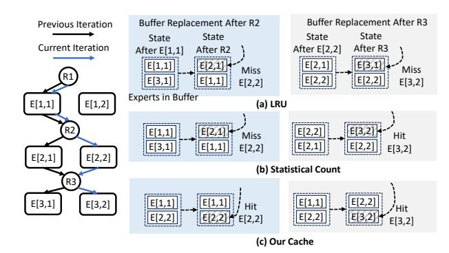

# <span id="page-4-1"></span>4.5. Request-level sparse activation tracing

We thus must trace the sparse activation of experts at the request level and our tracing must reflect the entire group of experts. For this purpose, we have designed a novel data structure termed the *Expert Activation Matrix Collection* (EAMC), which acts as a trace for keeping historical request-level EAMs online. As the system has processed an incoming request, it compares the request-level EAM with those recently stored in the EAMC. A matching prior EAM can then facilitate more effective prefetching and caching decisions by the serving system. To determine if two EAMs match, we use the following method: each EAM is flattened into a vector, and the cosine distance between these vectors is calculated. Within the EAMC, the most closely matching prior EAM to a current EAM is the one with the smallest cosine distance. The distance measure considers the follow-

ing: (i) need for the relative frequency of expert activation as sequences has varying length and number of iterations are indeterministic, and (ii) need to handle sparse vectors as expert activations are sparse and skewed, also matching experts with high activation frequency is beneficial than ones with low frequency.

Given the EAM collection, we define the activation likelihood computation as *PredictEAM*, by giving an EAMC and iEAM. We illustrate its computation process in Figure 5. We revisit the MoE model from Figure 1. After R2 finishes dispatching the token to E[2,1], we need to initiate an online prediction. For this, MoE-INFINITY utilizes iEAM that traces the numbers of tokens passing through different experts in the current iteration. This iEAM is matched with prior EAMs in the EAMC (shown in 1). Several matched EAMs might be returned. In such a case, we aggregate them and compute activation probability for each expert possibly to activate (shown in **2**). In this aggregation step, formally, the cell of each matched EAM is summed up and normalized on each row. To ensure future experts in proximity to the current layers can be prioritized, the layer proximity step (shown in 3) adjusts the value in each cell through the formula (1-(i-l)/L), where l is the current layer ID and i is the future layer ID.

### 4.6. Cache optimizations

We implement several key optimizations for the expert cache:

Enhancing the cache with prefetching. To further improve performance, we integrate prefetching into the expert cache mechanism. Given the sequential nature of MoE model execution, where layers are processed in order, we can leverage the pEAM to predict the experts that are likely to be activated for the next layer. By prefetching experts into the cache, we reduce the likelihood of GPU stalls caused by on-demand expert fetching.

#### Enhancing the cache with expert location information.

When deciding which expert to replace, we also consider the observation that: the initial layers of MoE models, which typically benefit less from prefetching due to less confident prediction of the group activation pattern at the start. By assigning higher caching priorities to experts in these initial layers, we not only counteract potential prefetching failures but also exploit the layer-by-layer execution property of MoE models: the subsequent layers are executed later and they are more likely to benefit from prefetching and thus less need caching.

### 4.7. Sparsity-aware expert cache algorithm

Finally, we can formally define the algorithm that realizes the sparsity-aware expert cache. Algorithm 1 presents the

### <span id="page-5-0"></span>Algorithm 1 Expert Cache Retrieval

Require: cur EAM – Current iteration-level EAM, id – Requested expert ID, eamc – List of historical rEAMs, cache – Dictionary storing cached experts, cache size – Maximum allowed cache size, m – Model instance with L layers.

Output: expert – Retrieved expert instance.

```
1: if id ∈ cache then
 2: return cache[id]
 3: end if
 4: if |cache| < cache size then
 5: cache[id] ← FetchOnDemand(id)
 6: return cache[id] {Cache not full}
 7: end if
 8: p eam ← PredictEAM(eam, cur EAM)
 9: evict expert ← None, p min ← ∞
10: for id, e in cache do
11: n token ←
                 Pp eam[e.layer idx]
12: p ←
          (p eam[e.layer idx]+ϵ)·(1−
                                e.layer idx
                                  L
                                      )
                      n token
13: if p < p min then
14: p min ← p, evict expert ← e
15: end if
16: end for
17: delete cache[evict expert.id]
18: cache[id] ← FetchOnDemand(id)
19: return cache[id]
```

expert cache retrieval procedure. We collaborate expert cache with on-demand fetching for a conventional cache put procedure (steps 1-7). When the cache reaches its maximum capacity, an eviction mechanism is triggered to replace the least relevant expert using prediction. The intuition is to find the expert that has the least likelihood to be reused in future iterations. As shown in Section [4.5,](#page-4-1) we compute the likelihood for each expert by identifying the most similar historical EAM (steps 8). The expert matched guarantees similar overall activation pattern. We then computes a priority score, with layer decay taken into account (steps 9-16). As expert from all layers needs to be considered, the decay starts from the first layer. Finally, The expert with the lowest priority is removed from the cache, making space for the new expert that is fetched on demand, added to cache and returned. (steps 17-19). The prefetching mechanism can be integrated into the FetchOnDemand function. We omit the detailed implementation here for brevity.

We also provide an example to understand how sparsityawareness helps make better cache performance than conventional LRU (implemented in most inference systems, such as vLLM and Llama.cpp) and statistical counting approaches such as BrainStorm, as depicted in Figure [6.](#page-5-1) In the second decoding iteration, an MoE model completes the first layer and proceeds to the second. Once a token is dispatched to E[2, 1], Augmenting dependency-based

<span id="page-5-1"></span>

Figure 6: Example of integrating caching with prefetching. LRU is the most commonly implemented technique in SOTA systems such as vLLM, Llama.cpp, DeepSpeed and Statistical Count is implemented in BrainStorm.

prefetching with an LRU cache, as in DeepSpeed-Inference, prefetching E[2, 1] evicts E[3, 1], leading to a buffer miss when tokens route to E[2, 2] (see (a) left). For statistical counting approaches, as in BrainStorm, uniform activation means E[1, 1] could route to E[2, 1] or E[2, 2], resulting in a buffer miss (see (b) left). Our method, using a request-level EAM[[1, 2], [0, 3], [0, 3]], keeps E[2, 2] from eviction, ensuring a cache hit and better latency (see (c) left). When the token enters layer 3, LRU method misses E[3, 2], causing a buffer miss (see (a) right). Statistical counting method identifies and prefetches the layer 3 expert but risks future misses by evicting E[2, 2] (see (b) right). Our strategy accurately predicts and retains E[2, 2] and prefetches preventing its eviction and optimizing cache prioritization (see (c) right).

