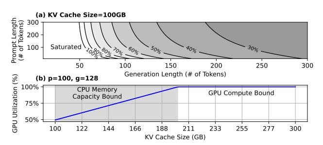

# 5.2 Stage 1 Model: Parallelism-Memory Efficiency Analysis

While CPU memory capacity constrains the number of tokens that can be processed in parallel, the memory footprint per token varies across stages of inference. During the prefill stage, all tokens in the prompt can be processed simultaneously, effectively amortizing the memory cost across multiple token computations. In contrast, the decode stage operates autoregressively: each sequence's KV cache enables computing only a single token at a time. Consequently, prefill tokens offer higher memory efficiency compared to decode tokens, in terms of parallel computation per unit of memory. This leads to: what is the theoretical upper bound on system throughput for a batch of requests with varying prompt and generation lengths, under a fixed hardware configuration?

We introduce *Parallelism-Memory Efficiency (PME)*, a metric quantifying how effectively a sequence translates memory capacity into the number of tokens that can be processed in parallel to saturate GPU resources. The *PME* for a sequence *s* with prompt

Figure 3: Visualization of the maximum GPU utilization  $\frac{T_{max}}{T_{GPU}}$ . (a) Maximum GPU utilization when running Mixtral8x7B on A40 with 100GB KV cache. (b) For the same model and GPU, the maximum GPU utilization when p = 100 and q = 128.

length p and generation length q is

PME = 
$$\frac{\sum_{\text{gen. steps}} \text{Parallel Tokens}}{\sum_{\text{gen. steps}} \text{Sequence KV Cache Size}}$$
$$= \frac{p+g}{\sum_{j=0}^{g} (p+j)} = \frac{2(p+g)}{(2p+g)g}$$
(3)

Here, the denominator is the sum of the memory capacity a sequence occupies across its entire generation lifetime. We further define the time to transfer the weight of a model from CPU to GPU as  $\delta = \frac{\text{Model Size}}{B_{IO}}$ . For a batch of sequences with average prefill length p and generation length g, its theoretical maximum inference throughput (tokens/sec) can be estimated as:

$$T_{max} = min(\frac{\text{PME} \cdot M}{\delta}, T_{GPU}),$$
 (4)

where M is the size of KV cache in number of tokens, and  $T_{GPU}$  is the maximum throughput of a GPU in number of tokens per second. Figure 3(a) illustrates how the theoretical maximum GPU utilization varies with prompt length (p) and generation length (g) under a 100GB KV cache budget. Longer sequences lead to lower theoretical GPU utilization, while a higher prompt-to-generation ratio improves utilization for a given sequence length. Figure 3(b) presents a roofline model of theoretical GPU utilization. As KV cache capacity increases, the system transitions from a CPU memory capacity-bound regime to a GPU-bound regime. In the memory-bound regime, limited CPU memory constrains the number of parallel sequences, leading to underutilized GPU compute and throughput that scales with available KV cache. Once the system becomes GPU-bound, the GPU is fully saturated, and further increases in KV cache capacity yield diminishing returns in performance.

**Takeaway:** Prompt and generation length jointly determine the theoretical upper bound on achievable GPU utilization.

