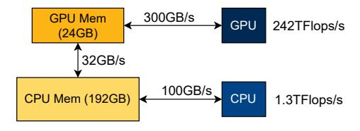
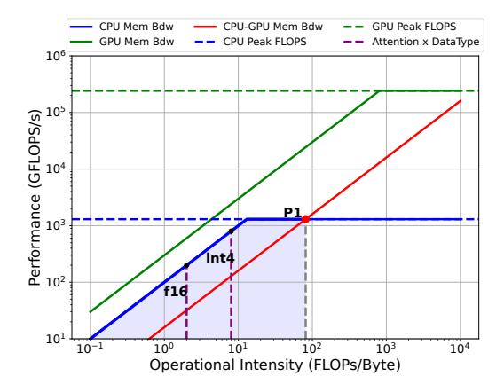

# • Memory Roof from level *j* to *i*:

$$P_x^i \le B_{\text{peak}}^{j,i} \times I_x^j \tag{6}$$

Therefore, if computation x is executed on level i, data from level j needs to be fetched, and the peak performance will be bounded by the three roofs listed above (Eqs. (4)–(6)):

$$P_x^i = \min(P_{\text{peak}}^i, B_{\text{peak}}^i \times I_x^i, B_{\text{peak}}^{j,i} \times I_x^j)$$
 (7)

If operator x is executed on level i without fetching data from other levels, it reduces to the traditional roofline model and can achieve:

$$P_x^i = \min(P_{\text{peak}}^i, B_{\text{peak}}^i \times I_x^i) \tag{8}$$

Turning Points. Intuitively, our HRM introduces more memory roofs that consider cross-level memory bandwidth and compute roofs for diverse processors. This results in more "turning points" than in the original Roofline Model, which define various performance regions where different resources are the bottleneck. Analyzing these turning points is crucial for understanding the performance upper bound of an application under different hardware setups and computational characteristics.

For example, consider a computation task x that has data stored on level j, according to Eq. (6) and Eq. (8), when  $P_x^j = \min(P_{\text{peak}}^j, B_{\text{peak}}^j \times I_x^j) \geq B_{\text{peak}}^{j,i} \times I_x^j$ , we have  $P_x^i \leq B_{\text{peak}}^{j,i} \times I_x^j \leq P_x^j$ . Therefore, the first turning point  $P_1$  is at:

$$\bar{I}_x^j = \frac{\min(P_{\text{peak}}^j, B_{\text{peak}}^j \times I_x^j)}{B_{\text{peak}}^{j,i}} \tag{9}$$

This gives the critical operational intensity  $\bar{I}_{x}^{j}$ , indicating the threshold below which it is not beneficial to transfer data from level j to i for computation for x.

Now if we continue increasing  $I_x^j$  such that  $P_x^j < B_{\text{peak}}^{j,i} \times I_x^j \leq \min(P_{\text{peak}}^i, B_{\text{peak}}^i \times I_x^i)$ , then we obtain another turning point  $P_2$ :

$$\bar{I}_x^j = \frac{\min(P_{\text{peak}}^i, B_{\text{peak}}^i \times I_x^i)}{B_{\text{peak}}^{j,i}}$$
(10)

which denotes the critical operational intensity  $\bar{I}_x^j$  below which computation x is bounded by the memory bandwidth from memory at level i to memory at level i.

In this paper we assume when  $i < j, P_{\text{peak}}^i \ge P_{\text{peak}}^j$  and  $B_{\text{peak}}^i \ge B_{\text{peak}}^j$ 

**Balance Point.** Further, if  $B_{\text{peak}}^i \times I_x^i < B_{\text{peak}}^{j,i} \times I_x^j < P_{\text{peak}}^i$ , indicating that the computation x on level i is memory-bound (refer to Eq. (3)). In this situation, further increasing  $I_x^j$  cannot improve the system's performance. Instead, we need to increase  $I_x^i$ , and a balance point will be reached if:

$$B_{\text{peak}}^{i} \times I_{x}^{i} = B_{\text{peak}}^{j,i} \times I_{x}^{j} \tag{11}$$

Our performance model and policy optimizer (see §4.2) are designed to find the maximum balance point under the device memory constraints.

**Figure 3.** Hardware Configurations for the L4 Instance.

#### 3.3 Case Study

To visualize the turning points and balance points discussed in the preceding sections, we conduct a case study with real HRM plots for computations2 in a single layer of the Mixtral 8x7B model on a Google Cloud Platform L4 instance. The hardware setting is as detailed in Fig. 3. Specifically, we let levels i and j represent GPU and CPU, respectively. Then, we define the following:

**Definition 3.2** (Batch Size *N*). Batch size is the total number of tokens processed by one pass of the whole model.

**Definition 3.3** (Micro-Batch Size  $\mu$ ). Since GPU memory is limited, a batch of size N often needs to be split into several micro-batches of size  $\mu$  to be processed by a single kernel execution on GPU.

**Figure 4.** Hierarchical Roofline Model for Mixtral 8x7B's Grouped Query Attention Block in Decode Stage on L4 Instance. (Context Length = 512)

Attention Block. Fig. 4 demonstrates the HRM plot for Mixtral 8x7B's attention computation3 assuming all the KV cache are stored on CPU4. On the plot, we have horizontal lines as the compute roofs defined by CPU and GPU peak performance. There are also the memory roofs defined by CPU memory bandwidth, GPU memory bandwidth, and CPU to GPU memory bandwidth, respectively. We then draw vertical lines representing different operational intensities for the attention computation with different KV cache data types. Theoretically, attention's operational intensity is independent of the batch size since its flops and bytes are proportional to batch size. To increase the attention computation's operational intensity, we need methods such as quantization [30, 38], Grouped Query Attention (GQA) [2], or sparse attention [9]. All these methods try to reduce the memory access needed by performing the attention computation, and GQA is used by most of the existing MoE models; however, as denoted in the plot, for both float16 and int45 the operational intensity is quite low and is smaller than  $P_1$ 's corresponding operational intensity, which suggests it may be better to perform attention on CPU.

**MoE Feed-Forward Network (FFN).** Fig. 5 is an HRM plot for Mixtral 8x7B's MoE Feed-Forward module on the L4 instance. The orange line represents the MoE FFN kernel performance achieved at a micro-batch size of 128. Vertical lines intersecting with CPU roofs and CPU-GPU memory roofs represent different batch sizes. FFN's operational intensity will increase as batch size or micro-batch size increases since, intuitively, a larger batch size means more computation per weight access. As shown in the plot, suppose the computation kernel for the MoE FFN can run at a maximum  $\mu = 128$ , we can identify the turning point in Eq. (10) to be  $P_2$  and the turning point in Eq. (9) to be  $P_1$ .

When I is less than  $P_1$ 's corresponding I, there is no benefit in swapping the data to GPU for computation since it will be bounded by the memory roof from CPU to GPU. This is normally the case for many latency-oriented applications where users may only have one or two prompts to be processed. In such scenarios, it is more beneficial to have a static weights placement strategy (e.g., putting m out of n layers on GPU) and perform the computation where the data is located instead of swapping the weights back and forth.

Next, we show the peak performance will be finally reached at a balance point (Eq. (11)). When I is less than  $P_2$ 's corresponding I, the computation is bounded by the CPU to GPU memory bandwidth, and it cannot achieve the performance at  $P_2$ . Depending on whether there is enough CPU memory to hold a larger batch, we can either increase the batch size or put some of the weights on the GPU statically since both

&lt;sup>2We only discuss the attention and feed-forward blocks since they account for the majority of computation time and represent quite different computation characteristics.

 $^3\mathrm{Not}$  including QKVO projection.

 $^4$ For analysis purposes, we use the calculated theoretical operational intensity instead of numbers from real profiling

&lt;sup>5The computation is still done in float32.

**Figure 5.** Hierarchical Roofline Model for Mixtral 8x7B's MoE Feed-Forward Block in Decode Stage on L4 Instance.

strategies can increase the operational intensity for the MoE FFN computation regarding the data on the CPU.

If the batch size can be continually increased, then when I equals  $P_2$ 's corresponding I, the maximum performance that can be achieved is bounded by the operator's operational intensity on GPU, which is dependent on the  $\mu$  for the MoE FFN kernels. Then, there is no need to increase N anymore, and the maximum performance reached at a balance point equals  $P_2$ . On the other hand, if we put more weights onto GPU,  $\mu$  will decrease since larger  $\mu$  will result in higher peak memory consumption. The maximum performance will be achieved at a balance point smaller than  $P_2$ .

In conclusion, to achieve high throughput for batched MoE inference, we hope to place computations on proper computing devices and find the best combination of N and  $\mu$  so that we can fully utilize all the system's components.

