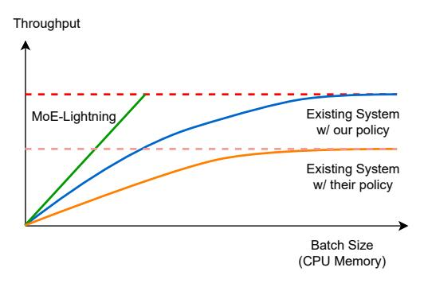

# 1 Introduction

Mixture of Experts (MoE) [\[10,](#page-13-0) [22,](#page-13-1) [41,](#page-14-0) [46\]](#page-14-1) is a paradigm shift in the architecture of Large Language Models (LLMs) that leverages sparsely-activated expert sub-networks to enhance model performance without significantly increasing the number of operations required for inference. Unlike dense models [\[40,](#page-13-2) [47,](#page-14-2) [53\]](#page-14-3), where all model parameters are activated for

each input, MoE models activate only a subset of experts, thereby improving computational efficiency.

While the MoE models achieve strong performance in many tasks [\[10,](#page-13-0) [22\]](#page-13-1), unfortunately, their deployment is challenging due to the significantly increased memory demand for the same number of active parameters. For example, the Mixtral 8x22B model [\[32\]](#page-13-3) requires over 256 GB of memory for the parameters of the expert feed-forward network (FFN), which is 4 − 5× higher than the memory requirements of dense models that require similar FLOPs for inference.

In this paper, we study how to achieve high-throughput MoE inference with limited GPU memory. We are focusing on off-line, batch-processing workloads such as model evaluation [\[29\]](#page-13-4), synthetic data generation [\[14\]](#page-13-5), data wrangling [\[33\]](#page-13-6), form processing [\[7\]](#page-13-7), and LLM for relational analytics [\[31\]](#page-13-8) where higher inference throughput translates into lower total completion time.

The common approach for memory-constrained batch inference is to offload model weights [\[4,](#page-12-0) [19\]](#page-13-9) and key-value tensors of earlier tokens (KV cache) [\[42\]](#page-14-4) — which are needed for generating the next token – to CPU memory or disk. Then, they are loaded layer-by-layer to the GPU for computation.

Unfortunately, existing solutions fall short of effectively overlapping computations with data transfers between CPU and GPU. For instance, the GPU may remain idle as it awaits a small yet crucial piece of data such as intermediate results for the upcoming batch. At the same time, transferring the weights for subsequent layers may take a long time and potentially block both the GPU and CPU from processing further tasks, leading to under-utilization of all the resources.

As a result, efficient MoE inference for throughput-oriented workloads using limited GPU memory remains challenging. We find that increasing I/O utilization and other resource utilization is critical in achieving high throughput. For example,

Figure 1. MoE-Lightning achieves higher throughput with far less CPU memory, enabled by CGOPipe and HRM.

Fig. [1](#page-1-0) illustrates the relationship between CPU memory and achievable token generation throughput for different systems with fixed GPU memory (less than the model size) and CPU-to-GPU memory bandwidth. When a layer's weights are loaded onto the GPU, a common strategy to increase throughput is to process as many requests as possible to amortize the I/O overhead of weights' transfer [\[42\]](#page-14-4). However, this increases CPU memory usage as additional space is required to store the KV cache for all requests. Consequently, lower I/O utilization means higher I/O overhead of weights' transfer, requiring greater CPU memory to reach peak generation performance; otherwise, the GPU will be under-utilized as suggested by the blue line in Fig. [1.](#page-1-0)

While improving resource utilization is crucial for achieving high-throughput inference with limited GPU memory, achieving this raises several challenges. First, we need to effectively schedule the computation tasks running on CPU and GPU, together with the transfers of various inputs (e.g., experts weights, hidden states, and KV cache), such that to avoid computation tasks waiting for transfers or the other way around. Second, as indicated by the orange line in Fig. [1,](#page-1-0) the existing solutions [\[42\]](#page-14-4) tend to generate sub-optimal policies with smaller GPU batch sizes which lead to resource under-utilization. Fundamentally, these solutions fail to take into account that changes in the workload can lead to changes in the bottleneck resource.

To address these two challenges, we developed a new inference system, MoE-Lightning, which consists of two new components. The first component is CGOPipe, a pipeline scheduling strategy that overlaps GPU computation, CPU computation and various I/O events efficiently so that computation is not blocked by I/O events and different I/O events won't block each other. This way, CGOPipe can significantly improve the system utilization. The second component is Hierarchical Roofline Model (HRM) which accurately models how different components in an inference system interact and affect application performance under various operational conditions.

In summary, this paper makes the following contributions:

- CGOPipe, a pipeline scheduling strategy that efficiently schedules various I/O events and overlaps CPU and GPU computation with I/O events. By deploying weights paging, CGOPipe reduces pipeline bubbles, significantly enhancing throughput and I/O efficiency compared with existing systems [\(§4.1\)](#page-5-0).
- HRM, a general performance model for LLM inference which extends the Roofline Model [\[48\]](#page-14-5). HRM can easily support different models, hardware, and workloads, and has near-zero overhead in real deployments, without the need for extensive data fitting (might take hours or days) as needed in FlexGen [\(§4.2\)](#page-6-0).
- An in-depth performance analysis for MoE models based on our extended HRM which identifies various performance regions where specific resource becomes the bottleneck [\(§3\)](#page-2-0).

We evaluate MoE-Lightning on various recent popular MoE models (e.g., Mixtral 8x7b, Mixtral 8x22B, and DBRX) on different hardware settings (e.g., L4, T4, 2xT4, and 4xT4 GPUs) using three real workloads. When compared to the best of the existing systems, MoE-Lightning can improve the generation throughput by up to 10.3× (without request padding) and 3.5× (with request padding) on a single GPU. When Tensor-parallelism is enabled, MoE-Lightning demonstrates super-linear scaling in generation throughput [\(§5\)](#page-7-0).

