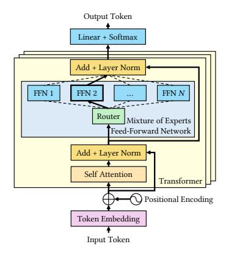

# 2 Background

## 2.1 Mixture of Experts

Large Language Models (LLMs) have significantly improved in performance due to the advancements in architecture and scalable training methods. In particular, Mixture of Experts (MoE) models have shown remarkable improvements in model capacity, training time, and model quality [\[10,](#page-13-0) [13,](#page-13-10) [22,](#page-13-1) [27,](#page-13-11) [41,](#page-14-0) [46\]](#page-14-1), revitalizing an idea that dates back to the early 1990s [\[21,](#page-13-12) [23\]](#page-13-13) where ensembles of specialized models are used in conjunction with a gating mechanism to dynamically select the appropriate "expert" for a given task.

The key idea behind MoE is a gating function that routes inputs to specific experts within a larger neural network. Each expert is specialized in handling particular types of inputs. The gating function selects only a subset of experts to process an input, which allows LLMs to scale the number of parameters without increasing inference operations.

MoE models adopt a conventional LLM architecture, which uses learned embeddings for tokens and stacked transformer layers. MoE LLMs typically modify the Feed-Forward Network (FFN) within a transformer layer by adding a gating network that selects expert FFNs, usually implemented as multi-layer perceptrons, to process the input token [\[6,](#page-12-1) [13,](#page-13-10) [57\]](#page-14-6). These designs can surpass traditional dense models [\[8,](#page-13-14) [10,](#page-13-0) [22\]](#page-13-1) in effectiveness while being more parameter-efficient and cost-effective during training and inference.

**Figure 2.** Architecture of a Mixture of Experts in Large Language Models.

Despite their advantages, the widespread use of MoE models faces challenges due to the difficulties in managing and deploying models with extremely high parameter counts that demand substantial memory. Thus, our work aims to make MoE models more accessible to those lacking extensive high-end GPU resources.

#### 2.2 LLM Inference

LLMs are trained to predict the conditional probability distribution for the next token,  $P(x_{n+1} | x_1, ..., x_n)$ , given a list of input tokens  $(x_1, \ldots, x_n)$ . When deployed as a service, the LLM takes in a list of tokens from a user request and generates an output sequence  $(x_{n+1}, \ldots, x_{n+T})$ . The generation process involves sequentially evaluating the probability and sampling the token at each position for *T* iterations. The stage where the model generates the first token  $x_{n+1}$  given the initial list of tokens  $(x_1, \ldots, x_n)$ , is defined as the *prefill* stage. In the prefill stage, at each layer, the input hidden states to the attention block will be projected into the query, key, and value vectors. The key and value vectors will be stored in the KV cache. Following the prefill stage is the decode stage, where the model generates the remaining tokens  $(x_{n+2}, \ldots, x_{n+T})$  sequentially. When generating token  $x_{n+2}$ , all the KV cache of the previous tokens  $(x_1, \ldots, x_{n+1})$  will be needed, and the token  $x_{n+2}$ 's key and value at each layer will be appended to the KV cache.

The auto-regressive nature of LLM generation, where tokens are generated sequentially, can lead to sub-optimal device utilization and decreased serving throughput [37]. Batching is a critical strategy for improving GPU utilization: [51] proposed continuous batching which increases the serving throughput by orders of magnitude. Numerous studies have developed methods to tackle associated challenges such as memory fragmentation [26] and the heavy memory pressure imposed by the KV cache [17, 24, 42]. The scenario of limited GPU memory introduces further challenges, especially for large MoE models, as it requires transferring large amounts of data between the GPU and CPU for various computational tasks with distinct characteristics. Naive scheduling of the computation task and data transfer can result in poor resource utilization. This paper explores how each resource in a heterogeneous system affects LLM inference performance and proposes efficient scheduling strategies and system optimizations to enhance resource utilization.

