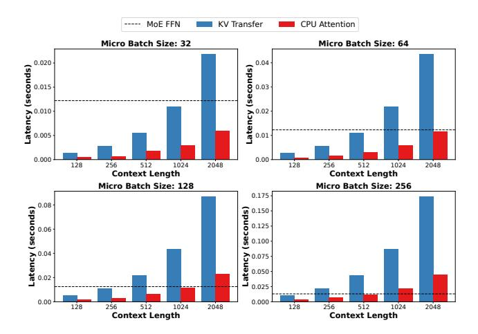

# 6.2 CPU Attention vs. Experts FFN vs. KV Transfer

In this section, we study when CPU attention will become the bottleneck in the decode stage. For different batch sizes (from 32 to 256), we test the latency of the MoE FFN kernel on L4 GPU and compare it with the latency of the CPU attention kernel on a 24-core Intel(R) Xeon(R) CPU @ 2.20GHz with various context lengths (from 128 to 2048). Additionally, we also measure the latency for swapping the KV cache needed for the attention from CPU pinned memory to GPU to validate the efficiency of our CPU GQA kernel.

As shown in Fig. 9, our CPU attention kernel is  $3-4\times$  faster than KV cache transfer, which is close to the ratio of CPU memory bandwidth and the CPU to GPU memory bandwidth. The MoE FFN's latency doesn't change so much across different micro batch sizes, which is as expected since the kernel is memory-bound for the decode stage. As the micro-batch size and context length increase, the CPU attention will eventually become the bottleneck, which calls for higher CPU memory bandwidth.

#### 6.3 Case Study on Different Hardware Settings

In this section, we study how the best policy changes under different hardware settings. As we have shown in the previous ablation study, CPU attention can actually become the bottleneck for large batch size and context length, which means if we have more powerful GPUs, at some point, CPU attention may not be worth it. Moreover, if we have higher

**Figure 9.** Latency Comparison for a single layer's KV cache transfer, CPU Attention Kernel and the MoE FFN Kernel wrt.  $\mu$  and Context Length in Decode Stage.

CPU to GPU memory bandwidth, the trade-offs will also change. Then the question becomes: when we have enough GPU memory (e.g., 2xA100-80G) to hold the model weights (e.g., Mixtral 8x7B), is it still beneficial to perform CPU computation or to offload weights/KV cache to the CPU? To conduct the analysis, we use 2xA100-80G for the GPU specification and vary the CPU to GPU memory bandwidth from 100 to 500 GB/s alongside different CPU capabilities. We set base CPU specifications at  $m_c = 200$ GB/s,  $b_c = 100$ GB, and  $p_c = 1.6$ TFLOPS/s, scaling these values by multiplying with the CPU scaling ratio for various configurations  $^{10}$ .

**Figure 10.** Policy changes with different hardware configurations (prompt length=512, generation length=32). Red points denote performing attention on the CPU.

We can see that when running Mixtral 8x7B on two A100 GPUs, as CPU-to-GPU memory bandwidth increases, more weight will be offloaded to the CPU. KV cache offloading is highly related to the CPU scaling ratio in this setup: when the

&lt;sup>10Note that this setup doesn't reflect real-world hardware scaling; rather, it simplifies the number of variables to offer a rough idea of how these hardware configurations might impact performance.

CPU scaling ratio is low (i.e., low CPU memory bandwidth), even with the highest CPU to GPU memory bandwidth tested here, it is not beneficial to offload KV cache.

#### 7 Related Work

Memory-constriant LLM Inference LLM inference requires substantial memory to store model parameters and computation outputs, making it typically memory capacity-bound. There is a line of research dedicated to memory-constraint LLM inference. This is particularly crucial for inference hardware such as desktop computers, or low-end cloud instances with limited computational power and memory capacity. To facilitate inference on such constrained systems, some work leverages sparsity or neuro activation patterns to intelligent offloading between CPU and GPU [15, 42, 43, 50]. Some approaches utilize not only DRAM but also flash memory to expand the available memory resources [3]. Additionally, since the CPU often remains underutilized during inference, it can be harnessed to perform complementary computations [25, 43, 49].

**LLM Inference Throughput Optimization** To enhance inference throughput, some research focuses on maximizing the sharing of computations between sequences to minimize redundant processing of identical tokens [24, 56]. Another approach involves batching requests [51] to optimize hardware utilization. Additionally, some studies develop paged memory methods for managing the key-value (KV) cache to reduce memory waste, thereby increasing the effective batch size and further improving throughput [26]. FastDecode [17] proposes aggregating memory and computing power of CPUs across multiple nodes to process the attention part to boost GPU throughput. Compared with FastDecode, we are targeting the memory-constrained case where the model weights also need to be transferred between CPU and GPU, making the optimization and scheduling problem far more challenging.

**LLM Inference Latency Optimization** To reduce LLM inference latency, some work addresses the inherent slowness caused by the autoregressive nature of LLM inference by developing fast decoding methods, such as speculative decoding [5, 28, 44] and parallel decoding [39], which generate multiple tokens simultaneously. Another approach aims to decrease inference latency by implementing efficient computational kernels [1, 11, 12] designed to minimize memory access and maximize GPU utilization.

#### 8 Conclusion

We present MoE-Lightning, a high-throughput MoE inference system for GPU-constrained scenarios. MoE-Lightning can achieve up to 10.3× (without request padding) and 3.5× (with request padding) higher throughput over state-of-theart systems on a single GPU and demonstrate super-linear scaling on multiple GPUs, enabled by CGOPIPE and HRM. CGOPIPE is a novel pipeline scheduling strategy to improve

resource utilization, and HRM is a performance model based on a Hierarchical Roofline Model that we extend from the classical Roofline Model to find policies with higher throughput upper bound.

