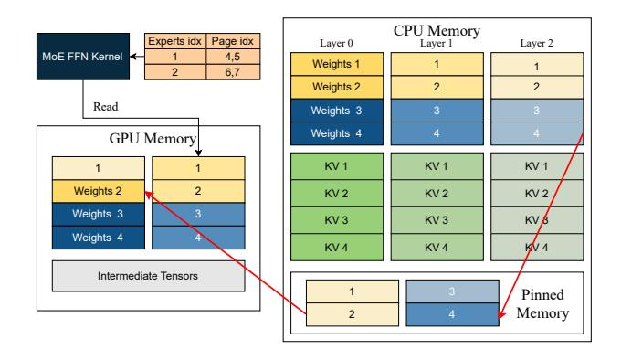

# **A System Implementation Details**

In this section, we explain two system-level designs and their implementation details: 1. Appendix A.1 introduces how GPU and CPU memory are used and weights paging is implemented in MoE-LIGHTNING, and 2. Appendix A.2 presents the batching algorithm employed in MoE-LIGHTNING to support dynamic-length requests in a batch.

#### A.1 Memory Management

Since attention is performed on CPU, the KV cache for all micro-batches will be transferred to and stored on CPU after the corresponding computation completes. To enable CGOPIPE, we allocate a weight buffer with a size of  $2 \times sizeof(W_L)$ , where  $W_L$  denotes the size of the portion of a layer's weights stored in CPU memory. This buffer enables overlapping weight prefetching: as the current layer's weights are being used, the next layer's weights are simultaneously transferred to GPU memory.

Weights are transferred in a paged manner. For example in Fig. 11, each expert in the MoE FFN kernel requires two pages, and the kernel accesses the appropriate pages using a page table. To accelerate transfers from CPU to GPU, weights are first moved from CPU memory to pinned memory, and then from pinned memory to GPU. These transfers are overlapped to hide latency. As illustrated in Fig. 11, while transferring Weights 2 for Layer 2 from pinned memory to GPU, Weights 4 for the same layer can be transferred concurrently from CPU to pinned memory.

**Figure 11.** Simplified Demonstration of MoE-LIGHTNING's Memory Management.

