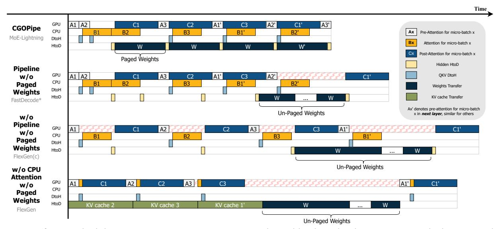

# **Algorithm 1** CGOPipe

```
1: for d = 1, 2, \dots gen\_len do
2:
       // Prologue
3:
       for j = 1, 2 do
 4:
           PreAttn(1, i)
 5:
           OffloadQKV(1, j)
           CPUATTN(1, j)
 6:
7:
           W_{CTOPIN}(2, j)
       for i = 1, 2, \dots num\_layers do
 8:
9:
           for j = 1, 2, \dots num ubs do
10:
               LoadH(i, j)
               W_{PINTOG}(i+1, j)
11:
12:
               PostAttn(i, j)
13:
               // Launch CPUAttn two batches ahead
14:
               PreAttn(i, j + 2)
               OffloadQKV(i, j + 2)
15:
16:
               CPUATTN(i, i + 2)
               W_{CTOPIN}(i+1, j+2)
17:
```

<span id="page-5-4"></span>Pipeline scheduling is a common approach to maximize compute and I/O resource utilization. Yet, the pipeline concerning GPU, CPU, and I/O is not trivial. In traditional pipeline parallelism for deep learning training [16, 18, 34], models are divided into stages which are assigned to different devices. Therefore, only output activations are transferred between stages, resulting in a single type of data transfer in each direction at a time. In our scenario, both weights and intermediate results need to be transferred between GPU and CPU. Intermediate results are required immediately after computation to avoid blocking subsequent operations, whereas weights for the next layer are needed only after all micro-batches for the current layer are processed. Additionally, weight transfers typically take significantly longer than intermediate results. Consequently, naive scheduling of I/O events can lead to low I/O utilization, which also hinders computation. **CGOPIPE.** Fig. 6 demonstrates our proposed CGOPIPE and the other three scheduling strategies adopted in existing systems. CGOPIPE employs CPU attention as analyzed in §3.3, alongside a weight paging scheme that interleaves the transfer of intermediate results for upcoming micro-batches with paged weight transfers to optimize computation and communication overlap. The GPU sequentially processes the postattention tasks (primarily O projection and MoE FFN) for the current micro-batch, followed by the pre-attention tasks (mainly layer norm and QKV projection) for the next microbatch. Concurrently, the CPU handles attention (specifically the softmax part) for the next batch, and a page of weights for the subsequent layer are transferred to the GPU.

<span id="page-5-2"></span><sup>&</sup>lt;sup>6</sup>We do not consider disk offloading in this work.

<span id="page-5-3"></span><sup>&</sup>lt;sup>7</sup>Since the prefill stage is normally compute-bound, and the computation can be easily overlapped with I/O, we do not perform further optimization for prefill stage.

<span id="page-6-1"></span>

**Figure 6.** Different Scheduling Strategies: Square sizes vary with workloads and policies. For example, larger  $\mu$  or longer sequences lengthen the orange (attention) and the green (KV cache transfer from CPU to GPU) squares. Squares with red zigzag lines indicate the unnecessary GPU idle times. \*FastDecode [17] dose not consider weights offloading.

FlexGen [42] primarily employs the fourth schedule  $(S_4)$ , where attention is performed on GPU and the KV cache for the next micro-batch is prefetched during the current computation. This approach results in higher KV cache transfer latency than performing attention directly on the CPU (§3.3) and consumes I/O bandwidth that could otherwise be used for weight transfers, reducing resource utilization compared to CGOPIPE. FlexGen also supports CPU attention and adopts the third schedule ( $S_3$ ), which is the least optimized and may even perform worse than  $S_4$  if KV cache transfer latency is less than the sum of pre-attention, post-attention, and CPU attention latencies, as later shown by our evaluation results (§5). FastDecode [17] suggests overlapping CPU attention with GPU computation, similar to the second schedule ( $S_2$ ). However, it does not target memory-constrained settings, so weight transfer scheduling is not considered.

**Weights Paging and Data Transfer Scheduling.** To fully utilize the I/O, we propose a weights paging scheme to interleave the data transfer for different tasks, reducing bubbles in the I/O. There are mainly four kinds of data transfer:

- D<sub>1</sub> (QKV DtoH): the intermediate results to be transferred from GPU to CPU after QKV projection.
- D<sub>2</sub> (Hidden HtoD): the hidden states to be transferred from CPU to GPU after the CPU attention.
- $\mathcal{D}_3$  (Weights Transfer): the weights for the next layer to be transferred from CPU to GPU.
- $\mathcal{D}_4$  (KV cache Transfer): the KV cache for the next micro-batch to be transferred from CPU to GPU.

Due to independent data paths, data transfers in opposite directions can happen simultaneously. Data transfer will be performed sequentially in the same direction. The challenge then mainly lies in the scheduling of  $\mathcal{D}_2$ ,  $\mathcal{D}_3$  and  $\mathcal{D}_4$ , which are all from CPU to GPU. For the case without CPU attention ( $\mathcal{S}_4$ ), while  $\mathcal{D}_4$  usually takes a similar or longer time compared with a layer's computation, the I/O bandwidth is almost fully utilized, leaving little room for more efficient scheduling for data transfer. As we can see from the diagram of  $\mathcal{S}_2$  and  $\mathcal{S}_3$ , conducting the weights transfer as a whole will block the next layer's first  $\mathcal{D}_2$  for a long time, resulting in poor overall system efficiency. Instead, we can chunk the weights to be transferred into n pages where n equals the number of micro-batches in the pipeline, and the performance model and optimizer (§4.2) select the proper micro-batch size, batch size and the proportion of weights to be transferred from CPU to GPU.

Algorithm 1 provides the order in which the main CPU task launcher thread launches the tasks to enable CGOPIPE. All the tasks are executed asynchronously, and necessary synchronization primitives are added to each task to enforce the correct data dependency.

