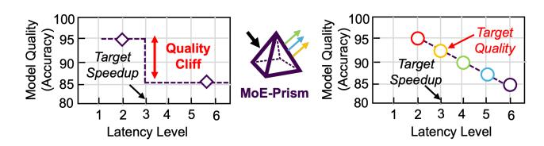

# 1 Introduction

The rapid advancement of Large Language Models (LLMs) has driven the development of increasingly sophisticated architectures to achieve state-of-the-art performance while managing computational costs [27, 29, 40]. Mixture-of-Experts (MoE) models have emerged as a leading approach, enabling models with trillions of parameters to maintain tractable inference costs by activating only a subset of experts for

Figure 1. MoE-Prism resolves the Quality Cliff in MoE serving. (Left) Conventional MoE models are rigid, creating a "Quality Cliff" where achieving a target speedup forces a disproportionately large drop in model quality. The name reflects its core function: just as a prism decomposes a single beam of light into a spectrum of colors, MoE-Prism refactors a monolithic expert into a spectrum of fine-grained sub-experts. This introduces architectural elasticity (right), transforming the cliff into a smooth trade-off curve and enabling the selection of an optimal "Target Quality" point that was previously unattainable.

each input token [13, 19, 30]. This selective activation mechanism has proven instrumental in achieving remarkable capabilities across reasoning, generation, and comprehension tasks [17, 35, 43].

The MoE architecture, comprising multiple discrete expert modules, offers inherent computational flexibility that monolithic dense models cannot achieve. This design theoretically enables fine-grained control over the computational cost-quality trade-off by dynamically selecting which experts to activate for each input. However, current MoE implementations fail to realize this architectural potential due to insufficient granularity in available configurations. While the sparse activation principle is sound, existing models provide only a limited number of discrete operating points. For instance, the well-known Mixtral-8x7B model [13] only has 2 activated experts per token, offering only 2 distinct quality levels (activating 1 or 2), which creates a coarse-grained "quality cliff" where systems must choose between separate configurations with no intermediate options.

This limited configuration space creates significant operational challenges for cloud providers and service operators. Systems cannot smoothly scale computational resources to match available hardware capacity or varying workload demands, preventing efficient resource utilization and limiting the ability to satisfy heterogeneous Service Level Objectives

(SLOs). Reducing the expert count, even by the smallest possible step, often triggers a massive and disproportionate drop in model quality. We call this the Quality Cliff: the inability to make a small sacrifice in quality for a commensurate gain in performance. As illustrated in Figure [1](#page-0-0) (left), this cliff makes it impossible to efficiently serve heterogeneous user requests, forcing the system to either over-provision quality at the expense of latency or violate quality requirements.

The root cause of this coarse granularity lies in training constraints. While one could theoretically train models with many more experts to increase configuration options (e.g., activating 128 experts), this approach is practically infeasible due to prohibitive computational costs and well-documented training instabilities that arise at such scales. Current stateof-the-art models exemplify this constraint: the KIMI K2 model [\[35\]](#page-12-5), despite containing 1 trillion total parameters, utilizes only 9 experts. This modest expert utilization reflects the practical realities of MoE training at scale, necessitating a post-training solution to unlock finer-grained control.

Our work addresses this granularity limitation through a key insight: we can increase the number of available configurations without changing the overall activation pattern or requiring retraining. By decomposing existing monolithic experts into finer-grained sub-experts, we can transform a model to finer granularity while maintaining the same computational budget and activation sparsity. This approach leverages the observation that monolithic experts in pretrained MoE models exhibit significant internal redundancy which means for any given token, only a fraction of the neurons within an activated expert contribute meaningfully to the final output. Realizing this opportunity requires a holistic model-system co-design that addresses three non-trivial, cross-stack challenges:

First, a solution must achieve Architectural Refactoring without Retraining. A pre-trained MoE model is a static artifact. The primary challenge is how to introduce elasticity into this rigid structure post-training. This requires a principled method to deconstruct the monolithic expert, the core computational block of the MoE layer, into smaller, independent units without altering the model's fundamental mathematical properties.

Second, the system must perform a Quality-Preserving Transformation and Routing. A naive partitioning of neurons would sever critical, co-dependent connections learned during training, catastrophically damaging model quality. Furthermore, creating a finer-grained architecture renders the original gating network obsolete. The core problem is thus twofold: how to partition experts in a way that preserves functional locality, and how to construct a new, effective routing mechanism for this new spectrum of sub-experts.

Third, this new architecture necessitates a QoS-Aware Online Scheduler. Introducing elasticity at the model level creates a powerful new capability, but it also gives rise to a

significantly more complex scheduling problem. The online serving system must now solve a multi-dimensional optimization problem at runtime: which requests to batch together and, crucially, what quality level (i.e., how many sub-experts) to use, all while maximizing system throughput and respecting heterogeneous user SLOs across a much larger configuration space.

This paper presents MoE-Prism, a complete model-system co-design that systematically addresses these barriers to deliver the first truly elastic MoE serving solution as shown in Figure [1](#page-0-0) (right). MoE-Prism's architecture is divided into two parts. First, the Offline Refactoring Engine performs a one-time transformation of the MoE model. At its core is the partition optimization solver, a metaheuristic-based engine that deconstructs monolithic experts into fine-grained, functionally-coherent sub-experts. Second, the Online Scheduling Engine exploits this newfound architectural elasticity during online inference. It implements novel, utility-driven policies to navigate the expanded configuration space, enabling dynamic, fine-grained control over the performancequality trade-off. The key contributions are summarized as follows:

- We present MoE-Prism, the first holistic model-system co-design that transforms static MoEs into elastic, QoS-aware services.
- We develop an offline model transformation methodology that introduces fine-grained elasticity by deconstructing monolithic experts into functionally coherent sub-experts using a metaheuristic-based partition optimization solver, preserving model quality without costly retraining.
- We design and implement a unified, utility-driven online engine that solves the complex joint optimization problem of request batching and quality-level selection for heterogeneous workloads.
- We conduct a comprehensive evaluation on state-ofthe-art MoE models, demonstrating that MoE-Prism unlocks significant real-world performance gains. MoE-Prism increases throughput by up to 19.9% for cloud services under strict latency budgets and reduces endto-end latency by up to 10.36% on resource-constrained devices.

