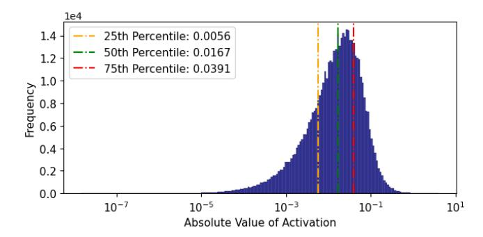

# 2.2 The Redundancy Within Monolithic Experts

The inflexibility quantified above stems from treating experts as monolithic, indivisible computational blocks. Our work is motivated by the insight that this view is a false constraint. We hypothesize that significant computational redundancy exists *within* each expert.

To validate this hypothesis, we performed a fine-grained analysis of neuron activations inside a single expert of the DeepSeek-V2-Lite model. For a sample of tokens routed to this expert, we recorded the activation values of all neurons

**Figure 3.** Distribution of neuron activation magnitudes within a single activated expert for a sample of input tokens. A vast majority of neurons exhibit near-zero activation, demonstrating significant computational redundancy. This suggests that only a small fraction of the expert's computation is essential for any given token.

in its FFN sub-layers. As shown in Figure 3, the neuron-level computation is exceptionally sparse. For a typical input, the distribution of work is highly skewed: 50% of the neurons exhibit an activation magnitude of less than 0.0167, and 75% of activations fall below 0.0391. This empirically demonstrates a high degree of activation sparsity at the sub-expert level. In essence, activating an entire expert is computationally wasteful, as the vast majority of its neurons contribute minimally to the final output for any specific token.

This empirically verified redundancy is the central motivation of our work. It reveals that the monolithic expert is an artificial construct of the training process, not a fundamental computational necessity. This presents a crucial opportunity: if we can devise a method to decompose these experts into finer-grained, functionally coherent sub-units *post-training*, we can bypass the training bottleneck entirely. By activating only the essential sub-units at runtime, we can finally unlock the smooth, elastic performance-quality trade-off that the MoE architecture has always promised. MoE-Prism is designed to systematically exploit this latent redundancy to achieve this goal.

