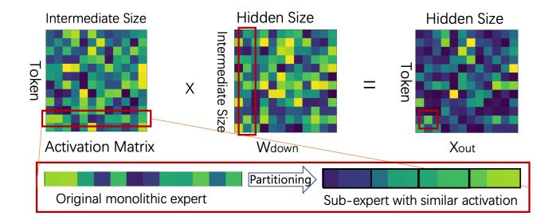
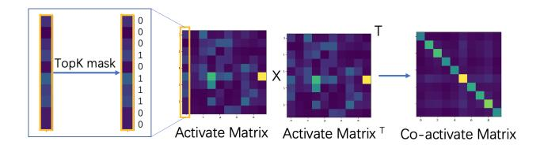

# 4.2 Partitioning Optimization Solver

The Partitioning Optimization Solver receives the activation profiles from the Neuron Activation Profiler and partition each expert's neurons into robust sub-experts (Figure 5).

**4.2.1 Problem Formulation.** The central challenge in refactoring a monolithic expert is to partition its neurons into sub-experts that are optimized for elastic, on-demand execution. A naive partitioning might evenly distribute active neurons for any given input, forcing the runtime to execute all sub-experts to preserve quality. Our goal is to create a structure where, for any input token, the computation is

**Figure 5.** The partitioning process leverages the neuron-level independence of the FFN to group neurons into new sub-experts. The total expert output is the sum of the outputs of its constituent sub-experts.

naturally concentrated within a small subset of the new subexperts. This would allow a runtime system to deactivate the remaining, largely quiescent sub-experts, thereby saving significant memory and computation with minimal impact on output quality.

To achieve this, we must first define a proxy for a sub-expert's contribution to the model's output for a given token. We use the  $L_1$  norm of its activation vector for this purpose. This metric serves as an efficient-to-calculate and effective measure of a sub-expert's overall activation magnitude. A low  $L_1$  norm implies that the neurons within that sub-expert had minimal influence on the computation for that specific token.

We therefore formalize our goal as a combinatorial optimization problem. We begin with the neuron activation matrix,  $\mathbf{M} \in \mathbb{R}^{B \times C}$ , captured from a representative calibration set, where B is the number of tokens and C is the total number of neurons in the expert. Our objective is to find a partition  $\mathcal{P} = \{S_1, \ldots, S_N\}$  of the C neuron indices into N disjoint sub-experts.

For any given input token b and a sub-expert partition  $S_n$ , we calculate its activation magnitude as  $L_{b,n} = \|\mathbf{M}[b,S_n]\|_1$ . Our objective is to find the optimal partition  $P^*$  that minimizes the sum of the norms corresponding to the K deactivated sub-experts, aggregated across all B rows. For each row b, let  $\mathcal{L}_b(\mathcal{P}) = \{L_{b,1}, L_{b,2}, \ldots, L_{b,N}\}$  be the set of norms derived from the partition  $\mathcal{P}$ . Let top- $K(\mathcal{L}_b(\mathcal{P}))$  denote the set of the K smallest values in  $\mathcal{L}_b(\mathcal{P})$ . Thus, the optimal partition  $P^*$  is:

$$\mathcal{P}^* = \arg\min_{\mathcal{P}} \sum_{b=0}^{B-1} \sum_{l \in \mathbb{L}} l, \ \mathbb{L} = \text{top-K}(\mathcal{L}_b(\mathcal{P}))$$
 (2)

Solving this optimization problem yields a sub-expert structure that is fundamentally aligned with the goal of dynamic, quality-preserving execution, providing the foundation upon which our online runtime strategies are built.

**4.2.2 Solver Implementation.** We address the computational intractability of optimal partitioning by developing

a practical two-phase hybrid algorithm that efficiently explores the exponential search space to identify high-quality solutions

*Greedy Initialization.* The solver first constructs a strong initial partition using the deterministic greedy heuristic . It calculates the total impact (L1 norm across the batch) of each neuron and then iteratively assigns the most impactful unassigned neuron to the sub-expert with the current lowest cumulative impact. This load-balancing strategy provides a well-structured starting point for further optimization.

**Simulated Annealing-based Refinement.** The initial partition is then refined using Simulated Annealing (SA), a metaheuristic chosen for its proven ability to navigate complex, non-convex search spaces and escape local minima. The SA process iteratively explores neighboring partitions by swapping random neurons between sub-experts. A move to a lower-cost partition is always accepted, while a move to a higher-cost one is accepted with a probability that decreases over time. This allows the solver to broadly explore the solution space before converging on a high-quality solution. The output of the Partitioning Optimization Solver is the optimal partition map,  $\{\mathcal{P}_e^*\}$ , which is passed to the Gating Mechanism Reconstructor.

### 4.3 Gating Mechanism Reconstructor

The final stage of the offline refactoring engine constructs a new gating mechanism tailored to the newly created sub-experts. The primary system challenge is to design a router that is both computationally efficient and accurate in selecting the appropriate sub-experts for a given input. Our system provides two distinct strategies for this reconstruction, offering a trade-off between training-free deployment and maximum fidelity.

**4.3.1 Training-Free Proxy Gating.** The first strategy creates an effective gating mechanism without additional training. A naive approach would be to execute all sub-experts for every token simply to compute their output norms and decide which to use. This is computationally prohibitive and would defeat the entire purpose of the refactoring.

To address this, we introduce a lightweight, proxy-based gating mechanism. The core idea is to estimate the activation level of each sub-expert by using a small, fixed-size set of representative neurons, which we term *gate neurons*. For any given input token, the system computes the intermediate activations for *only* these gate neurons. The average L1 norm of these few activations is then used as a cheap but effective score to approximate the entire sub-expert's output norm. The model's top-level router can then use these lightweight scores to select which sub-experts to execute.

**Figure 6.** Construction of the co-activation matrix. From the raw activation matrix, a binary matrix is derived by identifying the top-k most active neurons for each token. The co-activation matrix is the product of this binary matrix and its transpose.

The pivotal question is how to select the optimal set of gate neurons for each sub-expert. Intuitively, a good representative neuron is one whose activation pattern is highly correlated with the activation patterns of other neurons within its own sub-expert. Such a neuron acts as a functional "centroid" of its cluster, meaning its behavior is indicative of the group's collective behavior. We formalize a method to identify these centroids based on co-activation frequency.

**Co-activation Matrix Construction.** We quantify the functional similarity between all pairs of neurons as shown in Figure 6. We begin by processing the calibration dataset through the model to collect the intermediate activation matrix,  $\mathbf{M} \in \mathbb{R}^{B \times C}$  (where B is the number of tokens and C is the number of neurons), which was previously generated by the Neuron Activation Profiler.

From this matrix, we derive a binary activation matrix,  $\mathbf{B} \in \{0,1\}^{B \times C}$ . For each token (row), we consider a neuron "active" if its absolute activation value is among the top- $k_a$  for that token. Formally, for each token t, the row  $\mathbf{B}[t,:]$  is generated such that  $\mathbf{B}[t,c]=1$  if  $|\mathbf{M}[t,c]|$  is one of the  $k_a$  largest values in the row  $|\mathbf{M}[t,:]|$ , and 0 otherwise. The symmetric co-activation matrix,  $\mathbf{C}_{co} \in \mathbb{R}^{C \times C}$ , is then computed as  $\mathbf{C}_{co} = \mathbf{B}^T \mathbf{B}$ . Each entry  $\mathbf{C}_{co}[i,j]$  represents the total number of tokens for which neuron i and neuron j were simultaneously active.

**Centroid Identification.** With the co-activation matrix, we can now identify the most representative neurons for each sub-expert partition produced by the Solver. For a given sub-expert, defined by its neuron set  $S_n$ , a neuron's centrality is determined by its cumulative co-activation with all other neurons within the same sub-expert. A neuron that frequently co-activates with its peers is considered highly central and thus a strong candidate for a gate neuron. We select the top-r neurons with the highest centrality scores from each sub-expert to form the final set of gate neurons.

**4.3.2 Low-cost Router Finetuning.** The second strategy is an optional, low-cost finetuning path for applications demanding maximum fidelity. The system design prioritizes

surgical precision and extreme parameter efficiency. We finetune *only* the gating network, freezing all the other weights (over 99.9% of total parameters).

To imbue the router with the ability to perform well across a range of resource budgets, we adopt a curriculum-based training strategy inspired by recent work on training scalable MoE models [4]. Instead of using a fixed number of active sub-experts during finetuning, we *progressively increase k as training proceeds*. The router is trained using a standard end-to-end learning objective. For each input token, the router computes scores for all N sub-experts and selects the top-k (where k is determined by the current training step). The token is then processed by these k sub-experts, and their outputs are combined based on the router's softmax-normalized scores. The model is optimized using the cross-entropy loss.

This approach is highly pragmatic. By teaching the router to handle a curriculum of increasing expert counts, it learns a robust and flexible routing policy. The finetuning remains extremely fast and memory-efficient, and by preserving the router's standard architectural type (a linear layer), we avoid custom kernel development and can leverage existing, highly-optimized system kernels for high-performance execution.

