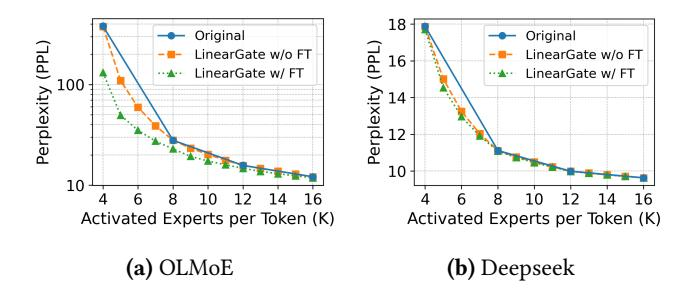

# 6.2.3 Latency Minimization for Constrained Devices.

On memory-constrained hardware, such as consumer GPUs, the necessity of offloading model experts to host memory creates a significant I/O bottleneck that dominates inference latency. As illustrated in Figure [8](#page-9-0) for devices with 16GB (RTX 4080) and 24GB (RTX 4090) of memory, MoE-Prism is designed to mitigate this bottleneck through two synergistic mechanisms. First, its fine-grained expert architecture improves GPU cache residency. Under a fixed memory budget, the smaller sub-experts enable more efficient packing into the GPU cache; memory fragments too small for a monolithic expert can instead store several of our sub-experts. This granular packing increases the proportion of resident parameters, raising the effective cache hit ratio from 0.4375 (28/64) for the baseline to 0.4453 ((28×4+2)/(64×4)) in a 16GB configuration.

Second, MoE-Prism reduces the total data transfer volume required to meet a given Service Level Objective (SLO). The baseline model suffers from a coarse-grained quantization error in resource allocation, as it must load entire monolithic experts. For instance, if an SLO requires the computational equivalent of 4.2 experts, the baseline must wastefully load 5 full experts from CPU memory. In contrast, MoE-Prism can

Figure 9. Perplexity (PPL) comparison between our model and the original model on the Wikitext dataset, as a function of the number of selected experts per token (K).

satisfy the same SLO by loading only 17 fine-grained subexperts (equivalent to 4.25 experts), fundamentally reducing the data payload transferred over the PCIe bus. The combination of higher cache residency and lower transfer volume allows MoE-Prism to reduce end-to-end offloading latency by approximately 10% across both memory configurations, demonstrating its clear advantage in I/O-bound scenarios.

