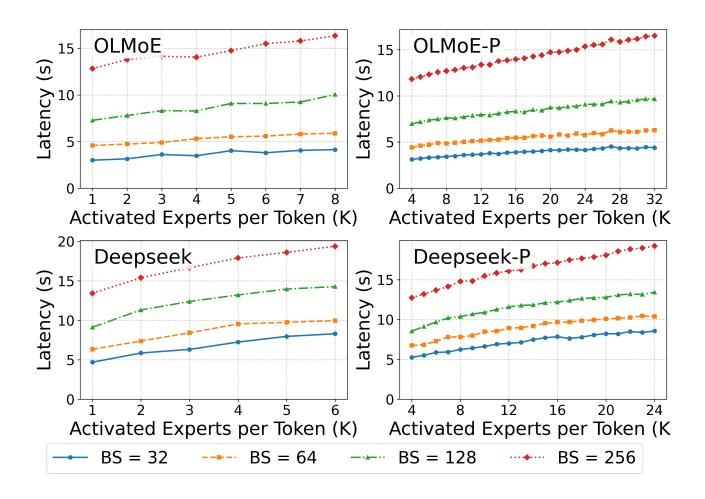

# 6.3 Verifying Effectiveness of MoE-Prism

To visually validate the core benefit of our model refactoring approach, we plot the perplexity against to different K settings, and throughput, latency against different (K, batch\_size) settings.

6.3.1 Perplexity Analysis. Figure [9](#page-9-1) validates that our architectural modifications, designed for system flexibility, do not compromise the underlying model's quality. The figure plots perplexity on the Wikitext dataset as a function of activated experts (K), confirming the expected trade-off between computational cost and accuracy for both the OLMoE and Deepseek models. Crucially, our training-free variant (LinearGate w/o FT) yields a perplexity curve nearly indistinguishable from the original, demonstrating that the finegrained control essential for our scheduler can be achieved with zero training overhead. Moreover, with minimal finetuning, the LinearGate w/ FT variant consistently matches or slightly outperforms the baseline across the entire spectrum of K values. These results establish that our architectural refactoring is effective, providing the runtime scheduler with a predictable and uncompromised performance-cost curve to navigate the latency-quality trade-off without penalty.

6.3.2 Granularity Advantage. The key distinction of our approach lies in its fine-grained control over the inference process. Figure [10,](#page-10-0) [11](#page-10-1) provides a compelling visual contrast in operational flexibility. The original model is constrained to a coarse-grained selection of discrete integer values for K, resulting in abrupt, step-wise decreases in throughput. In contrast, our MoE-Prism model, enabled by the partitioning of experts, exposes a significantly more fine-grained control space for K. This fine granularity translates into a smoother

**Figure 10.** Throughput comparison of MoE-Prism model against the original model under different K, lighter colors indicating higher throughput.

**Figure 11.** Latency comparison for different K and batch sizes (BS).

trade-off curve between accuracy and computational load, empowering more precise resource allocation and performance tuning in dynamic serving environments. For example, if a coming request requires accuracy that  $K \geq 2.2$ , then our MoE-Prism model can allocate K' = 9 sub-experts to satisfy the SLO while the original model should allocate K = 3 experts, which has the equivalent computational cost of K' = 12 sub-experts, and causes unnecessary latency.

**6.3.3 Ablation Study.** To dissect the source of these improvements, we conduct the ablation study shown in Figure 12, isolating the contributions of our flexible model architecture (Model Only) and our dynamic scheduler (System Only). The results reveal that while both components individually contribute to enhancing performance, their synergistic combination in the complete MoE-Prism system consistently yields the lowest latency and highest throughput. This finding underscores the importance of our co-design approach,

**Figure 12.** Ablation of MoE-Prism on Deepseek-V2-Lite.

where the model's architectural flexibility is fully exploited by a dedicated, model-aware system scheduler to achieve optimal inference efficiency.

### 7 Related Work

