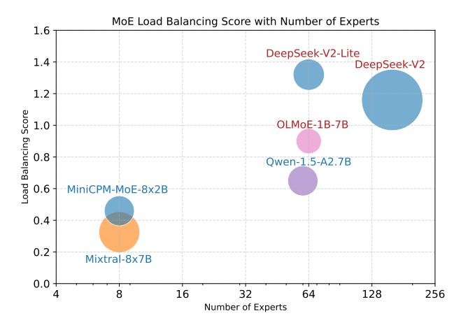

# 3 METHODOLOGY

## 3.1 THE MIXTURE-OF-EXPERTS ARCHITECTURE

Mixture-of-Experts (MoE) architecture. MoE architecture replaces the feed-forward networks (FFN) in Transformers with mixture-of-expert layers. A router or a gating network is trained to select a subset of experts for each input token based on its routing policy. Given n experts in a layer, the output of the expert layer is given by:

<span id="page-2-0"></span>
$$y = \sum_{i=0}^{n-1} Gate(x)_i \cdot E_i(x), \tag{1}$$

where the Gate(x)<sup>i</sup> is the router weights from the gating network assigned to the i-th expert, and Ei(x) is the output of i-th expert. The router weights can be formulated as softmax over the Top-K logits:

$$Gate(x) = Softmax(TopK(x \cdot W_g)),$$
 (2)

where W<sup>g</sup> is the weight of the router or gating network, and TopK(X)<sup>i</sup> = l<sup>i</sup> if i is in the top-K coordinates of logits l and TopK(X)<sup>i</sup> = −∞ otherwise.

Since current LLMs mostly adopt SwiGLU [\(Shazeer, 2020\)](#page-13-6) architecture for the FFN, and MoE LLM such as Mixtral-8x7B [\(Jiang et al., 2024\)](#page-11-2) uses a top-2 to select experts, we can derive the output of an expert layer as:

$$y = \sum_{i=0}^{n-1} \text{Softmax}(\text{Top2}(x \cdot W_g))_i \cdot \text{SwiGLU}_i(x).$$
 (3)

Some recent MoE LLMs, such as DeepSeekMoE [\(Dai et al., 2024\)](#page-10-6), adopt shared experts that are always activated, aiming at capturing and consolidating common knowledge across varying contexts.

MoE Expert Initialization. MoE expert initialization uses different strategies, which can be classified into two categories: sparse upcycling [\(Komatsuzaki et al., 2023\)](#page-12-2) and training from scratch. Some open-source MoE models such as Mixtral [\(Jiang et al., 2024\)](#page-11-2), Qwen1.5-MoE-A2.7B [\(Team,](#page-13-7) [2024\)](#page-13-7), and MiniCPM-MoE [\(Hu et al., 2024\)](#page-11-6) all employ the upcycling approach to reduce the total training costs. While some MoE models like DeepSeek-V2 [\(Liu et al., 2024\)](#page-12-3), OLMoE [\(Muennighoff](#page-13-8) [et al., 2024\)](#page-13-8), and Yuan2.0-M32 [\(Wu et al., 2024\)](#page-14-0) use the training from scratch approach to help expert diversification. We find that different MoE expert initialization methods result in different expert activation frequencies and expert similarities, which will impact the MoE pruning strategies. For instance, the MoE model initialized with upcycling can take advantage of the dense model and reduce training costs. The final MoE model exhibits higher expert similarity and more balanced expert activation frequency, which indicates that expert pruning will result in a performance drop, and weight pruning will be a better choice. MoE model trained from scratch might yield better performance as it avoids the limitations of starting with a group of identical experts, which can hinder diversification (Wei et al., 2024). It also shows imbalanced expert activation frequency, indicating that least-used expert pruning could help compress model size and not bring performance degradation.

**MoE Expert Activation Frequency.** We use a subset of the C4 (Raffel et al., 2020) dataset and collect the activation frequency of MoE experts. The expert activation frequency is task-agnostic since C4 pretraining datasets are comprehensive and not dominated by knowledge specific to any particular domain. Motivated by the load balancing loss (Shazeer et al., 2017; Lepikhin et al., 2021; Fedus et al., 2022), we propose to use the coefficient of variation of expert activation frequency in each layer to represent the load balancing score, where a lower score represents more balanced loads. Given n experts and l layers and a batch  $\mathcal B$  with T tokens, the load balancing score for one layer is:

$$s = \frac{\sigma}{\mu} = \frac{\sqrt{\frac{1}{n} \sum_{i=0}^{n-1} (f_i - \mu)^2}}{\mu},$$

$$\mu = \frac{1}{n} \sum_{i=0}^{n-1} f_i,$$
(4)

where  $f_i$  is the number of tokens dispatched to expert i,

$$f_i = \sum_{x \in \mathcal{B}} \mathbb{1}\{\operatorname{argmax} p(x) = i\}. \tag{5}$$

<span id="page-3-0"></span>We can derive the load balancing score by calculating the mean of scores across all *l* MoE layers, such that we can use this score to compare with various MoE models with different numbers of experts. Figure 2 shows the load balancing scores of Mixtral-8x7B (Jiang et al., 2024), Qwen-1.5-A2.7B (Team, 2024), DeepSeek-V2 and DeepSeek-V2-Lite (Liu et al., 2024), MiniCPM-MoE-8x2B (Hu et al., 2024), and OLMoE (Muennighoff et al., 2024).



Figure 2: Load balancing score of MoE models. We collect the expert activation frequency of MoE models and calculate the load balancing score (lower is better). The circle area represents the model size. MoE model trained from scratch are marked with red, while MoE models that use upcycling are marked with blue. MoE models trained from scratch usually have more experts and imbalanced loads. MoE models initialized with upcycling tend to have more balanced loads and less number of experts. The only exception is Qwen-1.5-A2.7B, which is initialized with upcycling. But according to the report (Yang et al., 2024), its expert parameters are shuffled along the intermediate dimension to guarantee that each fine-grained expert exhibits unique characteristics and therefore exhibits more like trained from scratch MoE models.

#### 3.2 PRUNING METRIC

**Problem Formulation.** Post-training pruning for LLMs can be decomposed into layer-wise subproblems (Lu et al., 2022; Frantar & Alistarh, 2023b; Sun et al., 2024; Dong et al., 2024). Given a

sparsity ratio and a linear layer with weight W, the pruning algorithm tries to find a sparsity mask M that minimizes reconstruction loss:

$$\underset{\mathbf{M}}{\operatorname{argmin}} \|\mathbf{W}\mathbf{X} - (\mathbf{M} \odot \mathbf{W})\mathbf{X}\|. \tag{6}$$

Optimal Brain Damage (OBD) [\(LeCun et al., 1989\)](#page-12-5) first sets up a pioneering framework for neural network pruning. It uses second-order information without off-diagonal elements in the Hessian matrix for faster approximation. Optimal Brain Surgeon (OBS) [\(Hassibi et al., 1993\)](#page-11-7) develops upon OBD partly by taking into account the off-diagonal elements. SparseGPT [\(Frantar & Alistarh,](#page-11-3) [2023b\)](#page-11-3) revisits the OBS, computes the inverse Hessian only once, and reuses to update weight in the remaining rows that are also in the mask to mitigate reconstruction loss. The pruning metric in SparseGPT is:

$$S_{ij} = [|\mathbf{W}|^2 / \operatorname{diag}(\mathbf{H}^{-1})]_{ij}. \tag{7}$$

Wanda [\(Sun et al., 2024\)](#page-13-4) further simplifies the pruning metric to the following form without the need to compute the inverse of the Hessian matrix H:

$$S_{ij} = [|\mathbf{W}|^2 / \operatorname{diag}((\mathbf{X}^T \mathbf{X})^{-1})]_{ij} \approx [|\mathbf{W}|^2 / (\operatorname{diag}(\mathbf{X}^T \mathbf{X})^{-1})]_{ij} = (|\mathbf{W}_{ij}| \cdot ||\mathbf{X}_j||)^2.$$
(8)

When it comes to pruning MoE, the expert layers constitute the majority of model parameters. For example, the Mixtral-8x7B [\(Jiang et al., 2024\)](#page-11-2) has a total of 47B parameters where 1.3B belongs to attention modules and 45B is used for expert layers (2 out of 8 experts are activated, 12.5B active parameters during inference). Only a subset of experts are activated for different input tokens, so there is a large space of expert redundancy.

Router Tells It All. As shown in Equation [1,](#page-2-0) the router weights are assigned to each expert output. Motivated by the pruning metric in Wanda and the MoE routing policy, our approach, MoE-Pruner, prunes weights with the smallest magnitudes multiplied by the corresponding input activations and router weights, on each output neuron:

$$S = |\mathbf{W}_{ij}| \cdot ||\mathbf{X}_j \cdot \mathbf{Gate}_j||. \tag{9}$$

<span id="page-4-0"></span>Table 1: Comparison of different pruning methods including magnitude pruning, SparseGPT, Wanda, and MoE-Pruner.

| Method     | Weight update | Calibration data | Pruning metric S           |                     |
|------------|---------------|------------------|----------------------------|---------------------|
| Magnitude  | ✗             | ✗                | W                          | O(1)                |
| SparseGPT  | ✔             | ✔                | 2/diag(H−1<br>[ W <br>)]ij | 3<br>O(d<br>hidden) |
| Wanda      | ✗             | ✔                | Wij<br>  · ∥Xj∥            | 2<br>O(d<br>hidden) |
| MoE-Pruner | ✗             | ✔                | Wij<br>  · ∥Xj<br>· Gatej∥ | 2<br>O(d<br>hidden) |

Table [1](#page-4-0) summarizes pruning methods, including magnitude pruning, SparseGPT, Wanda, and MoE-Pruner and their corresponding pruning metric and complexity. Algorithm [1](#page-5-0) presents the unstructured sparsity version of our MoE-Pruner algorithm. Our method is simple and efficient for MoE models and does not require a sophisticated weight update procedure.

Structured N:M Sparsity. Structured N:M sparsity can leverage NVIDIA's sparse tensor cores to accelerate matrix multiplication. While MoE-Pruner so far has been developed for unstructured sparsity, it can be easily extended to structured N:M sparsity [\(Mishra et al., 2021\)](#page-13-10), where we compare weights using the same metric among every M consecutive weights, for all weights connected to an output.

Comparison Group. Generally, for a pruning method, each weight is first assigned an importance score, calculated by the pruning metric. These weights are then grouped into comparison groups where weights within each group are compared against one another, and weights with lower importance scores are pruned. Most previous pruning methods default to comparing weights locally within each layer or globally across the whole network. Our method compares weights using the comparison groups on each output neuron, which aligns with Wanda and can be easily extended to <span id="page-5-0"></span>**Algorithm 1** The MoE-Pruner algorithm. We prune each expert layer weight matrix **W** to p% sparsity.

```
1: Initialize: A MoE model \mathcal{M} with l MoE layers, where each MoE layer has n experts. Let \mathbf{X} \in \mathbb{R}^{b \times d_{\mathrm{col}}}
     and \mathbf{Gate} \in \mathbb{R}^{b \times n} denote the calibration samples and router weights respectively.
 2: for layer t = 1, \ldots, l do
           X', G \leftarrow forward(layer_t, X)

    ▶ get router weights

           for expert e = 1, \dots, n do
 5:
                 \mathbf{M} \leftarrow \mathbf{1}_{d_{\mathrm{row}} \times d_{\mathrm{col}}}
                                                                                                                                   ▶ binary pruning mask
                 \mathcal{S} \leftarrow |\mathbf{W}_{ij}| \cdot \|\mathbf{X}_j \cdot \mathbf{Gate}_j\|
                                                                                                                              > compute pruning metric
 6:
 7:
                 idx \leftarrow \text{sort}(\mathcal{S}, dim = 1)
                                                                                                        > prund weights indices based on metric
                 \mathbf{M} \leftarrow \mathtt{scatter}(0, idx_{:,d_{\mathtt{col}}*p\%})
 8:
 9:
                 \mathbf{W} \leftarrow \mathbf{M} \odot \mathbf{W}
                                                                                                                               > set pruned weights to 0
10:
           end for
           \mathbf{X} \leftarrow \mathbf{X}'
11:
12: end for
13: Return: A pruned MoE model \mathcal{M}'.
```

N:M semi-structured sparsity. Moreover, our method is not limited to pruning individual weights but can also group structured weights into a unit and compare those units among a larger comparison group, such that we can extend our method to structured sparsity.

#### 3.3 EXPERT-WISE KNOWLEDGE DISTILLATION

**Expert-Wise Knowledge Distillation.** MoE models can preserve most of their capacity after pruning but still suffer from performance degradation. To recover MoE LLM performance, we fine-tune the model by leveraging the unpruned pretrained model as a teacher model in an expert-wise knowledge distillation (KD) manner. The pretrained model is a natural teacher model for the pruned model since they share exactly the same number of layers, experts, and dimensions (Kurtic et al., 2023). The loss function for expert-wise knowledge distillation is formulated as follows:

$$\mathcal{L}_{KD} = \mathcal{L}_{CE} + \lambda \times \mathcal{L}_{expert} = \mathcal{L}_{CE} + \lambda \times \sum_{j=0}^{l-1} \sum_{i=0}^{n-1} \text{MSE}(E_{it}^j, E_{is}^j), \tag{10}$$

where  $\mathcal{L}_{CE}$  is the cross entropy loss, MSE is the mean squared error calculated as MSE $(X,Y) = \frac{1}{N} \sum_{i=0}^{N-1} (x_i - y_i)^2$  for N-dimensional vectors X and Y.  $\lambda$  is a weighting coefficient and initialized based on the strength of cross entropy loss and expert-wise knowledge distillation loss:  $\frac{\mathcal{L}_{CE}}{\mathcal{L}_{expert}}$ . We sum up all the differences between teacher experts and student experts. Figure 3 illustrates the expert-wise knowledge distillation for pruned models. The corresponding expert in the pretrained teacher model will be used to distill the expert in the pruned student model.

#### 4 EXPERIMENTS

Models, Datasets, and Evaluation. We conduct pruning experiments on widely adopted open-source MoE models: the base and instruct version of Mixtral-8x7B and Mixtral-8x22B (Jiang et al., 2024). We use samples from the pretraining dataset C4 (Raffel et al., 2020) as calibration data for one-shot pruning since pretraining datasets are often more comprehensive and not dominated by knowledge specific to any particular domain. We use the exact same 128 sequences of calibration data for all one-shot pruning experiments to control this variable factor. We evaluate the perplexity on the WikiText (Merity et al., 2017) validation set. Our expert-wise knowledge distillation method uses a subset of the C4 (Raffel et al., 2020) as the training set. We measure the performance of pruned models on zero-shot tasks and language modeling. For zero-shot evaluation, we use nine popular tasks from EleutherAI LM Harness (Gao et al., 2023). The nine evaluated zero-shot tasks are: ARC-easy, ARC-challenge (Clark et al., 2018), Boolq (Clark et al., 2019), HellaSwag (Zellers et al., 2019), MMLU (Hendrycks et al., 2021), OpenBookQA (OBQA) (Mihaylov et al., 2018), PIQA (Bisk et al., 2020), RTE (Wang et al., 2018), and WinoGrande (Sakaguchi et al., 2021).

<span id="page-6-0"></span>

Figure 3: Expert-wise knowledge distillation for the pruned MoE model using the pretrained MoE model as the teacher to recover the performance of the pruned model.

Baselines and Experiments Setup. We compare MoE-Pruner with prior pruning approaches, including SparseGPT [\(Frantar & Alistarh, 2023b\)](#page-11-3) and Wanda [\(Sun et al., 2024\)](#page-13-4). Similarly, our pruning algorithm is implemented in a layer-wise reconstruction manner. All pruning experiments are conducted on a single NVIDIA H100-80GB GPU. The fine-tuning experiments use the pruned model as a starting point and perform full-parameter fine-tuning to preserve the sparsity mask. We implement the expert-wise knowledge distillation method in Llama-Factory [\(Zheng et al., 2024\)](#page-14-4) and conduct experiments on 2 servers, each with 8 NVIDIA H100-80GB GPUs. We fine-tune the pruned student model for three epochs, using a learning rate of 2e-5 with the cosine learning rate scheduler.

