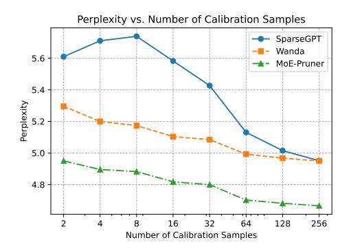

# 4.1 ONE-SHOT PRUNING

Table [2](#page-7-0) shows the one-shot pruning model perplexity on WikiText with 50% sparsity. There is a clear difference between MoE-Pruner and other pruning methods, including SparseGPT [\(Frantar &](#page-11-3) [Alistarh, 2023b\)](#page-11-3) and Wanda [\(Sun et al., 2024\)](#page-13-4). For Mixtral-8x7B [\(Jiang et al., 2024\)](#page-11-2) models, MoE-Pruner achieves 0.22-0.31 better perplexity over SparseGPT and Wanda. This improvement expands when the MoE model scales to the Mixtral-8x22B model. For the larger Mixtral-8x22B model, MoE-Pruner achieves 0.55 better perplexity over SparseGPT and 0.31-0.34 better perplexity over Wanda. MoE-Pruner further expands the improvement to 1.21 better perplexity over SparseGPT and 1.10 better perplexity over Wanda when we prune the MoE models with the 2:4 semi-structured sparsity.

Table [3](#page-7-1) shows the average zero-shot accuracies on nine zero-shot tasks of the pruned Mixtral-8x7B MoE models with 50% unstructured sparsity. The average performance of pretrained models, SparseGPT, Wanda, and our pruned models are 69.16, 66.27, 65.90, and 67.23, respectively. MoE-Pruner outperforms the state-of-the-art pruning approaches, SparseGPT and Wanda, by a large margin. Given that no fine-tuning takes place at this time, there is a noticeable gap between the sparse pruned MoE model and the original pretrained MoE model.

### 4.2 EXPERT-WISE KNOWLEDGE DISTILLATION PERFORMANCE

The gap between the pruned MoE model and the pretrained MoE model can be largely mitigated via expert-wise knowledge distillation. We only need 1000 training samples from C4 [\(Raffel et al.,](#page-13-9) [2020\)](#page-13-9), and training can be done in 1 hour. Table [4](#page-7-2) shows the average zero-shot accuracy of the pruned and fine-tuned Mixtral-8x7B MoE models with 50% unstructured sparsity. The fine-tuned model could achieve a 68.40 average performance on nine zero-shot tasks. The performance is very close to the pretrained Mixtral-8x7B MoE model, which demonstrates a 69.16 average performance.

Table 2: Perplexity against other one-shot pruning methods, including SparseGPT and Wanda with 50% sparsity.

| Model                  | Method            | Sparsity | WikiText Perplexity ↓ |  |  |
|------------------------|-------------------|----------|-----------------------|--|--|
|                        | Pretrained        | 0%       | 3.84                  |  |  |
|                        | SparseGPT         | 50%      | 4.99                  |  |  |
| Mixtral-8x7B           | Wanda             | 50%      | 4.97                  |  |  |
|                        | MoE-Pruner (Ours) | 50%      | 4.68                  |  |  |
|                        | Pretrained        | 0%       | 3.84                  |  |  |
| Mixtral-8x7B           | SparseGPT         | 2:4      | 7.09                  |  |  |
|                        | Wanda             | 2:4      | 6.98                  |  |  |
|                        | MoE-Pruner (Ours) | 2:4      | 5.88                  |  |  |
|                        | Pretrained        | 0%       | 4.14                  |  |  |
|                        | SparseGPT         | 50%      | 5.20                  |  |  |
| Mixtral-8x7B-Instruct  | Wanda             | 50%      | 5.16                  |  |  |
|                        | MoE-Pruner (Ours) | 50%      | 4.94                  |  |  |
|                        | Pretrained        | 0%       | 4.14                  |  |  |
|                        | SparseGPT         | 2:4      | 7.19                  |  |  |
| Mixtral-8x7B-Instruct  | Wanda             | 2:4      | 6.92                  |  |  |
|                        | MoE-Pruner (Ours) | 2:4      | 6.11                  |  |  |
|                        | Pretrained        | 0%       | 2.83                  |  |  |
|                        | SparseGPT         | 50%      | 4.19                  |  |  |
| Mixtral-8x22B          | Wanda             | 50%      | 3.97                  |  |  |
|                        | MoE-Pruner (Ours) | 50%      | 3.64                  |  |  |
|                        | Pretrained        | 0%       | 2.89                  |  |  |
|                        | SparseGPT         | 50%      | 4.27                  |  |  |
| Mixtral-8x22B-Instruct | Wanda             | 50%      | 4.06                  |  |  |
|                        | MoE-Pruner (Ours) | 50%      | 3.72                  |  |  |

Table 3: Average zero-shot performance on 9 evaluation tasks of pruned models using SparseGPT, Wanda, and MoE-Pruner.

| Model            | Method     | ARC-c | ARC-e | Boolq | HellaSwag | MMLU  | OBQA | PIQA  | RTE   | WinoGrande | Average |
|------------------|------------|-------|-------|-------|-----------|-------|------|-------|-------|------------|---------|
|                  | Pretrained | 56.91 | 84.47 | 85.29 | 64.78     | 67.03 | 35.0 | 82.43 | 70.4  | 76.16      | 69.16   |
| Mixtral -8x7B | SparseGPT  | 50.43 | 80.68 | 84.62 | 60.20     | 61.79 | 32.8 | 81.12 | 68.59 | 76.16      | 66.27   |
|                  | Wanda      | 51.02 | 80.89 | 85.08 | 60.45     | 62.73 | 32.6 | 80.90 | 64.64 | 74.82      | 65.90   |
|                  | MoE-Pruner | 53.33 | 81.86 | 86.02 | 62.29     | 64.76 | 33.6 | 81.61 | 66.06 | 75.53      | 67.23   |

Table 4: Average zero-shot performance after pruning and expert-wise knowledge distillation.

| Model            | Method        | ARC-c | ARC-e | Boolq | HellaSwag | MMLU  | OBQA | PIQA  | RTE   | WinoGrande | Average |
|------------------|---------------|-------|-------|-------|-----------|-------|------|-------|-------|------------|---------|
| Mixtral -8x7B | Pretrained    | 56.91 | 84.47 | 85.29 | 64.78     | 67.03 | 35.0 | 82.43 | 70.4  | 76.16      | 69.16   |
|                  | MoE-Pruned    | 53.33 | 81.86 | 86.02 | 62.29     | 64.76 | 33.6 | 81.61 | 66.06 | 75.53      | 67.23   |
|                  | MoE-Distilled | 54.35 | 81.19 | 85.26 | 68.77     | 65.59 | 36.0 | 82.48 | 68.23 | 75.72      | 68.40   |

Figure 4: Perplexity with different number of calibration samples at 50% sparsity.

Figure 5: Perplexity over different pruning ratios with 128 calibration samples.

#### 4.3 ABLATION STUDIES

Ablation on Different Number of Calibration Samples. We change the number of calibration samples by selecting different sample sizes ranging from 2 to 256. Results are summarized in Figure 4. We see a clear difference in trend as the number of calibration samples changes. MoE-Pruner is much more robust than SparseGPT when there are few calibration samples and performs the same trend but better perplexity over Wanda. Notably, even with just two calibration samples, pruned networks obtained by MoE-Pruner have a perplexity of just 4.95. This may be because input norm statistics could be much easier to estimate than the full inverse Hessian of the local layer-wise reconstruction problem.

**Ablation on Different Sparsity Ratio.** We also change the pruning ratio using the same 128 calibration samples. Figure 5 shows that at lower pruning ratios, such as 10% to 40%, all pruning methods result in almost the same perplexity. When the pruning ratio increases, the Wanda pruned model perplexity changes dramatically and fails at 70%. MoE-Pruner shows better and more stable pruning results than SparseGPT and Wanda, especially at higher pruning ratios. This demonstrates that router weights preserve important information when selecting experts and provide a clear hint for pruning unimportant weights.

#### 5 RELATED WORKS

**Pruning and Sparsity.** Pruning (LeCun et al., 1989; Hassibi et al., 1993; Han et al., 2015) is an important approach for compressing neural networks through eliminating weights (Han et al., 2016) or activations (Rao et al., 2021), yielding sparse networks. It can be mainly classified into two categories based on the granularity: *unstructured* and *structured* pruning.

Unstructured pruning such as magnitude pruning (Han et al., 2015; 2016) removes individual weights to introduce sparsity while preserving accuracy even at high sparsity. Existing methods either require retraining or fine-tuning the pruned models (Liu et al., 2019) or the whole iterative retraining process (Frankle & Carbin, 2019). However, in the era of LLMs, these methods fail as retraining LLMs demands substantial computational resources. SparseGPT (Frantar & Alistarh, 2023b) and Wanda (Sun et al., 2024) propose efficient post-training pruning method that prunes LLM weights in a layer-wise manner without retraining the model.

Structured pruning eliminates weights as a group, such as channel pruning (He et al., 2017), kernel pruning (Zhong et al., 2022), attention head pruning (Wang et al., 2021), token pruning (Rao et al., 2021), and layer pruning (Elhoushi et al., 2024). Unlike unstructured pruning, it leads to more hardware-friendly, dense blocks of computation, which facilitates acceleration on modern hardware platforms. Some methods explore structured pruning based on sparsity on the structural components of LLMs, such as attention heads (Wang et al., 2021) and FFN channels (Ma et al., 2023). Muralid-haran et al. (2024) uses both structured pruning and knowledge distillation to compress LLM models and shows improvement over models trained from scratch. Due to the constraint of removing regular components, structured pruning usually has low sparsity ratios and high accuracy loss. NVIDIA

proposes N:M semi-structured sparsity [\(Mishra et al., 2021\)](#page-13-10), which can preserve model performance by retraining and leverage GPU tensor core acceleration.

Pruning for MoE Models. Most of the works for MoE pruning focus on structured expert pruning. [Chen et al.](#page-10-5) [\(2022\)](#page-10-5) and [Koishekenov et al.](#page-12-11) [\(2023\)](#page-12-11) prune experts based on their utilization to save memory. However, this usually leads to degraded performance. [Lu et al.](#page-12-12) [\(2024\)](#page-12-12) enumerates expert combinations based on the required expert number and uses calibration data to find a set of remaining experts that has the minimum reconstruction loss. [Chowdhury et al.](#page-10-12) [\(2024\)](#page-10-12) prunes experts based on the change in the router's norm and proves that the generalization accuracy can be preserved. However, expert pruning sometimes removes experts with certain knowledge and results in the loss of model performance. Therefore, [Li et al.](#page-12-13) [\(2024\)](#page-12-13) and [Zhang et al.](#page-14-7) [\(2024\)](#page-14-7) both leverage expert merging techniques to compress the expert layer while also preserving expert knowledge. [He et al.](#page-11-12) [\(2024\)](#page-11-12) proposes a unified framework to compress MoE models. The framework consists of two perspectives: (i) expert slimming that compresses individual experts by weight pruning and quantization, and (ii) expert trimming that removes whole structured modules by layer drop and block drop.

Efficiency for MoE and Existing Solutions. MoE models require huge memory to host expert layers, while many experts have low utilization during inference. To address this, [Gao et al.](#page-11-13) [\(2022\)](#page-11-13) uses a tensor decomposition method to share the central tensor's parameters across experts and keep different auxiliary tensors for each expert. MoQE [\(Kim et al., 2023\)](#page-12-14) and QMoE [\(Frantar & Alistarh,](#page-11-14) [2023a\)](#page-11-14) both study extreme low-bit quantization for compressing MoE model size. Moreover, some works employ knowledge distillation [\(Fedus et al., 2022;](#page-10-3) [Artetxe et al., 2021\)](#page-9-2) to create either a smaller dense model or a MoE model with fewer layers. However, they also overlook the existing redundancy within MoE expert layers. [Yadav et al.](#page-14-8) [\(2023\)](#page-14-8) shows that experts can be compressed to a huge degree without any performance loss.

