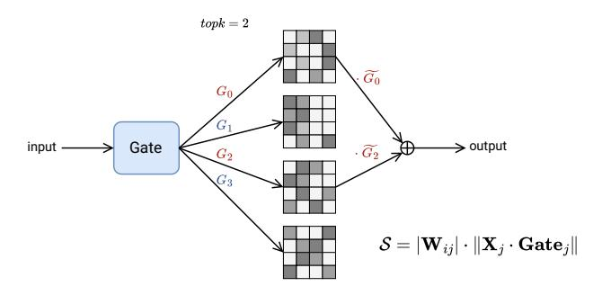

# MOE-PRUNER: PRUNING MIXTURE-OF-EXPERTS LARGE LANGUAGE MODEL USING THE HINTS FROM ITS ROUTER

Yanyue Xie $^{1*}$  Zhi Zhang $^2$  Ding Zhou $^2$  Cong Xie $^2$  Ziang Song $^2$  Xin Liu $^2$  Yanzhi Wang $^1$  Xue Lin $^1$  An Xu $^2$ †  $^1$ Northeastern University  $^2$ ByteDance Inc. {xie.yany, yanz.wang, xue.lin}@northeastern.edu {zhangzhi.joshua, ding.zhou, cong.xie, ziang.song, liuxin.ai, an.xu}@bytedance.com

#### **ABSTRACT**

Mixture-of-Experts (MoE) architectures face challenges such as high memory consumption and redundancy in experts. Pruning MoE can reduce network weights while maintaining model performance. Motivated by the recent observation of emergent large magnitude features in Large Language Models (LLM) and MoE routing policy, we propose MoE-Pruner, a method that prunes weights with the smallest magnitudes multiplied by the corresponding input activations and router weights, on each output neuron. Our pruning method is one-shot, requiring no retraining or weight updates. We evaluate our method on Mixtral-8x7B and Mixtral-8x22B across multiple language benchmarks. Experimental results show that our pruning method significantly outperforms state-of-the-art LLM pruning methods. Furthermore, our pruned MoE models can benefit from a pretrained teacher model through expert-wise knowledge distillation, improving performance post-pruning. Experimental results demonstrate that the Mixtral-8x7B model with 50% sparsity maintains 99% of the performance of the original model after the expert-wise knowledge distillation.

## 1 Introduction

Scaling neural network models is one of the main drivers of better performance in deep learning. From BERT (Devlin et al., 2019) to GPT-3 (Brown et al., 2020) to Llama 3.1 405B (Dubey et al., 2024) in natural language processing, or from ResNet (He et al., 2016) to ViT (Dosovitskiy et al., 2021) in computer vision, breakthroughs in performance have been obtained from larger models, datasets, and computational resources for training (Kaplan et al., 2020). However, the cost of training state-of-the-art models grows exponentially. For instance, BERT-Large (345M parameters, proposed in 2018) requires an estimated  $5 \times 10^{20}$  FLOPs (Devlin et al., 2019) to train, GPT-3 (175B parameters, from 2020) requires  $3.14 \times 10^{23}$  FLOPs (Brown et al., 2020), while Llama 3.1 (405B, released in 2024) requires  $3.8 \times 10^{25}$  FLOPs (Dubey et al., 2024) to train. This exponential growth motivates researchers to seek more efficient and effective training approaches.

Mixture-of-Experts (MoE) architectures (Jacobs et al., 1991; Shazeer et al., 2017) have been proposed to reduce the computing cost while enabling efficient scaling of network capacity. It has been successfully employed to scale both vision (Ruiz et al., 2021; Shen et al., 2023) and language (Lepikhin et al., 2021; Fedus et al., 2022) models. In addition, these models provide other advantages, including sparsity that can mitigate catastrophic forgetting in continual learning and an inductive bias that can enhance performance in multitask learning. Overall, MoE has proven to be a promising strategy for scaling deep learning models across various domains.

However, several crucial limitations persist in MoE for expanding its capacity. First of all, the static parameters, particularly those required for constructing the MoE architecture, introduce substantial

\*Work done during an internship at ByteDance.

&lt;sup>†Corresponding author.

memory overheads and constraints for deployment. For example, Mixtral-8x7B [\(Jiang et al., 2024\)](#page-11-2) expert layers account for 96% of model parameters (45B out of 47B), which demands considerable memory and storage during inference. Moreover, MoE has a poor utilization of its experts. The conventional learning-based routing policy for MoE suffers from representation collapse issues since it encourages token embeddings to be clustered around expert centroids [\(Chi et al., 2022\)](#page-10-4) and results in redundant experts [\(Mittal et al., 2022;](#page-13-3) [Chen et al., 2022\)](#page-10-5).

One possible solution to address those drawbacks and fully unleash the power of MoE is consolidating information from insignificant experts, aiming to establish a more compact MoE without hurting performance. Another solution is pruning experts that yield the lowest token reconstruction loss. Nevertheless, naively combining existing model merging mechanisms or expert pruning leads to performance degradation in the MoE architectures. We raise the following pivotal questions for MoE LLM pruning: (i) How do we formulate and devise comprehensive pruning metrics that leverage existing methods? (ii) How do we find the optimal pruning metric tailored for MoE Large Language Models?

In this paper, we systematically explore MoE LLM pruning and target a high-quality compressed MoE model in downstream fine-tuning scenarios. Specifically, we first analyze the open-source MoE model's expert activation frequency and observe that different MoE expert initialization methods result in different expert activation frequencies and expert similarities. We leverage existing LLM pruning methods such as SparseGPT [\(Frantar & Alistarh, 2023b\)](#page-11-3) and Wanda [\(Sun et al., 2024\)](#page-13-4), and design a novel pruning metric that incorporates MoE router weights information to identify and remove unimportant weights in expert layers. An overview of MoE-Pruner is shown in Figure [1.](#page-1-0) Since the pruning process is one-shot and only requires a small set of calibration data, the MoE model suffers from performance degradation. To recover MoE model performance, we further propose an expert-wise knowledge distillation method that utilizes the pretrained model as a teacher model, facilitating the recovery of the pruned model's performance.

Figure 1: Overview of MoE-Pruner. For the MoE expert layer, the output is the weighted sum of the outputs from selected experts over inputs. Gi denoted the routing logits and Gfi denotes the normalized router weight of each selected expert. Our pruning metric is the multiplication of weight magnitude and the norm of input activations by the router weights.

Our main contributions can be summarized as follows:

- We propose a novel framework, MoE-Pruner, that is efficient and effective for pruning MoE models with minimal performance degradation.
- We design an innovative expert-wise knowledge distillation method that leverages the pretrained MoE model as a teacher model to recover pruned MoE student model performance.
- Experimental results on Mixtral MoE models across nine zero-shot evaluation benchmarks demonstrate the effectiveness of our MoE-Pruner algorithm. MoE-Pruner achieves minimal performance drop even at 50% sparsity with only a small set of calibration data compared with existing pruning methods. The pruned model maintains 99% of the performance of the original model after the expert-wise knowledge distillation.

