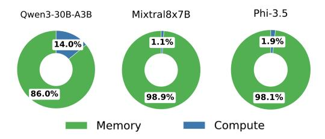
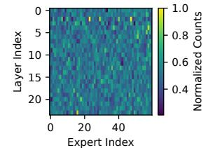

# MoE-SpeQ: Speculative Quantized Decoding with Proactive Expert Prefetching and Offloading for Mixture-of-Experts

Jiacheng Liu

Wenfeng Wang Shanghai Jiao Tong University Shanghai, China

Hong Kong University of Science and Technology Hongkong, China

Xiaofeng Hou† Shanghai Jiao Tong University Shanghai, China

Xinfeng Xia Shanghai Jiao Tong University China

Peng Tang Shanghai Jiao Tong University Shanghai, China

Mingxuan Zhang Shanghai Jiao Tong University Shanghai, China

Chao Li† Shanghai Jiao Tong University Shanghai, China

## Abstract

The immense memory requirements of state-of-the-art Mixtureof-Experts (MoE) models present a significant challenge for inference, often exceeding the capacity of a single accelerator. While offloading experts to host memory is a common solution, it introduces a severe I/O bottleneck over the PCIe bus, as the data-dependent nature of expert selection places these synchronous transfers directly on the critical path of execution, crippling performance.

This paper argues that the I/O bottleneck can be overcome by trading a small amount of cheap, on-device computation to hide the immense cost of data movement. We present MoE-SpeQ, a new inference system built on a novel co-design of speculative execution and expert offloading. MoE-SpeQ employs a small, on-device draft model to predict the sequence of required experts for future tokens. This foresight enables a runtime orchestrator to prefetch these experts from host memory, effectively overlapping the expensive I/O with useful computation and hiding the latency from the critical path. To maximize performance, an adaptive governor, guided by an Amortization Roofline Model, dynamically tunes the speculation strategy to the underlying hardware. Our evaluation on memory-constrained devices shows that for the Phi-MoE model, MoE-SpeQ achieves at most 2.34x speedup over the state-of-the-art offloading framework. Our work establishes a new, principled approach for managing data-dependent memory access in resource-limited environments, making MoE inference more accessible on commodity hardware.

## 1 Introduction

The Mixture-of-Experts (MoE) architecture [\[35\]](#page-13-0) is a cornerstone of state-of-the-art Large Language Models (LLMs). By routing each token through a subset of its vast parameter space, MoE models like Mixtral-8x7B [\[19\]](#page-13-1), Phi-MoE [\[1\]](#page-12-0),

Minyi Guo Shanghai Jiao Tong University Shanghai, China

Figure 1. Comparison of execution timelines. (a) The baseline is dominated by I/O stalls. (b) Our approach utilizes the initial I/O latency to perform speculative draft generation, effectively hiding latency and maximizing GPU utilization.

Qwen-MoE [\[48\]](#page-14-0), DeepSeek [\[15\]](#page-13-2), can achieve superior quality without a proportional increase in computational cost. This advantage comes at a price that an enormous memory footprint which presents a fundamental deployment challenge, as it far exceeds the memory capacity of a single accelerator.

This memory pressure forces a strategy of offloading: inactive expert parameters are stored in host DRAM, while the accelerator (GPU) fetches them on-demand over the PCIe bus [\[11,](#page-12-1) [36\]](#page-13-3). Consequently, the performance bottleneck shifts dramatically from computation to I/O. During autoregressive inference, each generated token can activate a new set of experts, triggering a slow data transfer that stalls the powerful GPU compute units. This recurring I/O latency dominates the end-to-end generation time, severely underutilizing the expensive accelerator hardware.

1

A natural approach to mitigate this I/O latency is prefetching [37, 40, 52]. However, its effectiveness hinges on accurately predicting which experts the *next* token will require, a task made exceptionally difficult by the strict sequential dependency of autoregressive generation. Simple heuristics are inaccurate, while specialized learning-based predictors lack generality and add significant overhead. This fundamental challenge in prediction leaves the I/O bottleneck unresolved.

This deadlock motivates our work, which stems from a key empirical observation: a quantized MoE model exhibits remarkable fidelity in its expert activation patterns relative to its full-precision parent. This insight reveals that a quantized model can serve as a natural, high-fidelity, zerotraining-cost predictor. It enables a new paradigm: using speculative decoding [4, 22] with a lightweight draft model to transform the I/O latency window into an opportunity for productive computation. As illustrated in Figure 1, by generating a draft sequence of future tokens during an initial I/O wait, the system gains an accurate, multi-step lookahead, allowing it to prefetch necessary experts for a subsequent, highly parallel verification step.

However, translating this elegant concept into a high-performance system requires overcoming three critical, interlocking system-level challenges. First, with an accurate multi-step lookahead, the system must devise an *intelligent prefetching and caching strategy*. The challenge shifts from prediction accuracy to resource management. The system must decide which of the predicted experts to prefetch and when, balancing the goal of maximizing the cache hit rate for the verification stage against the hard constraints of limited PCIe bandwidth and, more importantly, limited accelerator VRAM (Video RAM, such as GDDR - Graphics Double Data Rate memory or HBM - High Bandwidth Memory).

Second, the system must determine the *optimal draft length* in consideration of the verification stage. The number of speculative tokens, k, is a critical tuning parameter. A larger k can better amortize I/O and other system overheads, but it also increases the number of candidate experts, putting pressure on VRAM and potentially leading to lower overall throughput if the draft is frequently rejected. This creates a complex, hardware-dependent trade-off that must be dynamically managed.

Third, the system must execute the entire speculative work-flow efficiently. This requirement is twofold. The system must first ensure the draft generation phase is fast enough to achieve meaningful speedup, a non-trivial task given that a naive implementation of a quantized MoE model suffers from low arithmetic intensity and high kernel overheads. Concurrently, the system must also manage the significant memory pressure imposed by maintaining a second model and its associated state, along with the computational overheads of the verification stage, all within the constraints of limited accelerator VRAM.

To overcome these challenges, we design and build MoE-SpeQ, a complete system for high-performance MoE inference. MoE-SpeQ features an Expert Scheduler that acts on the draft model's predictions, using an Expert Lookahead Buffer (ELB) to orchestrate a hierarchical, entropy-aware caching policy and a near-optimal, lookahead-aware eviction strategy. This scheduler is governed by an adaptive Speculative Governor, which employs a novel Amortization Roofline Model to determine the optimal draft length k. The entire framework is enabled by a high-throughput, hybrid-precision Execution Engine, which uses a fused MoE kernel to accelerate the draft phase, computation reordering to optimize the verification stage, and shared non-expert parameters and KV cache to minimize the overall memory footprint. This synergy ensures the system to effectively conceal the I/O latency behind computation, while maintaining high prediction fidelity.

In summary, this paper makes the following contributions:

- We design and implement an Expert Scheduler that leverages multi-step lookahead via an Expert Lookahead Buffer (ELB) to manage data movement, featuring a hierarchical, entropy-aware caching policy and a near-optimal, lookahead-aware eviction strategy.
- We propose a *Speculative Governor*, a hardware-aware control plane guided by a novel *Amortization Roofline Model*, which dynamically determines the optimal speculative draft length.
- We develop a high-performance Execution Engine that employs a fused kernel for quantized MoE operations to accelerate drafting, computation reordering to optimize verification, and leverages parameter and KV cache sharing to reduce VRAM pressure.
- We build and evaluate MoE-SpeQ, a complete system integrating these techniques. Our comprehensive evaluation on three representative MoE architectures and under varying hardware constraints shows that MoE-SpeQ achieves end-to-end throughput improvements of up to 2.34× over state-of-the-art offloading frameworks.

#### 2 Background and Motivation

This section first provides background on MoE models [35] and the performance challenges of autoregressive inference with offloading. We then present a data-driven analysis to pinpoint the I/O bottleneck and introduce the key observation that motivates our work.

#### 2.1 Mixture-of-Experts Models

A standard Transformer model relies on dense feed-forward network (FFN) layers, where all parameters are engaged for every input token. The MoE architecture replaces these dense FFN layers with a sparse alternative. An MoE layer consists of two main components:

**Figure 2.** Speculative decoding in MoE.

- A set of N "expert" networks. Each expert is typically a standard FFN. In modern LLMs, these experts are replicated across multiple layers of the model.
- A router, or gating network. This is a small, trainable network that takes the hidden state of an input token and produces a probability distribution over the N experts.

During inference, for each token, the router dynamically selects a small subset of experts (e.g., the top-2) to process the token's hidden state. The outputs of the selected experts are then combined, weighted by their router scores. This sparse activation allows MoE models like Phi-MoE [1] to scale to hundreds of billions of parameters while keeping the floating-point operations (FLOPs) per token constant. However, the full set of parameters must still be stored, leading to massive memory requirements (e.g., >78GB for Phi-MoE in FP16).

#### 2.2 Speculative Decoding

Speculative decoding [4, 22] is a technique to accelerate autoregressive inference by reducing the number of sequential forward passes through a large language model. The core idea is to use a smaller, faster "draft model" to generate a sequence of candidate tokens, which are then verified by the original, more powerful "target model" in a single, parallel forward pass.

Figure 2 illustrates this process. First, in the **drafting** stage, a small draft model, which is fast and typically resides on the accelerator, autoregressively generates a short sequence of k candidate tokens. For instance, given the input "I Love Reading", the draft model in the figure speculates a three-token continuation: "the", "MoE", and "Tools".

Next, in the **verification** stage, the large target model takes the original input concatenated with the k draft tokens and performs a single forward pass. This efficiently computes the target model's true probability distributions for all potential next tokens at once. The draft tokens are then validated sequentially against the target model's predictions. In the example, the first two tokens ("the", "MoE") match the target model's outputs and are accepted. However, the third token ("Tools") mismatches the target's prediction ("Papers") and is rejected. The process halts at this point of divergence. The final output comprises the accepted prefix ("the", "MoE") plus one new token sampled from the target model's distribution at the point of rejection.

**Figure 3.** Performance comparison of decoding timelines. Speculative decoding provides a clear benefit for dense models by amortizing verification costs. For MoE models, however, the verification overhead becomes substantial, leading to performance degradation.

#### 2.3 Challenge of Speculative Decoding in MoE

While speculative decoding can yield significant speedups, its performance characteristics change dramatically when the target is an MoE model. Figure 3 visualizes this critical performance challenge by contrasting three decoding timelines.

- AutoReg (top row) shows standard autoregressive decoding, where each token requires a full, sequential pass through the model's attention and MoE blocks. This represents the latency baseline.
- SD in dense (middle row) shows speculative decoding on a conventional dense model. The verification pass for multiple tokens has only a *marginal* overhead, resulting in a clear performance *benefit* (hatched green area) by amortizing the cost of the target model pass.
- **SD** in **MoE** (bottom row) reveals the fundamental problem. During verification, each of the *k* speculative tokens processed in parallel may be routed to a *different set of experts*. To produce valid outputs, the system must load and compute the *union* of all experts activated across all *k* tokens. This dramatically inflates the computation and memory access costs of the MoE layers ('FFN verify in MoE', dark grey), creating a *substantial* overhead that can overwhelm any gains from amortization, leading to a net performance *degradation* (hatched red area).

Therefore, naively applying speculative decoding to MoE models is often counterproductive. The efficacy hinges not only on the draft model's accuracy but, more critically, on overcoming the disproportionate cost of parallel verification. This challenge necessitates a new approach that co-designs the speculation and verification processes specifically for the MoE architecture.

**Figure 4.** Latency breakdown for an inference step using offloading mechanism with Transformers on A100-PCIE-40G. GPU computation accounts for less than 15% of the total time, with the vast majority spent stalled on PCIe transfers.

#### 2.4 Characterizing the MoE Offloading Challenge

To precisely quantify the performance impact of the I/O bottleneck, we first profiled three representative MoE models using the standard offloading mechanism in the Hugging Face transformers library. The experiment was conducted on an A100-40G GPU (bfloat16 precision), measuring pertoken latency during the generation of 256 tokens for inputs from the GSM8K dataset.

The latency breakdown, shown in Figure 4, reveals a severe I/O-bound condition. For large models like Mixtral-8x7B, memory operations (Memory)—dominated by fetching experts over PCIe—consume a staggering 98.9% of the total time, leaving the powerful compute units idle. This empirical result confirms that offloaded MoE inference is fundamentally a data movement problem.

This naturally raises the question of why this I/O cannot be hidden with simple caching or prefetching. The answer lies in the highly dynamic and unpredictable nature of expert activation. Figure 5 delves into this behavior using Qwen-1.5MoE as an example. The heatmap in Figure 5a, which visualizes expert activation counts, shows a diffuse and varied pattern across all 24 layers. There are no consistently "hot" experts that could be easily cached; instead, token-level routing decisions spread the load widely. This observation is quantified in Figure 5b, which plots the activation entropy per layer. The consistently high entropy, close to the theoretical maximum, confirms that the router's choice is highly unpredictable from one token to the next.

This inherent unpredictability explains why naive heuristics like Least Recently Used (LRU) caching are ineffective. They are reactive, not predictive, and thus lead to frequent cache misses in the face of such dynamic access patterns. To overcome this challenge, we need a proactive approach that can accurately anticipate future expert needs to hide the crippling I/O latency.

#### 2.5 Opportunity: High-Fidelity Quantized Predictors

Our approach is motivated by a critical observation: while predicting the *exact* router probability distribution is hard, predicting the *outcome* of the router's top-k selection is much

- (a) fine-grain expert statistic
- (b) activation entropy per layer

**Figure 5.** Expert activation in Qwen-1.5MoE is highly diverse and non-uniform, reflected in (a) unbalanced activation counts per expert, and (b) consistently high activation entropy across layers.

**Figure 6.** Fidelity of expert selection between a 4-bit quantized Qwen-MoE draft model and its FP16 parent. The quantized model accurately predicts the top-4 experts chosen by the full-precision model over 90.9% of the time, averaged across all tokens. Total fidelity is composed of hard fidelity (entirely identical expert selections) and soft fidelity (same expert identification numbers but in varied orders).

more feasible. Specifically, we find that *a heavily quantized* version of an MoE model acts as a high-fidelity predictor for its full-precision counterpart. A quantized model is much smaller and can reside entirely in VRAM, enabling it to run as an extremely fast, low-overhead oracle.

To validate this, we measured the expert selection fidelity between a full-precision FP16 Qwen-MoE model (the target) and a 4-bit quantized (INT4) version (the draft) on the same input sequences. For each token, we compare the set of top-4 experts selected by the draft model against the set selected by the target. We categorize the outcomes as follows:

- **Hard Matches:** The draft model predicts the exact same set of experts in the identical order of importance.
- Soft Matches: The draft model predicts the correct set of experts, but their ranking (order of importance) differs.
- Mismatches: The set of experts predicted by the draft model is not identical to the set chosen by the target, meaning at least one expert was incorrectly predicted.

Figure 6 presents the results, which show a remarkably high fidelity. The INT4 draft model achieves a 90.9% total

accurate prediction rate. This result even outperforms a specialized, one-layer-ahead predictor, which only reaches 84.7% accuracy [37], and this quantized predictor can predict all layers simultaneously in a single pass. This success is composed of 44.1% Hard Matches and a substantial 46.8% Soft Matches. From a system prefetching perspective, both outcomes are highly effective. Conversely, Mismatches occur in only 9.1% of cases. Crucially, a mismatch does not imply a total failure; it simply means at least one of the top-4 experts was not anticipated. The low frequency of these events underscores the overall reliability of the predictive approach.

This high-fidelity, low-cost predictability is the cornerstone of our approach. It demonstrates that a fast, on-chip draft model can provide a reliable lookahead, generating the precise information needed to orchestrate PCIe transfers and effectively hide the I/O latency that cripples conventional offloading systems.

