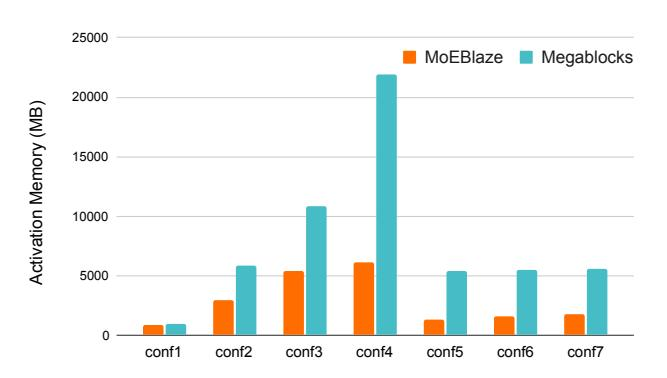
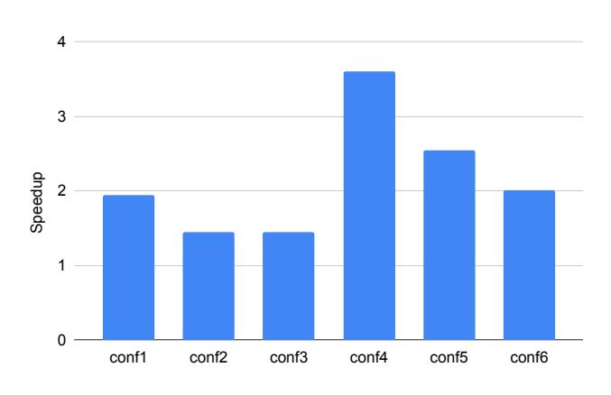
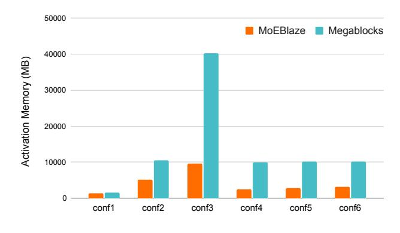
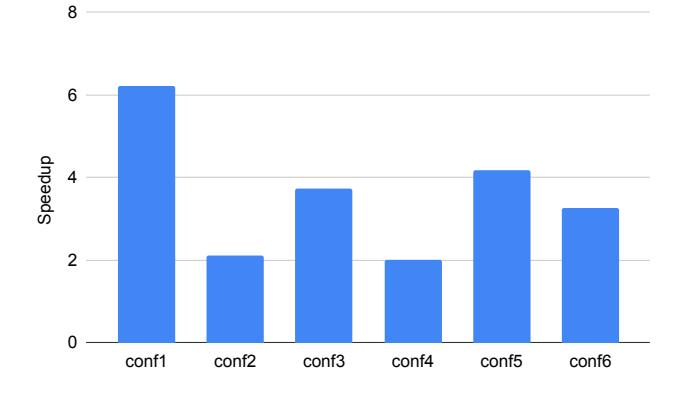

# 5 TRAINING-KERNEL CO-DESIGN FOR END-TO-END EFFICIENCY

This section details our approach to jointly optimize the Mixture-of-Experts training kernels and smart activation checkpointing method to address the memory issues associated with some advanced activation methods.

#### 5.1 SwiGLU MoE and the Memory Bottleneck

Modern MoE training has increasingly adopted advanced non-linear activations such as *SiLU* and *SwiGLU* in place of ReLU/GELU. Prior work shows these activations provide smoother nonlinearity, which can improve optimization stability and lead to better empirical accuracy on large-scale language tasks. While numerically favorable, these activations introduce more complex compute and larger memory footprint during training. We take the SwiGLU activation as an example. The SwiGLU activation is defined as:

$$SwiGLU(\mathbf{x}; W_1, W_2) = SiLU(\mathbf{x}W_1) \cdot (\mathbf{x}W_2),$$

where  $\mathrm{SiLU}(u)=u\cdot\sigma(u)$  and  $\sigma$  is the sigmoid operation. For an MoE layer with E experts, each implementing a SwiGLU Feed-Forward Network (FFN), a routed batch of tokens  $x\in\mathbb{R}^{L\times d}$  for a single expert induces two projections:  $a=xW_1\in\mathbb{R}^{L\times h}$  and  $b=xW_2\in\mathbb{R}^{L\times h}$ . This is followed by the element-wise operations  $\mathrm{SiLU}(a)$  and the final product  $\mathrm{SiLU}(a)\odot b$ .

#### 5.2 Activation Checkpoint and Kernel Codesign

In conventional kernels, the forward pipeline necessitates materializing multiple intermediates in order to accommodate the backward computation (e.g., in the SwiGLU example, it includes the two GEMM outputs a and b, the sigmoid  $\sigma(a)$ , SiLU(a), and the final product). These intermediate results are written to and subsequently read from global memory, which incurs non-negligible overheads. As models and batch sizes scale, this incurs significant memory traffic and storage costs, which quickly becomes a non-negligible bottleneck.

To mitigate the observed memory pressure, we present a joint optimization of the MoE training flow and its underlying GPU kernels that reduces the activation memory footprint and memory traffic without sacrificing performance. Our optimization is based on below observations:

- Computation of activation functions is generally memory bandwidth bound on modern GPUs due to two primary reasons: 1) activation function's computation is mostly point-wise operations and modern GPU is highly capable of such operations, 2) in LLM training, we are usually handling the case where the number of tokens is far larger than the embedding dimension  $L\gg d$ . Operations on matrices of this tall-and-skinny shape are generally memory bandwidth bound on GPUs.
- While activation computation is computationally light, its memory footprint is surprisingly significant. This is particularly true for complex, modern activation functions, which requires materialization and saving many intermediate, point-wise results for the backward pass. The resulting memory allocation is substantial, scaling linearly with the batch size, sequence length, and FFN dimensions. In the context of today's trillion-token training environments, the memory required to store these activations can be prohibitive.

Based on this observations, we propose the joint activation checkpoint and kernel fusion approach. Our approach fuses the two first-layer projections in SwiGLU with the activation epilogue, and applies activation checkpoint in the specialized path to "break the memory wall" arising from intermediate activation storage.

To reduce activation traffic and kernel launch overhead, we fuse both first-layer projections and the SwiGLU epilogue into a single kernel. The kernel consumes non-materialized routed tokens, loads the input x only once, streams it through both  $(W_1, W_2)$  GEMMs simultaneously, computes  $\mathrm{SiLU}(a)$  in register/shared memory, and immediately performs the multiplication with b, writing only the final output to global memory.

This "epilogue fusion" eliminates global writes of a, b and subsequent re-reads for elementwise operations, effectively moving computation from the memory-bound domain to the compute-bound domain where possible. It also halves the input reads of x compared to separate kernels for each projection.

During backward, fusing the two first-layer projections implies that gradients w.r.t. the shared input x from both paths must be aggregated. Rather than allocating two separate activation buffers and stitching them, our implementation computes the two branches' activation derivatives in a fused

fashion and aggregates gradients in-place via tiled reductions—completely eliminating temporary global buffers.

On top of the fusion, we further applied the activation check-point strategy – where we skip saving the SwiGLU intermediate result (SiLU) during forward. Instead, we adopt a recomputation strategy during the backward pass, leveraging the fact that the SiLU function is computationally inexpensive (e.g elementwise operation), and are heavily memory bandwidth bounded on modern GPUs.

#### Algorithm 1 Fused SwiGLU MoE Training

**Input:** Input Tokens  $X \in \mathbb{R}^{L \times d}$ , Projection Weights  $W_1, W_2 \in \mathbb{R}^{d \times h}, W_3 \in \mathbb{R}^{h \times d}$ ,

**Output:** Output  $Y_{\text{out}} \in \mathbb{R}^{L \times d}$ , Gradients  $\nabla W_1, \nabla W_2, \nabla W_3, \nabla Z$ 

- 1: // Forward module for Swiglu MoE training
- 2: **Procedure FusedForward** $(X, W_1, W_2, W_3)$
- 3: // Load input tokens once
- 4: **Load** *X*
- 5: // 1st MLP projection:
- 6: // Compute A and B;
- 7: // SiLU(A) and  $Y_{swi}$  computed in-kernel
- 8: // SiLU(A) is transient
- 9:  $(A, B), Y_{\text{swi}} \leftarrow \text{Fused\_SwiGLU}(Z, W_1, W_2)$
- 10:  $Y_{\text{out}} \leftarrow Y_{\text{swi}} W_3$
- 11: **Store**  $A, B, Y_{\text{swi}}$
- 12: // Store activations and SwiGLU output for backward
- 13: **Return**  $Y_{\text{out}}$
- 14:

#### 15: Procedure FusedBackward

- 16:  $(Y_{\text{out}}, \nabla Y_{\text{out}}, W_1, W_2, W_3, A, B, Y_{\text{swi}})$
- 17: // Gradient for final projection
- 18:  $\nabla W_3 \leftarrow Y_{\text{swi}}^T \nabla Y_{\text{out}}$
- 19: // Backpropagate gradient to SwiGLU output
- 20:  $\nabla Y_{\text{swi}} \leftarrow \nabla Y_{\text{out}} W_3^T$
- 21: // Load stored activations
- 22: **Load** *A*, *B*
- 23: // Recomputes SiLU(A) to save memory
- 24:  $S_{\text{recomp}} \leftarrow \text{SiLU}(A)$
- 25: // Derivative w.r.t A
- 26:  $\nabla A \leftarrow \nabla Y_{\text{swi}} \odot B \odot \nabla \text{SiLU}(A)$
- 27: // Derivative w.r.t B
- 28:  $\nabla B \leftarrow \nabla Y_{\text{swi}} \odot S_{\text{recomp}}$
- 29:  $\nabla W_1, \nabla W_2 \leftarrow \text{FusedBwdW}(X, \nabla A, \nabla B)$
- 30:  $\nabla X \leftarrow \text{FusedBwdX}(\nabla AW_1^T, \nabla BW_2^T)$
- 31: **Return**  $\nabla W_1, \nabla W_2, \nabla W_3, \nabla Z$

#### 5.3 Putting It Together: E2E Training on Swiglu MoE

Algorithm 1 summarizes the end-to-end training process for an MoE model utilizing the SwiGLU activation function. The pseudo-code specifically demonstrates the integration of activation checkpoint and kernel fusion detailed in sec-

Table 1. MoE configurations used in experiments. The FFN hidden dim is set to be four times the input dimension (ffn hidden size = 4 × input d).

|       | INPUT D | EXPERTS # | K | BATCH | SEQ LEN |
|-------|---------|-----------|---|-------|---------|
| CONF1 | 512     | 4         | 1 | 32    | 2048    |
| CONF2 | 1024    | 8         | 2 | 32    | 2048    |
| CONF3 | 1024    | 16        | 4 | 32    | 2048    |
| CONF4 | 2048    | 16        | 4 | 32    | 1024    |
| CONF5 | 512     | 16        | 4 | 32    | 1024    |
| CONF6 | 1024    | 16        | 4 | 16    | 1024    |
| CONF7 | 2048    | 8         | 4 | 16    | 512     |
|       |         |           |   |       |         |

tion [5.](#page-5-0) While the low-level implementation of the fused kernels is omitted for brevity, the high-level methodology is derived from the memory-efficient token dispatch explained in section [3.](#page-2-0)

## 6 EXPERIMENTS

In this section, we benchmark MoEBlaze against the current state-of-the-art sparse training system, Megablocks ??, demonstrating significant improvements in both training speed and memory efficiency across a range of representative Mixture-of-Experts (MoE) configurations.

#### 6.1 Experiment Setups

We conducted all experiments on a single NVIDIA H100 Tensor Core GPU. The software stack utilizes PyTorch 2.0.1 and CUDA 12.1. We measure end-to-end training time for a single MoE layer, focusing on the Sparse-to-Sparse computation phase. We evaluate performance with two different activation functions: ReLU (Rectified Linear Unit) and SwiGLU (Swish-Gated Linear Unit).

We selected a set of seven representative MoE configurations that explore varied dimensions for the input hidden size (d), the number of experts (E), the top-k tokens routed to experts, and common training parameters (sequence length L and batch size B). The specific configurations, which mimic common settings in large language models, are detailed in Table 1.

#### 6.2 Baselines and Metrics

Our primary baseline for comparison is Megablocks, a system that optimizes MoE training through custom kernels and efficient token dispatch, serving as the industry standard for high-performance sparse training.

We evaluate performance using two key metrics: (1) Training Speed: measured as the speedup factor of MoEBlaze relative to Megablocks in an end-to-end single training pass. The training time includes both forward and backward

passes, but we exclude optimizer updates as optimizer is irrelavant to both approach designs. Higher values indicate better performance. (2) Activation Memory Consumption: measured as the total memory allocated to save the intermediate activation tensors for given inputs. To measure the activation memory, we utilize PyTorch's saved tensor hooks to trace and calculate the exact activation space allocated during model training with the given input configuration.

#### 6.3 Memory Efficiency in MoE Training using SiLU

As shown in Figure 3, MoEBlaze consistently and significantly reduces activation memory consumption compared to the Megablocks baseline across all tested configurations.

The memory savings achieved by MoEBlaze are especially significant in configurations characterized by large input dimensions and high expert counts, such as conf4. Specifically, MoEBlaze requires only 6, 100 MB of memory, achieving a nearly 3.6× reduction compared to the 22, 000 MB consumed by Megablocks. For smaller configurations (e.g., conf1), the activation memory saving is less pronounced, which is expected since the savings scale proportionally with the sequence length L and the number of activated experts k, both of which are small in conf1 (k = 1). This substantial reduction in peak activation memory is a direct outcome of two core system innovations: (1) a more memory-efficient token dispatch mechanism that minimizes intermediate buffer allocations, and (2) the adoption of smart recomputation within our custom activation checkpoint scheme.

Figure 3. Activation memory footprint comparison between MoE-Blaze and Megablocks across the set of MoE configs defined in Table 1 using SiLU activation function.

#### 6.4 Training Speed in SiLU-based MoEs

Figure [4](#page-8-0) illustrates the training speedup of MoEBlaze over Megablocks over the given configurations. MoEBlaze achieves notable performance gains, showing a speedup factor of 1.4× to 3.7×.

The maximum speedup is achieved at conf4 (Dinput = 2048, E = 16, L = 1024, B = 32), demonstrating that MoEBlaze scales particularly well with larger model dimensions. This training speeds are attributed to three factors: (1) our highly optimized token dispatch implementation, which reduces the latency overheads associated with expensive token dispatch and permute operations; (2) the efficient data dispatch construction kernels, which is very light-weight and runs rapidly on GPUs, avoiding the expensive multiplepasses kernel in other sorting-based approaches and greatly eliminating the CPU-side bottlenecks. (3) the fused kernel for the batched-GEMM computations that effectively leverages H100's latest hardware acceleration features such as warp-group matrix multiplication, tensor memory accelerator, etc.

Figure 4. Speedups of MoEBlaze w.r.t to Megablocks on the set of configurations in Table [1](#page-7-0) using SiLU as the activation function.

## 6.5 Memory Efficiency in MoE Training with SwiGLU

The SwiGLU activation function inherently requires higher memory usage due to the additional gating and elementwise multiplication operations. Figure 5 shows the memory consumption comparison under the SwiGLU setting. MoEBlaze maintains a substantial memory advantage over Megablocks, with peak activation memory often less than half of the baseline's usage. For instance, in configuration conf3, Megablocks requires over 40, 000 MB, while MoEBlaze is contained to approximately 10, 000 MB. This consistent 4× reduction in memory pressure confirms that our memory-efficient dispatch and smart recomputation schemes are highly effective even for more complex activation functions.

#### 6.6 Training Speed in SwiGLU-based MoEs

Figure 4 presents the speedup of MoEBlaze relative to Megablocks when using the SwiGLU activation. Compared to the ReLU results, the speedup factors are generally higher and more consistent, ranging from 2× to 6.2×. The increased relative speed is a result of two factors: (1) The more complex computation in SwiGLU exposes greater opportunities for MoEBlaze's highly fused kernels to outperform the baseline; and (2) the memory-bandwidth savings from our activation optimization are more critical in the SwiGLU case, where intermediate activation sizes are larger and more compound, thereby reducing the excessive global memory accesses through smart kernel fusion and recomputation allows MoEBlaze to execute the whole kernel faster.

Figure 5. Activation memory footprint comparison between MoE-Blaze and Megablocks across the set of MoE configs defined in Table [1](#page-7-0) using SwiGLU activation function.

Figure 6. Speedups of MoEBlaze w.r.t to Megablocks on the set of configurations in Table [1](#page-7-0) using SiLU as the activation function.

## 7 RELATED WORK

MoE architectures and scaling. Scaling laws and empirical studies established that model performance improves predictably with compute, dataset size, and parameter count [\(Kaplan et al.,](#page-10-0) [2020;](#page-10-0) [Hoffmann et al.,](#page-10-0) [2022\)](#page-10-0). GPT-3 demonstrated few-shot generalization at 175B parameters [\(Brown et al.,](#page-10-0) [2020\)](#page-10-0), while follow-on models explored scaling in parameters, training data, and context length (e.g., Gopher at 280B [\(Rae et al.,](#page-11-0) [2022\)](#page-11-0); PaLM at 540B [\(Chowdhery et al.,](#page-10-0) [2023\)](#page-10-0)). Open foundation models such as LLaMA [\(Touvron et al.,](#page-11-0) [2023\)](#page-11-0) accelerated progress by enabling reproducibility and broad evaluation. More recently, proprietary systems improved multimodal integration and long-context capabilities (e.g., GPT-4 [\(OpenAI et al.,](#page-11-0) [2024\)](#page-11-0), Gemini [\(Team et al.,](#page-11-0) [2023\)](#page-11-0)), while open releases distilled insights from such systems (Gemma [\(Team et al.,](#page-11-0) [2024\)](#page-11-0)). These trends increase pressure on both throughput and memory, particularly under longer contexts and larger hidden dimensions.

Mixture-of-Experts (MoE) was popularized for scaling neural networks via sparse conditional computation, initially in recurrent architectures with the Sparsely-Gated MoE formulation [\(Shazeer et al.,](#page-11-0) [2017\)](#page-11-0). Subsequent work demonstrated large-scale Transformer-based MoEs with automatic sharding and conditional computation in production-scale systems (e.g., GShard) [\(Samuel,](#page-11-0) [1959\)](#page-11-0). Switch Transformers replaced top-k expert selection with top-1 to simplify routing and improve throughput [\(Fedus et al.,](#page-10-0) [2022\)](#page-10-0). GLaM explored large-scale MoE training with expert sparsity and strong efficiency–quality tradeoffs [\(Du et al.,](#page-10-0) [2021\)](#page-10-0). In the open-source ecosystem, Mixtral 8×7B employs top-2 routing with strong performance at 32k context [\(Jiang et al.,](#page-10-0) [2024\)](#page-10-0), while DeepSeek-V3 reports a 671B-parameter MoE with 37B active parameters per token and efficient largescale training [\(DeepSeek-AI et al.,](#page-10-0) [2025\)](#page-10-0).

Systems for MoE training and routing. Early GPU-first stacks such as FastMoE offered a PyTorch-based distributed MoE system with practical acceleration and multi-node expert placement [\(He et al.,](#page-10-0) [2021\)](#page-10-0). Tutel proposed Flex, a design enabling runtime-adaptive parallelism and pipelining to handle routing-induced workload variability, showing large speedups across scales [\(Hwang et al.,](#page-10-0) [2023\)](#page-10-0). DeepSpeed-MoE introduced both training and inference optimizations to support next-generation MoE at scale [\(Rajbhandari et al.,](#page-11-0) [2022\)](#page-11-0). MegaBlocks reformulated MoE computation as block-sparse operations to avoid padding or token dropping and map well to GPUs [\(Gale et al.,](#page-10-0) [2023\)](#page-10-0). TurboMoE argued the gating path is a core bottleneck and introduced fused, metadata-driven kernels and data-layout transformations that reduce sparse-compute overheads and improve large-scale throughput [\(Aminabadi et al.,](#page-10-0) [2025\)](#page-10-0).

Routing policies, load balancing, and capacity. MoE quality and efficiency depend on the router. The auxiliary load-balancing loss in Sparsely-Gated MoE mitigates expert imbalance [\(Shazeer et al.,](#page-11-0) [2017\)](#page-11-0); Switch Transformers adopted top-1 routing plus capacity constraints to reduce compute and simplify gather/scatter [\(Fedus et al.,](#page-10-0) [2022\)](#page-10-0). GShard explored routing and tensor-sharding policies at massive scale [\(Lepikhin et al.,](#page-11-0) [2021\)](#page-11-0). Open MoE models such as Mixtral use top-2 routing and capacity factors tuned for stability and throughput [\(Jiang et al.,](#page-10-0) [2024\)](#page-10-0). DeepSeek-V3 further reports an auxiliary-loss-free strategy for load balancing while scaling training to very large regimes [\(DeepSeek-AI et al.,](#page-10-0) [2025\)](#page-10-0). Across these designs, routing capacity and token dropping vs. padding interact with both throughput and memory pressure, particularly at long contexts.

Kernel and performance optimization. GPU performance for MoE hinges on data movement minimization and on-chip residency. MegaBlocks leverages block-sparse kernels to avoid wasteful dense padding [\(Gale et al.,](#page-10-0) [2023\)](#page-10-0), and TurboMoE fuses gating, scatter/gather, and expert combination with tailored kernels that avoid expensive sparse MMs [\(Aminabadi et al.,](#page-10-0) [2025\)](#page-10-0). Complementary to sparse mapping and orchestration, architecture-conscious fusion can shorten activation lifetimes (e.g., fusing non-linearities such as SiLU/SwiGLU with expert GEMMs) and reduce read/write traffic. Our work (MoEBlaze) advances this line by eliminating per-expert routed activation buffers via compact metadata and co-fusing routing and expert compute in microarchitecture-optimized kernels for current-generation GPUs.

## 8 CONCLUSION AND FUTURE WORK

We present MoEBlaze, a fast and memory efficient system for MoE training on GPU. MoEBlaze eliminating the need for materializing large per-expert activation buffers with fused token dispatch and compute kernel designs. Furthermore, MoEBlaze consolidates the MoE computation and activation pipelines to minimize read/write traffic for better memory bandwidth savings and footprint reduction. Our experimental shows that MoEBlaze provides a highly efficient and scalable solution across a range of configurations with over 4× reduction in peak activation memory consumption and delivers end-to-end training speedups reaching 6.2×.

While this paper primarily focuses on single-device performance, we note that the core mechanisms of MoEBlaze are also applicable to distributed settings. As furture work, we plan to extend MoEBlaze to distributed training frameworks and study the optimizations for multi-node, multi-GPU MoE training.

## 9 ACKNOWLEDGMENTS

We gratefully acknowledge Carole-Jean Wu for insightful discussions and consultation. We are also grateful to Hongtao Yu for his expertise and support on the Triton language..

## REFERENCES

- Aminabadi, R. Y., Holmes, C., Rajbhandari, S., Yao, Z., and He, Y. Turbomoe: Enhancing moe model training with smart kernel-fusion and data transformation. 2025.
- Brown, T. B., Mann, B., Ryder, N., Subbiah, M., Kaplan, J., Dhariwal, P., Neelakantan, A., Shyam, P., Sastry, G., Askell, A., Agarwal, S., Herbert-Voss, A., Krueger, G., Henighan, T., Child, R., Ramesh, A., Ziegler, D. M., Wu, J., Winter, C., Hesse, C., Chen, M., Sigler, E., Litwin, M., Gray, S., Chess, B., Clark, J., Berner, C., McCandlish, S., Radford, A., Sutskever, I., and Amodei, D. Language models are few-shot learners. In *Proceedings of the 34th International Conference on Neural Information Processing Systems*, NIPS '20, Red Hook, NY, USA, 2020. Curran Associates Inc. ISBN 9781713829546.
- Chowdhery, A., Narang, S., Devlin, J., Bosma, M., Mishra, G., Roberts, A., Barham, P., Chung, H. W., Sutton, C., Gehrmann, S., Schuh, P., Shi, K., Tsvyashchenko, S., Maynez, J., Rao, A., Barnes, P., Tay, Y., Shazeer, N., Prabhakaran, V., Reif, E., Du, N., Hutchinson, B., Pope, R., Bradbury, J., Austin, J., Isard, M., Gur-Ari, G., Yin, P., Duke, T., Levskaya, A., Ghemawat, S., Dev, S., Michalewski, H., Garcia, X., Misra, V., Robinson, K., Fedus, L., Zhou, D., Ippolito, D., Luan, D., Lim, H., Zoph, B., Spiridonov, A., Sepassi, R., Dohan, D., Agrawal, S., Omernick, M., Dai, A. M., Pillai, T. S., Pellat, M., Lewkowycz, A., Moreira, E., Child, R., Polozov, O., Lee, K., Zhou, Z., Wang, X., Saeta, B., Diaz, M., Firat, O., Catasta, M., Wei, J., Meier-Hellstern, K., Eck, D., Dean, J., Petrov, S., and Fiedel, N. Palm: scaling language modeling with pathways. *J. Mach. Learn. Res.*, 24(1), January 2023. ISSN 1532-4435.
- DeepSeek-AI, Liu, A., Feng, B., Xue, B., Wang, B., Wu, B., Lu, C., Zhao, C., Deng, C., Zhang, C., Ruan, C., Dai, D., Guo, D., Yang, D., Chen, D., Ji, D., Li, E., Lin, F., Dai, F., Luo, F., et al. Deepseek-v3 technical report, 2025. URL <https://arxiv.org/abs/2412.19437>.
- Du, N., Huang, Y., Dai, A. M., Tong, S., Lepikhin, D., Xu, Y., Krikun, M., Zhou, Y., Yu, A. W., Firat, O., Zoph, B., Fedus, L., Bosma, M., Zhou, Z., Wang, T., Wang, Y. E., Webster, K., Pellat, M., Robinson, K., Meier-Hellstern, K. S., Duke, T., Dixon, L., Zhang, K., Le, Q. V., Wu, Y., Chen, Z., and Cui, C. Glam: Efficient scaling of language models with mixture-of-experts. In *International Conference on Machine Learning*,

- 2021. URL [https://api.semanticscholar.](https://api.semanticscholar.org/CorpusID:245124124) [org/CorpusID:245124124](https://api.semanticscholar.org/CorpusID:245124124).
- Elfwing, S., Uchibe, E., and Doya, K. Sigmoid-weighted linear units for neural network function approximation in reinforcement learning. *CoRR*, abs/1702.03118, 2017. URL <http://arxiv.org/abs/1702.03118>.
- Fedus, W., Zoph, B., and Shazeer, N. Switch transformers: scaling to trillion parameter models with simple and efficient sparsity. *J. Mach. Learn. Res.*, 23(1), January 2022. ISSN 1532-4435.
- Gale, T., Narayanan, D., Young, C., and Zaharia, M. Megablocks: Efficient sparse training with mixture-ofexperts. In Song, D., Carbin, M., and Chen, T. (eds.), *Proceedings of Machine Learning and Systems*, volume 5, pp. 288–304. Curan, 2023.
- He, J., Qiu, J., Zeng, A., Yang, Z., Zhai, J., and Tang, J. Fastmoe: A fast mixture-of-expert training system. *CoRR*, abs/2103.13262, 2021. URL [https://arxiv.org/](https://arxiv.org/abs/2103.13262) [abs/2103.13262](https://arxiv.org/abs/2103.13262).
- Hoffmann, J., Borgeaud, S., Mensch, A., Buchatskaya, E., Cai, T., Rutherford, E., de Las Casas, D., Hendricks, L. A., Welbl, J., Clark, A., Hennigan, T., Noland, E., Millican, K., van den Driessche, G., Damoc, B., Guy, A., Osindero, S., Simonyan, K., Elsen, E., Vinyals, O., Rae, J. W., and Sifre, L. Training compute-optimal large language models. In *Proceedings of the 36th International Conference on Neural Information Processing Systems*, NIPS '22, Red Hook, NY, USA, 2022. Curran Associates Inc. ISBN 9781713871088.
- Hwang, C., Cui, W., Xiong, Y., Yang, Z., Liu, Z., Hu, H., Wang, Z., Salas, R., Jose, J., Ram, P., Chau, H., Cheng, P., Yang, F., Yang, M., and Xiong, Y. Tutel: Adaptive mixture-of-experts at scale. In Song, D., Carbin, M., and Chen, T. (eds.), *Proceedings of Machine Learning and Systems*, volume 5, pp. 269–287. Curan, 2023.
- Jiang, A. Q., Sablayrolles, A., Roux, A., Mensch, A., Savary, B., Bamford, C., Chaplot, D. S., de Las Casas, D., Hanna, E. B., Bressand, F., Lengyel, G., Bour, G., Lample, G., Lavaud, L. R., Saulnier, L., Lachaux, M., Stock, P., Subramanian, S., Yang, S., Antoniak, S., Scao, T. L., Gervet, T., Lavril, T., Wang, T., Lacroix, T., and Sayed, W. E. Mixtral of experts. *CoRR*, abs/2401.04088, 2024. doi: 10.48550/ARXIV.2401.04088. URL [https:](https://doi.org/10.48550/arXiv.2401.04088) [//doi.org/10.48550/arXiv.2401.04088](https://doi.org/10.48550/arXiv.2401.04088).
- Kaplan, J., McCandlish, S., Henighan, T., Brown, T. B., Chess, B., Child, R., Gray, S., Radford, A., Wu, J., and Amodei, D. Scaling laws for neural language models. *CoRR*, abs/2001.08361, 2020. URL [https://arxiv.](https://arxiv.org/abs/2001.08361) [org/abs/2001.08361](https://arxiv.org/abs/2001.08361).

- Lepikhin, D., Lee, H., Xu, Y., Chen, D., Firat, O., Huang, Y., Krikun, M., Shazeer, N., and Chen, Z. Gshard: Scaling giant models with conditional computation and automatic sharding. In *9th International Conference on Learning Representations, ICLR 2021, Virtual Event, Austria, May 3-7, 2021*. OpenReview.net, 2021. URL [https:](https://openreview.net/forum?id=qrwe7XHTmYb) [//openreview.net/forum?id=qrwe7XHTmYb](https://openreview.net/forum?id=qrwe7XHTmYb).
- OpenAI, Achiam, J., Adler, S., Agarwal, S., Ahmad, L., Akkaya, I., Aleman, F. L., Almeida, D., Altenschmidt, J., Altman, S., Anadkat, S., Avila, R., Babuschkin, I., Balaji, S., Balcom, V., Baltescu, P., Bao, H., Bavarian, M., Belgum, J., Bello, I., Berdine, J., Bernadett-Shapiro, G., Berner, C., Bogdonoff, L., Boiko, O., Boyd, M., Brakman, A.-L., Brockman, G., Brooks, T., Brundage, M., Button, K., Cai, T., Campbell, R., Cann, A., Carey, B., Carlson, C., Carmichael, R., Chan, B., Chang, C., Chantzis, F., Chen, D., Chen, S., Chen, R., Chen, J., Chen, M., Chess, B., Cho, C., Chu, C., Chung, H. W., Cummings, D., Currier, J., Dai, Y., Decareaux, C., Degry, T., et al. Gpt-4 technical report, 2024. URL [https://arxiv.org/](https://arxiv.org/abs/2303.08774) [abs/2303.08774](https://arxiv.org/abs/2303.08774).
- Rae, J. W., Borgeaud, S., Cai, T., Millican, K., Hoffmann, J., Song, F., Aslanides, J., Henderson, S., Ring, R., Young, S., Rutherford, E., Hennigan, T., Menick, J., Cassirer, A., Powell, R., van den Driessche, G., Hendricks, L. A., Rauh, M., Huang, P.-S., Glaese, A., Welbl, J., Dathathri, S., Huang, S., Uesato, J., Mellor, J., Higgins, I., Creswell, A., McAleese, N., Wu, A., Elsen, E., Jayakumar, S., Buchatskaya, E., Budden, D., Sutherland, E., Simonyan, K., Paganini, M., Sifre, L., Martens, L., Li, X. L., Kuncoro, A., Nematzadeh, A., Gribovskaya, E., , et al. Scaling language models: Methods, analysis & insights from training gopher, 2022. URL <https://arxiv.org/abs/2112.11446>.
- Rajbhandari, S., Li, C., Yao, Z., Zhang, M., Aminabadi, R. Y., Awan, A. A., Rasley, J., and He, Y. DeepSpeed-MoE: Advancing mixture-of-experts inference and training to power next-generation AI scale. In Chaudhuri, K., Jegelka, S., Song, L., Szepesvari, C., Niu, G., and Sabato, S. (eds.), *Proceedings of the 39th International Conference on Machine Learning*, volume 162 of *Proceedings of Machine Learning Research*, pp. 18332–18346. PMLR, 17–23 Jul 2022. URL [https://proceedings.mlr.](https://proceedings.mlr.press/v162/rajbhandari22a.html) [press/v162/rajbhandari22a.html](https://proceedings.mlr.press/v162/rajbhandari22a.html).
- Ramachandran, P., Zoph, B., and Le, Q. V. Searching for activation functions. *CoRR*, abs/1710.05941, 2017. URL <http://arxiv.org/abs/1710.05941>.
- Samuel, A. L. Some studies in machine learning using the game of checkers. *IBM Journal of Research and Development*, 3(3):211–229, 1959.

- Shazeer, N. GLU variants improve transformer. *CoRR*, abs/2002.05202, 2020. URL [https://arxiv.org/](https://arxiv.org/abs/2002.05202) [abs/2002.05202](https://arxiv.org/abs/2002.05202).
- Shazeer, N., Mirhoseini, A., Maziarz, K., Davis, A., Le, Q. V., Hinton, G. E., and Dean, J. Outrageously large neural networks: The sparsely-gated mixture-of-experts layer. In *5th International Conference on Learning Representations, ICLR 2017, Toulon, France, April 24-26, 2017, Conference Track Proceedings*. OpenReview.net, 2017. URL [https://openreview.net/forum?](https://openreview.net/forum?id=B1ckMDqlg) [id=B1ckMDqlg](https://openreview.net/forum?id=B1ckMDqlg).
- Team, G., Anil, R., Borgeaud, S., Alayrac, J.-B., Yu, J., Soricut, R., Schalkwyk, J., Dai, A. M., Hauth, A., Millican, K., et al. Gemini: a family of highly capable multimodal models. *arXiv preprint arXiv:2312.11805*, 2023.
- Team, G., Mesnard, T., Hardin, C., Dadashi, R., Bhupatiraju, S., Pathak, S., Sifre, L., Riviere, M., Kale, M. S., Love, ` J., Tafti, P., Hussenot, L., Sessa, P. G., Chowdhery, A., Roberts, A., Barua, A., Botev, A., Castro-Ros, A., Slone, A., Heliou, A., Tacchetti, A., Bulanova, A., Paterson, ´ A., Tsai, B., et al. Gemma: Open models based on gemini research and technology, 2024. URL [https:](https://arxiv.org/abs/2403.08295) [//arxiv.org/abs/2403.08295](https://arxiv.org/abs/2403.08295).
- Touvron, H., Lavril, T., Izacard, G., Martinet, X., Lachaux, M., Lacroix, T., Roziere, B., Goyal, N., Hambro, E., ` Azhar, F., Rodriguez, A., Joulin, A., Grave, E., and Lample, G. Llama: Open and efficient foundation language models. *CoRR*, abs/2302.13971, 2023. doi: 10.48550/ARXIV.2302.13971. URL [https://doi.](https://doi.org/10.48550/arXiv.2302.13971) [org/10.48550/arXiv.2302.13971](https://doi.org/10.48550/arXiv.2302.13971).
- Williams, S., Waterman, A., and Patterson, D. Roofline: an insightful visual performance model for multicore architectures. *Commun. ACM*, 52(4):65–76, April 2009. ISSN 0001-0782. doi: 10.1145/1498765. 1498785. URL [https://doi.org/10.1145/](https://doi.org/10.1145/1498765.1498785) [1498765.1498785](https://doi.org/10.1145/1498765.1498785).
- Wulf, W. A. and McKee, S. A. Hitting the memory wall: implications of the obvious. *SIGARCH Comput. Archit. News*, 23(1):20–24, March 1995. ISSN 0163-5964. doi: 10.1145/216585.216588. URL [https://doi.org/](https://doi.org/10.1145/216585.216588) [10.1145/216585.216588](https://doi.org/10.1145/216585.216588).