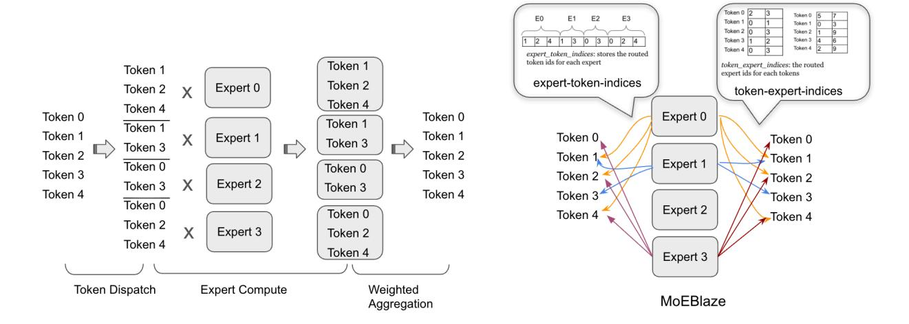
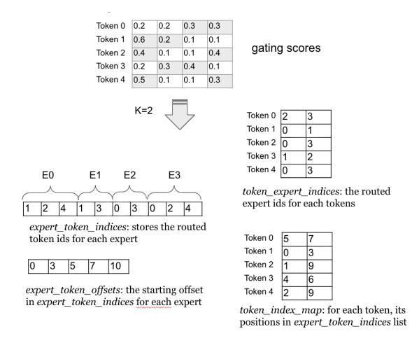

## MOEBLAZE: BREAKING THE MEMORY WALL FOR EFFICIENT MOE TRAINING ON MODERN GPUS

Jiyuan Zhang <sup>1</sup> Yining Liu <sup>1</sup> Siqi Yan <sup>1</sup> Lisen Deng <sup>1</sup> Jennifer Cao <sup>1</sup> Shuqi Yang <sup>1</sup> Min Ni <sup>1</sup> Bi Xue <sup>2</sup> Shen Li <sup>1</sup> <sup>1</sup>*Meta Platforms Inc*, <sup>2</sup>*Thinking Machines Lab*

## ABSTRACT

The pervasive "memory wall" bottleneck is significantly amplified in modern large-scale Mixture-of-Experts (MoE) architectures. MoE's inherent architectural sparsity leads to sparse arithmetic compute and also introduces substantial activation memory overheads—driven by large token routing buffers and the need to materialize and buffer intermediate tensors. This memory pressure limits the maximum batch size and sequence length that can fit on GPUs, and also results in excessive data movements that hinders performance and efficient model scaling. We present MoEBlaze, a memory-efficient MoE training framework that addresses these issues through a co-designed system approach: (i) an end-to-end token dispatch and MoE training method with optimized data structures to eliminate intermediate buffers and activation materializing, and (ii) co-designed kernels with smart activation checkpoint to mitigate memory footprint while simultaneously achieving better performance. We demonstrate that MoEBlaze can achieve over 4× speedups and over 50% memory savings compared to existing MoE frameworks.

## 1 INTRODUCTION

Over the past several decades, processor throughput has advanced much faster than memory bandwidth and latency, creating a persistent "memory wall" that widens the gap between compute and data movement [\(Wulf & McKee,](#page-11-0) [1995\)](#page-11-0). In practice, this disparity means that even with ample arithmetic units, end-to-end throughput is often limited by how quickly parameters and activations can be read, written, and exchanged [\(Williams et al.,](#page-11-0) [2009\)](#page-11-0).

Mixture-of-Experts (MoE) architectures have reshaped large-scale deep learning by enabling trillion-parameter models at manageable training cost through sparse activation [\(Shazeer et al.,](#page-11-0) [2017;](#page-11-0) [Kaplan et al.,](#page-10-0) [2020;](#page-10-0) [Hoffmann](#page-10-0) [et al.,](#page-10-0) [2022\)](#page-10-0). However, the very sparsity that delivers these gains simultaneously lowers compute density because only a subset of experts is active per token. This architectural sparsity, when combined with the scale of distributed training in Large Language Models (LLM), significantly exacerbates memory pressure in modern systems. As models exceed single-device High-Bandwidth Memory (HBM) capacity, training must be distributed across more GPUs and nodes, increasing pressure on device memory bandwidth and interconnect throughput. With the continuous growth in sequence lengths and batch sizes, performance rapidly becomes bounded by the system's memory and communication subsystems rather than raw FLOPs. In light of this, directly reducing the memory footprint and improving effective bandwidth utilization end-to-end has become critical to break the memory wall for MoE training and achieve

efficient model scalings.

While parameter storage often gets the spotlight, activation memory is an equally significant driver of the memory wall during training. In state-of-the-art LLM training at trilliontoken scale [\(Brown et al.,](#page-10-0) [2020;](#page-10-0) [Touvron et al.,](#page-11-0) [2023;](#page-11-0) [Team](#page-11-0) [et al.,](#page-11-0) [2024\)](#page-11-0), the combination of longer sequences, larger batches, and more complex routing mechanisms leads to a dramatic expansion of the memory buffers required to compact, reorder, and stage intermediate tensors. Consequently, these activation buffers consume a significant portion of GPU memory footprint and bandwidth, directly limiting the maximum batch size and sequence length a system can handle, and thereby capping the model's scalability and training efficiency.

To address this system bottleneck, earlier methods relied on heuristics like token dropping or padding to cap and manage activation buffers [\(Samuel,](#page-11-0) [1959;](#page-11-0) [Fedus et al.,](#page-10-0) [2022\)](#page-10-0), which, however, often came at the cost of model stability. More recent systems are focused on optimizing computation and communication complexity with regards to sparse expert computations [\(Gale et al.,](#page-10-0) [2023;](#page-10-0) [Aminabadi et al.,](#page-10-0) [2025\)](#page-10-0). Nevertheless, the auxiliary activation buffers needed for token dispatch and the requirement to pad or materialize intermediate results still contribute a major portion of the overall model memory footprint.

To address these limitations, we present MoEBlaze, a memory-efficient MoE training framework that drastically improve MoE training memory efficiency without comprising accuracy, while simultaneously achieving better training

<span id="page-1-0"></span>throughput. Concretely, we target two principal sources of activation memory bottleneck: (i) token routing, where conventional implementations allocate large auxiliary perexpert buffers to compact and store activations; and (ii) intermediate activation storage amplified by modern nonlinearities such as SiLU and SwiGLU [\(Shazeer,](#page-11-0) [2020;](#page-11-0) [Ra](#page-11-0)[machandran et al.,](#page-11-0) [2017;](#page-11-0) [Elfwing et al.,](#page-10-0) [2017\)](#page-10-0). MoEBlaze is designed to effectively break through the memory wall and maximize the utility of modern GPU architectures to better throughput. Our contributions are:

- We introduce an efficient end-to-end token dispatch and training method that significantly reduces the intermediate activation buffers for token routing and activation materializing. Our approach avoids both padding and token dropping, reducing memory usage and data movement without sacrificing accuracy while simultaneously achieving better compute efficiency.
- We introduce efficient data structure and algorithm for above memory-efficient compute scheme that can efficiently leverage GPU's massive parallelism and high bandwidth and avoids complex multi-kernel pipelines.
- We co-design training kernels with smart activation checkpoint schemes, which can further mitigate the substantial memory footprint associated with modern complex activation functions while achieving better compute efficiency on GPU.
- Overall our method can achieve over 4× speedups and over 50% compared memory savings to other state-ofthe-art MoE training frameworks across various MoE benchmarks.

## 2 BACKGROUND AND MOTIVATIONS

In this section, we provide a review of the background of MoE training, along with a identification of the key system bottlenecks that currently limit its performance.

We first define the notations that will be used throughout the rest of the paper. We mainly focus on the token-choice MoE as it has been adopted extensively in production. The MoE computation begins with the token input, which is represented as a vector x ∈ R L×d , where we denote by L the number of routed token instances in a step (e.g., batch size × sequence length), K the number of selected experts per token, E the number of experts, d the model dimension.

#### 2.1 Gating Network and Token Routing

The gating network determines the routing of each input token to the most relevant experts. The network is typically a linear transformation mapping the input dimension d to the number of experts E, thereby generating a score for each expert per token. This is followed by a Top-K selection, where expert-ids corresponding to the highest gating scores are collected for each token. The gating output for input x is defined as:

$$topk\_experts = TopK(softmax(W_g \mathbf{x}))$$

where W<sup>g</sup> ∈ R E×d are the gating network parameters and K is the number of selected experts per token. The result *topk experts* is the list of selected expert-ids by each token.

Following Top-k selection, tokens must be physically routed to their corresponding expert's execution buffer. In conventional implementations, this routing process requires substantial auxiliary memory and extra processing to compact and store the dispatched tokens, which constitutes a critical memory bottleneck.

Earlier work such as Switch Transformers and GShard [\(Fe](#page-10-0)[dus et al.,](#page-10-0) [2022;](#page-10-0) [Lepikhin et al.,](#page-11-0) [2021\)](#page-11-0) adopts capacitylimited routing (token-dropping) mechanism to manage token dispatch. Tokens are sorted by their gate score and packed into expert e's buffer; any tokens exceeding C are either dropped or routed to a residual path. A typical choice for capacity is:

$$C \approx \gamma \cdot \frac{Bk}{E}.$$

where γ is the user-defined capacity factor. Capacity-limited routing is amenable to system implements due to fixed-size buffers but comes at the cost of reduced model quality.

More recent literature focuses on dropless routing mechanisms [\(Rajbhandari et al.,](#page-11-0) [2022;](#page-11-0) [He et al.,](#page-10-0) [2021\)](#page-10-0), which generally yields better model quality. This method ensures every token is processed by an expert, allowing for better model quality and eliminating the need for capacity factor tuning. However, since the number of tokens assigned to each expert is variable, the underlying system must efficiently manage dynamic compute and memory needs. Consequently, recent literature primarily focuses on optimizing the computation with these dynamic and varying-length workloads [\(Gale et al.,](#page-10-0) [2023;](#page-10-0) [Aminabadi et al.,](#page-10-0) [2025\)](#page-10-0).

Nevertheless, a fundamental challenge persists across both token-dropping and dropless routing schemes: current implementations require storing the indices and compacted token data, resulting in memory footprint proportional to L × K × d. In modern LLM training with longer sequence lengths and higher batch sizes, this leads to a dramatic expansion of the memory buffers.

Example: To illustrate this token dispatch associated activation footprint, we use the example of a real-world MoE model (e.g DeepSeek) for a quantitative study here. For a typical MoE layer in DeepSeek model, it has L ≈ 2 million tokens, active experts K = 4, model dimension d = 6144,

<span id="page-2-0"></span>

Figure 1. MoE in conventional approach vs. MoEBlaze. Left illustrates the conventional MoE computation, comprising token dispatch, expert computation, and weighted aggregation (details in section [2\)](#page-1-0). Right presents the proposed MoEBlaze framework, which introduces memory-efficient token-routing and expert computation (details in section 3).

and using a 2 bytes per element (bfloat16) for the routed token buffer, the memory footprint is:

$$Mem_{routing} = L \times d \times k \times 2bytes \approx 94GB$$

We can see a single MoE layer can consume almost a hundred gigabytes of memory for one routing buffer alone.

#### 2.2 Expert Feed-Forward Networks (FFNs)

Following the token dispatch is the Feed-Forward Networks (FFN) computation across experts. Each FFN computation is typically realized as a two-layer Multi-Layer Perceptron (MLP). The first layer projects the input from dimension d to a higher-dimensional hidden space h, and the second layer projects back to the output dimension d ′ (assuming d ′ = d). The total memory required for the parameters across all E experts is O(E × (h × d + d × h)), but the conditional computation paradigm ensures that only k experts are active for each token, maintaining a low computational cost per forward pass. The FFN computation within expert E<sup>i</sup> for a given input x is defined as:

$$E_i(\mathbf{x}) = W_{2,i} \cdot \sigma(W_{1,i}\mathbf{x})$$

where W1,i ∈ R h×d and W2,i ∈ R d×h , and σ is the nonlinear activation function (e.g., ReLU, GELU, SwiGLU).

The second principal memory bottleneck stems from intermediate activation storage during the FFN computation. For an active expert, the first linear transformation W1,ix generates an intermediate activation of size L<sup>i</sup> × h, where L<sup>i</sup> is the number of tokens routed to expert i. While the number of active experts is small, the aggregated memory for these activations across all E experts is O(L × h) during the forward pass and can be much higher during backpropagation

due to the need to store intermediate values for gradient calculation. The choice of activation function (e.g., SwiGLU) will further exacerbate the memory pressure.

Example: We use deepseek's configuration as an example to illustrate the significance of the activation footprint created by FFN computation. We have L ≈ 2 million, FFN hidden dimension d = 24576, and using 2 bytes per element (bfloat16), we can get the activation footprint for the intermediate :

$$Mem_{act} = 2L \times h \approx 98GB$$

#### 2.3 Output Aggregation

The final stage is output aggregation, where the outputs of the selected experts are combined using a weighted summation to produce the final output for each token. The weights are derived from the gating network's scores. The MoE output y for an input token x is:

$$\mathbf{y} = \sum_{i=1}^{E} g_i(\mathbf{x}) \cdot E_i(\mathbf{x})$$

where gi(x) is the gating score for expert i, and only the top-k experts have non-zero scores. The memory required for the aggregated outputs is O(L × d). Computationally, this involves O(L × k × d) operations, which is generally efficient given the sparsity (k ≪ E).

## 3 MEMORY-EFFICIENT TOKEN ROUTING AND TRAINING ALGORITHM

As detailed in Section [2.1,](#page-1-0) in token-choice MoE, a gating network assigns each input token to one or more experts. To facilitate efficient token indexing and organization during expert computation, conventional systems compact these tokens into per-expert buffers. This compaction step, followed by the execution of per-expert Multi-Layer Perceptron (MLP) blocks, creates intermediate results kept at the compacted token length before being summed and reduced to the original token length at the output. Crucially, this separation and intermediate storage introduces significant activation buffers throughout the entire MoE training. In this section, we present our memory-efficient routing and expert computation algorithm that substantially reduces the auxiliary activation footprint while also allowing for efficient MoE training.

Given the input as an activation tensor of shape (L, d), the core idea of our algorithm is to leverage auxiliary index lists, generated during the token dispatch step, to track routing decisions and perform on-the-fly token accessing and result reduction throughout the Mixture-of-Experts (MoE) computation. Concretely, our fused kernel operates as follows: 1. it consumes the gating decisions and builds the experttoken index lists and other associated indexing structures, 2. it performs the expert MLP computations using on-thefly gathers from the original, unpermuted activation tensor, guided by the expert-token index list, and 3. The expert summation then uses the token-expert index list to directly sum and reduce the MLP results into the final output tensor. By directly accessing the input and storing only the final result, we eliminate many intermediate activations that are typically required for materialized token routing in other papers. The token-expert index list, which only stores token and expert IDs, is extremely lightweight. Moreover, this approach allows us to tightly fuse the token/expert indexing with computation, opening possibilities for overlapped memory access and computations. This is particularly advantageous on modern hardware like the latest H100 GPUs, achieving better resource utilization and faster speed.

Below, we detail the forward and backward passes of our proposed method. Data structures and the methods for efficiently building them will be explained in next section.

## 3.1 Forward Pass

Token Dispatch: In the token dispatch step, we do not create dedicated buffer for routed tokens. Instead we generate several lightweight indexing data structures based on the gating scores produced in the preceding gating stage. These structures include: the per-expert token list, which tracks the token-IDs assigned to each expert; and the per-token expert list, which stores the expert-IDs chosen for each token. No memory is allocated or preserved for materialized routed token activations at this stage.

Expert Computation: We perform the expert computation MLPs with on-the-fly gathers from the original unpermuted activation tensor utilizing the indices recorded in the per-expert token list. To maximize memory efficiency, only the intermediate result between the two back-to-back MLPs (i.e., the output of the first MLP) is buffered for the backward pass.

Output Aggregation: The final results from the experts are aggregated to produce the final (L, d) output. As we do not store the activation buffer for the materialized token dispatch result, this summation is tightly fused with the 2nd MLP computation and we directly leverage the per-token expert list to perform on-the-fly reduction into output tensor.

#### 3.2 Backward Pass

The backward pass takes the gradient of the (L, d) tokens and propagates it back through the inverse of the forward steps. The conventional backward process for expert summation relies on the routed token activation buffer to perform an "expansion" or materialization of the (L, d) gradients to the (L × k, d) "routed gradient tokens" before backpropagation through the MLP experts. However, our proposed approach avoids this intermediate expansion step by using the same reverse mapping indices.

- 1. Expert Summation Backward: Using the tokenmapping structure derived from the dispatch metadata, the (L, d) gradient tensor is mapped back to the (L × k, d) routed gradient tokens. This is done via an efficient operation that 'scatters' the output gradient to the corresponding locations in the materialized intermediate MLP result tensor.
- 2. Expert Computation Backward: Next, the gradients flow backward through the MLPs. The previously checkpointed intermediate result between the two backto-back MLPs will be used here when computing the weight gradients.
- 3. Token Gradient Accumulation: Finally, the gradients with respect to the input tokens are accumulated from all experts. This step sums the contributions from the k experts each token was routed to, producing the final (L, d) gradient tensor for the input activations. As we do not have the activation storage the materialized routed token result, we also leverage the token index data structure to perform on-the-fly reductions.

## 4 EFFICIENT AND PARALLELIZABLE DISPATCH AND DATA STRUCTURES

#### 4.1 Data Structures

We define the key data structures needed for the memory efficient MoE training algorithm we mentioned above.

- expert token indices: A compact tensor storing the indices of tokens assigned to each expert, concatenated across all experts. In the token-choice MoE training, each token chooses k experts, thus the *expert token indices* has size L × k. This list is fundamental for the experts to retrieve their designated input tokens.
- expert token offsets: An array of length E + 1 storing the exclusive prefix sums of token counts per expert. For expert i, the indices of its assigned tokens reside from expert token offsets[i] up to expert token offsets[i+1] − 1.
- token expert indices: token expert indices is basically the inverse mapping of expert token indices. It stores the routed expert-ids for each token which are ordered by the token IDs. Its shape is also L × k. This list is need for coalesced indexing into the intermediate materialized results (e.g., between two back-to-back MLPs) when processing tokens per expert.
- token index map: A L×k compact tensor that stores the routed token positions in the expert token indices list. It is logically grouped by the original token ID i ∈ L, allowing a token to efficiently find and gather its k expert outputs from the intermediate buffer for the final combination step.



Figure 2. Data structures for the memory-efficient MoE training.

Example. Figure 2 demonstrates the data structure for an example of L=6 tokens, E=4 experts, and k = 2 activated experts. From the gating score matrix, we obtain per-token's assignment as:

Token 0: expert{2, 3}; Token 1: expert{0, 1}; Token 2: expert{0, 3}; Token 3: expert{1, 2}; Token 4: expert{0, 3}. Concatenate the tokens' assignment together, we will get the token expert indices as:

```
token expert indices = [2, 3, 0, 1, 1, 2, 0, 3],
```

Similarly we can get for each expert the routed tokens: Expert 0: token{1, 2, 4}; Expert 1: token{1, 3}; Expert 2: token{0, 3}; Expert 3: token{0, 2, 4}. Concatenate them together, we get the expert token indices and expert token offsets

```
expert token indices = [1, 2, 4, 1, 3, 0, 3, 0, 2, 4],
expert token offsets = [0, 3, 5, 7, 10]
```

The token index map stores the positions of each token within the concatenated experts' token list. For example, token index map[0] = {5, 7} as token 0 is routed to 2 experts (k = 2) and placed in the 5th and 7th position of the expert token indices.

#### 4.2 Efficient Dispatch Data Structure Construction

We now detail the methods to efficiently construct the aforementioned data structures. The construction process presents a challenge: the inherent design of the expertcentric data structures requires a many-to-one mapping where multiple tokens are assigned to the same expert. Utilizing a naive approach would result in severe thread-level write contention on the GPU architecture, thereby compromising performance.

One solution is to rely on a sorting-based approach for building the token dispatch. This method flattens all tokens' top-k choice results (topk experts) into a 1D array of length Lk containing (expert id, token id) tuples. The array is then globally sorted by expert id to group tokens, followed by index recovery to reconstruct token order and compute per-expert ranges.

This sorting procedure, while conceptually simple, introduces severe performance bottlenecks at scale. Sorting is implemented as multi-pass radix sort on GPUs, which requires several global-memory passes proportional to key width, forcing frequent global-memory passes and moving O(Lk) data multiple times. This results in a actual high complexity and poor resource utilization on GPUs. Furthermore, this global ordering step limits fine-grained parallelism, forces a multi-kernel dispatch pipeline (multipass sorts, segmented scans, index recoveries etc) with high

<span id="page-5-0"></span>kernel launch latencies. These limitations motivate a more efficient, GPU-friendly approach.

To this end, we introduce an efficient method that replaces complex global sortings and organizations with parallelizable builds upon local index construction that map well to GPUs. The method is a simple 3-step process with each step designed to be atomic-free and parallelized on GPU which can minimize expensive global-memory passes and avoids complex multi-kernel pipelines. Below we will go over the details of the three steps.

**Build Dense Token-Expert Map** In the first step, we construct a dense bitmap denoted as dense\_token\_map to encode the top-k token-to-expert routing. For each token i, we consider its top-k assigned experts  $\{e_{i,0},\ldots,e_{i,k-1}\}$ . For each gate slot, we set dense\_token\_map $[i,e_{i,k}]$  to i. All other entries remain unset.

The construction of the encoding map is highly parallelizable on the GPU. We initiate the process by allocating an  $\mathbf{L} \times \mathbf{E}$  dense map and launching the kernel over the CTA grid. The parallelism is managed by assigning each warp a disjoint tile of token rows (i) from which it loads the  $\mathbf{top}$ - $\mathbf{k}$  expert results. Each (i,e) pair is written out at most once because expert IDs per token are unique; This guarantees no intra-warp collisions.

Compute Expert Lengths Leveraging the constructed dense\_token\_map, the next step is to efficiently compute the lengths and offsets for the sparse token-ID list for each expert. We launch a custom kernel with the CTA grid mapped across the columns (experts) of dense\_token\_map. Each CTA is dedicated to a single expert  $e_i$  and counts the non-zero entries (token-to-expert assignments) within that column. The use of warp-level reductions aggregates the row-wise sums within the CTA, producing the expert\_lengths array. The value expert\_lengths[ $e_i$ ] represents the final number of tokens routed to expert  $e_i$ . Following the length computation, the expert\_lengths array outside the initial counting kernel.

Route Indices to Gates This 3rd step involves generating the per-expert token id list expert\_token\_indices, which serves as the input for subsequent MLP computations. To achieve a compact, per-expert concatenation of indices in a contention-free manner on the GPU, we employ a two-phase process centered around generating a location map. This map specifies the final destination position-ID for every non-zero entry in the dense\_token\_map within the expert\_token\_indices list. Once the location map is built, a simple parallel kernel reads elements from dense\_token\_map and writes them directly to their calculated, corresponding positions in expert\_token\_indices,

guaranteeing full parallelism without atomics.

The construction of the location map can be challenging. We utilize a two-step strategy to ensure its atomic-free construction: (i). tile-level scan: We launch one CTA per expert. Threads within the same CTA process contiguous tokens assigned to that expert in dense\_token\_map. They first compute the tile-level counts within shared memory, followed by an exclusive scan operation (prefix sum) performed locally inside the CTA. (ii). The resulting CTA-local exclusive scan counts then add with the expert's pre-computed global expert\_offsets. This addition yields the correct, final position-ID in the concatenated indices array.

