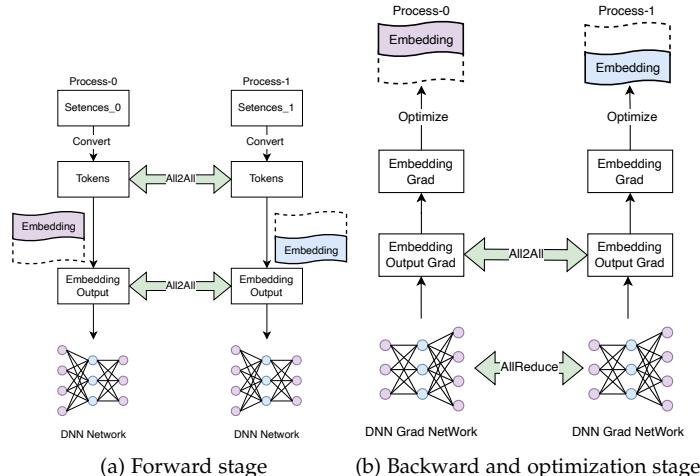
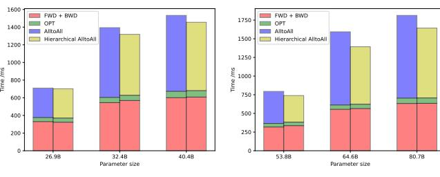
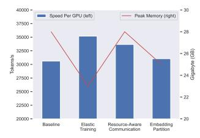
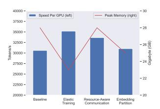

# 4.3 Embedding Partition in Data Parallelism

In the context of ultra-large-scale model training, the embedding table often constitutes the largest parameter set within the entire model, thereby necessitating restrictions on its storage due to the model's scale. Numerous studies have focused on researching embedding partitioning techniques. For instance, Megatron [40] has successfully employed column-wise partitioning of the embedding table in tensor-slicing parallelism to reduce training memory requirements. Additionally, EmbRace [57] has proposed a column-wise partitioning approach within the embedding table to achieve more balanced communication. However, an efficient processing method for handling embedding partitioning in scenarios where the input data for each process is inconsistent remains elusive. In such cases, ensuring efficient processing becomes challenging due to the varying nature of the inputs across different devices.

In this study, our primary focus is on addressing the challenge of embedding partitioning within the context of data parallelism, as illustrated in Figure 9. To elaborate, when we consider an embedding table with dimensions [V,H] being distributed among N training processes, we employ a column-wise partitioning scheme. This scheme assigns a  $[V,\frac{H}{N}]$  shard to each worker. Consequently, each training process possesses an embedding representation that

Fig. 9: Example data flow of Embedding Partition in data parallelism. The embedding table is column-wise partitioned among processes. In the forward stage, AlltoAll communication is called twice: one is for exchanging input data and another is for exchanging embedding lookup results. In the backward stage, AlltoAll is called once to swap the gradient of the embedding table and using the gradients updates the embedding table.

pertains only to a subset of the vocabulary. As a result, before querying the embedding table, the input data of each process must be exchanged with other processes through AlltoAll communication. This exchange allows the acquisition of embedding results corresponding to the local partial vocabulary. Subsequently, to obtain accurate results for the input data processed by each worker, the embedding results are exchanged once more through AlltoAll communication, effectively serving as the inverse procedure of the previous communication step. It is essential to note that during the backward stage, the gradient information also needs to be exchanged to recover the embedding table gradient.

In contrast to the traditional embedding sharding approach [58], which is similar to tensor model parallelism and partitions along the vocabulary dimension, our method is specifically designed for data parallelism. Given that each GPU card processes different data, sharding along the vocabulary dimension is not feasible. Instead, we employ sharding along the hidden\_size dimension of the vocabulary, ensuring that each computing device can access the complete vocabulary. Additionally, we utilize AlltoAll communication to complete the hidden layer, accommodating the varying data inputs across devices.

Significantly, this approach effectively reduces the storage requirements of the embedding table within the data parallelism framework. It achieves this by introducing only three instances of AlltoAll communication and eliminating the need for AllReduce synchronization for embedding table gradients in data parallelism.

#### 5 EXPERIMENT

In this section, we present a comprehensive experimental evaluation of MoE models using the proposed MoESys

system. Our evaluation focuses on both training and inference aspects of the MoE models. In the training phase, we assess the efficiency of the MoE-based GPT model across different configurations. For the inference phase, we analyze the performance of the ring memory-based offloading strategy, considering various model sizes. Moreover, we investigate several efficient methods implemented in the **MoESys** system, including the widely-used UFO model. It is important to note that our results reporting disregards the performance of the individual models themselves. This is because the converged models, whether based on baseline MoEs or utilizing **MoESys**, achieve comparable performance levels. Hence, our evaluation primarily focuses on the efficacy and efficiency of the proposed **MoESys** system.

## **5.1 Platform**

MoESys is implemented based on the PaddleFleetX [\[59\]](#page-13-37) architecture of PaddlePaddle. After some fundamental performance optimizations, PaddleFleetX demonstrates certain performance advantages over other standard models. For a more direct comparison, we would like to highlight the performance comparison between Paddle and Megatron as of March 2023. This comparison provides valuable insights into how PaddleFleetX, and by extension MoESys, stands in relation to other prominent frameworks in terms of efficiency and effectiveness. Please refer to Table [1](#page-10-0) for detailed comparative data. The experimental data demonstrates PaddleFleetX's enhanced performance over Megatron-LM across several model configurations, with a notable throughput superiority that ranges from a substantial 14.2% for smaller models (0.35 billion parameters) to a marginal 0.4% for the extensive 175 billion parameter models. This improved throughput is consistent despite marginal differences in memory usage where Megatron-LM occasionally leads, particularly with smaller models. PaddleFleetX also showcases a more efficient utilization of GPU resources, as evidenced by higher TFLOPS/s per GPU and a closer approach to the theoretical peak FLOP/s utilization across varying model sizes.

#### **5.2 Large-Scale MoE Training**

We conducted training experiments using GPT models based on the MoE architecture, leveraging A100 GPUs (80 GB), and employing a combination of data parallelism and expert parallelism. In the MoE system, there are two main parts: the Dense parameters (Backbone) and the Sparse parameters (Expert). The Dense part employs data parallelism, meaning that different input data is processed in parallel. After the backward computation is complete, the Dense parameters are synchronized through Allreduce communication. On the other hand, the Sparse parameter part involves expert parallelism. Here, routing communication between experts is used to send the required data to the designated compute devices. This is accomplished through AlltoAll communication. The backward pass also utilizes AlltoAll communication for gradient synchronization. This approach allows us to efficiently leverage both data and expert parallelism, optimizing the performance of the MoE system. The evaluation of these models was performed using Gshard [\[60\]](#page-13-38) and top1-gating metrics. Specifically, we utilized pure fp16 precision and the AdamW [\[61\]](#page-13-39) optimizer during the training process.

Compared to the high precision FP32 method, there are two lower precision training approaches: "AMP" (Automatic Mixed Precision) and "pure fp16". Unlike AMP, pure fp16 is a commonly used, faster training method. This method is well-established and has been applied in model training, for example in Megatron and DeepSpeed. Our approach is consistent with the methods used in Megatron/DeepSpeed. The term "pure" in "pure fp16" is in contrast to AMP, meaning that all model parameters in pure fp16 training are of fp16 type. However, it's important to note that not all operations are computed in fp16. Certain operations, like softmax, use fp32 for computation. We also employ techniques like MasterWeight to mitigate the impact of lower precision training on model accuracy. Our use of pure fp16 in the experiments is a standard practice, and we maintain this strategy consistently when comparing with other frameworks.

Table [2](#page-10-1) presents the throughput results for different configurations. The table lists the parameter sizes (*Parameters (B)* in billions) in ascending order from top to bottom, while keeping the number of attention heads (*Attention heads*), hidden layer size (*Hidden size*), vocabulary size (*Vocab size*), and number of layers (*Layers*) constant. Consequently, the number of experts (*Experts*), GPUs (*GPUs*), and batch size (*Batch size*) increase twofold. Both DeepSpeed and our proposed **MoESys** exhibit training speeds that double accordingly. It is worth noting that the first line of the table represents the performance on a single node equipped with eight GPUs, while the subsequent lines depict results for multi-node scenarios.

Our observations indicate that, compared to the stateof-the-art MoE system, DeepSpeed [2](#page-9-1) , **MoESys** achieves approximately a 28% speedup in single-node training and at least a 33% speedup in multi-node training for MoE models with over 100 billion parameters. Furthermore, **MoESys** reduces the GPU memory usage of each rank by nearly 12 GB. Therefore, in large-scale MoE training, our proposed **MoESys** system demonstrates comparable training speeds while consuming relatively less memory compared to the benchmark model, DeepSpeed.

#### **5.3 Ablation Study in MoE Training**

The experimental evaluation in this section highlights the benefits of efficient *implementation strategies* on a largescale model, as discussed in Section [4.](#page-6-2) Each of these strategies is evaluated independently and compared against traditional/baseline methods.

## *5.3.1 Elastic MoE Training*

In order to assess the efficiency of elastic MoE training, we conducted experiments using the UFO [\[2\]](#page-12-1) model, which is based on the MoE architecture and trained on A100 GPUs with 80 GB of memory. We designed four tasks with batch sizes of 512, 256, 128, and 128, respectively, to simulate an imbalanced training process.

Following the elastic sparse training methodology outlined in Section [4.1,](#page-6-3) we adjusted the overall training workload by adding additional computing nodes. Specifically,

TABLE 1: The standard model's performance on the established baselines.

| Parameters (Billions) | Hidden size | Layers | Attention heads | GPUs | Data parallel | Group sharded | Tensor parallel | Pipeline parallel | Batch size | (ve Megatron-I M )       |                      |                     |                                | Difference of |
|--------------------------|----------------|--------|--------------------|------|------------------|------------------|--------------------|----------------------|---------------|--------------------------|----------------------|---------------------|--------------------------------|------------------|
| (Dillions)               | SIZE           |        | licaus             |      | paraner          | parallel         | paraner            | Purunci              | 5120          | Throughput (tokens/s) | Memory usage (MB) | TFLOPS/s per GPU | Theoratical peak FLOP/s (%) | throughput       |
| 0.35                     | 1024           | 24     | 16                 | 8    | 8                | 1                | 1                  | 1                    | 64            | 291,585 (255,401)     | 31,919 (33,217)   | 102 (89)         | 32.7% (28.5%)               | +14.2%           |
| 1.3                      | 2048           | 24     | 16                 | 8    | 8                | 1                | 1                  | 1                    | 64            | 115,682 (109,537)     | 39,775 (39,537)   | 150 (142)        | 48.1% (45.5%)               | +5.6%            |
| 6.7                      | 4096           | 32     | 32                 | 16   | 1                | 16               | 1                  | 1                    | 128           | 44,605 (39,936)       | 35,442 (35,403)   | 149 (116)        | 47.8% (43.0%)               | +11.7%           |
| 175                      | 12288          | 96     | 96                 | 128  | 1                | 1                | 8                  | 16                   | 1536          | 14,634 (14,571)       | 34,912 (34,708)   | 160 (159)        | 51.3% (50.9%)               | +0.4%            |

TABLE 2: Results for large-scale MoE training on GPT models with different configurations.

| Parameters(B)  | Attention | Hidden | Vocab | Lavers | Experts | GPUs  | Batch | Speed(to  | kens/s) | Memory(GB) |        |
|----------------|-----------|--------|-------|--------|---------|-------|-------|-----------|---------|------------|--------|
| 1 atameters(b) | heads     | size   | size  | Layers |         | G1 U5 | size  | DeepSpeed | MoESys  | DeepSpeed  | MoESys |
| 13.9           | 64        |        | 50304 | 12     | 8       | 8     | 8     | 24165     | 31085   | 68.9       | 56.8   |
| 26.8           |           |        |       |        | 16      | 16    | 16    | 43691     | 59136   | 66.2       | 53.9   |
| 52.6           |           | 4096   |       |        | 32      | 32    | 32    | 82957     | 113456  | 66.8       | 54.5   |
| 104.1          |           |        |       |        | 64      | 64    | 64    | 157728    | 209970  | 66.3       | 54.4   |
| 207.2          |           |        |       |        | 128     | 128   | 128   | 283706    | 376968  | 66.4       | 54.3   |

TABLE 3: Results for elastic MoE training with multiple tasks.

|                 | Task number | Parameters(M) | Total batch size | Batch size per task | GPUs | GPUs per task | Total Speed (samples/s) | Speed per GPU (samples/s) |
|-----------------|-------------|---------------|---------------------|------------------------|------|------------------|----------------------------|---------------------------|
| Load imbalanced | 4           | 83            | 1024                | 512/256/128/128        | 4    | 1/1/1/1          | 250.4                      | 62.6                      |
| Load balanced   |             | 65            |                     | 312/230/120/120        | 8    | 4/2/1/1          | 591.9                      | 74.0                      |

we allocated 4 GPUs for Task-1 and 2 GPUs for Task-2. To ensure fairness, we calculated the average speed of each GPU to mitigate the impact of increasing the number of nodes. The results, as presented in Table 3, indicate that compared to the *Load imbalanced* configuration, the *Load balanced* configuration achieved an approximate 18.2% improvement in throughput per GPU. It is important to note that the *Load balanced* approach was derived from our designed elastic MoE training, and the results highlight its effectiveness and efficiency, respectively.

Furthermore, we applied a task-based MoE load balancing mechanism to the training of the billion-scale visual model VIMER-UFO 2.0. This approach supports dynamic expansion of task numbers and parallel training of multiple tasks and multiple experts. Under the same experimental environment (32x A100 80GB GPUs), we achieved a training performance of 697 images per second. This represents a significant improvement in throughput by 64% compared to 425 images per second using the Pytorch v1.10 framework. Additionally, the memory footprint was reduced to 45 GB per GPU, a decrease of 18%.

#### 5.3.2 Resource-Aware Communication

In this subsection, we conducted training of MoE models on different numbers of nodes and with varying model sizes to demonstrate the potential benefits of the **MoESys** designs. The results are presented using a stacked bar chart, which illustrates the time consumption for key components of the training process: 1) the forward stage (*FWD*), 2) the backward stage (*BWD*), 3) the optimization stage (*OPT*), and 4) the communication stage. Specifically, we compare the proposed *Hierarchical AlltoAll* approach to the baseline *AlltoAll* method in the communication stage, while keeping other components constant across the different settings.

As depicted in Figure 10, the first three components (green and pink bars) show similar performance between the AlltoAll baseline and Hierarchical AlltoAll across all parameter sizes. The performance gaps are primarily caused

(a) 2 nodes with 16 GPUs (b) 4 nodes with 32 GPUs Fig. 10: MoE Training Time Breakdown

by the two top bars (purple for AlltoAll baseline and yellow for Hierarchical AlltoAll) representing the communication stage. It is evident that with the adoption of Hierarchical AlltoAll in MoESys, the computation time does not increase significantly, while the communication time decreases dramatically. Furthermore, as the model parameter size increases, the efficiency gap in communication becomes more significant between AlltoAll and hierarchical AlltoAll. This indicates that the proposed MoESys can amplify the performance improvement in communication when dealing with large-scale models. This effect is evident by observing the gap between the purple and yellow bars from left to right along the horizontal axis.

For the most substantial improvement observed in the experiment, which involved a MoE model with 80.7 billion parameters across four nodes with 32 GPUs, the overall end-to-end training performance improved by 10.3%. Additionally, the communication stage achieved a 15.5% speedup using the Hierarchical AlltoAll strategy.

## 5.3.3 Embedding Partition in Data Parallelism

To assess the performance of embedding partition in data parallelism, we conducted training of a MoE model on a dataset with an extremely large vocabulary. The ablation study included a baseline approach using the non-segment

TABLE 4: Performance of the Embedding Partition in Data Parallelism.

| Batch | GPUs | Experts | Vocab | Hidden | Parameter(M)     | 1        | Memory (GB)                | Speed (tokens/s) |                            |       |
|-------|------|---------|-------|--------|------------------|----------|----------------------------|------------------|----------------------------|-------|
| size  | Gros | Experts | size  | size   | T arameter (IVI) | Baseline | <b>Embedding Partition</b> | Baseline         | <b>Embedding Partition</b> |       |
|       |      |         |       | 2048   | 72               | 4.68     | 2.43                       | 289452           | 300451                     |       |
| 8     | 8    | 4       | 50304 | 4096   | 180              | 7.51     | 4.67                       | 152144           | 167352                     |       |
|       |      |         |       | 8192   | 400              | 15.81    | 8.63                       | 80421            | 91687                      |       |
|       | 8    |         | 50304 | 2048   | 100              | 7.46     | 5.78                       | 144159           | 150161                     |       |
| 8     |      | 8       |       | 4096   | 300              | 12.80    | 9.70                       | 86237            | 95890                      |       |
|       |      |         |       |        |                  | 8192     | 700                        | 27.80            | 20.49                      | 40605 |
|       |      |         | 50304 | 2048   | 227              | 18.55    | 15.73                      | 53428            | 55725                      |       |
| 8     | 8    | 16      |       | 4096   | 781              | 31.41    | 27.98                      | 26321            | 29047                      |       |
|       |      |         |       | 8192   | 1320             | 63.25    | 55.75                      | 12065            | 13902                      |       |

TABLE 5: Performance comparison among the proposed strategies.

| Batch | Vocab | Lavers Hidden |      | Experts |           | Peal     | Memory (GB)   |                |           | Speed p  | per GPU (tokens/s) |                |           |
|-------|-------|---------------|------|---------|-----------|----------|---------------|----------------|-----------|----------|--------------------|----------------|-----------|
| size  | size  | Layers        | size | Experts | LAPEITS   | Baseline | Elastic       | Resource-Aware | Embedding | Baseline | Elastic            | Resource-Aware | Embedding |
|       |       |               |      |         | Daseillie | Training | Communication | Partition      | Daseinie  | Training | Communication      | Partition      |           |
| 8     | 50304 | 12            | 2048 | 8       | 28        | 23       | 28            | 25             | 30604     | 35194    | 33664              | 31033          |           |

embedding strategy, while the remaining settings remained consistent with MoESys. The results in Table 4 demonstrate that the embedding partition strategy within a single machine effectively reduces GPU memory consumption when processing vocabularies of large sizes. The study maintains a constant batch size and number of GPUs but varies the number of experts, hidden size, and parameter magnitude. Embedding partitioning consistently exhibits significant reductions in memory usage (e.g., a drop from 15.81 GB to 8.63 GB with 4 experts and hidden size 8192) and enhancements in processing speed (as seen with the increase from 80421 to 91687 tokens/s for the same configuration). These improvements are maintained across various model complexities, indicated by varying numbers of parameters and experts, suggesting that embedding partitioning provides a scalable solution for optimizing large-scale neural networks in data-parallel scenarios.

#### 5.3.4 Cross-wise Comparison

In order to determine the dominant strategy and its contribution to the overall performance gain in the MoESys system, we conducted a cross-wise comparison among the proposed strategies. While we have individually showcased the performance gains of each strategy compared to the baselines, their relative performance among each other requires further investigation. We are particularly interested in identifying the strategy that is most dominant and contributes the most to the MoESys system. To conduct this comparison, we performed experiments measuring the peak memory usage and average computation speed on the GPU in parallel. The results are summarized in Table 5. The baseline refers to the MoE without any of the proposed strategies, and as expected, it exhibits the highest peak memory consumption and the lowest computation speed. Among the proposed strategies, Elastic Training shows the least peak memory occupancy, while the Hierarchical AlltoAll strategy (utilized for resource-aware communication) consumes relatively more peak memory. Regarding GPU computation speed, Elastic Training again outperforms the other three strategies.

As shown in Fig. 11 directly, compared to a baseline scenario with no optimizations, our elastic training strategy shows the most significant improvements in terms of peak memory usage and GPU computation speed, contributing

greatly to overall performance enhancement. Additionally, the topology-aware hierarchical AllToAll strategy and the DP-Embedding sharding strategy also contribute to a noticeable proportion of performance improvement in MoESys.

#### 5.4 MoE Inference

The inference experiments consist of two parts: the first part evaluates the performance of the MoE inference system using different models with varying numbers of parameters (in the billions), while the second part assesses the effectiveness of the offloading strategy proposed in Section 3.3.2.

#### 5.4.1 Effectiveness

TABLE 6: Performance of MoE inference.

| Parameters(B)  | GPUs | Batch | Speed(tokens/s) |        |  |  |
|----------------|------|-------|-----------------|--------|--|--|
| 1 arameters(D) | Gros | size  | DeepSpeed       | MoESys |  |  |
| 10.0           | 1    | 1     | 4303            | 4551   |  |  |
| 106.5          | 8    | 8     | 27215           | 29681  |  |  |
| 209.6          | 16   | 16    | 35310           | 40059  |  |  |

Inference tasks typically require less memory compared to training tasks in many scenarios. Consequently, it is feasible to perform downstream tasks using a single GPU with a 10-billion-parameter MoE model. To evaluate the inference performance of large-scale MoE models, we conducted experiments on a text generation task. The results presented in Table 6 indicate that **MoESys** achieves approximately 13% faster inference speed compared to DeepSpeed for MoE models with over 200 billion parameters. This considerable performance improvement underscores the effectiveness of **MoESys** in the inference process.

#### 5.4.2 Ring Memory Offloading

We conducted experiments to evaluate the inference performance of the expert offloading strategy using ring memory on a system equipped with 16 A100(40G) GPUs. The experiment focused on a MoE model with 32 experts and 58.2 billion parameters. We measured the time consumed for computation in GPU memory as well as the movement of experts between CPU and GPU memory. Figure 12 illustrates the results, indicating that the performance of the overlapped MoE inference system remains largely unaffected by CPU

offloading. The findings demonstrate that this strategy achieves a favorable balance between computation and data movement. Additionally, it enables the MoE inference systems to reduce GPU memory consumption by at least 30% compared to inference without ring memory offloading.

Fig. 11: Cross-wise comparison among proposed strategies.

Fig. 12: Evaluation of MoE inference with and without overlapping offloading.

## 5.5 Summary

The aforementioned experiments comprehensively examine the efficiency and efficacy of the proposed designs within the **MoESys** systems. Particularly, when applied to large-scale deep learning models such as the GPT series, **MoESys** exhibits superior performance in terms of training and inference speed, as well as memory consumption, in comparison to the established benchmark DeepSpeed. As an industrially-relevant MoE system, **MoESys** is demonstrated to further enhance the development of distributed MoE designs in practical real-world applications.

