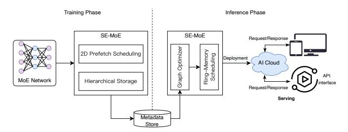
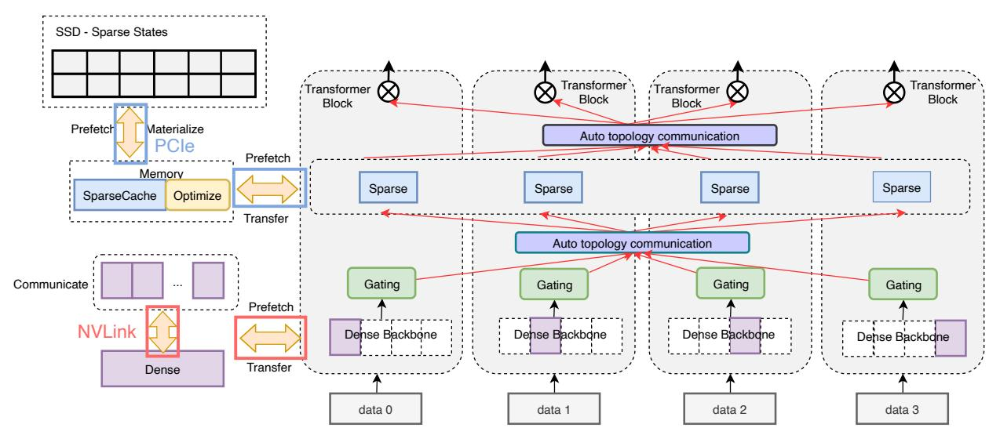
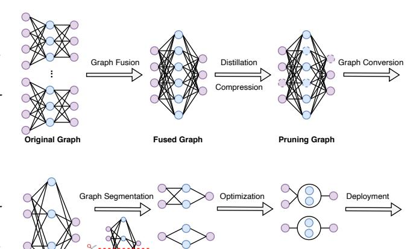

# <span id="page-0-0"></span>**MoESys**: A Distributed and Efficient Mixture-of-Experts Training and Inference System for Internet Services

Dianhai Yu<sup>∗</sup> , Liang Shen<sup>∗</sup> , Hongxiang Hao, Weibao Gong, Huachao Wu, Jiang Bian, *Member, IEEE*, Lirong Dai, *Member, IEEE*, Haoyi Xiong, *Senior Member, IEEE*

**Abstract**—While modern internet services, such as chatbots, search engines, and online advertising, demand the use of large-scale deep neural networks (DNNs), distributed training and inference over heterogeneous computing systems are desired to facilitate these DNN models. Mixture-of-Experts (MoE) is one the most common strategies to lower the cost of training subject to the overall size of models/data through gating and parallelism in a divide-and-conquer fashion. While DeepSpeed [\[1\]](#page-12-0) has made efforts in carrying out large-scale MoE training over heterogeneous infrastructures, the efficiency of training and inference could be further improved from several system aspects, including load balancing, communication/computation efficiency, and memory footprint limits. In this work, we present a novel **MoESys** that boosts efficiency in both large-scale training and inference. Specifically, in the training procedure, the proposed **MoESys** adopts an *Elastic MoE training* strategy with *2D prefetch* and *Fusion communication* over *Hierarchical storage*, so as to enjoy efficient parallelisms. For scalable inference in a single node, especially when the model size is larger than GPU memory, **MoESys** builds the CPU-GPU memory jointly into a ring of sections to load the model, and executes the computation tasks across the memory sections in a round-robin manner for efficient inference. We carried out extensive experiments to evaluate **MoESys**, where **MoESys** successfully trains a Unified Feature Optimization [\[2\]](#page-12-1) (UFO) model with a Sparsely-Gated Mixture-of-Experts model of 12B parameters in 8 days on 48 A100 GPU cards. The comparison against the state-of-the-art shows that **MoESys** outperformed DeepSpeed with 33% higher throughput (tokens per second) in training and 13% higher throughput in inference in general. Particularly, under unbalanced MoE Tasks, e.g., UFO, **MoESys** achieved 64% higher throughput with 18% lower memory footprints.

**Index Terms**—Large Models for Internet Services, MoE, Distributed Training, Distributed Inference ✦

## **1 INTRODUCTION**

In recent years, there has been significant evolution in internet services, and the integration of artificial intelligence has made deep learning models indispensable in the internet ecosystem [\[3\]](#page-12-2)–[\[6\]](#page-12-3). Particularly, large deep neural network (DNN) models such as BERT and GPT have gained increasing popularity due to their remarkable performance in text and language processing applications [\[7\]](#page-12-4), leading to the reliance of various internet services, including chat bots, online advertising platforms, recommender systems, search engines, and translation tools, on these models to provide users with the desired accuracy and customization [\[8\]](#page-12-5)–[\[12\]](#page-12-6). While the utilization of large models has significantly enhanced the performance of internet services, it has come at the cost of expanding the parameter scale to tens of billions, such as the GPT-3 model with 175B parameters [\[13\]](#page-12-7), [\[14\]](#page-12-8), Ernie3.0 Titan with 260B parameters [\[15\]](#page-12-9), and Megatron-Turing NLG with 530B parameters [\[16\]](#page-12-10). However, these densely activated models necessitate abundant computing resources and extensive training time. For instance, the training of Megatron-Turing NLG with 530B parameters, one of the largest densely activated models, required three months using over 2000 NVIDIA A100 GPUs [\[16\]](#page-12-10), making it financially expensive and hindering the development of

*This work was supported in part by (1) project CEIEC-2022-ZM02-0247 and (2) Beijing Municipal Science and Technology Project (No. Z231100010323002)* <sup>∗</sup>*The first two author contributed equally to this work. D. Yu, L. Shen, H. Hao, W. Gong, H. Wu, J. Bian, H. Xiong are with Baidu, Inc., Beijing, China. L. Dai is with Department of Electronic Engineering and Information Science, University of Science and Technology of China, Heifei, China. Corresponding author is Jiang Bian (email: jiangbian03@gmail.com).*

models with even larger parameter scales. Moreover, the inference performance of these super large-scale models seldom meets the current industrial demands [\[5\]](#page-12-11), [\[17\]](#page-12-12).

1

Various ad-hoc strategies have been employed to improve the efficiency of training large-scale models. One such approach is the AIBox concept, applied specifically in the training of Click-Through Rate (CTR) prediction models to reduce costs. This method involves sparsifying feature embeddings and leveraging a distributed multi-GPU setup to over-parameterize the model [\[18\]](#page-12-13). AIBox primarily focuses on certain layers for processing high-dimensional data, with an aim to scale the model. Conversely, in the realm of pre-trained language models, multi-task learning has been adopted, especially for multilingual neural machine translation [\[19\]](#page-12-14). Models like MT5 [\[20\]](#page-12-15), MASSively [\[21\]](#page-13-0), and MultiNLI [\[22\]](#page-13-1) differ from densely activated models but require significant computational resources to surpass existing benchmarks.

To address these challenges, Mixture-of-Experts (MoE) based sparsely activated neural networks have been introduced for training larger models with minimal or no additional computational resources, while still achieving improved training outcomes [\[23\]](#page-13-2)–[\[26\]](#page-13-3). MoE architectures activate only a subset of parameters based on the input data, unlike densely activated models. This selective activation results in a sub-linear increase in computational costs relative to model size. For instance, GLaM's largest variant [\[27\]](#page-13-4) possesses 1.2T parameters with 64 experts per MoE layer, yet only activates a 95B-parameter subnet (8% of 1.2T) for each input token. Training this model saves two-thirds of the power required for GPT-3 (175B) [\[13\]](#page-12-7), while halving the

computational resources needed during inference. Despite all the benefits, MoE models still face numerous challenges and limitations, especially in computation, communication, and storage:

- *Computation –* The computation cost per GPU remains constant in MoE models, but increases with the total number of experts. Training performance suffers due to expert imbalance, where some are overtrained and others underutilized [\[25\]](#page-13-5). Solutions include auxiliary losses [\[24\]](#page-13-6), random expert selection [\[28\]](#page-13-7), and noise in routing [\[25\]](#page-13-5). However, these focus more on scheduling than computation and require substantial CPU resources. Inefficient computational task allocation and redundant operations, like H2D and D2H transfers, reduce efficiency and increase latency [\[29\]](#page-13-8).
- *Communication –* In MoE models, imbalances in routing strategies persist despite advanced learning methods [\[24\]](#page-13-6), [\[25\]](#page-13-5), [\[30\]](#page-13-9), [\[31\]](#page-13-10). Unbalanced data leads to inconsistent progress and redundant waiting in multi-task training. For example, the Switch Transformer model requires four AlltoAll communications per MoE layer, leading to performance degradation due to routing conflicts and blocking in unknown network topologies [\[25\]](#page-13-5).
- *Storage –* The memory and storage capacity limits MoE model sizes. While dense models are constrained by training time, MoE models scale better due to their sublinear computing cost increase. A dense model with 1 trillion parameters requires 3 months to train on 3072 NVIDIA A100 GPUs, but an MoE model can be trained in weeks [\[14\]](#page-12-8). However, the model's scalability depends on device memory capacity. The differences in I/O latency between HBM in GPUs, CPU memory, and SSDs cause delays, necessitating efficient storage management for sparsely activated training [\[32\]](#page-13-11).

**Our Contributions.** To overcome the aforementioned challenges and limitations of MoE, we introduce a novel unified framework **MoESys**, based on an open-source platform for MoE training and inference. The non-trivial contributions in **MoESys** are as follows,

- A novel distributed framework named **MoESys** is designed, which is capable of scaling MoE models to trillions of parameters, fully utilizes the clusters including HBM, CPU memory and even SSDs to break the memory wall and achieves efficient training scheduling. Notably, **MoESys** incorporates advanced techniques such as 2D prefetch scheduling and fusion communication, further enhancing the efficiency of heterogeneous storage systems.
- A new inference method based on the ring memory is employed by dynamic graph scheduling, which can integrate the computation and communication as much as possible and accelerate the inference procedure without using additional machines for larger-scale MoE models.
- Several effective training strategies have been initially devised in **MoESys** for NLP and CV tasks, aimed at scaling up multi-task learning without requiring additional memory. These strategies include load balancing, embedding partition, and resource-aware communication.
- We conduct comprehensive industrial-level experiments to showcase the significant performance gain using **MoESys**, where the practice in this work could benefit the future

development of large-scale MoE training and inference.

We organize the rest of this manuscript as follows. In Section 2, we review the previous efforts on the design of MoE. Section 3 introduces the novel design of **MoESys** respectively. Additionally, we reveal details of the practical implementation strategies adopted in **MoESys** in Section 4. To demonstrate the effectiveness and efficiency of **MoESys**, we conduct comprehensive experiments and analyze the results in Section 5. Finally, we conclude this work and look forward to the future direction in Section 6.

## **2 RELATED WORK**

In this section, we review the relevant works in the field from the perspectives of large models for internet services and their training and inference systems.

## **2.1 Internet Services and Large Models**

Large Language Models (LLMs) are revolutionizing internet services such as search engines, chatbots, online advertising, and cloud applications [\[8\]](#page-12-5)–[\[12\]](#page-12-6), [\[33\]](#page-13-12). Organizations are increasingly using custom LLMs tailored to specific needs. These domain-specific models enhance internet service quality and customer experience, being more efficient and faster than general-purpose LLMs, particularly for applications involving proprietary data. An example is BloombergGPT [\[34\]](#page-13-13), a custom LLM by Bloomberg, which significantly impacts online finance services by rapidly evaluating financial data for risk assessments, financial sentiment analysis, and potentially automating accounting and auditing. Despite its large size of 50 billion parameters, BloombergGPT avoids traditional single-model training, favoring a Mixture-of-Experts (MoE) system for better efficiency and effectiveness. MoE models have shown great promise in natural language processing, with strategies focusing on routing enhancements [\[28\]](#page-13-7), [\[35\]](#page-13-14) to improve model quality and performance. Notice that, the GLaM [\[27\]](#page-13-4) framework demonstrates that the largest MoE with 1.2 trillion parameters is more energy-efficient, using only one-third of the energy required for training GPT-3.

In light of the scaling law, there's a growing trend to increase model sizes. MoE-based models with billions or even trillions of parameters, like CPM-2 [\[36\]](#page-13-15), M6-T [\[31\]](#page-13-10), M6- 10T [\[37\]](#page-13-16), and GLaM [\[27\]](#page-13-4), are showing superior generalization in language processing and multi-modal tasks. Baidu's UFO [\[2\]](#page-12-1) model, another MoE-based framework, emphasizes deployment efficiency and big data utilization. It features a super network comprising multiple subtasks, with a routing strategy selecting the appropriate subtask for training.

## **2.2 MoE Training and Inference Systems**

The rising popularity of the Mixture of Experts (MoE) training approach has led to the release of several opensource MoE training frameworks and systems by various scientific research bodies and corporations. DeepSpeed-MoE integrates multiple distributed parallel techniques like data parallelism and tensor slicing to effectively utilize MoE parallelism, allowing for the training of larger models. It also introduces PR-MoE, a new sparsely activated model for MoE inference, and employs model compression to reduce model sizes, alongside an efficient communication strategy to

improve latency [38], [39]. FastMoE, another distributed MoE training system, offers a user-friendly hierarchical interface and straightforward guidelines for integrating Megatron-LM and Transformer-XL with data and tensor slicing parallelism [29], [40], [41]. Unlike DeepSpeed, FastMoE focuses on reducing network traffic through an advanced optimization method. The INFMoE inference system suggests an optimal computation sequence and parameter offloading using a greedy algorithm to address workload imbalances and minimize the impact of data movement, especially when offloading to CPUs, while maintaining computational efficiency [36]. Fairseq-MoE is a framework tailored for training custom models in areas like summarization, translation, and language modeling. Tutel enhances Fairseq's communication and computation capabilities, leading to a performance boost of around 40%. Notably, these improvements in Tutel have been incorporated into DeepSpeed for MoE model training [42]–[44].

Furthermore, model scale and data size are two crucial factors that significantly impact the performance and effectiveness of model training. However, exploring further in this field poses a substantial challenge for scientific institutions and enterprises due to the enormous computational and storage resource requirements involved. To address this challenge, the design of sparsely activated model has emerged in recent years and gained traction in the industry. Unlike densely activated models that involve computing all parameters, the sparsely activated model dynamically selects a subset of parameters for training based on the input data. This approach enables linear parameter scaling without increasing the computational workload, thus making larger models built on the Mixture-of-Experts (MoE) architecture more feasible and efficient.

## 3 MoESys Design

**MoESys** is an innovative system for distributed training and inference, utilizing a Mixture-of-Experts architecture to enhance scalability and efficiency. Its main objective is to adhere to predefined memory latency goals while operating within existing storage limits. A notable advancement in this area is DeepSpeed's Zero-infinity approach [45], which has successfully trained a model with over 30 trillion parameters using 512 V100 GPUs across NVIDIA DGX-2 nodes. This pioneering technique circumvents memory bottlenecks by fully exploiting a range of storage mediums, such as High Bandwidth Memory (HBM) in GPUs, CPU memory, and SSDs. This enables the training of exceptionally large models on singular devices. To refine storage use and boost training efficacy, both the Zero strategy [45] and a parameter prefetching method are implemented. However, there is a need to consider the reduced longevity and diminished performance of SSDs when near maximum capacity [46]. Moreover, DeepSpeed's current prefetching approach does not accommodate the heterogeneity of parameters specific to the Mixture-of-Experts design. MoESys addresses these issues by introducing an innovative prefetching scheduling technique. This method enhances both training and inference by tailoring to the distinct attributes of various parameters, effectively leveraging multi-tiered storage solutions to optimize system performance.

## 3.1 Overall Design of Architecture

**MoESys** employs a two-phase approach, namely the training phase and the inference phase, as illustrated in Figure 1. During the training phase, large-scale models are trained offline utilizing a variety of strategies. Once the model convergence is achieved, the parameters are saved for future use. On the other hand, the inference phase involves deploying the trained model to the cloud through graph optimization and pruning operations. This deployment facilitates convenient query services for users.

<span id="page-2-0"></span>

Fig. 1: MoESys's architecture diagram

## 3.2 Training Phase

To enhance the efficiency of MoE training and address issues pertaining to Solid-State Drives (SSDs) and scheduling in the context of training large-scale models, a novel approach has been introduced [47]. In this method, MoE model parameters are divided into two categories according to their activation characteristics. Parameters in the first category are sparsely activated during training, such as those in the switching feed-forward network (FFN) layer, while the second category includes densely activated parameters, like those in the multihead attention layer. Given that sparse parameters, which form a substantial part of the MoE model, may surpass GPU storage capacities, **MoESys** has restructured the MoE training system architecture, as shown in Figure 2. This restructure utilizes a variety of storage mediums to meet the memory demands of both sparse and dense parameters. To counteract the performance issues arising from data transfer across different storage types, a new technique termed 2D prefetch scheduling has been implemented. The following sections will delve into a comprehensive discussion of our training framework, concentrating specifically on two principal components: Hierarchical Storage and 2D Prefetch Scheduling.

#### 3.2.1 Hierarchical Storage

In the context of large-scale Mixture-of-Experts (MoE) models, the increasing scale of parameters has led to storage becoming a significant bottleneck in model training. Typically, the stored parameter states consist of three components: trainable parameters, parameter gradients, and corresponding optimizer states. Considering the different storage media available, the storage devices can be classified into three categories: GPU-Node, CPU-Node, and SSD-Node. Since dense parameters are extensively utilized for computation and do not occupy the majority of storage space, their parameter states are stored exclusively on the GPU-Node to minimize data movement. In contrast, sparse parameters, which are selectively activated during training and consume

<span id="page-3-0"></span>

Fig. 2: Overall MoE training: This is an example of the MoE training with four devices. In accordance with the parameter state property of the MoE model, the parameter states are stored in both GPUs and SSDs. With this heterogeneous storage setup, we can effectively utilize the NVLink and PCIe bandwidth concurrently, leveraging their capabilities in two dimensions.

a significant amount of storage space compared to dense parameters, have their parameter states stored on the SSD-Node and are transferred to the GPU-Node when required for calculations. By strategically allocating the corresponding parameter states to hierarchical storage based on the computational and storage characteristics of parameters, the storage capacity of devices can be maximally utilized.

In light of the constraints posed by storage nodes, this work introduces a set of theoretical formulas to articulate the correlation between various storage devices and the storage requirements of parameter states when utilizing the ADAM optimizer [\[48\]](#page-13-26). Typically, each storage device is configured with eight GPUs. We denote the aggregate count of dense and sparse parameters as D and S respectively, and L as the total number of MoE layers. The capacities of SSD memory, CPU memory, and GPU memory in a single device are represented by MSSD, MCP U , and MGP U , in that order. Moreover, N signifies the quantity of devices. We also introduce a variable, α, to quantify the likelihood of activation of sparse parameters during training, with α ranging between 0 and 1.

For the GPU-Node, it stores the dense parameter states used in forward propagation [\(FWD\)](#page-0-0), backward propagation [\(BWD\)](#page-0-0), and parameter updating. This includes parameters such as param fp16, grad fp16, master param fp32, momentum fp32, variance fp32, with a total size of 2D + 2D + 4D + 4D + 4D = 16D bytes. Furthermore, it accommodates sparse parameters and their corresponding gradients, with a size of 4αS/L bytes, accounting for the selective activation of sparse parameters. The CPU-Node serves as a cache to hold high-frequency sparse parameter states, occupying 16αS bytes. Lastly, the SSD-Node stores all sparse parameter states on the device, including master param fp32, momentum fp32, and variance fp32, with a size of 12S bytes.

$$\begin{tabular}{lll} {\bf GPU-Node}: & 16D+4\alpha S/L \leq M_{GPU} \cdot N \\ {\bf CPU-Node}: & 16\alpha S \leq M_{CPU} \cdot N \\ {\bf SSD-Node}: & 12S \leq M_{SSD} \cdot N \\ \end{tabular} \end{tabular} \begin{tabular}{lll} \end{tabular}$$

The scale of the entire MoE model:

$$P = S + D \tag{2}$$

The storage mechanism for sparse parameters typically involves saving them on SSDs. Nonetheless, SSDs encounter limitations due to their flash media, limited PCIe bandwidth, and constraints of the NVMe protocol. These factors contribute to increased latency and a restricted number of erasures, posing challenges in MoE training scenarios that require frequent write operations. To address these challenges, we turn our focus to Intel Optane Persistent Memory (Optane PMem) [\[49\]](#page-13-27), an innovative storage medium that merges the benefits of byte-level addressing, similar to DRAM, with the long-term storage ability of SSDs. Optane PMem is connected to the CPU's integrated memory controller (IMC) via the DIMM (Dual Inline Memory Module) interface and communicates using DDR-T, a protocol developed for DDR4's electrical/mechanical interface. This configuration allows for byte-level addressing through CPU commands, enhancing bandwidth and decreasing latency. Significantly, Optane PMem functions in two modes: memory mode and AppDirect mode. For our specific requirement of storing parameter files on Optane PMem, we choose the AppDirect mode and set the namespace to FSDAX. By exploiting the features of Ext4, direct load and store operations are possible, circumventing both the CPU's page cache and the kernel, which facilitates seamless data transfer free from interruptions or context switches.

#### *3.2.2 2D Prefetch Scheduling*

The implementation of hierarchical storage for the preservation of both sparse and dense parameter states in MoE training introduces considerable time overhead due to the necessity of transferring these states across various devices. To mitigate this, a 2D prefetch scheduling strategy is proposed, allowing for the simultaneous processing of dense and sparse schedules during MoE training. This strategy facilitates the concurrent computation of parameters with the scheduling procedure.

In greater detail, this strategy, particularly when applied to the dense parameter subset as defined by the ZeRO-3 strategy, enables prefetching of the entire dense parameter set post inter-rank communication along the horizontal axis, utilizing the rapid transfer speeds of NVLink. This approach is instrumental in achieving data parallelism, as demonstrated in Algorithm [1.](#page-4-0) In this methodology, prefetching occurs alongside the computation and communication processes of the current layer. To be more specific, while the i th layer undergoes computation and communication, prefetch scheduling for the (i+1)th layer's parameters is conducted in parallel. This simultaneous prefetching approach guarantees the readiness of parameters for the subsequent layer when required, significantly reducing idle times and boosting overall computational efficiency.

## **Algorithm 1:** Scheduling on Dense Parameters

```
1 d
   ′
   i
    : Dense parameter state slices in i
                                      th layer
2 di
    : total dense parameters in i
                                 th layer
3 Function DenseSchedule(i):
4 Get dense parameters in i
                               th layer dslice
5 d = AllGather(d
                      ′
                      i
                       )
6 End Function
```

In a similar vein, the prefetching of sparse parameters takes place through the PCIe bandwidth in the vertical dimension of the device. Given that sparse parameters are stored in SSDs, we mitigate access to SSDs for sparse parameter states by implementing a cache mechanism in the CPU memory, akin to the LFU (Least Frequently Used) mechanism [\[50\]](#page-13-28). CPU caches are responsible for storing selectively activated sparse parameter states used in FWD/BWD calculations and parameter updates. When a prefetch request is received, it is prioritized to retrieve the requested sparse parameters from the CPU caches. If these parameters are not found in the CPU caches, they are subsequently retrieved from the SSDs. Moreover, when the CPU caches become full or when the sparse parameter update cycle period is reached, the sparse parameter states from the CPU caches are used to update the corresponding parameter states on the SSDs.

As the CPU memory on each machine only caches frequently activated sparse parameters, we only need to prefetch the parameters of one or more expert layers, which are cached in the CPU memory, to the corresponding GPU memory in advance. By prefetching parameters in advance, the waiting time for computation can be significantly reduced. From a global perspective, by utilizing the bandwidth of NVLink and PCIe in two dimensions, we can simultaneously prefetch dense and sparse parameters, effectively reducing the scheduling gap caused by heterogeneous storage and greatly enhancing training efficiency. In the following sections, we present a detailed explanation of the CPU cache mechanism, as depicted in Algorithm [2.](#page-4-1) Additionally, we maintain historical hit information for each sparse parameter,

## **Algorithm 2:** Scheduling on Sparse Parameters

th layer

<span id="page-4-1"></span>**<sup>1</sup> Parameters:**

**<sup>2</sup>** ps: sparse parameter states in i

```
3 cachescpu: CPU caches
4 CP Usize: the maximum capacity of the CPU caches to
   store sparse parameter states
5 hits: the frequency of hits for a specific sparse parameter in
   the hash table
6 threshold: hit threshold
7 β: attenuation coefficient
8 K: the step size of moving average
9 steps = 0: cycle steps
10 acccaches = 0: cumulative caches
11 Function SparseSchedule(i):
12 if ps in cachescpu then
13 Get ps from cachescpu
14 hits[ps] += 1
15 else if acccaches + 1 < CP Usize then
16 hits[ps] = 1
17 acccaches += 1
18 Fetch ps from SSDs to cachescpu
19 else
20 foreach pa in hits do
21 hita = hits[pa]
22 if hita ≥ threshold and
           min(hits.values()) == hita then
23 Update the states of pa on SSDs
24 Delete the states of pa in cachescpu
25 Delete hits[pa]
26 Fetch ps from SSDs to cachescpu
27 steps += 1
28 if steps == K then
29 hits · β ▷ moving average
30 steps = 0
31 ps −→ GP U ▷ transfer ps to the corresponding GPU
32 End Function
```

which is recorded in a hash table referred to as hits. Specifically, if a parameter p<sup>s</sup> is requested and has been used in the previous FWD, we increment its count in the hits table. When the CPU caches have reached their maximum capacity, we update the sparse parameter states with the lowest hit frequency that surpasses the hit threshold.

In the MoE model training, each node determines whether to activate its experts in the next iteration based on the recorded expert selection results and the maintained experts' information. If activation is needed, further decisions are made based on the historical hit information recorded in a hash table to determine whether to send prefetch requests. Firstly, to avoid introducing additional CPU operations before sending prefetch requests, it is essential to place the hash table that records historical hit information on the GPU Node. Since each node only stores a portion of the sparse parameters in the SSD (not the full set), it is only necessary to maintain historical hit information for the corresponding sparse parameters. This approach distributes the GPU space cost across all computing nodes, making it negligible. Secondly, the process of selecting experts by the

Gate network inherently requires All-to-All communication to synchronize the selection results across each node in the Expert Parallelism Group. The prefetch scheduling simply reuses the results of this All-to-All communication, so no additional communication operations are introduced. Additionally, the time complexity of a hash table is O(1), meaning each prefetch operation involving searches, insertions, or deletions can be completed in constant time, thus not introducing additional computational costs.

The distinct and non-interfering characteristics of dense and sparse parameters in the model facilitate the simultaneous implementation of prefetch strategies. This approach optimally leverages the bandwidth capacities of both NVLink and PCIe. While the GPU is engaged in prefetching the parameter state for the upcoming layer, it can also simultaneously execute computations for the current layer. This dualoperation mode efficiently combines the tasks of computation and parameter readiness.

## **3.3 Inference Phase**

Numerous studies [\[27\]](#page-13-4), [\[43\]](#page-13-29) have demonstrated that Mixtureof-Experts (MoE) models exhibit significantly higher training efficiency compared to dense models. However, during inference, the presence of numerous parameters, many of which are ineffective, poses a challenge of increased storage requirements compared to dense models. Knowledge distillation [\[25\]](#page-13-5), [\[51\]](#page-13-30)–[\[53\]](#page-13-31) has emerged as a popular approach for reducing model size while preserving accuracy. In this context, DeepSpeed [\[39\]](#page-13-18) has proposed the Mixtureof-Students (MoS) architecture to enhance the accuracy of the student models. Specifically, to achieve low latency and high throughput at a large scale for MoE models, various parallelism techniques have been devised [\[39\]](#page-13-18), including expert-slicing, expert parallelism, tensor-slicing, and others. However, the inference of MoE models at an unprecedented scale often neglects the consideration of multiple storage devices when the number of machines is limited.

In the following subsections, we present the approach adopted by **MoESys** to achieve high efficiency throughout the training and inference deployment. We optimize the graph training process and propose innovations in the MoE inference architecture based on ring memory. This architecture addresses the memory wall challenge and ensures optimal performance to the greatest extent possible.

#### *3.3.1 Graph Optimization*

The training phase of **MoESys** incorporates dynamic graph training, which offers significant advantages in terms of debugging and flexibility. In contrast, for enhanced stability and efficiency, the inference and deployment stages utilize a static graph. Figure [3](#page-5-0) illustrates the overall process of inference, which comprises six key steps:

- Graph Fusion The original graph is merged with the corresponding distributed strategy to accommodate ultralarge-scale distributed training. This step involves eliminating parameter redundancy.
- Distillation and Compression The numerous experts in the teacher network are compressed through distillation and compression techniques, resulting in a student network with fewer experts.

<span id="page-5-0"></span>

Fig. 3: Inference Pipeline in MoE.

**Optimized Graph**

**Distributed Graph**

**Static Graph**

- Graph Conversion The dynamic graph is converted into a static graph to enable subsequent optimization and deployment processes. Due to space limit, we introduce the detailed strategy of conversion in the external link[1](#page-5-1) .
- Graph Segmentation Based on available inference resources and specific requirements, a rational distributed strategy is chosen either manually or automatically to partition the static graph into multiple distributed subgraphs. Additional communication is added as needed.
- Optimization Pertinent Intermediate Representation (IR) Pass optimizations, such as kernel fusion, are applied to the distributed sub-graphs to further improve inference performance.
- Deployment The optimized sub-graphs are deployed on servers to provide efficient and reliable services.

It is important to note that **MoESys** combines highly optimized transformers and MoE-related kernels. We leverage optimized methods, such as Fused Multi-head Attention, which have been successfully employed in NVIDIA's BERT implementation for MLPerf 1.1 [\[54\]](#page-13-32). These optimizations effectively reduce kernel launch time. For the MoE model, we have developed unique kernels to improve H2D/D2H (Hostto-Device/Device-to-Host) transfer time by utilizing CUDA Pinned Memory and customizing AlltoAll communication. Our aim is to minimize the number of layer transitions as much as possible. The details of these optimizations and their impact on the performance of **MoESys** are presented and discussed in Section [5.4.](#page-11-0)

