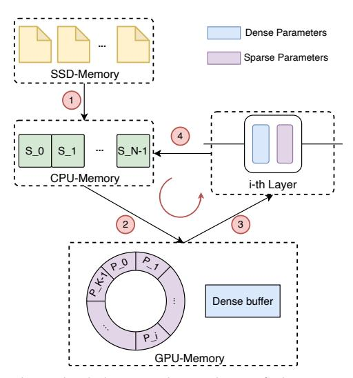
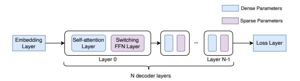

# *3.3.2 Ring Memory Offloading*

In order to facilitate the inference of large-scale MoE models with limited resources, it is essential to employ an offloading strategy to address the storage challenge. However, the speed of data movement often becomes a limiting factor for inference performance. Consequently, numerous methods aim to conceal the impact of data movement by maximizing the overlap between data movement and inference calculations, thereby reducing the waiting time for calculations. In this work, we propose a dynamic scheduling strategy for offloading sparse parameters, specifically expert

1. [https://www.paddlepaddle.org.cn/documentation/docs/en/](https://www.paddlepaddle.org.cn/documentation/docs/en/guides/jit/basic_usage_en.html) [guides/jit/basic\\_usage\\_en.html](https://www.paddlepaddle.org.cn/documentation/docs/en/guides/jit/basic_usage_en.html)

Fig. 5: The scheduling and timeline of the ring memory offloading process can be summarized into the following essential steps: 1 Load N copies of parameters from files in SSD memory, 2 Load K copies of parameters from CPU memory, 3 Execute the computation for the i-th layer, 4 Release the i-th parameter and trigger asynchronous copy process to replace Pi with SK+i .

parameters in the MoE model. The objective is to maintain efficient performance by concurrently moving parameters from CPU memory while performing inference computations in GPU memory. By overlapping these operations, we aim to minimize the overall latency and enhance the efficiency of the inference process.

The structure of the MoE model during its inference stage, illustrated in Figure [4,](#page-6-0) demonstrates a layer-specific independence of parameters, reminiscent of the switch transformer architecture [\[25\]](#page-13-5). This design feature enables the staggering of computation and offloading tasks, thereby facilitating their concurrent execution. Considering an MoE inference model comprising N decoder layers, each layer's expert parameters are replicated N times and stored on the CPU device. Concurrently, other parameters, such as embeddings, are maintained within the dense buffer of the GPU device. In addition, K replicas of the expert parameters are also cached within the GPU device.

Fig. 4: Switching Layers in MoE Inference Model.

As depicted in Figure [5,](#page-6-1) upon completion of the computation pertaining to the i-th layer, the corresponding parameter Pi in the GPU memory can be released. Concurrently, the SK+i expert parameter of the (K + i)-th layer can be asynchronously loaded from the CPU memory to occupy the previously utilized space by Pi . This procedure, referred to as calculation-released-load, facilitates the maintenance of a fixed number of K expert parameter duplicates on the GPU device. These duplicates are stored in the ring memory, thereby mitigating memory fragmentation. By leveraging distinct CUDA streams, the expert loading from the CPU and the computation process can be partially overlapped. Moreover, by ensuring a substantial ring memory size and incorporating a greater number of decoder layers in the MoE inference model, the level of overlap can be significantly optimized. For an evaluation of the inference performance using the ring memory approach, please consult Section [5.4.](#page-11-0)

