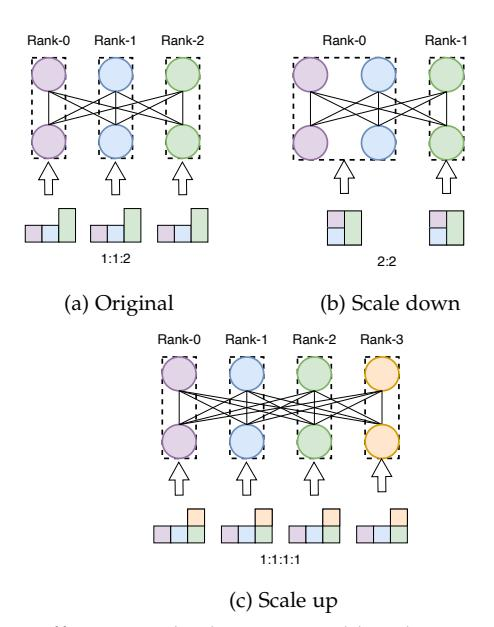
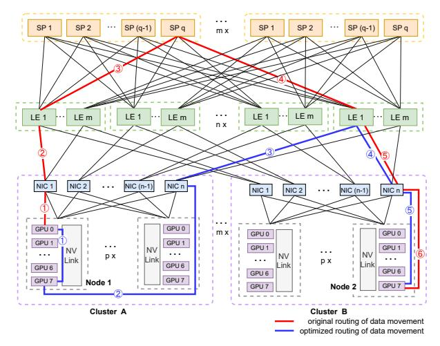
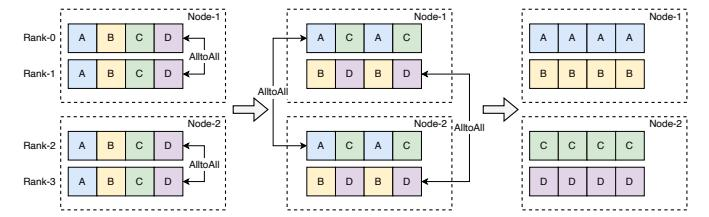

# **4.1 Elastic MoE Training**

Load imbalance significantly influences training efficiency, especially in multi-task training scenarios employing the MoE framework. A prominent instance of this is seen in the UFO task, where the differential input data volumes across various tasks lead to unequal computation durations, thus exacerbating load imbalances. This discrepancy manifests in two primary forms: one, the breaching of memory capacity limits due to the processing of disproportionately large batch sizes by individual task nodes, a consequence of aggregating data from other nodes; and two, the retardation of synchronous communication caused by the lag of the slowest node. This phenomenon, known as the "Cask Effect" [\[55\]](#page-13-33), results in reduced computational efficiency.

To tackle these challenges, we implement the elastic MoE training method, which dynamically adjusts the number of training nodes to ensure load balance based on the estimated workload of each task. In practical terms, for lighter tasks, combining multiple nodes proves more resource-efficient, as long as storage capacity is not a limiting factor (see Figure [6b\)](#page-7-0). Conversely, for heavier tasks, we introduce additional nodes to distribute the workload across more computing resources. Simultaneously, we partition the input data of heavy-duty tasks to achieve load balance and employ data parallelism to ensure parameter synchronization (see Figure [6c\)](#page-7-1). These elastic training approaches effectively mitigate performance degradation resulting from load imbalance. You can find detailed performance comparisons in Section [5.3.](#page-9-0)

In elastic training, load imbalance often leads to situations where some devices are idle, waiting for others to complete their computations, creating what is known as "bubbles." These bubbles not only reduce computational efficiency but also increase training costs. To address this, we have introduced a method of scaling up or down the computational devices dynamically. This method aims to reduce waiting

Fig. 6: Different methods supported by elastic MoE training: (a) the original training with load imbalance, in which the ratio of each node data quantity is 1:1:2; (b) combining multiple nodes with light-duty tasks, in which the ratio of each node data quantity is 2:2; (c) adding extra nodes to handle heavy-duty tasks, in which the ratio of each node data quantity is 1:1:1:1.

times and enhance the FLOPS (floating-point operations per second) utilization rate per device, thereby boosting the throughput (tokens/s/card) of each compute device. The decision to scale up or down should be based on specific training requirements and cost considerations:

- Upscaling: When there is a need to increase the overall end-to-end throughput, we typically scale up by adding more compute devices. This reduces the total training time for the model.
- Downscaling: In situations where resources are constrained, and cost control is crucial, we opt for downscaling by reducing the number of compute devices, thereby lowering the cost of training the model.

Irrespective of the scaling direction, both methods effectively enhance the FLOPS utilization rate, reduce idle waiting times for compute devices, and decrease the overall "bubble" time during training.

#### 4.2 Resource-Aware Communication

In the process of training and inference of the MoE model, a significant volume of AlltoAll communication is necessitated between devices in the context of expert parallelism. This communication procedure has the potential to become a performance bottleneck, as multiple instances of AlltoAll communication may contend for the finite network resources concurrently. Upon analysis of network topologies in typical clusters, it is observed that data interaction across clusters exhibits relatively slower transmission speeds compared to interactions within a single cluster. This disparity arises from factors such as congested message pathways and higher traffic costs associated with inter-cluster communication.

Fig. 7: Network topology and message pathways for data movement

By utilizing NVLink, intra-node communication incurs minimal time and resource overhead as it avoids traversing any Network Interface Cards (NICs) or switches. However, inter-node communication within a cluster or across clusters necessitates traversing a congested message path that involves NICs and switches [56], resulting in increased time consumption for traffic scheduling. Consider a network consisting of m clusters and p nodes that share a common set of NICs within each cluster. The leaf switches (LE) and spin switches (SP) are organized into n and m groups, respectively. As depicted in Figure 7, the leaf switches of the *i*-th group establish direct connections only to NICs with a rank of i from different clusters. The spin switches facilitate communication between leaf switches. It is important to note that the bandwidth of the spin switch is lower than that of the leaf switch. Hence, it is preferable to maximize the utilization of the leaf switch for data exchange, aiming for improved performance. For instance, let us consider a scenario where all GPU0s are connected to NIC1 and all GPU7s are connected to NICn. We observe that data movement between GPU0 of Node1 in Cluster A and GPU7 of Node2 in Cluster B traverses the switch routing path [LE1, SPq, LE1] as indicated by the red lines. This incurs higher communication costs and the potential for resource contention with other interactions. An alternative approach involves a two-step process: first, transferring data from GPU0 to GPU7 within Node1 using NVLink, and then performing cross-cluster communication between the corresponding pair of NICs with rank 7, without crossing any switches except LE1. This is depicted by the blue lines. Such an approach enables the optimal utilization of NVSwitch bandwidth and enhances network traffic optimization.

Hence, the speed at which data is exchanged between GPUs of the same rank within a node surpasses that of GPUs with different ranks within the same node. To leverage the network topology's characteristics, we propose an optimized approach for Hierarchical AlltoAll communication that takes into account the available resources during both training and inference. As depicted in Figure 8, to avoid cross-node communication involving GPUs of different ranks, we initially utilize intra-node AlltoAll communication through

Fig. 8: Hierarchical AlltoAll

NVSwitch connections to collect the data. Afterward, we group GPUs with identical ranks for inter-node AlltoAll communication, allowing communication across machines without incurring unnecessary costs related to crossing different channels.

Furthermore, this approach enhances peer-to-peer communication between nodes by a factor of p, where p denotes the number of GPUs within a single node. This increase in inter-node communication capacity enables the optimal utilization of inter-node bandwidth. In contrast to DeepSpeed's AlltoAll design [39], which is primarily aimed at addressing the issue of small per-port communication volumes in all-to-all communication through a layered approach for tensor fusion to facilitate larger packet communication, our approach is specifically tailored to the network topology of our experimental cluster. We concentrate on maximizing the utilization of NVLink connections and mitigating network congestion. Therefore, our Hierarchical AlltoAll structure is a direct response to our specific network topology and would adapt if the cluster's topology were to change. This distinction underscores the customization of our method to our particular hardware and network architecture, which differs from the more generalized approach adopted by DeepSpeed.

