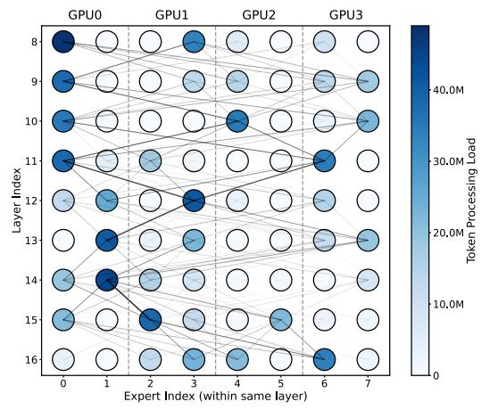

# 1 Introduction

The rapid growth of transformer models [\[1,](#page-12-0)[34,](#page-13-0)[35,](#page-13-1)[42–](#page-14-0)[44\]](#page-14-1) has revolutionized deep learning, driving advancements in natural language processing, computer vision, and other sequencebased tasks. By leveraging self-attention mechanisms, transformers excel at capturing long-range dependencies and processing large-scale datasets efficiently. However, as these models scale, their parameter count grows exponentially, significantly increasing computational and memory demands. For instance, models like LLaMA and GPT, with billions of parameters, push the limits of current hardware, making largescale training and deployment prohibitively expensive [\[1,](#page-12-0) [43\]](#page-14-2).

As such, Mixture-of-Experts (MoE) architecture has emerged to efficiently scale large models [\[3,](#page-12-1) [5,](#page-12-2) [15,](#page-12-3) [20\]](#page-13-2). MoE models activate only a subset of experts within each layer, significantly reducing the computational burden compared to dense models [\[39\]](#page-13-3). By routing tokens through only a subset of experts at each layer, MoE models reduce computational costs compared to dense models of equivalent capacity. This sparse activation allow for larger models to be trained without a proportional increase in compute requirements. Despite these benefits, MoE models face several challenges as they continue to scale. While sparse routing helps reduce compute intensity, the parameters still scale and so does the memory capacity requirement [\[2,](#page-12-4) [5,](#page-12-2) [7,](#page-12-5) [8,](#page-12-6) [14,](#page-12-7) [22,](#page-13-4) [37\]](#page-13-5). Additionally, the effectiveness of individual experts becomes increasingly unbalanced, with some experts being activated far more frequently than others. This skewed activation pattern results in imbalanced hardware utilization of MoE models.

Expert parallelism distributes experts across multiple GPUs to scale the experts and size of the models [\[2,](#page-12-4) [7,](#page-12-5) [8,](#page-12-6) [21,](#page-13-6) [36,](#page-13-7) [41,](#page-14-3) [45\]](#page-14-4). In a typical MoE model, each expert is responsible for processing a subset of tokens. As the number of experts grows, it becomes impractical to fit all of them onto a single GPU due to memory constraints. Expert parallelism solves this issue by partitioning the experts evenly across GPUs, ensuring that each GPU processes a smaller subset of experts [\[21,](#page-13-6) [36\]](#page-13-7). In conventional expert parallelism implemented in popular ML frameworks like Deepspeed and Megatron-LM [\[37,](#page-13-5) [40\]](#page-13-8), each GPU is assigned a contiguous range of experts. For instance, when expert parallelism is deployed across 4 GPUs for an MoE model with 8 experts per layer, as shown in Figure [1,](#page-1-0) GPU 0 handles experts 0 and 1, GPU 1 handles experts 2 and 3, and so on. In this setup, tokens are dispatched to remote GPUs via all-to-all communication if the destination expert is not present locally. This distribution aims to alleviate the memory burden on individual GPUs, enabling the model to scale efficiently as the number of experts increases.

Figure 1: Token routing statistics for Mixtral-8x7B. Each colored circle represents an expert in a layer, and the lines connecting them illustrate the number of tokens routed between pairs of experts. Thicker lines indicate a higher volume of routed tokens, highlighting key routing dependencies.

Expert parallelism introduces bottlenecks. Firstly, communication during token routing, especially all-to-all, can dominate execution time, especially when token routing is imbalanced across GPU pairs. For example, for the Mixtral-8x7B [\[15\]](#page-12-3) model, we observe that all-to-all communication takes up 35.7% of the end-to-end inference time. Secondly, in existing work [\[8,](#page-12-6) [21,](#page-13-6) [41,](#page-14-3) [45\]](#page-14-4) even though every GPU has equal number of experts, the expert activation is still skewed and activates certain experts more than the others. Uneven activation of experts across GPUs exacerbates token processing tail latency, where GPUs responsible for processing a larger number of tokens cause other GPUs to stall until all computations are finished. In summary, while expert parallelism mitigates memory constraints to facilitate scalability, it adds the communication overhead and faces token balance issues.

To address inefficiencies in expert parallelism, prior works explore techniques such as overlapping compute and communication to mitigate communication costs [\[2,](#page-12-4) [8,](#page-12-6) [16,](#page-12-8) [21,](#page-13-6) [36,](#page-13-7) [40,](#page-13-8) [41\]](#page-14-3). Other approaches focus on minimizing communication volume through optimized token dispatch mechanisms or locality-aware expert placement strategies, achieving notable gains in throughput and efficiency [\[45\]](#page-14-4). While these methods achieve notable improvements in throughput and efficiency by reducing the overhead of inter-GPU communication, they often fall short in addressing two critical challenges: load imbalance in token processing and the communication tail latency caused by uneven token distribution across GPU pairs. These works still distribute the experts evenly across GPUs purely based on parameter size and not based on their token activation. These systemic inefficiencies remain significant bottlenecks, preventing optimal scalability and performance in large-scale MoE systems.

To address these challenges, we leverage the insight that

activation dependencies exist between experts across layers, creating an affinity for activating specific experts based on those activated in the previous layer. Moreover, certain experts are activated significantly more frequently than others, adding an imbalance to the system. A straightforward approach is to distribute experts based on token routing; however, the challenge with this approach is that distributing with expert parallelism still needs to mitigate the memory bottleneck, thus parameter size is still a factor that determines how experts are distributed. In this work, instead of distributing experts evenly based solely on parameter size, we account for size, token routing patterns, and expert activation chains. To solve this optimization problem, we propose an Integer Linear Programming (ILP) formulation that models the communication and computation costs of token routing and expert activation. By leveraging cross-layer dependencies, our approach derives an optimal expert placement strategy that minimizes inter-GPU communication while balancing token processing workloads and expert size across devices. This strategy effectively reduces all-to-all communication overhead and mitigates compute-induced tail latency by ensuring even distribution of token dispatching and expert activations, while minimizing the total number of tokens dispatched. Through ILP-based optimization, we resolve communication skew and token processing load imbalances, ultimately enhancing the scalability and performance of MoE models.

In summary, we make the following contributions:

- We identify key bottlenecks in existing expert parallelism techniques, which focus primarily on reducing total communication volume but often result in imbalanced token routing and uneven expert activation across devices.
- We exploit token routing dependencies to design an optimal expert placement strategy that mitigates these bottlenecks, improving load balancing and communication efficiency across GPUs.
- We introduce MOETUNER , a novel optimization approach for expert parallelism in MoE models leveraging ILP to minimize both communication and computeinduced tail latency.

We demonstrate the effectiveness of MOETUNER using the Mixtral-8x7B model, achieving 9.3% and 17.5% of average speedups in single-node (8 H100 GPUs) and multi-node (16 H200 GPUs) distributed MoE inference tasks, respectively. These improvements are driven by two key factors: (1) loadbalanced token processing to minimize GPU idle times and lower token processing latency, and (2) reduced variation in remote token dispatching, ensuring efficient all-to-all communication. Together, these optimizations address inefficiencies in expert computation and token dispatching, enabling consistent performance improvements across distributed settings.

