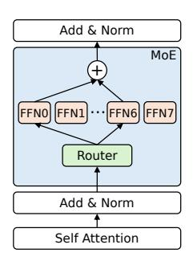
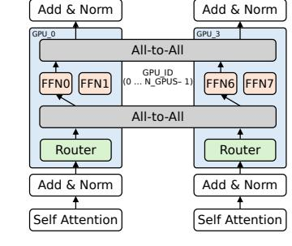

# 2.2 Expert Parallelism and Token Dispatching

To manage the massive parameter size of MoE models, distributed systems employ expert parallelism—a model-parallel strategy designed specifically for MoE architectures. Expert parallelism partitions experts across multiple GPUs, distributing computational workloads and reducing the memory footprint on each GPU. This approach enables the model to scale without requiring an impractically large amount of memory on individual GPUs. There are two primary techniques for distributing experts across devices to reduce their memory footprint. The first evenly splits the number of experts across devices [\[36,](#page-13-7) [37,](#page-13-5) [40,](#page-13-8) [45\]](#page-14-4), while the second splits each expert and distributes its components across devices [\[19,](#page-12-11) [40,](#page-13-8) [41\]](#page-14-3). Figure [2\(](#page-2-0)a) illustrates an example MoE model on a single GPU, while (b) demonstrates expert parallel execution across four devices, which involves all-to-all communication [\[29\]](#page-13-9) to gather the expert data. In the second expert parallel setup, tokens are routed to remote GPUs using all-to-all communication based on their assigned experts. This mechanism ensures that tokens are processed by the most relevant experts. Despite these strategies, both techniques distribute experts evenly based solely on memory footprint, without accounting for the computational load on each expert.

(a) Execution of an MoE model on a single GPU with 8 experts.

(b) Expert-parallel execution with an expert parallel size of 4. Experts are distributed across GPUs, with all-toall operations before and after the FFN computations.

Figure 2: An example of Mixture-of-Experts (MoE) model execution. (a) Single-GPU execution with all experts local to the GPU. (b) Expert-parallel execution, where experts are distributed across GPUs, requiring inter-GPU communication through all-to-all operations.

