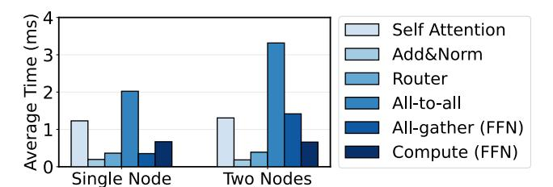
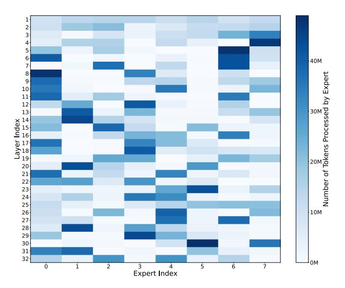
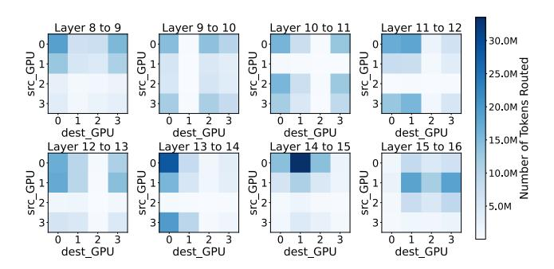

# 2.3 Related Work

Distributing deep learning models across devices. Distributing deep learning models across multiple devices has been a common strategy to overcome memory and computational limitations. Data parallelism [\[23,](#page-13-10) [46\]](#page-14-5) replicates the model across devices, with each device processing a subset of the input data independently and synchronizing gradients during updates. Pipeline parallelism [\[10,](#page-12-12)[25,](#page-13-11) [26\]](#page-13-12) partitions a model into sequential stages, assigning each stage to a different device, and enables concurrent processing of inputs for different batches. Model parallelism [\[5,](#page-12-2) [40\]](#page-13-8), unlike data and pipeline parallelism, partitions the model itself across multiple devices. For instance, in tensor parallelism, large tensor computations are split into smaller sub-operations distributed across devices. Each device computes a portion of the operation, exchanging intermediate results with others during the forward and backward passes. This approach enables running models that exceed the memory capacity of a single device but introduces inter-device communication overhead, particularly for large matrix multiplications. Expert parallelism [\[2,](#page-12-4) [4,](#page-12-13) [5,](#page-12-2) [36\]](#page-13-7) is a form of model parallelism tailored for MoE models, where the experts are distributed across devices.

System level optimizations for MoE. To enhance scalability and efficiency in distributed training and inference of MoE models, various system level optimizations have been introduced. DeepSpeed-MoE [\[36\]](#page-13-7) integrates multidimensional

parallelism and hierarchical all-to-all algorithm to improve the scalability of distributed MoE inference. Tutel [\[13\]](#page-12-14) incorporates adaptive parallelism and pipelining optimization during runtime to accommodate the dynamic nature of MoE models. Other works, such as Switch Transformers [\[5\]](#page-12-2), reduce the number of active experts per input to simplify routing and lower memory overhead. However, this often exacerbates token routing imbalances and leads to suboptimal resource utilization in distributed settings. While these approaches aim to improve throughput and reduce resource overhead, they often fail to address critical challenges such as activation sparsity overheads and the load imbalances inherent in MoE models. As a result, critical bottlenecks like inter-GPU communication and workload imbalances caused by real-world token routing patterns remain unaddressed, limiting their effectiveness in large-scale deployments.

Expert parallelism to mitigate the memory bottleneck of MoE models. Several prior works have addressed the challenges of optimizing expert parallelism through techniques that focus on overlapping expert computation with communication or reducing the total number of communication steps. Lancet [\[16\]](#page-12-8) improves MoE performance by overlapping non-MoE computations with all-to-all through careful partitioning and pipelining of the training graph. FasterMoE [\[8\]](#page-12-6) introduces a congestion-avoiding expert selection strategy that dynamically adjusts token assignments to relieve network congestion, thereby reducing training latency in distributed MoE models. Lina [\[21\]](#page-13-6) employs all-to-all prioritization and dynamic resource scheduling to mitigate communication bottlenecks and reduce resource contention during both training and inference. ExFlow [\[45\]](#page-14-4) exploits token routing dependencies between different layers by strategically placing experts with the highest interdependencies on the same GPU. These works often aim to maximize GPU utilization by overlapping the computation of one expert with the communication for another, or by reducing the communication frequency through techniques like pipelining. However, they tend to overlook the impact of communication imbalance on tail latency, which becomes increasingly important in large-scale MoE models.

In contrast, our approach specifically targets tail latency by formulating an ILP-based optimization strategy that balances both computation and communication loads. By considering token processing and communication overhead together, our method ensures more efficient scaling and improved performance under distributed conditions.

### 3 Challenges and Motivation

As we scale MoE models to include more experts, several challenges arise, affecting both memory and communication efficiency. While increasing the number of experts enhances model capacity, it also significantly raises the memory footprint. To address this, MoE models are distributed across multiple devices to alleviate memory constraints. State-of-the-art

Figure 3: Time distribution of representative operations during the forward pass of Mixtral-8x7B. The inference time is primarily dominated by all-to-all communication between GPU pairs, particularly in multi-node environments.

expert parallelism techniques have been developed to manage these memory bottlenecks [\[8,](#page-12-6) [21,](#page-13-6) [36,](#page-13-7) [45\]](#page-14-4). While these works mitigate compute and communication bottlenecks through optimized token dispatch mechanisms or locality-aware expert placement, they still suffer from inherent load imbalance and communication tail latency. Expanding the number of experts exacerbates inter-GPU communication, as only a small subset of tokens is typically processed by local experts on a given GPU, requiring frequent token dispatches to remote GPUs. In distributed multi-node environments, communication costs often surpass computation time, with all-to-all token routing causing network congestion and bandwidth limitations. Figure [3](#page-3-0) illustrates the time distribution of representative operations during the forward pass of an MoE model, highlighting that communication time dominates as the system scales to multiple nodes. Maintaining balanced loads across GPUs is crucial in large-scale deployments, as skewed token distributions can lead to significant delays, reduced throughput, and inefficient resource utilization.

### 3.1 Challenges with Expert Parallelism

Expert load imbalance. A significant challenge in distributing experts across devices is the occurrence of load imbalance, driven by skewed token routing distributions. Current approaches distribute experts primarily based on memory requirements, often neglecting the compute load, which depends on the number of tokens processed by each expert. This can result in certain experts receiving a disproportionate share of tokens, causing the GPUs to host these experts and experience higher processing loads. The imbalance leads to higher tail latencies, where some GPUs complete their computations early and remain idle while waiting for others to finish. Figure [4](#page-4-0) highlights the expert activation frequency across layers, demonstrating a clear skew in the number of tokens processed per expert. We observe that in layers with high skew, certain GPUs suffer from a significantly higher token processing load than others. For instance, in layers 14 and 23, GPUs 0 and 3 process over 64% and 69% of the total tokens in each layer, respectively. These inefficiencies are especially detrimental in high-throughput scenarios, as idle GPU time directly reduces overall throughput and resource utilization. Addressing this

Figure 4: Expert activation frequency of Mixtral-8x7B, highlighting significant load imbalance across layers. Darker regions indicate a higher skew. For example, in layer 14, experts 0 and 1 process 64% of the total tokens.

load imbalance is essential to ensure efficient MoE processing and maximize hardware utilization.

Challenge: Unbalanced token processing load across GPUs. Token distribution across GPUs can become uneven due to imbalances in the number of tokens routed to different experts. Prior work only distributes experts to alleviate the memory footprint, this results in some GPUs becoming idle while others are overburdened due to token processing skew, leading to increased processing latency and reduced overall throughput.

Insight: Token Routing-Based Expert Placement. Strategic expert placement, rather than solely focusing on memory size mitigation, can significantly reduce load imbalance by evenly redistributing token workloads across GPUs in each layer. By maximizing GPU utilization and minimizing idle times, this approach effectively reduces token processing latencies, improving MoE model performance in both single-node and multi-node configurations.

Tail latency due to skewed token load and inter-GPU communication. Due to the distribution of experts across GPUs, inter-GPU communication introduces significant overhead. Efficient inter-GPU communication is a critical challenge in expert-parallel MoE systems, as poorly planned expert placement can lead to communication tail latencies. Frequent routing of tokens between remote GPUs, caused by suboptimal expert distribution, generates heavy all-to-all traffic patterns. This issue is further exacerbated by token processing imbalances, which amplify communication skews across GPU pairs. As a result, certain GPU pairs handle significantly higher communication volumes, leading to underutilized interconnect

bandwidth and increased tail latencies, as other GPUs stall while waiting for communication operations to complete. Figure [5](#page-4-1) illustrates the disparity in token dispatching across GPU pairs, highlighting how some GPUs bear a disproportionately large communication load due to imbalanced token routing among distributed experts.

Figure 5: Number of tokens dispatched across different GPU pairs. Certain GPU pairs experience substantially higher communication volumes compared to others.

Challenge: Skewed Communication Patterns. Routing tokens to experts on different GPUs generates substantial allto-all communication. Without optimization, this can cause congestion and inefficient interconnect bandwidth utilization, ultimately limiting system scalability and performance.

Insight: Affinity Towards Certain Experts Across Layers. Optimizing expert placement to account for inter-expert token routing patterns, remote token routing can be minimized, and communication loads can be distributed more evenly across GPU pairs. This approach improves interconnect resource utilization, reduces latency, and ensures more predictable and efficient communication in large-scale MoE deployments.

