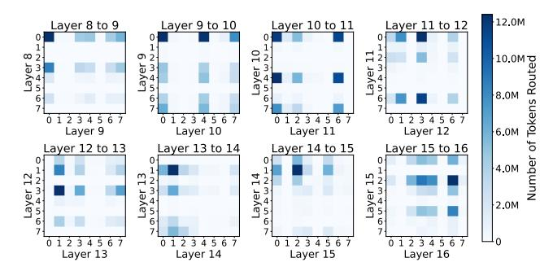

# 3.2 Inter-layer Token Routing Dependency

While expert parallelism offers a scalable approach for deploying MoE models across multiple GPUs, its effectiveness hinges on efficient management of both processing load and inter-GPU communication. Achieving this balance necessitates optimization of expert placement and token routing mechanisms. To address these challenges, we exploit the observation that inter-layer expert token routing exhibits significant dependencies: when a token is routed to a specific expert in layer *l*, it is more likely to be routed to certain experts in layer *l* +1, and these patterns often persist across subsequent layers. This reveals that token paths across layers are not random but instead follow structured and predictable patterns, driven by the underlying model dynamics and characteristics.

Figure [1](#page-1-0) and [6](#page-5-0) illustrate inter-layer routing dependencies, showing the frequency of token transitions between specific experts across layers. These structured dependency chains provide a key opportunity for optimization. By aligning the

Figure 6: Dependency table of Mixtral-8x7B illustrating interlayer routing dependencies during inference. Most tokens routed to specific experts in one layer are directed to particular experts in the next layer. For instance, tokens processed by expert 1 at layer 14 are predominantly routed to expert 2 at layer 15, highlighting strong routing dependencies.

physical placement of frequently interacting experts with these routing patterns, we can significantly reduce inter-GPU communication, improve load balance, and minimize latency across large-scale deployments. This insight motivates the need for a global expert placement framework that goes beyond just alleviating memory overheads or being limited to layer-by-layer optimization. By considering the holistic routing patterns across the model, such a framework ensures more efficient utilization of both computational and communication resources. This approach directly tackles both the challenges of inter-GPU communication overhead and load imbalance, enabling more efficient and scalable MoE systems.

### 4 MOETUNER for Expert Placement

Based on the observations presented in Section [2,](#page-2-1) we propose an MOETUNER framework a novel way to optimize expert placement for MoE models. This framework is built on the insight that inter-layer token routing exhibits predictable dependencies. The primary goal of MOETUNER is to develop an expert placement strategy that minimizes two critical factors: the imbalance of token processing load across GPUs and the inter-GPU communication overhead. To leverage the expert routing dependency, we need to determine the routing per dataset. However, using the entire dataset to determine the token routing can be prohibitive. Instead, we observe that we can perform inference on a small subset of the dataset for each task over a predefined number of iterations. Our experiments in Section [4.1](#page-5-1) reveal that the routing patterns of the sampled dataset reliably approximate the overall routing behavior across the full dataset for a given task. This method significantly reduces computational overhead while still capturing representative routing information. Using the collected routing statistics, MOETUNER formulates the expert placement problem as an Integer Linear Programming (ILP) optimization. The ILP optimization integrates the routing data into its constraints and objectives, enabling simultaneous optimization of load balance and communication costs across GPUs. We use ILP as it offers optimal solutions under the given constraints, ensuring the best expert placement strategies. The MOETUNER framework operates in two key stages, each modeled as an ILP: (1) Load-Balanced Expert Clustering where we group experts based on routing dependencies while maintaining balanced loads, and (2) Cluster-to-GPU Assignment where these are mapped clusters to GPUs to minimize communication overhead while preserving load balance. The ILP is formulated using the following:

- Modeling Per-GPU Token Processing Load: Using token routing statistics, we quantify the token processing load for each GPU by assigning a weight to each expert proportional to its token demands. This weight reflects the computational workload associated with processing tokens routed to the expert. To ensure balanced token processing, we introduce constraints in the ILP that evenly distribute these loads across GPUs within their capacity limits.
- Modeling Inter-GPU Communication Cost: Inter-GPU communication costs are modeled based on token routing frequency between expert pairs. If two interacting experts are placed on separate GPUs, the communication cost is proportional to the volume of tokens transferred between them. This model drives the optimization process, penalizing placements that increase inter-GPU data exchanges and encouraging configurations that minimize cross-GPU communication.
- Optimizing expert placement: The expert placement is formulated as two ILP stages where each aims to: (a) balance token processing loads across GPUs and (b) minimize the maximum inter-GPU communication cost. Each ILP incorporates constraints for GPU memory and processing capacity, as well as routing dependencies captured from the token statistics. By solving the optimization problems, we identify an expert placement strategy that maximizes GPU utilization, minimizes idle time, and reduces interconnect communication overhead across all MoE layers.

Through this formulation, MOETUNER delivers an efficient and scalable solution for expert placement. By addressing token processing imbalance and inter-GPU communication, it enhances overall system performance, reducing latency and improving throughput in large-scale MoE deployments.

