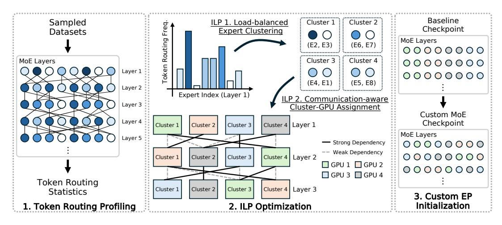
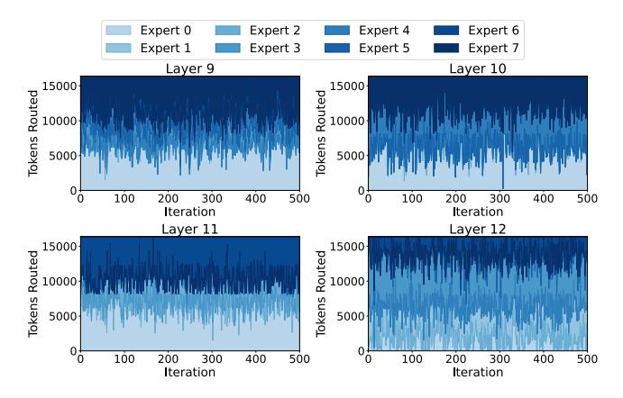
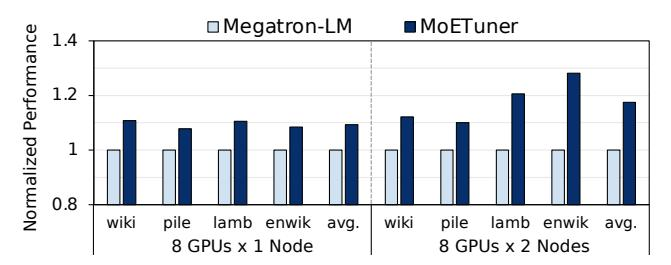
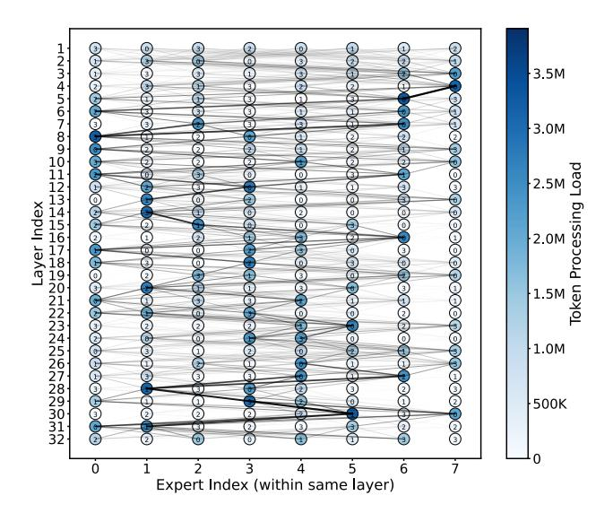
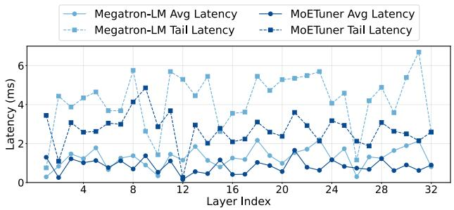
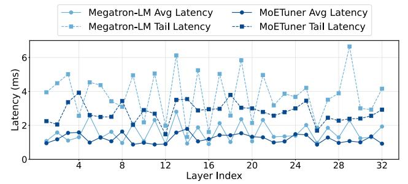
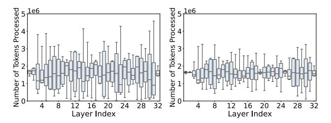
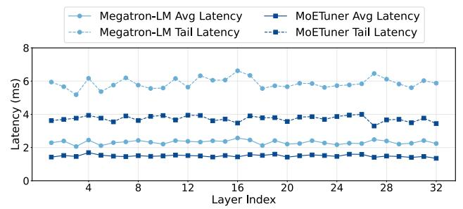
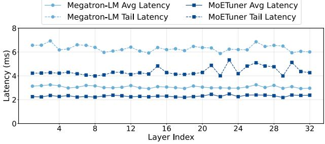
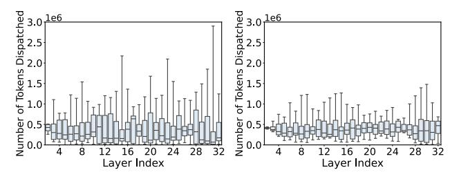

# 4.1 MOETUNER Overview

The framework for expert placement in MoE models consists of three stages: Token Routing Profiling, ILP Optimization, and Custom Expert Parallelism Initialization. These stages are systematically integrated to optimize expert placement, minimizing token processing imbalance and inter-GPU communication costs. The overall process is summarized in Figure [7.](#page-6-0) In (1) Token Routing Profiling, we analyze token routing patterns by profiling a sampled subset of the dataset,

Figure 7: Overview of the MOETUNER framework.

Figure 8: Token routing statistics to different experts during the inference of Mixtral-8×7B on the WikiText dataset. The results show that token routing statistics remain consistent across different batches within the same task.

leveraging their consistency across batches to estimate routing dependencies and expert loads. Next, in the (2) ILP Optimization stage, we solve the placement problem in two steps: first, we cluster experts to balance token loads across GPUs; then, we determine the optimal mapping of these clusters to GPUs to minimize communication latency induced by token dispatching. Finally, in the (3) Custom Expert Parallelism Initialization stage, the optimized expert placement is applied to the MoE model, replacing default configurations to improve inference performance by balancing GPU utilization and minimizing communication latency.

Token Routing Profile In this stage, we execute inference over a sampled subset of the task dataset to gather token routing statistics. For each token, we track its routing path across layers in the MoE model. The statistics capture how tokens are routed from one expert to another between neighboring layers. To better understand the nature of these routing patterns, we analyze their consistency over time. Figure [8](#page-6-1) indicates a high degree of invariance in token routing, as illustrated in

the accompanying plot. This invariance suggests that token routing decisions remain stable across iterations, suggesting that we can use a small subset of the task dataset to optimize the expert placement instead of the entire dataset. The gathered routing statistics and their consistent patterns will be utilized in the next stage to formulate the expert placement optimization problem, aiming to minimize communication overhead and balance computational loads effectively.

Leveraging ILP optimization for Expert Placement The expert placement in MoE models involves balancing token processing loads and minimizing inter-GPU communication overhead, both of which are highly constrained and interdependent. ILP is well-suited because it enables precise modeling of these constraints while optimizing for multiple objectives simultaneously. Unlike heuristic methods such as graph partitioning, ILP guarantees globally optimal solutions under the given constraints, ensuring the best expert placement strategies. Furthermore, ILP allows for the integration of routing statistics, GPU capacity limitations, and communication costs into a unified optimization problem, making it an ideal choice for solving this complex placement problem.

For expert placement, MOETUNER uses the token routing history to construct a routing history table. This table captures the number of tokens routed between each pair of neighboring layers in the MoE model. The ILP model is formulated with the objective of minimizing load imbalance and inter-GPU communication costs. The ILP solver takes routing data, interconnect bandwidth, and resource constraints as inputs and outputs the optimal placement of experts across GPUs. After solving the ILP, the optimal expert-to-GPU mapping is saved into a PyTorch tensor file for future use during custom expert parallelism initialization.

Custom Expert Parallelism Using the optimized expert placement derived from the ILP solvers, we initialize the MoE model with the ILP-optimized custom expert parallelism strategy. The expert-to-GPU mapping file is first loaded from local storage. For each layer of the model, the corresponding

expert-to-GPU assignments are extracted from the mapping. These assignments are then applied to the model to replace the default placement with the optimized configuration. By ensuring that experts are assigned to GPUs based on the solver's results, this initialization minimizes communication latency and balances the workload across GPUs.

#### 4.2 ILP Formulation

The MOETUNER optimization comprises two ILPs: ILP 1 for clustering experts to balance token processing loads across GPUs, and ILP 2 for assigning clusters to GPUs while minimizing inter-GPU token routing costs. By solving the ILPs, we obtain an expert placement that optimizes GPU and interconnect utilization, enhancing the efficiency of MoE processing by reducing processing load imbalance and communication latency.

#### 4.2.1 ILP 1: Clustering Experts within Layers

**Inputs.** The input to the ILP formulation includes the token routing statistics, which provide information on how many tokens are routed between experts within each MoE layer.

- $P_{e,l}$ : The number of tokens routed to expert e in layer l. It indicates the workload associated with each expert and helps calculate the token processing load for each expert cluster during ILP 1.
- E: Number of experts per layer.
- L: Total number of MoE layers.
- G: Total number of GPUs.

Variables. The variables of this ILP are:

$$x_{c,e,l} \in \{0,1\}$$
 for  $c \in \{0, \dots, G-1\}$ , for  $e \in \{0, \dots, E-1\}$ , for  $l \in \{0, \dots, L-1\}$ 

xc,e,l: Binary decision variable indicating whether expert
 e is assigned to cluster c in layer l.

**Objective Function.** In the first ILP, the objective is to cluster experts within each layer that balance the token processing load across all clusters, where each cluster will be mapped to a GPU using ILP 2. The goal is to distribute the token processing workload as evenly as possible across expert clusters in each layer. This is accomplished by minimizing the absolute deviation between the load of each cluster and the average load per layer, ensuring efficient resource utilization. The objective function  $O_1$  can be described as:

$$O_1 = \sum_{c=0}^{G-1} \sum_{l=0}^{L-1} \left| T_{c,l} - \bar{T}_l \right| \tag{1}$$

where  $T_{c,l}$  is the total token processing load for expert cluster c in layer l, and  $\bar{T}_l$  is the average token processing load across all clusters in layer l. The token processing load  $T_{c,l}$  for each

expert cluster in layer l is the sum of token routing statistics for each expert assigned to that cluster:

$$T_{c,l} = \sum_{e=0}^{E-1} \sum_{t=0}^{T-1} P_{e,l} \cdot x_{c,e,l}$$
 (2)

where  $P_{e,l}$  is the profiled number of tokens routed to expert e at layer l and  $x_{c,e,l}$  is a binary decision variable (1 if expert e is assigned to cluster c, 0 otherwise). Lastly, the average token processing load across all clusters in a layer is computed as:

$$\bar{T}_l = \frac{1}{G} \sum_{e=0}^{E-1} P_{e,l} \tag{3}$$

This objective minimizes the deviation of the token processing load across expert clusters for each layer. By minimizing this deviation, we ensure that no cluster is overloaded while others are underutilized.

**Solving the ILP.** The ILP is executed for every possible expert cluster and for every MoE layer of the model. The optimization goal is to minimize the deviation in token processing load across expert clusters. The ILP formulation is:

$$\min O_1 \tag{4}$$

s.t. 
$$O_1 = \sum_{c=0}^{G-1} \sum_{l=0}^{L-1} |T_{c,l} - \bar{T}_l|$$
 (5)

$$T_{c,l} = \sum_{e=0}^{E-1} P_{e,l} \cdot x_{c,e,l}$$
 (\forall c, l) (6)

$$\sum_{e=0}^{E-1} x_{c,e,l} \ge 1 \tag{\forall c,l}$$

**Constraints.** The ILP constraints in Equation 7 that at least one expert is assigned to each cluster c in each layer l, preventing null cluster assignments and ensuring that every layer has sufficient resources.

#### 4.2.2 ILP 2: Cluster Placement on GPUs

**Inputs.** The input to the ILP formulation includes the precomputed communication cost between clusters, which provides information on how many tokens are routed between experts within neighboring MoE layers.

- xc,e,l: The binary decision variable indicating whether expert e is assigned to cluster c in layer l. This value is determined in ILP 1 and is used to compute the communication cost between clusters for ILP 2.
- $C_{c_1,c_2,l}$ : Number of tokens routed between cluster  $c_1$  in layer l and cluster  $c_2$  in layer l+1. This represents the number of tokens routed clusters of neighboring layers and is used for balancing the inter-GPU communication load.
- $R_{e_1,e_2,l}$ : The number of tokens routed between experts  $e_1$  and  $e_2$  in layer l. This value is used to precompute the communication cost between clusters.

- Bg1,g2: The available bandwidth between GPUs g1 and g2.
   This parameter is used to model the bandwidth-aware communication cost by normalizing C with the available bandwidth, reflecting the relative cost of inter-GPU communication.
- E: Number of experts per layer.
- L: Total number of MoE layers.
- G: Total number of GPUs.

Variables. The variables for ILP 2 are defined as follows:

$$y_{c,g,l} \in \{0,1\}$$
 for  $c \in \{0,\dots,G-1\}$ , for  $g \in \{0,\dots,G-1\}$ , for  $l \in \{0,\dots,L-1\}$ 

•  $y_{c,g,l} \in \{0,1\}$ : Binary decision variable indicating whether cluster c is assigned to GPU g in layer l.

**Objective Function.** We aim to minimize the communication overhead between GPUs when routing tokens between experts. This is achieved by strategically placing expert clusters on GPUs to reduce inter-GPU communication, with a particular focus on minimizing the all-to-all tail latency in each layer. The objective function  $O_2$  directly targets the tail latency per layer by minimizing the maximum communication cost across all GPU pairs, which impacts the latency of token dispatching. The objective function is given by:

$$O_2 = \sum_{l=0}^{L-1} \max \left( \sum_{c_1, c_2=0}^{G-1} \sum_{g_1, g_2=0}^{G-1} \frac{C_{c_1, c_2, l}}{B_{g_1, g_2}} \cdot y_{c_1, g_1, l} \cdot y_{c_2, g_2, l+1} \right)$$
(8)

where  $C_{c_1,c_2,l}$  is the communication cost between expert clusters  $c_1$  and  $c_2$  for layer l and l+1, and  $B_{g_1,g_2}$  is the bandwidth between GPUs  $g_1$  and  $g_2$ . The term  $y_{c_1,g_1}$  is a binary decision variable that indicates whether cluster  $c_1$  is assigned to GPU  $g_1$ . The communication cost  $C_{c_1,c_2,l}$  is calculated using the expert assignments from ILP 1, where the  $x_{c,e,l}$  values (the binary decision variables indicating whether expert e is assigned to cluster c in layer l) have already been determined. Using these values, we calculate the total communication cost between expert clusters  $c_1$  and  $c_2$  for each layer l by summing over all pairs of experts  $e_1$  and  $e_2$ . Specifically, the total communication cost  $C_{c_1,c_2,l}$  is computed as:

$$C_{c_1,c_2,l} = \sum_{e_1=0}^{E-1} \sum_{e_2=0}^{E-1} R_{e_1,e_2,l} \cdot x_{c_1,e_1,l} \cdot x_{c_2,e_2,l}$$
(9)

where  $R_{e_1,e_2,l}$  is the number of tokens routed between these experts. Note that we pre-compute these communication costs  $C_{c_1,c_2,l}$  after ILP 1, thereby avoid having to compute them repeatedly during the ILP 2 optimization process.

**Solving the ILP.** The ILP is solved for every possible cluster-GPU mapping across every MoE layer of the model:

$$\begin{array}{ll}
\text{min} & O_2 \\
\text{s.t.} & 
\end{array} \tag{10}$$

$$O_{2} = \sum_{l=0}^{L-1} \max \left( \sum_{c_{1}, c_{2}=0}^{G-1} \sum_{g_{1}, g_{2}=0}^{G-1} \frac{C_{c_{1}, c_{2}, l}}{B_{g_{1}, g_{2}}} \cdot y_{c_{1}, g_{1}, l} \cdot y_{c_{2}, g_{2}, l+1} \right)$$

$$\tag{11}$$

$$C_{c_1,c_2,l} = \sum_{e_1=0}^{E-1} \sum_{e_2=0}^{E-1} R_{e_1,e_2,l} \cdot x_{c_1,e_1,l} \cdot x_{c_2,e_2,l} \quad (\forall c_1, c_2, l) \quad (12)$$

$$\sum_{l=0}^{L-1} \sum_{c=0}^{G-1} \sum_{e=0}^{E-1} x_{c,e,l} \cdot y_{c,g,l} = \frac{E \cdot L}{G}$$
 (\forall g)

$$\sum_{g=0}^{G-1} y_{c,g,l} = 1 \qquad (\forall c, l) \qquad (14)$$

$$\sum_{c=0}^{G-1} y_{c,g,l} = 1 \tag{$\forall g,l$}$$

**Constraints.** The formulation of ILP 2 includes several constraints to ensure a valid and balanced solution. These constraints collectively guarantee the one-on-one assignment of clusters to GPUs while respecting the available GPU capacity. Equation 13 ensures that the total number of experts assigned to each GPU g across all layers is equal to  $\frac{E \cdot L}{G}$ , ensuring a balanced assignment of experts across GPUs. This guarantees a balanced distribution of experts, ensuring that the memory footprint is evenly distributed across GPUs. Equation 14 enforces that each cluster c is assigned to exactly one GPU g in each MoE layer l. Equation 15 ensures that each GPU g is assigned to exactly one cluster c for each layer l, maintaining a balanced distribution of clusters across the GPUs.

MOETUNER Optimization MOETUNER offers a robust solution for optimizing expert placement in large-scale MoE models. By leveraging routing dependencies and systematically balancing token processing loads, while minimizing inter-GPU communication costs, MOETUNER achieves significant improvements in both GPU utilization and overall system throughput. Next, we analyze the performance of MOETUNER across diverse configurations and datasets, demonstrating its capability to address key challenges in MoE inference effectively.

#### 5 Evaluation

#### 5.1 Experimental Setup

MoE Model and Datasets. We evaluate MoETUNER on pre-trained Mixtral8x7B [15] available on the Huggingface Hub [11], benchmarking its performance on a representative selection of language modeling datasets, as shown in Table 1. As discussed in Section 4.1, the routing patterns observed with the subset closely match those of the full datasets, providing reliable insights into MoETUNER's performance.

Table 1: Evaluation Datasets

| Dataset           | Abbreviation | Type              |
|-------------------|--------------|-------------------|
| WikiText-103 [24] | wiki         | Language Modeling |
| MiniPile [17]     | pile         | Language Modeling |
| LAMBADA [31]      | lamb         | Language Modeling |
| enwik8 [12]       | enwi         | Language Modeling |

Table 2: H100 Server Node Specifications

| Component     | Specification                  |
|---------------|--------------------------------|
| GPU           | 8x NVIDIA H100 SXM5 80GB       |
| Interconnect  | NVLink Gen4 (900GB/s)          |
| CPU           | Dual Xeon Platinum 8462Y+      |
| System Memory | 2048 GB DDR5 4800 MHz          |
| NIC           | NVIDIA ConnectX-7 IB (400Gbps) |

**Expert and Tensor Parallel Configurations.** Since Mixtral features eight experts per layer, we limit the size of expert parallelism (EP) to four. Our methodology remains broadly applicable as the number of experts is expected to scale further in the future to accommodate greater knowledge capacity. To scale beyond four GPUs, we employ a hybrid parallelism strategy combining tensor parallelism (TP) and expert parallelism. For single-node (8 GPUs) and multi-node (2 nodes and 16 GPUs total) experiments, we configured parallelism as 4EP-2TP and 4EP-4TP, respectively.

Software and Libraries and Setup. To implement MOE-TUNER, we modify the all-to-all communication and expert placement modules in Megatron-LM [40] to allow custom expert mappings across GPUs, supporting variable numbers of experts per layer. Our ILP was optimized using Gurobi [6] (version 12.0.0). Both ILPs were set to execute until reaching a tolerance of 0.025, meaning the solver iteratively refines the solution by adjusting the values of decision variables to minimize the objective function. The evaluation was conducted with PyTorch 2.5.1 [32], CUDA Toolkit 12.4 [28, 29], and RHEL 9 OS [38].

Server Architecture. Experiments were conducted on a high-performance computing node with specifications detailed in Table 2 and Table 3. Our evaluations were performed in both single-node (i.e., 1 node with 8 GPUs) and multi-node (i.e., 2 nodes with 8 GPUs each) configurations to assess the impact of hierarchical interconnect topologies, especially in terms of how communication patterns change across nodes. Due to resource availability, single-node experiments were conducted using NVIDIA H100 GPUs [27] while multi-node experiments were performed on NVIDIA H200 GPUs [30].

Table 3: H200 Server Node Specifications

| Component     | Specification                  |
|---------------|--------------------------------|
| GPU           | 8x NVIDIA H200 SXM5 142GB      |
| Interconnect  | NVLink Gen4 (900GB/s)          |
| CPU           | Dual Xeon Platinum 8562Y       |
| System Memory | 2048 GB DDR5 5600 MHz          |
| NIC           | NVIDIA ConnectX-7 IB (800Gbps) |

Figure 9: End-to-end inference performance, normalized to Megatron-LM's expert parallelism approach.

#### **5.2** Baseline and Metrics

**Baseline and Expert Assignment.** We use Megatron-LM [40] as the baseline, which employs a naive expert placement strategy where experts are assigned to GPUs in contiguous blocks (for example, with 8 experts and 4 GPUs, experts 0 and 1 are assigned to GPU 0, experts 2 and 3 to GPU 1, and so on). This approach ensures an even distribution of experts for memory footprint but does not address load balancing or communication inefficiencies during runtime.

**Evaluation Metrics.** We evaluate MOETUNERand the baseline using the following metrics: *End-to-End Speedup:* Speedup in absolute time to complete one batch of inference. *Token Processing Time:* Tail latency and average time taken for experts to finish processing tokens at each layer. *All-to-All Time:* Tail latency and average time taken to complete all-to-all communication across GPUs.

**End-to-End Speedup Measurement.** End-to-end speedup is measured by running 100 inference steps and averaging the results across datasets. To ensure stable measurements, 100 warmup steps are performed prior to recording the timing.

Tail- and Average- Latency Measurement. For all latency measurements, we employed PyTorch Profiler [33], averaging results over 10 inference steps with an initial 100 warm-up steps on the WikiText-103 dataset. To measure tail latency, we identify the GPU with the longest execution time at each layer for each iteration, then calculate the average of these maximum values across all iterations. For average latency, we compute the mean execution time across all GPUs for each iteration and then average these means across iterations.

#### 5.3 Results and Insights

#### 5.3.1 End-to-End Speedup

Figure 9 compares the end-to-end speedup of MOE-TUNER against the baseline Megatron-LM in both single-node and multi-node settings. MOETUNER achieves a 9.3% speedup in the single-node setup and a 17.5% speedup in the multi-node setup. These performance improvements are driven by reductions in communication overhead and efficient load balancing of token processing across GPUs. Figure 10 illustrates the token routing statistics of Mixtral-8x7B on the

Figure 10: Token routing statistics for Mixtral-8x7B, with custom mapping generated by MOETUNER. The circle represents the index of expert parallel rank assignment.

WikiText-103 dataset, with the mapping generated by MOE-TUNER. MOETUNER demonstrates significant improvements in token load balancing, as evidenced by the darker expert colors indicating high token load on GPUs with only one expert assigned per layer, while lighter expert colors indicate low token load on GPUs with a larger number of experts. Moreover, MOETUNER also effectively manages remote token dispatching, as observed in layers 4 and 5, where experts 7 and 6 are mapped to the same GPU. In the single-node setup, the speedup can primarily be attributed to better resource utilization, with load balancing minimizing GPU idle times. Due to the balanced token processing across GPUs, MOETUNER enhances GPU memory utilization by 8.7% in the single-node setup.

In the multi-node setup, reduced inter-node communication overhead leads to a more significant speedup by minimizing communication volume, which is especially costly in multinode configurations. This is due to the much lower inter-node network bandwidth, 9× lower than intra-node NVLink bandwidth. The lower inter-node bandwidth results in higher allto-all communication latencies, but MOETUNER effectively reduces inter-node communication volume, leading to a more substantial speedup compared to the single-node scenario. As a result, our dual approach-targeting both computation and communication tail latency-enables consistent performance gains in both single-node and multi-node scenarios. As such this shows the benefits of MOETUNER and its scalability to multi-node setting. In the next part of this section, we break down the reasons for this performance benefit through token processing and communication time reduction.

(a) Single node: Average and tail latency of token processing time across GPUs in each layer.

(b) Multi node: Average and tail latency of token processing time across GPUs in each layer.

Figure 11: Comparison of average and tail latency of token processing time across GPUs in each layer for single-node and multi-node setups.

(a) Token processing load distribution (Megatron-LM). (b) Token processing load distribution (MOETUNER).

Figure 12: Distribution of tokens processed by a single GPU per layer. Each box plot summarizes the variation in token processing load across GPUs for a single layer. MOETUNER significantly reduces both the variation and peak load, demonstrating improved load balancing across GPUs.

#### 5.3.2 Token Processing Time

As shown in Figure [11,](#page-10-1) MOETUNER reduces the tail latency in token processing 36% in the single-node setup and by 27% in the multi-node setup. Similarly, the average token processing time is reduced by 34.8% in the single-node configuration and 22.5% in the multi-node configuration. These improvements are achieved through improved token dispatching and load balancing across GPUs, which minimizes stragglers during token processing. The benefits are particularly

(a) Single node: Average and tail latency of all-to-all time across GPUs in each neighboring layers.

(b) Multi node: Average and tail latency of token processing time across GPUs in each neighboring layers.

Figure 13: Comparison of average and tail latency of all-to-all communication in each layer for single-node and multi-node setups. MOETUNER provides substantial reduction in tail latency and average latency.

pronounced in layers with high computational loads, such as layer 31, where MOETUNER significantly reduces both average and tail processing times. This is likely due to its capacity to mitigate imbalances in token dispatching, as evidenced by the token routing distributions in Figure [12.](#page-10-2) By preventing GPUs from being overloaded or underutilized, MOETUNER ensures more consistent and efficient computation, even in the most demanding layers.

In the multi-node setup, while token processing time is reduced, the improvements are less pronounced compared to the single-node configuration. This is primarily due to the additional inter-node communication overhead during token processing, specifically the costs of all-gather operations introduced by tensor parallelism, as demonstrated in Figure [3.](#page-3-0) As discussed in Section [5.1,](#page-8-0) our experimental design keeps the expert parallel size fixed while scaling the tensor parallel size, which increases the all-gather communication volume required to synchronize intermediate activations. Although some layers, such as those in the 12–22 range, exhibit fluctuations in latency, this variability is likely due to the short profiling iterations. Despite these anomalies, MOETUNER demonstrates consistent benefits across setups, effectively addressing inefficiencies in token processing to deliver predictable and efficient computation.

(a) Token dispatching distribution (Megatron-LM). (b) Token dispatching distribution (MOETUNER).

Figure 14: Distribution of total token dispatching between individual GPU pairs across neighboring layers, measured for a single-node configuration. Each data point in a box plot represents the total number of tokens dispatched between a specific GPU pair (e.g., GPU0-GPU1) across all iterations.

#### 5.3.3 All-to-All Time

As illustrated in Figure [13,](#page-11-0) our proposed optimization strategy significantly reduces the tail latency of all-to-all communication, which is critical for improving end-to-end inference time. In the single-node setup, MOETUNER reduces the tail latency by 36.3% and the average latency by 35.4% compared to the baseline. This reduction is consistent across most layers, with notable improvements in layers 13-17, where both average and tail latencies are particularly low. In the multi-node setup, MOETUNER achieves a 30.50% reduction in tail latency and a 24.7% reduction in average latency. The reduced impact in this setup is primarily due to the higher inter-node communication overhead, which dominates the latency in multi-node environments. For example, in certain layers (e.g., layers 15 and 30), the improvement in tail latency is less pronounced. This is attributed to high inter-node token dispatching in these layers, which introduces additional communication overhead. The tail latency spikes observed in such layers are consistent with the token dispatching distributions shown in Figure [14,](#page-11-1) where layers 15 and 30 exhibit relatively higher maximum communication volumes compared to neighboring layers. Despite these spikes, MOETUNER still provides measurable benefits over the baseline, maintaining lower latency overall. By reducing the variation in token dispatching and avoiding severe imbalances, our approach ensures more efficient and predictable all-to-all communication.

### 6 Conclusion

We present MOETUNER, a method that optimizes MoE models by enhancing token dispatching and load balancing across GPUs. Our experiments on Mixtral-8x7B demonstrated significant reductions in both tail latency and average token processing time, particularly in layers with high token routing skew. Furthermore, MOETUNER mitigates the impact of inter-GPU communication overhead by balancing remote token dispatching and ensuring efficient all-to-all communication.

