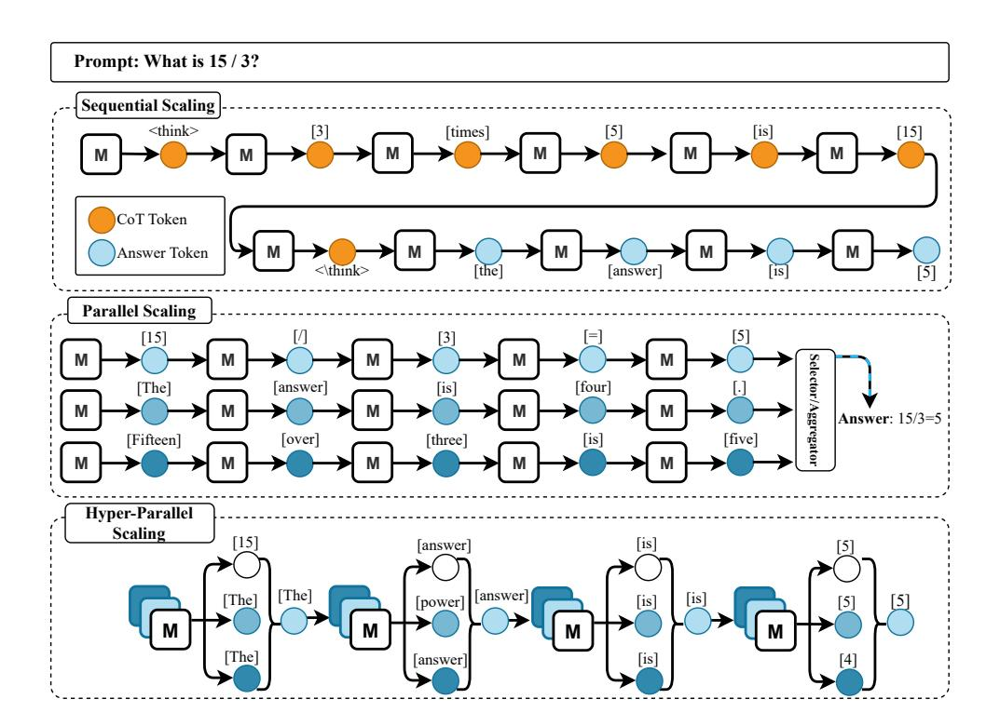
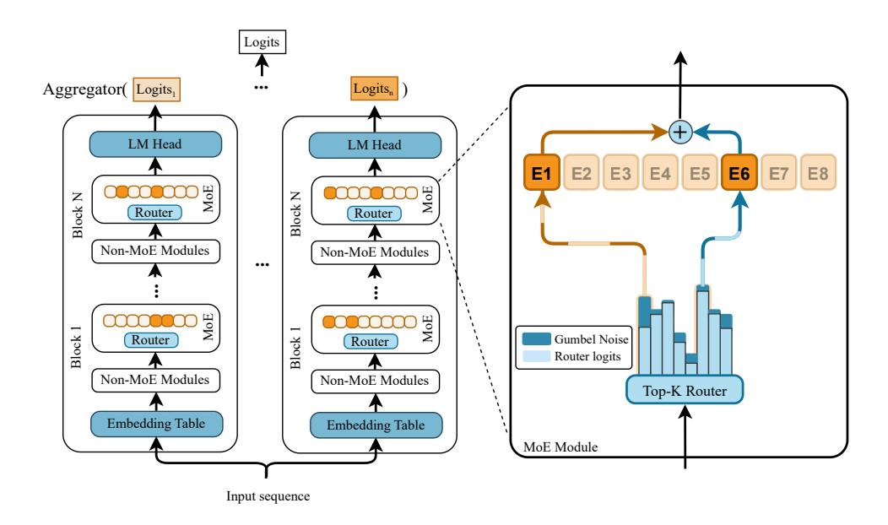

# 1 INTRODUCTION

Extensive data and substantial computational resources have fueled recent advancements in language models. While the simplest method for generating responses is greedy decoding, the quality of model outputs often requires enhancement at inference time. A growing line of work in this area focuses on test-time scaling, which aims to improve the performance of the sequence generation process. Existing test-time scaling approaches typically fall into two orthogonal categories: sequential scaling, where the model produces longer, more structured outputs (e.g., Chain-of-Thought [\(Wei](#page-11-0) [et al., 2022\)](#page-11-0)); and parallel scaling, where multiple independent sequences are generated and then aggregated (e.g., self-consistency [\(Wang et al., 2022\)](#page-11-1)). The general notion of these categories is marked as "Sequential Scaling" and "Parallel Scaling" in Figure [1.](#page-1-0)

In this paper, we pose an orthogonal question: Can we improve a model's intrinsic next-token prediction capability by allocating more computation at inference time? In other words, can we increase the model's internal compute during inference to enhance the quality of every generated token? We refer to this new paradigm as *hyper-parallel scaling*, as shown in Figure [1.](#page-1-0) This approach improves generation quality even under the simplest decoding strategy, greedy decoding. To isolate the gains attributable to hyper-parallel scaling, we focus our experiments on evaluating greedy decoding quality throughout the paper.

Hyper-parallel scaling aims to unlock a model's full potential by increasing the computation allocated to each token at inference time. One way to realize this idea is by introducing controlled variation within each transformer block [\(Shelmanov et al., 2021\)](#page-10-0) and recomputing the layer output multiple times. Another approach is to reuse each layer repeatedly in a recurrent manner, thereby increasing computation without adding parameters [\(Lin et al., 2022\)](#page-9-0). While many variants are possible, we focus on sparsely activated Mixture-of-Experts (MoE) models, which provide an ideal architecture for implementing this concept.

\*Work done during an internship at Apple.

†Corresponding authors: szibakhshshabgahi@ucsd.edu, m samraghrazlighi@apple.com

Figure 1: A categorization of inference-time scaling strategies. (I) Sequential Scaling: Enhancing performance by generating longer, structured outputs like a chain of thought (Wei et al., 2022). (II) Parallel Scaling: Generating multiple token sequences and aggregating them, as in Self-Consistency (Wang et al., 2022). (III) Hyper-Parallel Scaling: A novel paradigm, instantiated by RoE, that aggregates results from diverse internal computation paths on a per-token basis.

Mixture of experts (MoE) models have become a leading solution for frontier large language models (Shazeer et al., 2017; Comanici et al., 2025; Dai et al., 2024). Since they activate only a fraction of their parameters per forward pass, they naturally raise the central question of hyper-parallel scaling: can the inactive experts be leveraged at inference time to boost performance? Simply increasing the number of active experts does not work, as models are not trained to aggregate information from larger expert sets. To address this, we propose Roster of Experts (RoE), a training-free inference technique that treats a single MoE as a dynamic ensemble. RoE adds controlled stochasticity into the router's expert selection, runs multiple stochastic forward passes per token, and aggregates the resulting logits into a single, higher-quality prediction, all without model fine-tuning.

As is evident, a naive implementation of RoE would incur substantial redundant computation. We address this by exploiting the overlap across forward passes and merging them into a single batched call to the LLM. Furthermore, we introduce a specialized caching mechanism to reduce the KV-cache size required for RoE generation. In short, the contributions in this work are as follows:

- We introduce hyper-parallel scaling, a novel inference paradigm that allocates additional compute at test time to diversify a model's internal computations, thereby improving the quality of each token prediction.
- We propose Roster of Experts (RoE), a training-free approach to hyper-parallel scaling in MoE
  models that ensembles diverse computational paths. RoE leverages Gumbel-Top-K routing to\ninject controlled stochasticity into expert selection and introduces execution and KV-cache optimizations for efficient inference.
- We demonstrate the superior efficiency of RoE compared to conventional model scaling. For instance, we demonstrate that RoE can enhance the OlMoE-7B model (Muennighoff et al., 2024) to achieve the performance of a 10.5B model, with a 30% latency decrease compared to its larger counterpart. The enhancement requires no model finetuning.

Figure 2: An illustration of the Roster of Experts (RoE) method. **Left:** For a single input, n distinct experts are sampled by adding stochasticity to the expert routing at each MoE layer, and the resulting output logits are aggregated to form the final prediction. **Right:** A closer view of a single MoE layer shows k=2 active experts (dark orange), where Gumbel noise (dark blue) is added to the router logits, and the top-k experts are selected based on these modified logits.

#### 2 RoE: Hyper Parallel Scaling of Mixture of Experts

Roster of Experts (RoE) enhances a pre-trained MoE model's performance by treating it as a dynamic ensemble. In designing RoE, we hypothesize that making controlled variations in routing still yields high-quality predictions. The rationale behind our claim is straightforward: during training, the model already encounters a wide range of expert combinations, so there is no reason not to exploit the same diversity at test time.

Given the aforementioned insight, we provide a high-level illustration of RoE in Figure 2. At each generation step, the MoE model generates multiple candidate output logits for a single input by sampling diverse expert selections from the model. These outputs are then aggregated to produce a single, more accurate prediction. This process relies on two key components: a stochastic routing mechanism to create diverse paths, and an efficient inference strategy to ensure practicality.

### 2.1 GUMBEL-TOP-K ROUTING FOR PATH DIVERSITY

Standard MoE models use deterministic top-k routing, where each token is routed to the k experts with the highest router logits. To generate diverse computational paths, we introduce controlled stochasticity into this selection process using Gumbel-Top-K routing. Given the router logits  $R \in \mathbb{R}^E$  for a token over E experts, we perturb them with Gumbel noise before selecting the top-k experts. The indices of the selected experts are given by:

Indices = TopK(
$$\mathbf{R} + \tau \cdot \mathbf{G}, k$$
) (1)

where G is a vector of i.i.d. samples from the Gumbel(0,1) distribution, and  $\tau$  is a temperature parameter that controls the degree of stochasticity. When  $\tau=0$ , this reduces to standard deterministic top-k routing. As  $\tau$  increases, the selection becomes more random.

This method is a principled way to sample from the distribution implicitly defined by the router logits. The Gumbel-Max trick (Gumbel, 1954) establishes that adding Gumbel noise to logits before an argmax operation is equivalent to sampling from the categorical distribution produced by applying a softmax to the logits. By extension, applying a TopK operation to Gumbel-perturbed

logits corresponds to sampling k elements without replacement from the distribution. This ensures that experts with higher router logits remain more likely to be selected even after adding Gumbel noise, preventing the selection from drifting too far from the trained router's predictions. Figure [2](#page-2-0) illustrates this mechanism.

### 2.2 CHOOSING THE GUMBEL TEMPERATURE

The Gumbel temperature, τ , controls the degree of stochasticity in expert routing. We treat it as a layer-specific hyperparameter, defining a temperature vector τ = {τi}i∈LMoE , where LMoE is the set of MoE layers. Setting a small value of τ keeps router selections nearly unchanged, reducing expert diversity per sample and making the next-token prediction closely match the underlying MoE. In contrast, an excessively large τ introduces too much randomness in expert selection, degrading prediction quality. Appendix [B](#page-13-0) illustrates how task performance varies as the temperature increases. Selecting the optimal τ presents a hyperparameter optimization problem, balancing the potential performance gain against the cost of the search. The primary challenge is the search space, which grows exponentially with the number of MoE layers, rendering an exhaustive search infeasible. A practical search strategy therefore requires an efficient optimization algorithm and a carefully chosen validation metric.

### 2.2.1 OPTIMIZATION METRIC

We consider two metrics for guiding the hyperparameter search: validation perplexity and taskspecific accuracy.

Validation Perplexity (PPL) is computationally inexpensive, as it only requires a single forward pass over the validation set. However, PPL is an indirect measure of generative reasoning. A low PPL indicates that the model assigns a high probability to a ground-truth sequence, but does not guarantee that the model can generate a correct solution independently.

Validation Accuracy directly measures the model's ability to solve the task, making it a more faithful metric for generative performance. The main drawback is its high computational cost, as it requires generating a full solution for each validation example. This cost can make it prohibitive for large-scale hyperparameter searches.

### 2.2.2 SEARCH STRATEGY

Given the cost of each evaluation, Bayesian optimization methods are well-suited for this task. In our experiments (Section [3\)](#page-4-0), we employ the Tree-structured Parzen Estimator (TPE) [Watanabe](#page-11-2) [\(2023\)](#page-11-2) via the Optuna framework [Akiba et al.](#page-8-0) [\(2019\)](#page-8-0). To make the search tractable for models with many MoE layers, we introduce two heuristics to prune the vast search space, based on empirical observations:

- 1. Apply RoE to middle layers only. We hypothesize that the initial and final layers of a transformer are more sensitive to routing perturbations. The initial layers process raw token embeddings, while the final layers consolidate information for the output prediction. Our experiments show preference of the optimizer to reduce the stochasticity of initial and final layers. We therefore constrain the search by setting the temperature to zero (τi = 0) for the first and last k MoE layers, applying RoE only to the intermediate ones.
- 2. Bound the temperature range. We empirically observe that temperature values above 0.5 introduce excessive routing noise, which consistently harms model performance. Consequently, we restrict the search space for each non-zero temperature to the range [0, 0.5].

### 2.3 EFFICIENT ROE INFERENCE

A naive implementation of RoE, which performs n independent forward passes, would incur a prohibitive n-fold increase in computation. We introduce two optimization techniques that drastically reduce this overhead.

First, we take advantage of the batched parallel processing capabilities of modern accelerators, such as GPUs. The latency of a forward pass grows sub-linearly with the batch size due to hardware-level parallelization. By processing the n samples for a single token generation step as a batch, we can significantly reduce the wall-clock time compared to n sequential runs.

We demonstrate in Section [3.3](#page-6-0) that Key-Value (KV) caching significantly reduces the computational overhead of sequence generation with RoE. However, batched inference alone does not solve the significant memory overhead introduced by the KV-cache in autoregressive decoding. Since the n samples follow different computational paths, their hidden states diverge. A naive implementation would require maintaining n separate KV caches, one for each sample's unique history. This scales both memory and computation linearly with n, quickly becoming intractable for long sequences.

To address this, we introduce a novel caching strategy named Clean Cache. Our key insight is that sufficient output diversity can be achieved by applying stochastic routing only for the current token being generated, while all samples share a common KV cache derived from a single, deterministic history. We implement this efficiently within our batched approach by setting the routing temperature τ for the first sample (batch index 0) to zero, making it the "clean" path. We then store and reuse the KV cache from this single clean sample across all other samples in the batch. As a result, the memory footprint of the Clean Cache is identical to that of a single sample's KV cache, incurring no extra overhead compared to regular caching. This localizes the additional cost of RoE entirely to the batched forward pass of the current token, making it a practical inference-time strategy.

