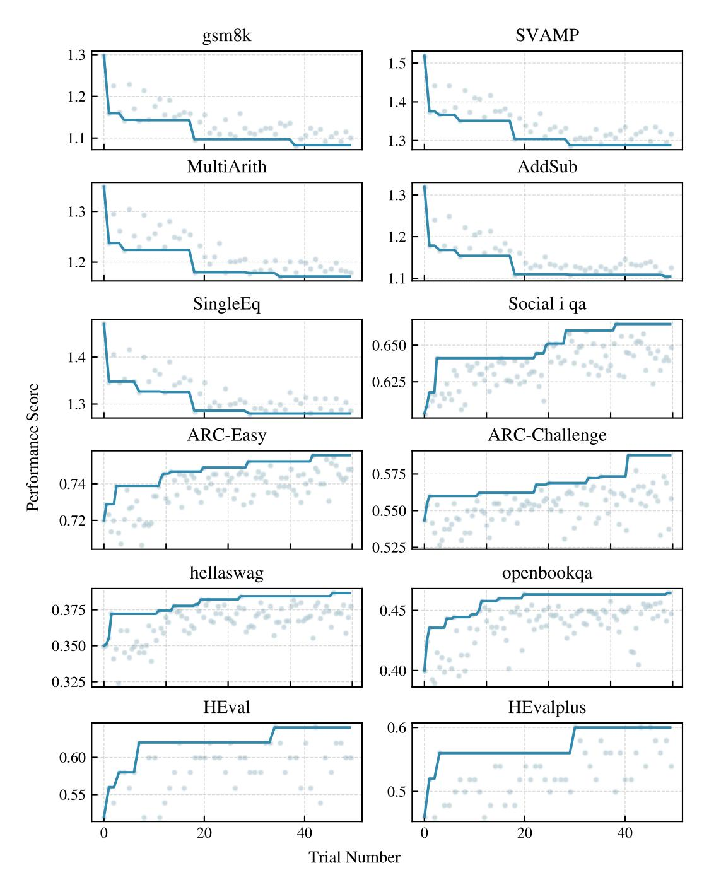
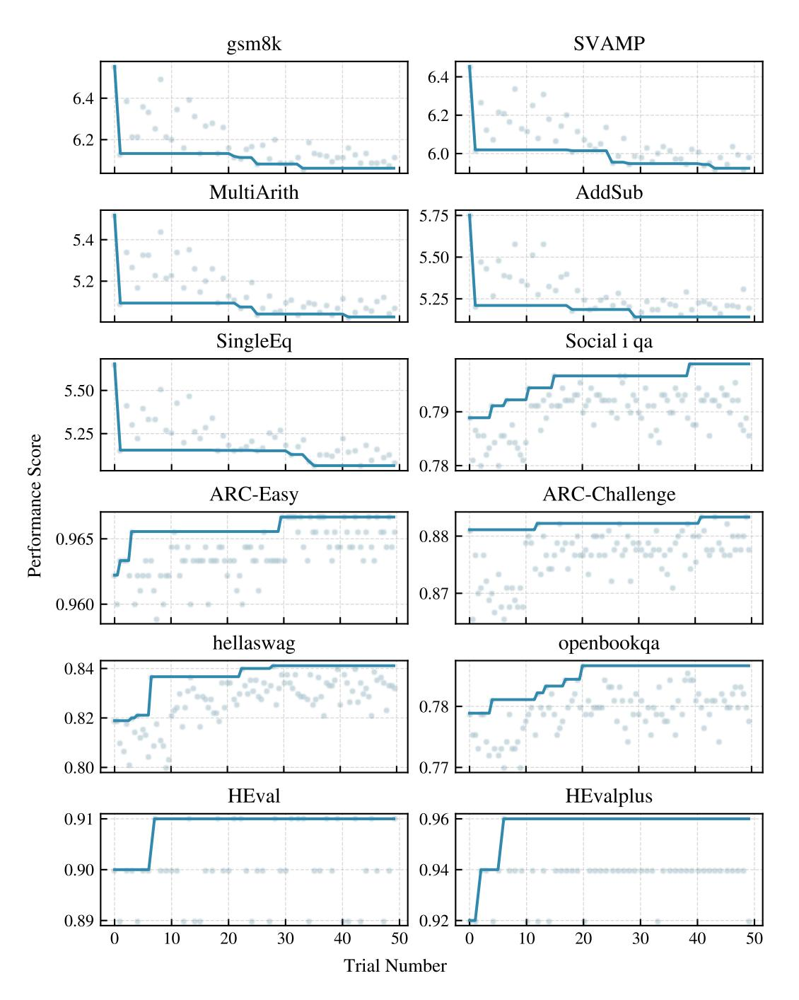
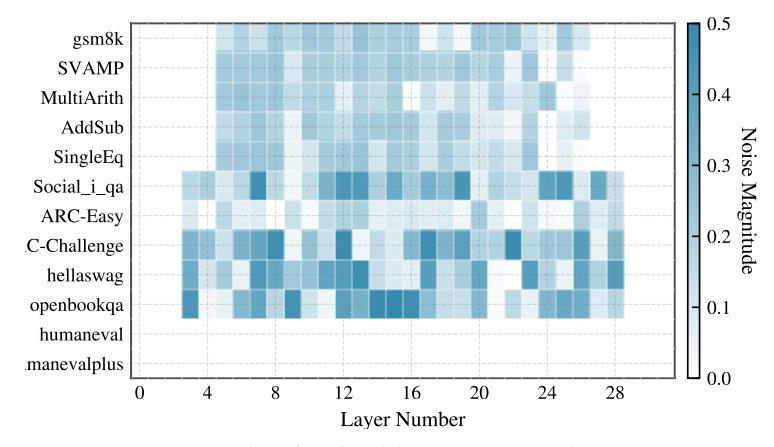
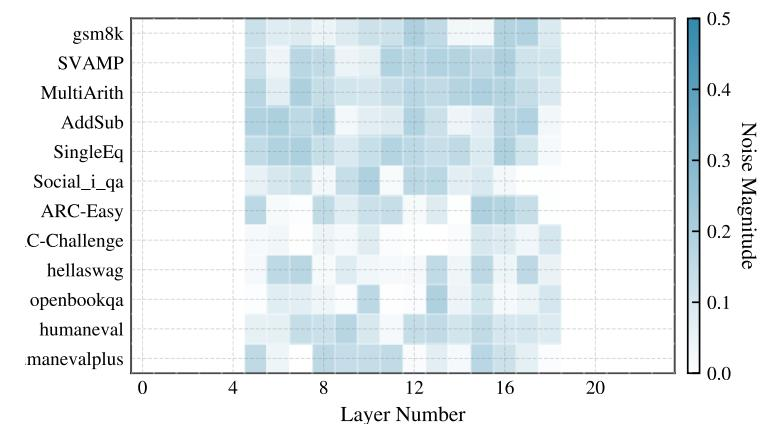

# C TUNING HISTORY AND RESULTS HEATMAP

Figure 7: Optimization history of OLMoE on the benchmarks on the validation set. Test set evalua-Individual Trial Best Value tion results are provided in Figure [3](#page-5-0)

Figure 8: Optimization history of Mixtral on the benchmarks on the validation set. Test set evalua-Individual Trial Best Value tion results are provided in Figure [3](#page-5-0)

Figure 9: Optimization history of GPT-OSS on the benchmarks on the validation set. Test set Individual Trial Best Value evaluation results are provided in Figure [3](#page-5-0)

(a) OLMoE-1b-7b layer temperature heatmap.

(b) Mixtral-7x8 layer temperature heatmap.

(c) GPT-OSS-20B layer temperature heatmap.

Figure 10: Heatmap of per layer temperature of OLMoE, Mixtral, and GPT-OSS after hyperparameter tuning on different layers.